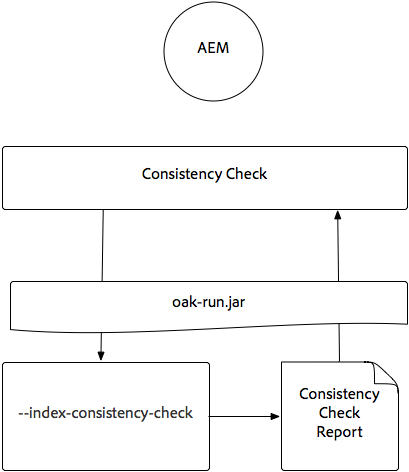
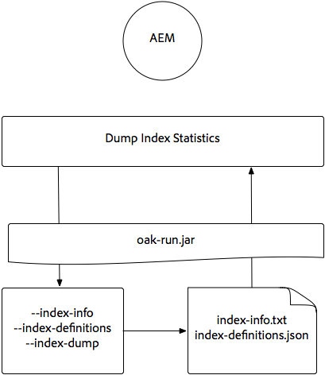
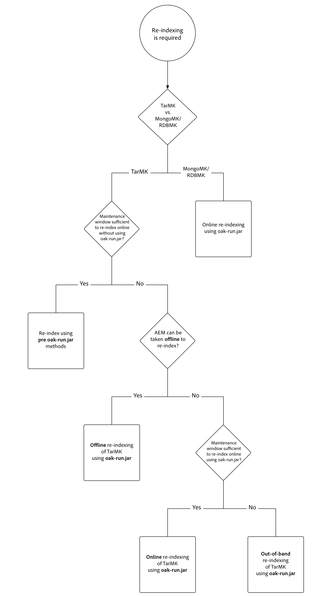
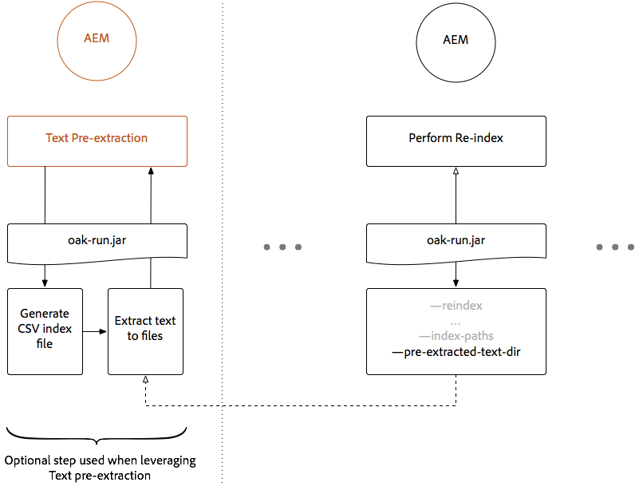
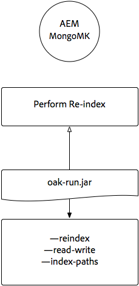
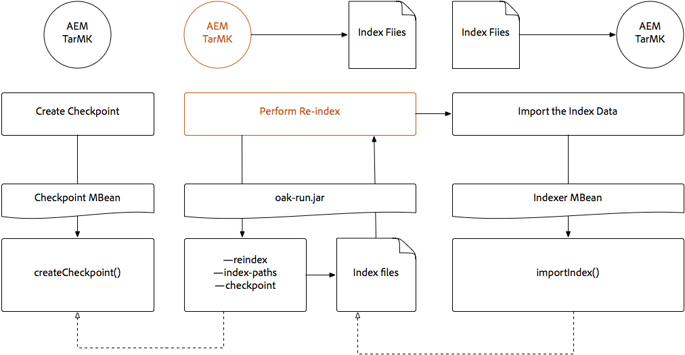
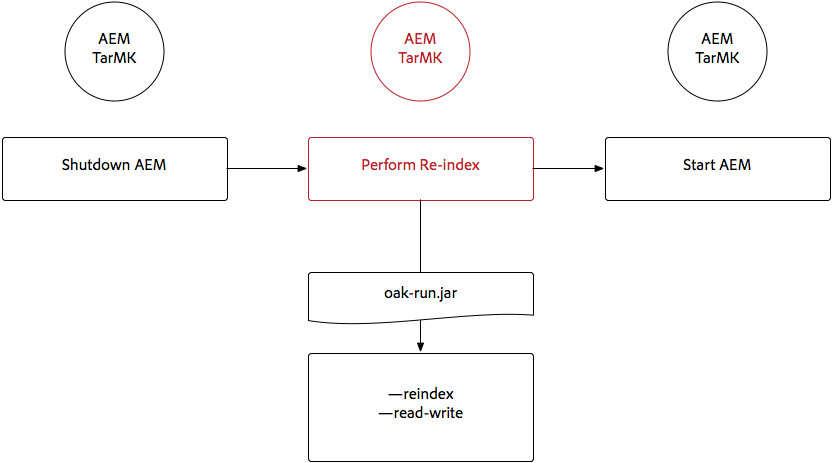
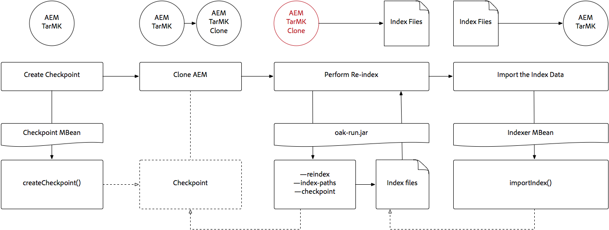
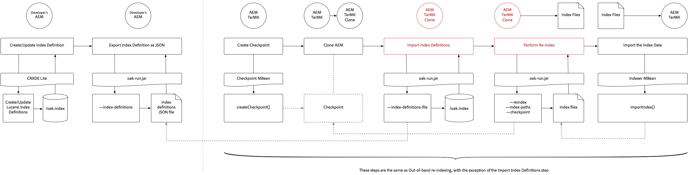
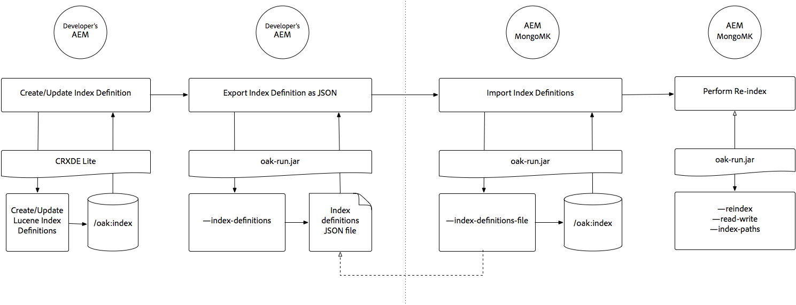

# Indexing by way of the Oak-run Jar {#indexing-via-the-oak-run-jar}

Oak-run supports all indexing use cases on the command line without having to operate from the JMX level. Advantages of the oak-run approach are:

1. It is a new indexing toolset for AEM 6.4
1. It decreases time-to-re-index which beneficially impacts reindex times on larger repositories
1. It is reducing resource consumption during reindexing in AEM which results in better system performance for other AEM activities
1. Oak-run provides Out-of-band support: If production conditions do not let you run reindex on production instances, a cloned environment can be used for reindexing to avoid critical performance impact.

Below is a list of use cases that can be used when performing indexing operations by way of the `oak-run` tool.

## Index Consistency Checks {#indexconsistencychecks}

>[!NOTE]
>
>For more detailed information regarding this scenario, see [Use Case 1 - Index Consistency Check](/help/sites-deploying/oak-run-indexing-usecases.md#usercase1indexconsistencycheck).

* `oak-run.jar`quickly determines if Lucene Oak indexes are corrupt.
* It is safe to run on an in-use AEM instance for consistency check levels 1 and 2.

## Index Statistics {#indexstatistics}

>[!NOTE]
>
>For more detailed information regarding this scenario, see [Use Case 2 - Index Statistics](/help/sites-deploying/oak-run-indexing-usecases.md#usecase2indexstatistics)

* `oak-run.jar` dumps all index definitions, important index stats, and index contents for offline analysis.
* Safe to execute on an in-use AEM instance.

## Reindexing Approach Decision Tree {#reindexingapproachdecisiontree}

This diagram is a decision tree for when to use the various reindexing approaches.

## Reindexing MongoMK / RDMBMK {#reindexingmongomk}

>[!NOTE]
>
>For more detailed information regarding this scenario, see [Use Case 3 - Reindexing](/help/sites-deploying/oak-run-indexing-usecases.md#usecase3reindexing).

### Text Pre-extraction for SegmentNodeStore and DocumentNodeStore {#textpre-extraction}

[Text pre-extraction](/help/sites-deploying/best-practices-for-queries-and-indexing.md#how-to-perform-text-pre-extraction) (a feature that has existed with AEM 6.3) can be used to reduce the time to reindex. Text pre-extraction can be used with all reindexing approaches.

Depending on the `oak-run.jar` indexing approach, there are various steps on either side of the Perform Reindex step in the diagram below.

>[!NOTE]
>
>Orange denotes activities where AEM must be in a maintenance window.

### Online reindexing for MongoMK or RDBMK using oak-run.jar {#onlinere-indexingformongomk}

>[!NOTE]
>
>For more detailed information regarding this scenario, see [Reindex - DocumentNodeStore](/help/sites-deploying/oak-run-indexing-usecases.md#reindexdocumentnodestore).

This is the recommended method for reindexing MongoMK (and RDBMK) AEM installations. No other method should be used.

Run this process only against a single AEM instance in the cluster.

## Reindexing TarMK {#re-indexingtarmk}

>[!NOTE]
>
>For more detailed information regarding this scenario, see [Reindex - SegmentNodeStore](/help/sites-deploying/oak-run-indexing-usecases.md#reindexsegmentnodestore).

* **Cold Standby considerations (TarMK)**

    * There are no special considerations for Cold Standby; the Cold Standby instances sync changes as usual.

* **AEM Publish Farms (AE Publish Farms should always be TarMK)**

    * For publish farm, it must be done for all OR execute the steps on a single publish. Then, clone the setup for others (taking all the usual precations when cloning AEM instances; sling.id - should link to something here).

### Online Re-Indexing for TarMK {#onlinere-indexingfortarmk}

>[!NOTE]
>
>For more detailed information regarding this scenario, see [Online Reindex - SegmentNodeStore](/help/sites-deploying/oak-run-indexing-usecases.md#onlinereindexsegmentnodestore).

This is the method used before the introduction of the new indexing capabilities of oak-run.jar. It is done by setting the `reindex=true` property on the Oak index.

This approach can be used if the time and performance effects to index are acceptable to the customer. This is often the case for small to medium-sized AEM installations.

### Online Re-Indexing TarMK using oak-run.jar {#onlinere-indexingtarmkusingoak-run-jar}

>[!NOTE]
>
>For more detailed information regarding this scenario, see [Online Reindex - SegmentNodeStore - The AEM Instance is Running](/help/sites-deploying/oak-run-indexing-usecases.md#onlinereindexsegmentnodestoretheaeminstanceisrunning).

Online reindexing of TarMK using the oak-run.jar is faster than the [Online Re-Indexing for TarMK](#onlinere-indexingfortarmk) described above. However, it also requires execution during a maintenance window; with the mention that the window is shorter, and more steps are required to perform the reindexing.

>[!NOTE]
>
>Orange denotes operations where AEM must be performed in a maintenance period.

### Offline Re-Indexing TarMK using oak-run.jar {#offlinere-indexingtarmkusingoak-run-jar}

>[!NOTE]
>
>For more detailed information regarding this scenario, see [Online Reindex - SegmentNodeStore - The AEM Instance is Shut Down](/help/sites-deploying/oak-run-indexing-usecases.md#onlinereindexsegmentnodestoreaeminstanceisdown).

Offline reindexing of TarMK is the simplest `oak-run.jar` based reindexing approach for TarMK as it requires a single `oak-run.jar` comment. However, it requires the AEM instance to be shut down.

>[!NOTE]
>
>Red denotes operations where AEM must be shut down.

### Out-of-band Re-Indexing TarMK using oak-run.jar  {#out-of-bandre-indexingtarmkusingoak-run-jar}

>[!NOTE]
>
>For more detailed information regarding this scenario, see [Out of Band Reindex - SegmentNodeStore](/help/sites-deploying/oak-run-indexing-usecases.md#outofbandreindexsegmentnodestore).

Out-of-band reindexing minimizes the impact of reindexing on in-use AEM instances.

>[!NOTE]
>
>Red denotes operations where AEM may be shut down.

## Updating Indexing Definitions {#updatingindexingdefinitions}

>[!NOTE]
>
>For more detailed information about this scenario, see [Use Case 4 - Updating Index Definitions](/help/sites-deploying/oak-run-indexing-usecases.md#usecase4updatingindexdefinitions).

### Creating and Updating index definitions on TarMK using ACS Ensure Index {#creatingandupdatingindexdefinitionsontarmkusingacsensureindex}

>[!NOTE]
>
>ACS Ensure Index is a community-supported project, and is not supported by Adobe Support.

This allows shipping index definition by way of the  content package which later results in reindexing by way of the setting the reindex flag to `true`. This works for smaller setups where reindexing does not take a long time.

For more info, see the [ACS Ensure Index documentation](https://adobe-consulting-services.github.io/acs-aem-commons/features/ensure-oak-index/index.html) for details.

### Creating and Updating index definitions on TarMK using oak-run.jar {#creatingandupdatingindexdefinitionsontarmkusingoak-run-jar}

If the time or performance impact of reindexing using non-`oak-run.jar` methods is too high, the following `oak-run.jar` based approach can be used to import and reindex Lucene Index definitions in a TarMK based AEM installation.

### Creating and Updating Index Definitions on MonogMK using oak-run.jar {#creatingandupdatingindexdefinitionsonmonogmkusingoak-run-jar}

If the time or performance impact of reindexing using non-`oak-run.jar` methods is too high, the following `oak-run.jar` based approach can be used to import and reindex Lucene Index definitions in MongoMK based AEM installations.

