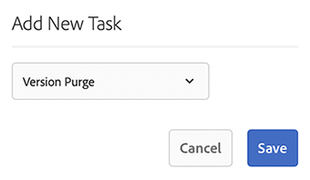
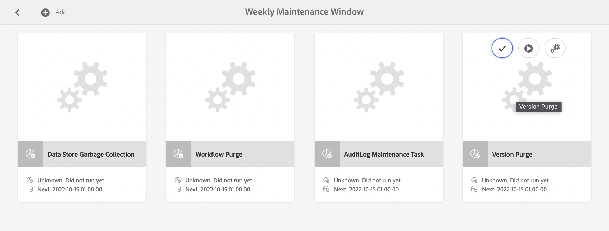
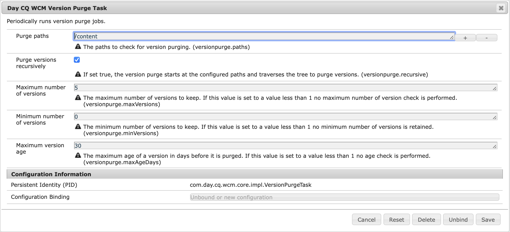
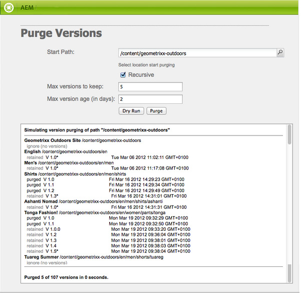
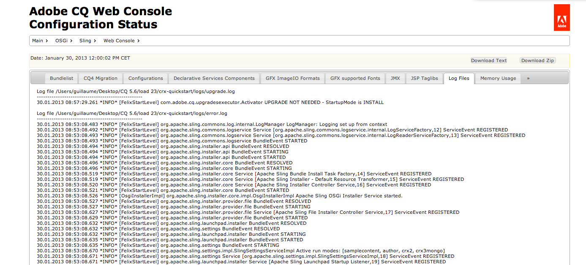
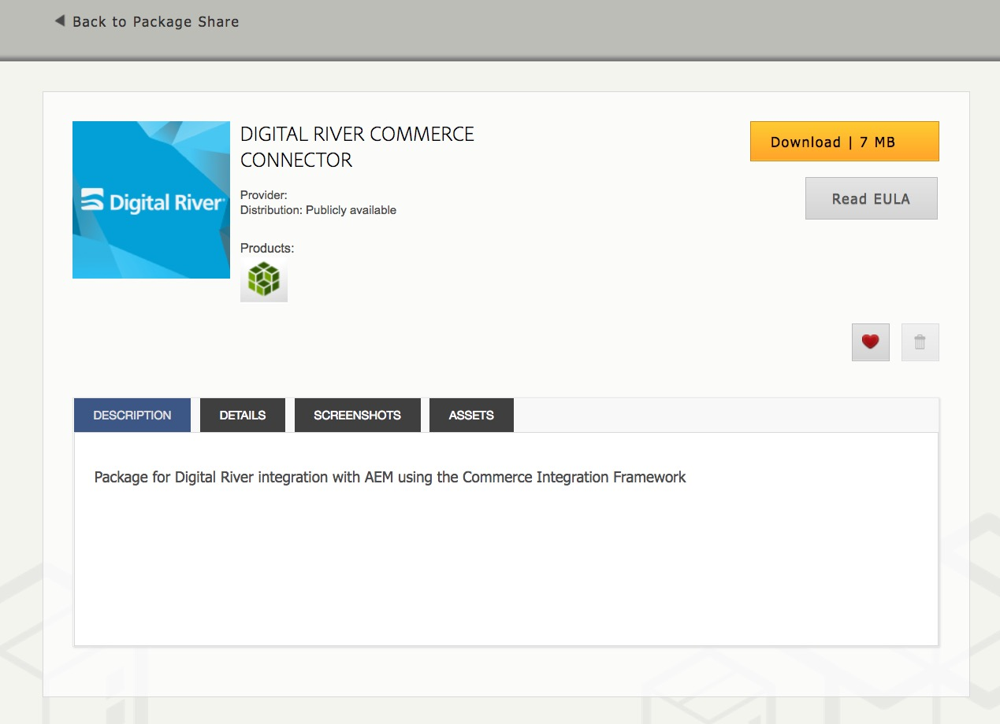
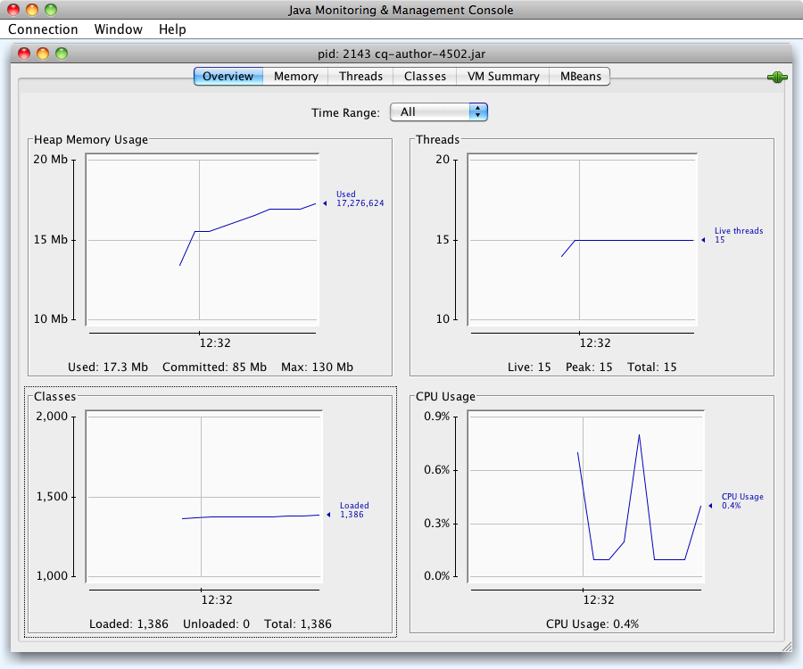
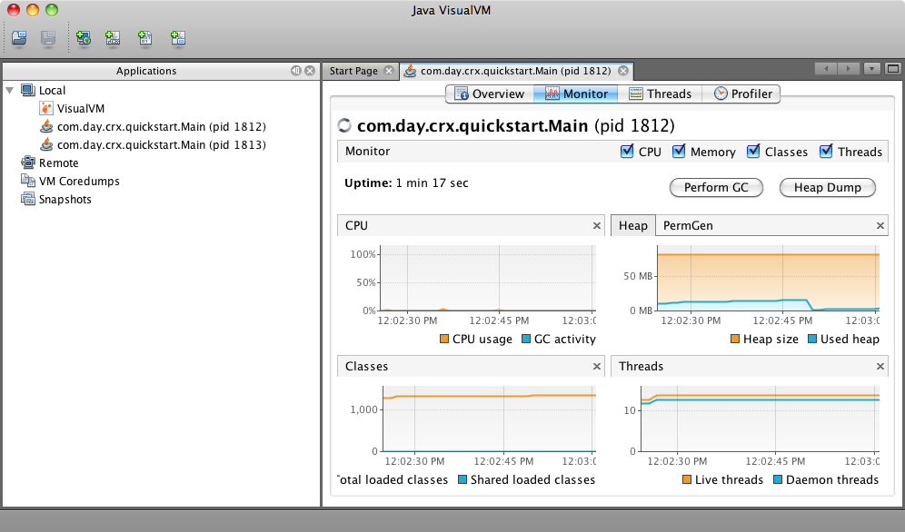

# Monitoring and maintaining your Adobe Experience Manager instance{#monitoring-and-maintaining-your-aem-instance}

After your AEM instances are deployed, you must monitor and maintain their operation, performance, and integrity.

A key factor here is that to recognize potential issues, you must know how your system looks and behaves under normal conditions. This ability is best done by monitoring the system and collecting information over time.

| Check |Considerations |Comment / Actions |
|---|---|---|
| Backup plan. |  |See how to [Back up your Instance](/help/sites-deploying/monitoring-and-maintaining.md#backups). |
| Disaster recovery plan. |Your company's disaster recovery guidelines. |  |
| An error tracking system is available for reporting problems. |For example, [Bugzilla](https://www.bugzilla.org/), [Jira](https://www.atlassian.com/software/jira), or one of many others. |  |
| File systems are being monitored. |The CRX repository "freezes" if there is insufficient free disk space. It resumes after space becomes available. |" `*ERROR* LowDiskSpaceBlocker`" messages can be seen in the log file when free space becomes low. |
| [Log files](/help/sites-deploying/monitoring-and-maintaining.md#working-with-audit-records-and-log-files) are being monitored. |  |  |
| System monitoring is (constantly) running in the background. |Including CPU, memory, disk and network usage. Using for example, iostat / vmstat / perfmon. |Logged data is visualized and can be used for tracking performance problems. Raw data is also accessible. |
| [AEM performance is being monitored](/help/sites-deploying/monitoring-and-maintaining.md#monitoring-performance). |Including [Request Counters](/help/sites-deploying/monitoring-and-maintaining.md#request-counters) to monitor traffic levels. |If a significant, or long-term loss, of performance is seen, detailed investigation should be made. |
| You are monitoring your [Replication Agents](/help/sites-deploying/monitoring-and-maintaining.md#monitoring-your-replication-agents). |  |  |
| Regularly purge workflow instances. |Repository size and workflow performance. |See [Regular Purging of Workflow Instances](/help/sites-administering/workflows-administering.md#regular-purging-of-workflow-instances). |

## Backups {#backups}

It is good practice to take backups of:

* Your software installation - before/after significant changes in the configuration
* The content held within the repository - regularly

Your company likely has a backup policy that you follow, additional considerations of what and when to back up include the following:

* how critical the system and data is.
* how often changes are made to either the software or data.
* volume of data; capacity can occasionally be an issue, as can the time to perform the backup.
* whether your backup can be made while users are online; and if possible, what is the performance impact.
* the geographical distribution of users; that is, when is the best time to back up (to minimize impact)?
* your disaster recovery policy; are there guidelines on where the backup data has to be stored (for example, offsite and specific medium).

Often a full backup is taken at regular intervals (for example, daily, weekly, or monthly), with incremental backups in between (for example, hourly, daily, or weekly).

>[!CAUTION]
>
>When implementing back ups of your production instances, tests *must* be made to ensure that you can successfully restore the backup.
>
>Without this testing, the backup is potentially useless (worst case scenario).

>[!NOTE]
>
>For more information about backup performances, read the [Back up Performance](/help/sites-deploying/configuring-performance.md#backup-performance) section.

### Backing up your software installation {#backing-up-your-software-installation}

After installation, or significant changes in the configuration, create a backup of your software installation.

To do accomplish this task, [back up your entire repository](#backing-up-your-repository) and then:

1. Stop AEM.
1. Back up the entire `<cq-installation-dir>` from your file system.

>[!CAUTION]
>
>If you are operating a third-party application server, additional folders may be in a different location and must be backed up, too. See [How to install AEM with an Application Server](/help/sites-deploying/application-server-install.md) for information about installing application servers.

>[!CAUTION]
>
>Incremental backup of the file data store is supported; when using incremental backup for other components (such as Lucene index), ensure that deleted files are also marked as deleted in the backup.

>[!NOTE]
>
>Disk mirroring can also be used as a backup mechanism.

### Backing up your repository {#backing-up-your-repository}

The [Backup and Restore](/help/sites-administering/backup-and-restore.md) section of the CRX documentation covers all issues related to backups of the CRX repository.

For full details of making an online "hot" backup, see [Creating an Online Backup](/help/sites-administering/backup-and-restore.md#online-backup).

## Version Purging {#version-purging}

The **Purge Versions** tool is intended for purging the versions of a node or a hierarchy of nodes in your repository. Its primary purpose is to help you reduce the size of your repository by removing old versions of your nodes.

This section deals with maintenance operations related to the versioning feature of AEM. The **Purge Version** tool is intended for purging the versions of a node or a hierarchy of nodes in your repository. Its primary purpose is to help you reduce the size of your repository by removing old versions of your nodes.

### Overview {#overview}

The **Purge Versions** tool is available as a weekly maintenance task. Before using for the first time, it must be added, then configured. After that it can be run on request, or on a weekly basis.

### Purging Versions of a Web Site {#purging-versions-of-a-web-site}

To purge versions of a web site, proceed as follows:

1. Navigate to the **[Tools](/help/sites-administering/tools-consoles.md)** **console**, select **Operation**, **Maintenance**, then **Weekly Maintenance Window**. 

1. Select **+ Add** from the top toolbar.

   

1. Select **Version Purge** from the drop-down list in the **Add New Task** dialog. Then **Save**.

   

1. The **Version Purge** task is added. Use the card actions to:
   * Select - reveals additional actions in the top toolbar
   * Run - to run the configured purge immediately
   * Configure - to configure the weekly purge task

   

1. Select the **Configure** action to open the Web Console for **Day CQ WCM Version Purge Task**, where you can configure:

   

    * **Purge paths**
      Set the start path of the content to be purged; for example, `/content/wknd`.

      >[!CAUTION]
      >
      >Adobe recommends that you define multiple paths for each of your websites.
      >
      >Defining a path with too many children can significantly lengthen the time to perform the purge.

    * **Purge versions recursively**

      * Unselect if you want to only purge the node defined by your path.
      * Select if you want to purge the node defined by your path and its descendants.

    * **Maximum number of versions**
      Set the maximum number of versions (for each node) that you want to keep. Leave empty to not use this setting.

    * **Minimum number of versions**
      Set the minimum number of versions (for each node) that you want to keep. Leave empty to not use this setting.

    * **Maximum version age**
      Set the maximum version age in days (for each node) that you want to keep. Leave empty to not use this setting.

   Then **Save**.

1. Navigate/return to the **Weekly Maintenance Window** window and select **Run** to launch the process immediately.

>[!CAUTION]
>
>You can use the Classic UI dialog to perform a [Dry Run](#analyzing-the-console) of your configuration:
>
>* http://localhost:4502/etc/versioning/purge.html
>
>Purged nodes cannot be reverted without restoring the repository. Take care of your configuration by always perform a dry run before purging.

#### Dry Run - Analyzing the Console {#analyzing-the-console}

The classic UI provides a **Dry Run** option from:

* http://localhost:4502/etc/versioning/purge.html

The process lists all the nodes that have been processed. During the process, a node can have one of the following statuses:

* `ignore (not versionnable)`: the node does not support versioning and is ignored during the process.

* `ignore (no version)`: the node does not have any version and is ignored during the process.

* `retained`: the node is not purged.
* `purged`: the node is purged.

Moreover the console provides useful information about the versions:

* `V 1.0`: the version number.
* `V 1.0.1`&#42;: the star indicates that the version is the current (base) version and cannot be purged.

* `Thu Mar 15 2012 08:37:32 GMT+0100`: the date of the version.

In the next example:

* The **[!DNL Shirts]** versions are purged because their version age is greater than two days.
* The **[!DNL Tonga Fashions!]** versions are purged because their number of versions is greater than 5.



## Working with Audit Records and Log Files {#working-with-audit-records-and-log-files}

Auditing records and log files relating to Adobe Experience Manager (AEM) can be found at various locations. The following is provided to give you an overview of what you can find and where you can find it.

### Working with Logs {#working-with-logs}

AEM WCM records detailed logs. After you unpack and start Quickstart, you can find logs in:

* `<cq-installation-dir>/crx-quickstart/logs/`

* `<cq-installation-dir>/crx-quickstart/repository/`

#### Log file rotation {#log-file-rotation}

Log file rotation refers to the process that limits the growth of the file by creating a file periodically. In AEM, a log file called `error.log` is rotated once a day according to the given rules:

* The `error.log` file is renamed according to the pattern {original_filename} `.yyyy-MM-dd`. For example, on July 2010 11th, the current log file is renamed `error.log-2010-07-10`, then a new `error.og` is created.

* Previous log files are not deleted, so it is your responsibility to clean old log files periodically to limit the disk usage.

>[!NOTE]
>
>If you upgrade your AEM installation, any existing log file that is no longer used by AEM remains on the disk. You can remove them without risk. All new log entries are written in the new log files.

### Finding the Log Files {#finding-the-log-files}

Various log files are held on the file server where you installed AEM:

* `<cq-installation-dir>/crx-quickstart/logs`

    * `access.log`
      All access requests to the AEM WCM, and the repository, are registered here.

    * `audit.log`
      Moderation actions are registered here.

    * `error.log`
      Error messages (of varying levels of severity) are registered here.

    * [ `ImageServer-<PortId>-yyyy>-<mm>-<dd>.log`](https://experienceleague.adobe.com/docs/dynamic-media-developer-resources/image-serving-api/image-serving-api/config-admin/server-logging/c-image-server-log.html)
      This log is only used if [!DNL Dynamic Media] is enabled. It provides statistics and analytical information used for analyzing behavior of the internal ImageServer process.

    * `request.log`
      Each access request is registered here together with the response.

    * [ `s7access-<yyyy>-<mm>-<dd>.log`](https://experienceleague.adobe.com/docs/dynamic-media-developer-resources/image-serving-api/image-serving-api/config-admin/server-logging/c-access-log.html)
      This log is only used if [!DNL Dynamic Media] is enabled. The s7access log records each request made to [!DNL Dynamic Media] through `/is/image` and `/is/content`.

    * `stderr.log`
      Holds error messages, again of varying levels of severity, generated during startup. By default the log level is set to `Warning` ( `WARN`)

    * `stdout.log`
      Holds logging messages indicating events during startup.

    * `upgrade.log`
      Provides a log of all upgrade operations that runs from the `com.day.compat.codeupgrade` and `com.adobe.cq.upgradesexecutor` packages.

* `<cq-installation-dir>/crx-quickstart/repository/segmentstore`

    * `journal.log`
      Revision journaling information.

>[!NOTE]
>
>The ImageServer and s7access logs are not included in the **Download Full **package that is generated from the **system/console/status-Bundlelist **page. For support purposes, if you have [!DNL Dynamic Media] issues, append the ImageServer and s7access logs when you contact Customer Support.

### Activating the DEBUG Log Level {#activating-the-debug-log-level}

The default log level ([Apache Sling Logging Configuration](/help/sites-deploying/osgi-configuration-settings.md#apacheslingloggingconfiguration)) is Information, so debug messages are not logged.

To activate the debug log level for a Logger, set the property `org.apache.sling.commons.log.level` to debug in the repository. For example, on `/libs/sling/config/org.apache.sling.commons.log.LogManager` to configure the [global Apache Sling Logging](/help/sites-deploying/osgi-configuration-settings.md#apacheslingloggingconfiguration).

>[!CAUTION]
>
>Do not leave the log at the debug log level longer than necessary, because it generates numerous log entries, consuming resources.

A line in the debug file usually starts with DEBUG, then provides the log level, the installer action, and the log message. For example:

```shell
DEBUG 3 WebApp Panel: WebApp successfully deployed
```

The log levels are as follows:

| 0 |Fatal error |The action has failed, and the installer cannot proceed. |
|---|---|---|
| 1 |Error |The action has failed. The installation proceeds, but a part of AEM WCM was not installed correctly and does not work. |
| 2 |Warning |The action has succeeded but encountered problems. AEM WCM may or may not work correctly. |
| 3 |Information |The action has succeeded. |

### Create a Custom Log File {#create-a-custom-log-file}

>[!NOTE]
>
>When working with Adobe Experience Manager, there are several methods of managing the configuration settings for such services; see [Configuring OSGi](/help/sites-deploying/configuring-osgi.md) for more details and the recommended practices.

In certain circumstances, you may want to create a custom log file with a different log level. In the repository, do the following:

1. If not existing, create a configuration folder ( `sling:Folder`) for your project `/apps/<project-name>/config`.
1. Under `/apps/<project-name>/config`, create a node for the new [Apache Sling Logging Logger Configuration](/help/sites-deploying/osgi-configuration-settings.md#apacheslingloggingloggerconfigurationfactoryconfiguration):

    * Name: `org.apache.sling.commons.log.LogManager.factory.config-<identifier>`

      Where `<identifier>` is replaced by free text that you (must) enter to identify the instance (you cannot omit this information).

      For example, `org.apache.sling.commons.log.LogManager.factory.config-MINE`

    * Type: `sling:OsgiConfig`

   >[!NOTE]
   >
   >Although not a technical requirement, it is advisable to make `<identifier>` unique.

1. Set the following properties on this node:

    * Name: `org.apache.sling.commons.log.file`

      Type: String

      Value: specify the Log File; for example, `logs/myLogFile.log`

    * Name: `org.apache.sling.commons.log.names`

      Type: String[] (String + Multi)

      Value: specify the OSGi services for which the Logger is to log messages; for example, all the following:

        * `org.apache.sling`
        * `org.apache.felix`
        * `com.day`

    * Name: `org.apache.sling.commons.log.level`

      Type: String

      Value: specify the log level required ( `debug`, `info`, `warn`, or `error`); for example, `debug`

    * Configure the other parameters as required:

        * Name: `org.apache.sling.commons.log.pattern`

          Type: `String`

          Value: specify the pattern of the log message as required; for example,

          `{0,date,dd.MM.yyyy HH:mm:ss.SSS} *{4}* [{2}] {3} {5}`

   >[!NOTE]
   >
   >`org.apache.sling.commons.log.pattern` supports up to six arguments.
   >
   >{0} The timestamp of type `java.util.Date`
   >
   >{1} the log marker
   >
   >{2} the name of the current thread
   >
   >{3} the name of the logger
   >
   >{4} the log level
   >
   >{5} the log message
   >
   >If the log call includes a `Throwable`, the stacktrace is appended to the message.

   >[!CAUTION]
   >
   >org.apache.sling.commons.log.names must have a value.

   >[!NOTE]
   >
   >Log writer paths are relative to the `crx-quickstart` location.
   >
   >Therefore, a log file specified as:
   >
   >`logs/thelog.log`
   >
   >writes to:
   >
   >`<cq-installation-dir>/crx-quickstart/logs/thelog.log`.
   >
   >And a log file specified as:
   >
   >`../logs/thelog.log`
   >
   >writes to a directory:
   >
   >`<cq-installation-dir>/logs/`  
   >(that is, next to `<cq-installation-dir>/crx-quickstart/`)

1. This step is only necessary when a new Writer is required (that is, with a configuration that is different to the default Writer).

   >[!CAUTION]
   >
   >A new Logging Writer Configuration is only required when the existing default is not suitable.
   >
   >If no explicit Writer is configured, the system automatically generates an implicit Writer based on the default.

   Under `/apps/<project-name>/config`, create a node for the new [Apache Sling Logging Writer Configuration](/help/sites-deploying/osgi-configuration-settings.md#apacheslingloggingwriterconfigurationfactoryconfiguration):

    * Name: `org.apache.sling.commons.log.LogManager.factory.writer-<identifier>` (a Writer)

      As with the Logger, `<identifier>` is replaced by free text that you (must) enter to identify the instance (you cannot omit this information). For example, `org.apache.sling.commons.log.LogManager.factory.writer-MINE`

    * Type: `sling:OsgiConfig`

   >[!NOTE]
   >
   >Although not a technical requirement, it is advisable to make `<identifier>` unique.

   Set the following properties on this node:

    * Name: `org.apache.sling.commons.log.file`

      Type: `String`

      Value: specify the Log File so that it matches the file specified in the Logger;

      for this example, `../logs/myLogFile.log`.

    * Configure the other parameters as required:

        * Name: `org.apache.sling.commons.log.file.number`

          Type: `Long`

          Value: specify the number of log files that you want kept; for example, `5`

        * Name: `org.apache.sling.commons.log.file.size`

          Type: `String`

          Value: specify as required to control file rotation by size/date; for example, `'.'yyyy-MM-dd`

   >[!NOTE]
   >
   >`org.apache.sling.commons.log.file.size` controls the rotation of the log file by setting either:
   >
   >* a maximum file size
   >* a time/date schedule
   >
   >to indicate when a new file is created (and the existing file renamed according to the name pattern).
   >
   >* A size limit can be specified with a number. If no size indicator is given, then it is taken as the number of bytes, or you can add one of the size indicators - `KB`, `MB`, or `GB` (case is ignored).
   >* A time/date schedule can be specified as a `java.util.SimpleDateFormat` pattern. It defines the time period after which the file is rotated. Also, the suffix appended to the rotated file (for identification).
   >
   >The default is '.'yyyy-MM-dd (for daily log rotation).
   >
   >For example, at midnight January 20, 2010 (or when the first log message after this date occurs to be precise), ../logs/error.log is renamed to ../logs/error.log.2010-01-20. Logging for January 21 is output to (a new and empty) ../logs/error.log until it is rolled over at the next change of day.
   >
   >| `'.'yyyy-MM` |Rotation at the beginning of each month |
   >|---|---|
   >| `'.'yyyy-ww` |Rotation at the first day of each week (depends on the locale). |
   >| `'.'yyyy-MM-dd` |Rotation at midnight each day. |
   >| `'.'yyyy-MM-dd-a` |Rotation at midnight and midday of each day. |
   >| `'.'yyyy-MM-dd-HH` |Rotation at the top of every hour. |
   >| `'.'yyyy-MM-dd-HH-mm` |Rotation at the beginning of every minute. |
   >
   >Note: When specifying a time/date:
   >
   >1. You should "escape" literal text within a pair of single quotes (' ');
   >
   >    Avoids certain characters from being interpreted as pattern letters.
   >
   >1. Only use characters allowed for a valid file name anywhere in the option.

1. Read your new log file with your chosen tool.

   The log file created by this example is `../crx-quickstart/logs/myLogFile.log`.

The Felix Console also provides information about Sling Log Support at `../system/console/slinglog`; for example, `https://localhost:4502/system/console/slinglog`.

### Finding the Audit Records {#finding-the-audit-records}

Audit records are held to provide a record of who did what and when. Different audit records are generated for both AEM WCM and OSGi events.

#### AEM WCM Audit records shown when Page Authoring {#aem-wcm-audit-records-shown-when-page-authoring}

1. Open a page.
1. From the sidekick you can select the tab with the lock icon, then double-click **Audit Log...**
1. A new window opens showing the list of audit records for the current page.

   

1. Click **OK** when you want to close the window.

#### AEM WCM Auditing records within the repository {#aem-wcm-auditing-records-within-the-repository}

Within the `/var/audit` folder, audit records are held according to the resource. You can drill down until you see individual records and the information that they contain.

These entries hold the same information as shown when editing a page.

#### OSGi Audit records from the Web Console {#osgi-audit-records-from-the-web-console}

OSGi events also generate audit records which can be seen from the **Configuration Status** tab -&gt; **Log Files** tab in the AEM Web Console:



## Monitoring Your Replication Agents {#monitoring-your-replication-agents}

You can monitor your [replication queues](/help/sites-deploying/replication.md) to detect when a queue is either down or blocked - which might in turn indicate a problem with a publishing instance or external system:

* are all required queues enabled?
* are any disabled queues still required?
* all `enabled` queues should have the status `idle` or `active`, which indicate normal operation; no queues should be `blocked`, which is often a sign of problems on the receivers side.

* if the size of the queue grows over time, it can indicate a blocked queue.

To monitor a replication agent:

1. Access the **Tools** tab in AEM.
1. Click **Replication**.
1. Double-click the link to agents for the appropriate environment (either the left or the right pane); for example, **Agents on author**.

   The resulting window shows an overview of all your replication agents for the author environment, including their target and status.

1. Click the appropriate agent name (which is a link) to show detailed information on that agent:

   

   Here you can:

    * See whether the agent is enabled.
    * See the target of any replications.
    * See whether the replication queue is active (enabled).
    * See whether there are any items in the queue.
    * **Refresh** or **Clear** to update the display of queue entries. Doing so helps you to see items that enter and leave the queue.
    * **View Log** to access the log of any actions by the replication agent.
    * **Test Connection** to the target instance.
    * **Force Retry** on any queue items, if necessary.

   >[!CAUTION]
   >
   >Do not use the "Test Connection" link for the Reverse Replication Outbox on a publish instance.
   >
   >If a replication test is performed for an Outbox queue, any items that are older than the test replication are reprocessed with every reverse replication.
   >
   >If such items exist in a queue, they can be found with the following XPath JCR query and should be removed.
   >
   >`/jcr:root/var/replication/outbox//*[@cq:repActionType='TEST']`

Again you can develop a solution to detect all replication agents (located under `/etc/replication/author` or `/etc/replication/publish`), then check the status of the agent ( `enabled`, `disabled`) and the underlying queue ( `active`, `idle`, `blocked`).

## Monitoring Performance {#monitoring-performance}

[Performance Optimization](/help/sites-deploying/configuring-performance.md) is an interactive process which receives focus during development. After deployment, it is reviewed after specific intervals or events.

Methods used while collecting information for optimization can also be used for ongoing monitoring.

>[!NOTE]
>
>Specific [configurations available to improve performance](/help/sites-deploying/configuring-performance.md#configuring-for-performance) can also be checked.

The following lists common performance issues which occur, together with proposals on how to spot, and counteract them.

| Area | Symptom | To increase capacity... | To reduce volume... |
|---|---|---|---|
| Client |High client CPU usage. |Install a client CPU with higher performance. |Simplify (HTML) layout. |
|   |Low server CPU usage. |Upgrade to a faster browser. |Improve client-side cache. |
|   |Some clients fast, some slow. |  |  |
| Server |  |  |  |
| Network |CPU usage low on both servers and clients. |Remove any network bottlenecks. |Improve/optimize the configuration of the client cache. |
|   |Browsing locally on the server is (comparatively) fast. |Increase network bandwidth. |Reduce the "weight" of your web pages (for example, fewer images, optimized HTML). |
| Web-server |CPU usage on the web-server is high. |Cluster your web-servers. |Reduce the hits per page (visit). |
|   |  |Use a hardware load-balancer. |  |
| Application |Server CPU usage is high. |Cluster your AEM instances. |Search for, and eliminate, CPU, and memory hogs (use code review and timing output). |
|   |High memory consumption. |  |Improve caching on all levels. |
|   |Low response times. |  |Optimize templates and components (for example, structure, logic). |
| Repository |  |  |  |
| Cache |  |  |  |

Performance issues may stem from various causes that have nothing to do with your website, including temporary slowdowns in connection speed, CPU load, and many more.

It may also impact either all your visitors, or only a subset of them.

All this information must be obtained, sorted, and analyzed before you can either optimize the general performance or solve specific issues.

* Before you experience a performance issue:

    * collect as much information as possible to build up a good working knowledge of the system under normal circumstances

* When you experience a performance issue:

    * try to replicate it with one (or preferably more) standard web-browser, on a different client that you know has good general performance and/or on the server itself (if possible)
    * check whether anything (related to the system) has changed within an appropriate time-space, and if any of these changes could have impacted the performance
    * ask questions such as:

        * does the issue only occur at specific times?
        * does the issue only occur on specific pages?
        * are other requests impacted?

    * collect as much information as possible to compare with your knowledge of the system under normal circumstances:

### Tools for Monitoring and Analyzing Performance {#tools-for-monitoring-and-analyzing-performance}

The following gives a short overview of some of the tools available for monitoring and analyzing performance.

Some of these tools depend on your operating system.

<table>
 <tbody>
  <tr>
   <td>Tool</td>
   <td>Used to analyze...</td>
   <td>Usage / More information...</td>
  </tr>
  <tr>
   <td>request.log</td>
   <td>Response times and concurrency.</td>
   <td><a href="#interpreting-the-request-log">Interpreting the request.log</a>.</td>
  </tr>
  <tr>
   <td>truss/strace</td>
   <td>Page Loads</td>
   <td><p>Unix/Linux commands to trace system calls and signals. Increase the log level to <code>INFO</code>.</p> <p>Analyze the number of page loads per request, and which pages.</p> </td>
  </tr>
  <tr>
   <td>Thread dumps</td>
   <td>Observe JVM threads. Identify contentions, locks, and long-runners.</td>
   <td><p>Dependent on the operating system:<br /> - Unix/Linux: <code>kill -QUIT &lt;<em>pid</em>&gt;</code><br /> - Windows (console mode): Ctrl-Break<br /> </p> <p>Analysis tools are also available, such as <a href="https://github.com/irockel/tda">TDA</a>.<br /> </p> </td>
  </tr>
  <tr>
   <td>Heap Dumps</td>
   <td>Out of Memory issues that cause slow performance.</td>
   <td><p>Add the:<br /> <code>-XX:+HeapDumpOnOutOfMemoryError</code><br /> option to the Java&trade; call that goes to AEM.</p> <p>See the <a href="https://docs.oracle.com/javase/8/docs/technotes/guides/troubleshoot/prepapp002.html#CEGBHDFH">Options/Flags for JVM Troubleshooting Page</a>.</p> </td>
  </tr>
  <tr>
   <td>System calls</td>
   <td>Identify timing issues.</td>
   <td><p>Calls to <code>System.currentTimeMillis()</code> or <code>com.day.util</code>. Timing is used to generate timestamps from your code, or by way of <a href="#html-comments">HTML-comments</a>.</p> <p><strong>Note:</strong> Implement these things so that they can be activated / deactivated as required; when a system is running smoothly, the overhead of collecting statistics is not needed.</p> </td>
  </tr>
  <tr>
   <td>Apache Bench</td>
   <td>Identify memory leaks, selectively analyze response time.</td>
   <td><p>basic usage is:</p> <p><code>ab -k -n &lt;<em>requests</em>&gt; -c &lt;<em>concurrency</em>&gt; &lt;<em>url</em>&gt;</code></p> <p>See <a href="#apache-bench">Apache Bench</a> and the <a href="https://httpd.apache.org/docs/2.4/programs/ab.html">ab man page</a> for full details.</p> </td>
  </tr>
  <tr>
   <td>Search Analysis</td>
   <td> </td>
   <td>Execute search queries offline, identify response time of query, test, and confirm result set.<br /> </td>
  </tr>
  <tr>
   <td>JMeter</td>
   <td>Load and functional tests.</td>
   <td><a href="https://jmeter.apache.org/">https://jmeter.apache.org/</a></td>
  </tr>
  <tr>
   <td>JProfiler</td>
   <td>In-depth CPU and memory profiling.</td>
   <td><a href="https://www.ej-technologies.com/">https://www.ej-technologies.com/</a></td>
  </tr>
  <tr>
   <td>Java&trade; Flight Recorder</td>
   <td>Java&trade; Flight Recorder (JFR) is a tool for collecting diagnostic and profiling data about a running Java&trade; application.</td>
   <td><a href="https://docs.oracle.com/javase/8/docs/technotes/guides/troubleshoot/tooldescr004.html#BABJJEEE">https://docs.oracle.com/javase/8/docs/technotes/guides/troubleshoot/tooldescr004.html#BABJJEEE</a></td>
  </tr>
  <tr>
   <td>JConsole</td>
   <td>Observe JVM metrics and threads.</td>
   <td><p>Usage: jconsole</p> <p>See <a href="https://docs.oracle.com/javase/8/docs/technotes/guides/management/jconsole.html">jconsole</a> and <a href="#monitoring-performance-using-jconsole">Monitoring Performance using JConsole</a>.</p> <p><strong>Note:</strong> With JDK 1.8, JConsole is extensible with plug-ins; for example, Top or TDA (Thread Dump Analyzer).</p> </td>
  </tr>
  <tr>
   <td>Java&trade; VisualVM</td>
   <td>Observe JVM metrics, threads, memory, and profiling.</td>
   <td><p>Usage: visualvm or visualvm<br /> </p> <p>See <a href="https://docs.oracle.com/javase/8/docs/technotes/guides/visualvm/">visualvm</a> and <a href="#monitoring-performance-using-j-visualvm">Monitoring Performance using (J)VisualVM</a>.</p> <p><strong>Note:</strong> With JDK 1.8, VisualVM is extensible with plug-ins. VisualVM is discontinued after JDK 9. Use the Java&trade; Flight Recorder instead.</p> </td>
  </tr>
  <tr>
   <td>truss/strace, lsof</td>
   <td>In-depth kernel call and process analysis (UNIX&reg;).</td>
   <td>Unix/Linux commands.</td>
  </tr>
  <tr>
   <td>Timing Statistics</td>
   <td>See timing statistics for page rendering.</td>
   <td><p>To see timing statistics for page rendering, you can use <strong>Ctrl-Shift-U</strong> together with <code>?debugClientLibs=true</code> set in the URL.</p> </td>
  </tr>
  <tr>
   <td>CPU and memory profiling tool<br /> </td>
   <td><a href="#interpreting-the-request-log">Used when analyzing slow requests during development</a>.</td>
   <td>For example, <a href="https://www.yourkit.com/">YourKit</a>. or the <a href="https://docs.oracle.com/javase/8/docs/technotes/guides/troubleshoot/tooldescr004.html#BABJJEEE">Java&trade; Flight Recorder</a>.</td>
  </tr>
  <tr>
   <td><a href="#information-collection">Information Collection</a></td>
   <td>The ongoing state of your installation.</td>
   <td>Knowing as much as possible about your installation can also help you track down what might have caused a change in performance, and whether these changes are justified. Collect these metrics at regular intervals so you can easily see significant changes.</td>
  </tr>
 </tbody>
</table>

### Interpreting the request.log {#interpreting-the-request-log}

This file registers basic information about every request made to AEM. From this, valuable conclusions can be extracted.

The `request.log` offers a built-in way to get a look at how long requests take. For development purposes, it is useful to `tail -f` the `request.log` and watch for slow response times. To analyze a bigger `request.log`, Adobe recommends the [use of `rlog.jar` which allows you to sort and filter for response times](#using-rlog-jar-to-find-requests-with-long-duration-times).

Adobe recommends isolating the "slow" pages from the `request.log`, then individually tuning them for a better performance. Include performance metrics per component or using a performance profiling tool such as ` [yourkit](https://www.yourkit.com/)`.

#### Monitoring traffic on your website {#monitoring-traffic-on-your-website}

The request log registers each request made, together with the response made:

```xml
09:43:41 [66] -> GET /author/y.html HTTP/1.1
09:43:41 [66] <- 200 text/html 797ms
```

By totaling all the GET entries within specific periods (for example, over various 24-hour periods), you can make statements about the average traffic on your website.

#### Monitoring response times with the request.log {#monitoring-response-times-with-the-request-log}

A good starting point for performance analysis is the request log:

`<cq-installation-dir>/crx-quickstart/logs/request.log`

The log looks as follows (the lines are shortened for simplicity):

```xml
31/Mar/2009:11:32:57 +0200 [379] -> GET /path/x HTTP/1.1
31/Mar/2009:11:32:57 +0200 [379] <- 200 text/html 33ms
31/Mar/2009:11:33:17 +0200 [380] -> GET /path/y HTTP/1.1
31/Mar/2009:11:33:17 +0200 [380] <- 200 application/json 39ms
```

This log has one line per request or response:

* The date at which each request or response was made.
* The number of the request, in square brackets. This number matches for the request and the response.
* An arrow indicating whether it is a request (arrow pointing to the right) or a response (arrow to the left).
* For requests, the line contains:

    * the method (typically, GET, HEAD, or POST)
    * the requested page
    * the protocol

* For responses, the line contains:

    * the status code (200 means "success", 404 means "page not found"
    * the MIME type
    * the response time

Using small scripts, you can extract the required information from the log file and assemble the statistics you want. From these statistics, you can see which pages or types of pages are slow, and if the overall performance is satisfactory.

#### Monitoring search response times with the request.log {#monitoring-search-response-times-with-the-request-log}

Search requests are also registered in the log file:

```xml
31/Mar/2009:11:35:34 +0200 [338] -> GET /author/playground/en/tools/search.html?query=dilbert&size=5&dispenc=utf-8 HTTP/1.1
31/Mar/2009:11:35:34 +0200 [338] <- 200 text/html 1562ms
```

So, as above, you can use scripts to extract the relevant information and build up statistics.

However, after you have determined the response time, analyze why the request is taking the time it does, and what can be done to improve the response.

#### Monitoring the number and impact of concurrent users {#monitoring-the-number-and-impact-of-concurrent-users}

Again the `request.log` can be used to monitor concurrency and the system's reaction to it.

Tests must be made to determine how many concurrent users the system can handle before a negative impact is seen. Again scripts can be used to extract results from the log file:

* monitor how many requests are made within a specific time span, such as one minute.
* test the effects of a specific number of users all making the same requests at (as close as possible) the same time. For example, 30 users clicking **Save** at the same time.

```xml
31/Mar/2009:11:45:29 +0200 [333] -> GET /author/libs/Personalize/content/statics.close.gif HTTP/1.1
31/Mar/2009:11:45:29 +0200 [334] -> GET /author/libs/Personalize/content/statics.detach.gif HTTP/1.1
31/Mar/2009:11:45:30 +0200 [335] -> GET /author/libs/CFC/content/imgs/logo.rZMNURccynWcTpCxyuBNiTCoiBMmw000.default.gif HTTP/1.1
31/Mar/2009:11:45:32 +0200 [335] <- 304 text/html 0ms
31/Mar/2009:11:45:33 +0200 [334] <- 200 image/gif 31ms
31/Mar/2009:11:45:38 +0200 [333] <- 200 image/gif 31ms
31/Mar/2009:11:45:42 +0200 [336] -> GET /author/libs/CFC/content/imgs/logo.rZMNURccynWcTZRXunQbbQtvuuCMbRRBuWXz0000.default.gif HTTP/1.1
31/Mar/2009:11:45:43 +0200 [337] -> GET /author/titlebar_bg.gif HTTP/1.1
31/Mar/2009:11:45:43 +0200 [336] <- 304 text/html 0ms
31/Mar/2009:11:45:44 +0200 [337] <- 304 text/html 0ms
```

### Using rlog.jar to find requests with long duration times {#using-rlog-jar-to-find-requests-with-long-duration-times}

AEM includes various helper tools in the following:
`<cq-installation-dir>/crx-quickstart/opt/helpers`

One of these tools, `rlog.jar`, can be used to quickly sort `request.log` so that requests are displayed by duration, from longest to shortest time.

The following command shows the possible arguments:

```shell
$java -jar rlog.jar
Request Log Analyzer Version 21584 Copyright 2005 Day Management AG
Usage:
  java -jar rlog.jar [options] <filename>
Options:
  -h               Prints this usage.
  -n <maxResults>  Limits output to <maxResults> lines.
  -m <maxRequests> Limits input to <maxRequest> requests.
  -xdev            Exclude POST request to CRXDE.
```

For example, you can run it specifying `request.log` file as a parameter and show the ten first requests that have the longest duration:

```shell
$ java -jar ../opt/helpers/rlog.jar -n 10 request.log
*Info * Parsed 464 requests.
*Info * Time for parsing: 22ms
*Info * Time for sorting: 2ms
*Info * Total Memory: 1mb
*Info * Free Memory: 1mb
*Info * Used Memory: 0mb
------------------------------------------------------
     18051ms 31/Mar/2009:11:15:34 +0200 200 GET /content/geometrixx/en/company.html text/ html
      2198ms 31/Mar/2009:11:15:20 +0200 200 GET /libs/cq/widgets.js application/x-javascript
      1981ms 31/Mar/2009:11:15:11 +0200 200 GET /libs/wcm/content/welcome.html text/html
      1973ms 31/Mar/2009:11:15:52 +0200 200 GET /content/campaigns/geometrixx.teasers..html text/html
      1883ms 31/Mar/2009:11:15:20 +0200 200 GET /libs/security/cq-security.js application/x-javascript
      1876ms 31/Mar/2009:11:15:20 +0200 200 GET /libs/tagging/widgets.js application/x-javascript
      1869ms 31/Mar/2009:11:15:20 +0200 200 GET /libs/tagging/widgets/themes/default.js application/x-javascript
      1729ms 30/Mar/2009:16:45:56 +0200 200 GET /libs/wcm/content/welcome.html text/html; charset=utf-8
      1510ms 31/Mar/2009:11:15:34 +0200 200 GET /bin/wcm/contentfinder/asset/view.json/ content/dam?_dc=1238490934657&query=&mimeType=image&_charset_=utf-8 application/json
      1462ms 30/Mar/2009:17:23:08 +0200 200 GET /libs/wcm/content/welcome.html text/html; charset=utf-8
```

Concatenate the individual `request.log` files if you  must do this operation on a large data sample.

### Apache Bench {#apache-bench}

To minimize the impact of special cases (such as garbage collection), it is recommended to use a tool such as `apachebench` (for example, [ab](https://httpd.apache.org/docs/2.4/programs/ab.html) for further documentation) to help identify memory leaks and selectively analyze response time.

Apache Bench can be used in the following way:

```shell
$ ab -c 5 -k -n 1000 "https://localhost:4503/content/geometrixx/en/company.html"
This is ApacheBench, Version 2.3 <$Revision: 655654 $>
Copyright 1996 Adam Twiss, Zeus Technology Ltd, https://www.zeustech.net/
Licensed to The Apache Software Foundation, https://www.apache.org/

Benchmarking localhost (be patient)
Completed 100 requests
Completed 200 requests
Completed 300 requests
Completed 400 requests
Completed 500 requests
Completed 600 requests
Completed 700 requests
Completed 800 requests
Completed 900 requests
Completed 1000 requests
Finished 1000 requests

Server Software: Day-Servlet-Engine/4.1.52
Server Hostname: localhost
Server Port: 4503

Document Path: /content/geometrixx/en/company.html
Document Length: 24127 bytes

Concurrency Level: 5
Time taken for tests: 69.766 seconds
Complete requests: 1000
Failed requests: 998
(Connect: 0, Receive: 0, Length: 998, Exceptions: 0)
Write errors: 0
Keep-Alive requests: 0
Total transferred: 24160923 bytes
HTML transferred: 24010923 bytes
Requests per second: 14.33 /sec (mean)
Time per request: 348.828 [ms] (mean)
Time per request: 69.766 [ms] (mean, across all concurrent requests)
Transfer rate: 338.20 [Kbytes/sec] received

Connection Times (ms)
min mean[+/-sd] median max
Connect: 0 1 3.9 0 58
Processing: 138 347 568.5 282 8106
Waiting: 137 344 568.1 281 8106
Total: 139 348 568.4 283 8106

Percentage of the requests served within a certain time (ms)
50% 283
66% 323
75% 356
80% 374
90% 439
95% 512
98% 1047
99% 1132
100% 8106 (longest request)
```

The numbers above are taken from a standard MAcBook Pro laptop (mid 2010) accessing the Geometrixx company page, as included in a default AEM installation. The page is simple, but not optimized for performance.

The `apachebench` also displays the time per request as the mean, across all concurrent requests; see `Time per request: 54.595 [ms]` (mean, across all concurrent requests). You can change the value of the concurrency parameter `-c` (number of multiple requests to perform at a time) to see any effects.

### Request Counters {#request-counters}

Information about request traffic (number of requests during a specific time period) gives you an indication of the load on your instance. This information can be extracted from [request.log](#interpreting-the-request-log), though using counters automates data collection to let you see:

* significant differences in activity (that is, differentiate between "many requests" and "low activity"
* when an instance is not being used
* any restarts (counters are reset to 0)

To automate information collection, you can also install a RequestFilter to increment a counter on every request. Multiple counters can be used for different time periods.

The information gathered can be used to indicate:

* significant changes in activity
* a redundant instance
* any restarts (counter reset to 0)

### HTML Comments {#html-comments}

It is recommended that every project includes `html comments` for server performance. Many good public examples can be found. Select a page, open the page source for viewing, and scroll to the bottom. Code such as the following can be seen:

```xml
</body>
 </html>
        <!--
        Page took 58 milliseconds to be rendered by server
         -->

```

### Monitoring Performance using JConsole {#monitoring-performance-using-jconsole}

The tool command `jconsole` is available with the JDK.

1. Start your AEM instance.
1. Run `jconsole.`
1. Select your AEM instance and **Connect**.

1. From within the `Local` application, double-click `com.day.crx.quickstart.Main`; the Overview is shown as default:

   

   Now you can select other options.

### Monitoring Performance using (J)VisualVM {#monitoring-performance-using-j-visualvm}

For JDK 6-8, the tool command `visualvm` is available. After you have installed a JDK, you can do the following:

1. Start your AEM instance.

   >[!NOTE]
   >
   >If using Java&trade; 5, you can add the `-Dcom.sun.management.jmxremote` argument to the Java&trade; command line that starts your JVM. JMX is enabled per default with Java&trade; 6.

1. Run either:

    * `jvisualvm`: in the JDK 1.6 bin folder (tested version)
    * `visualvm`: can be downloaded from [VisualVM](https://docs.oracle.com/javase/8/docs/technotes/guides/visualvm/) (bleeding edge version)

1. From within the `Local` application, double-click `com.day.crx.quickstart.Main`. The Overview is shown as the default:

   

   Now you can select other options, including Monitor:

   

You can use this tool to generate thread dumps and memory head dumps. This information is often requested by the technical support team.

### Information Collection {#information-collection}

Knowing as much as possible about your installation can help you track down what might have caused a change in performance, and whether these changes are justified. Collect these metrics at regular intervals so you can easily see significant changes.

The following information can be useful:

* [How many authors are working with the system?](#how-many-authors-are-working-with-the-system)
* [What is the average number of page activations per day?](#what-is-the-average-number-of-page-activations-per-day)
* [How many pages do you currently maintain on this system?](#how-many-pages-do-you-currently-maintain-on-this-system)
* [If you use MSM, what is the average number of rollouts per month?](#if-you-use-msm-what-is-the-average-number-of-rollouts-per-month)
* [What is the average number of Live Copies per month?](#what-is-the-average-number-of-live-copies-per-month)
* [If you use AEM Assets, how many assets do you currently maintain in Assets?](#ifyouusecqdamhowmanyassetsdoyoucurrentlymaintainincqdam)
* [What is the average size of the assets?](#what-is-the-average-size-of-the-assets)
* [How many templates are currently used?](#how-many-templates-are-currently-used)
* [How many components are currently used?](#how-many-components-are-currently-used)
* [How many requests per hour do you have on the author system at peak time?](#how-many-requests-per-hour-do-you-have-on-the-author-system-at-peak-time)
* [How many requests per hour do you have on the publish system at peak time?](#how-many-requests-per-hour-do-you-have-on-the-publish-system-at-peak-time)

#### How many authors are working with the system? {#how-many-authors-are-working-with-the-system}

To see the number of authors that have used the system since installation use the command line:

```shell
cd <cq-installation-dir>/crx-quickstart/logs
cut -d " " -f 3 access.log | sort -u | wc -l
```

To see the number of authors working on a given date:

```shell
grep "<date>" access.log | cut -d " " -f 3 | sort -u | wc -l
```

#### What is the average number of page activations per day? {#what-is-the-average-number-of-page-activations-per-day}

To see the total number of page activations since server installation, use a repository query; by way of CRXDE - Tools - Query:

* **Type** `XPath`

* **Path** `/`

* **Query** `//element(*, cq:AuditEvent)[@cq:type='Activate']`

Then calculate the number of days that have elapsed since installation to calculate the average.

#### How many pages do you currently maintain on this system? {#how-many-pages-do-you-currently-maintain-on-this-system}

To see the number of pages currently on the server use a repository query; via CRXDE - Tools - Query:

* **Type** `XPath`

* **Path** `/`

* **Query** `//element(*, cq:Page)`

#### If you use MSM, what is the average number of rollouts per month? {#if-you-use-msm-what-is-the-average-number-of-rollouts-per-month}

To determine the total number of rollouts since installation, use a repository query; by way of CRXDE - Tools - Query:

* **Type** `XPath`

* **Path** `/`

* **Query** `//element(*, cq:AuditEvent)[@cq:type='PageRolledOut']`

Calculate the number of months that have elapsed since installation to calculate the average.

#### What is the average number of Live Copies per month? {#what-is-the-average-number-of-live-copies-per-month}

To determine the total number of Live Copies made since installation use a repository query; via CRXDE - Tools - Query:

* **Type** `XPath`

* **Path** `/`

* **Query** `//element(*, cq:LiveSyncConfig)`

Again use the number of months that have elapsed since installation to calculate the average.

#### If you use AEM Assets, how many assets do you currently maintain in Assets? {#if-you-use-aem-assets-how-many-assets-do-you-currently-maintain-in-assets}

To see how many DAM assets you currently maintain, use a repository query; via CRXDE - Tools - Query:

* **Type** `XPath`
* **Path** `/`
* **Query** `/jcr:root/content/dam//element(*, dam:Asset)`

#### What is the average size of the assets? {#what-is-the-average-size-of-the-assets}

To determine the total size of the `/var/dam` folder:

1. Use WebDAV to map the repository to the local file system.

1. Use the command line:

   ```shell
   cd /Volumes/localhost/var
   du -sh dam/
   ```

   To get the average size, divide the global size by the total number of assets in `/var/dam` (obtained above).

#### How many templates are currently used? {#how-many-templates-are-currently-used}

To see the number of templates currently on the server use a repository query; via CRXDE - Tools - Query:

* **Type** `XPath`
* **Path** `/`
* **Query** `//element(*, cq:Template)`

#### How many components are currently used? {#how-many-components-are-currently-used}

To see the number of components currently on the server use a repository query; via CRXDE - Tools - Query:

* **Type** `XPath`
* **Path** `/`
* **Query** `//element(*, cq:Component)`

#### How many requests per hour do you have on the author system at peak time? {#how-many-requests-per-hour-do-you-have-on-the-author-system-at-peak-time}

To determine the requests per hour that you have on the author system at peak time:

1. To determine the total number of requests since installation, use the command line:

   ```shell
   cd <cq-installation-dir>/crx-quickstart/logs
   grep -R "\->" request.log | wc -l
   ```

1. To determine the start and end dates:

   ```shell
   vim request.log
   G / 1G: for the last/first lines
   ```

   Use these values to calculate the number of hours that have elapsed since installation, then the average number of requests per hour.

#### How many requests per hour do you have on the publish system at peak time? {#how-many-requests-per-hour-do-you-have-on-the-publish-system-at-peak-time}

Repeat the above procedure on your publish instance.

## Analyzing Specific Scenarios {#analyzing-specific-scenarios}

The following is a list of suggestions on what to check if you start experiencing certain performance problems. The list is not (unfortunately) fully comprehensive.

>[!NOTE]
>
>See also the following articles for more information:
>
>* [Thread dumps](https://experienceleague.adobe.com/docs/experience-cloud-kcs/kbarticles/KA-17452.html?lang=en)
>* [Analyze memory problems](https://experienceleague.adobe.com/docs/experience-cloud-kcs/kbarticles/KA-17482.html?lang=en)
>* [Analyze using built-in profiler](https://experienceleague.adobe.com/docs/experience-cloud-kcs/kbarticles/KA-17499.html?lang=en)
>* [Analyze slow and blocked processes](https://helpx.adobe.com/experience-manager/kb/AnalyzeSlowAndBlockedProcesses.html)
>

### CPU at 100% {#cpu-at}

If the CPU of your system is constantly running at 100%, see the following:

* The Knowledge Base:

    * [Analyze Slow and Blocked Processes](https://helpx.adobe.com/experience-manager/kb/AnalyzeSlowAndBlockedProcesses.html)

### Out of Memory {#out-of-memory}

Although such errors should be detected during Development and Testing, certain scenarios can slip through.

If your system is running out of memory, this issue can be seen in various ways, including performance degradation and error messages including the subtext:

`java.lang.OutOfMemoryError`

In these cases check:

* The JVM settings used to [start AEM](/help/sites-deploying/deploy.md#getting-started)
* The Knowledge Base:

    * [Analyze Memory Problems](https://experienceleague.adobe.com/docs/experience-cloud-kcs/kbarticles/KA-17482.html?lang=en)

### Disk I/O {#disk-i-o}

If your system is either running out of diskspace, or you notice disk thrashing, see:

* Whether you have disabled collection of debug information, it can be configured in various locations, including the following:

    * [Apache Sling JSP Script Handler](/help/sites-deploying/osgi-configuration-settings.md#apacheslingjspscripthandler)
    * [Apache Sling JavaScript Handler](/help/sites-deploying/osgi-configuration-settings.md#apacheslingjavascripthandler)
    * [Apache Sling Logging Configuration](/help/sites-deploying/osgi-configuration-settings.md#apacheslingloggingconfiguration)
    * [CQ HTML Library Manager](/help/sites-deploying/osgi-configuration-settings.md#daycqhtmllibrarymanager)
    * [CQ WCM Debug Filter](/help/sites-deploying/osgi-configuration-settings.md#daycqwcmdebugfilter)
    * [Loggers](/help/sites-deploying/monitoring-and-maintaining.md#activating-the-debug-log-level)

* Whether and how you have configured [Version Purging](/help/sites-deploying/version-purging.md)
* The Knowledge Base:

    * [Too Many Open Files](https://experienceleague.adobe.com/docs/experience-cloud-kcs/kbarticles/KA-17470.html?lang=en)
    * [Journal consumes too much diskspace](https://helpx.adobe.com/experience-manager/kb/JournalTooMuchDiskSpace.html)

### Regular Performance Degradation {#regular-performance-degradation}

If you see the performance of your instance deteriorating after each reboot (sometimes a week or later), then the following can be checked:

* [Out of Memory](#outofmemory)
* The Knowledge Base:

    * [Unclosed Sessions](https://helpx.adobe.com/experience-manager/kb/AnalyzeUnclosedSessions.html)

### JVM Tuning {#jvm-tuning}

The Java&trade; Virtual Machine (JVM) has improved in respect to tuning (especially since Java&trade; 7). As such, specifying a reasonable fixed JVM size and using the defaults is often suitable.

If the default settings are not suitable, then it is important to establish a method to monitor and assess GC performance. Do so before attempting to tune the JVM. This process can involve monitoring factors including, heap size, algorithm, and other aspects.

Some common choices are:

* VerboseGC:

  ```
  -verbose:gc \
   -Xloggc:$LOGS/verbosegc.log \
   -XX:+PrintGCDetails \
   -XX:+PrintGCDateStamps
  ```

The resulting log can be ingested by a GC visualizer such as:

` [https://www.ibm.com/developerworks/library/j-ibmtools2/](https://www.ibm.com/developerworks/library/j-ibmtools2/)`

Or JConsole:

* These settings are for a "wide open" JMX connection:

  ```
  -Dcom.sun.management.jmxremote \
   -Dcom.sun.management.jmxremote.port=8889 \
   -Dcom.sun.management.jmxremote.authenticate=false \
   -Dcom.sun.management.jmxremote.ssl=false
  ```

* Then connect to the JVM with the JConsole; see the following:
  ` [https://docs.oracle.com/javase/8/docs/technotes/guides/management/jconsole.html](https://docs.oracle.com/javase/8/docs/technotes/guides/management/jconsole.html)`

You can see how much memory is being used, what GC algorithms are being used, how long they take to run, and what effect this process has on your application performance. Without it, tuning is just "randomly twiddling knobs".

>[!NOTE]
>
>For Oracle's VM, there is also information at:
>
>[https://docs.oracle.com/javase/8/docs/technotes/guides/vm/server-class.html](https://docs.oracle.com/javase/8/docs/technotes/guides/vm/server-class.html)
