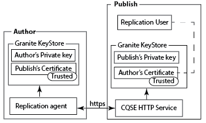
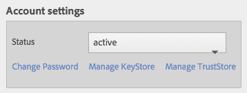
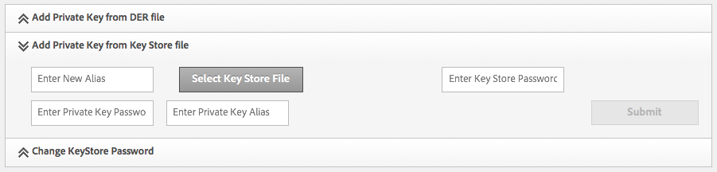
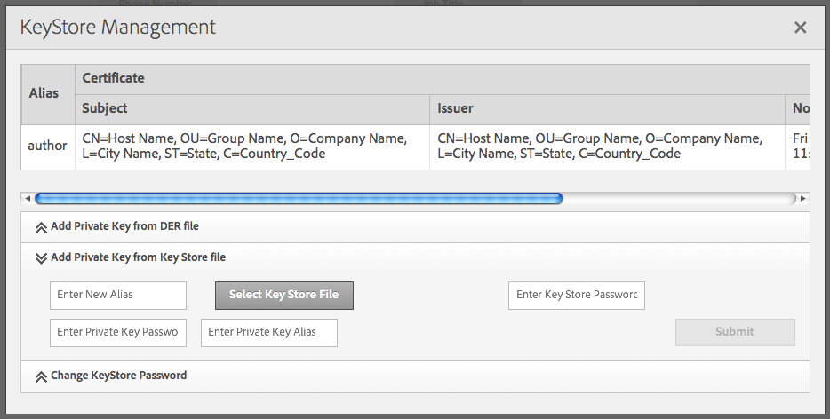
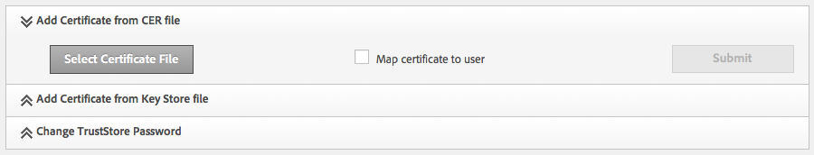
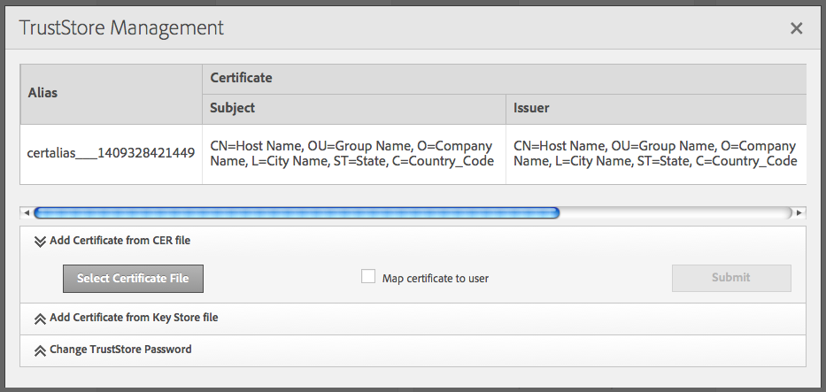
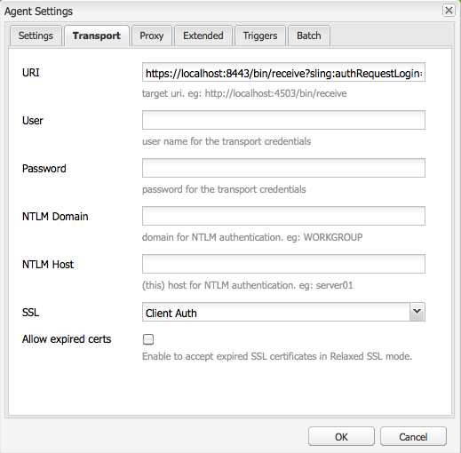

# Replicating Using Mutual SSL{#replicating-using-mutual-ssl}

Configure AEM so that a replication agent on the author instance uses mutual SSL (MSSL) to connect with the publish instance. Using MSSL, the replication agent and the HTTP service on the publish instance use certificates to authenticate each other.

Configuring MSSL for replication involves performing the following steps:

1. Create or obtain private keys and certificates for the author and publish instances.
1. Install the keys and certificates on the author and publish instances:

    * Author: Author's private key and Publish's certificate.
    * Pubish: Publish's private key and Author's certificate. The certificate is associated with the user account that is authenticated with the replication agent.

1. Configure the Jetty-Based HTTP Service on the Publish instance.
1. Configure the transport and SSL properties of the replication agent.



You must determine which user account is performing the replication. When installing the trusted author certificate on the publish instance, the certificate is associated with this user account.

## Obtaining or Creating Credentials for MSSL {#obtaining-or-creating-credentials-for-mssl}

You require a private key and public certificate for the author and publish instances:

* Private keys must be contained in pkcs#12 or JKS format.
* Certificates must be contained in pkcs#12 or JKS format. Additionally certificate contained in "CER" format can also be added to Granite Truststore.
* Certificates can be self-signed or signed by a recognized CA.

### JKS Format {#jks-format}

Generate a private key and a certificate in JKS format. The private key is stored in a KeyStore file, and the certificate is stored in a TrustStore file. Use [Java `keytool`](https://docs.oracle.com/javase/7/docs/technotes/tools/solaris/keytool.html) to create both.

Perform the following steps using Java `keytool` to create the private key and the credential:

1. Generate a private-public key pair in a KeyStore.
1. Create or obtain the certificate:

    * Self-signed: Export the certificate from the KeyStore.
    * CA-signed: Generate a certificate request and send it to the CA.

1. Import the certificate into a TrustStore.

Use the following procedure to create a private key and a self-signed certificate for both the author and publish instances. Use different values for command options accordingly.

1. Open a command-line window or terminal. To create the private-public key pair, enter the following command, using option values from the table below:

   ```shell
   keytool -genkeypair -keyalg RSA -validity 3650 -alias alias -keystore keystorename.keystore  -keypass key_password -storepass  store_password -dname "CN=Host Name, OU=Group Name, O=Company Name,L=City Name, S=State, C=Country_ Code"
   ```

   | Option |Author |Publish |
   |---|---|---|
   | -alias |author |publish |
   | -keystore |author.keystore |publish.keystore |

1. To export the certificate, enter the following command using option values from the table below:

   ```shell
   keytool -exportcert -alias alias -file cert_file -storetype jks -keystore keystore -storepass store_password
   ```

   | Option |Author |Publish |
   |---|---|---|
   | -alias |author |publish |
   | -file |author.cer |publish.cer |
   | -keystore |author.keystore |publish.keystore |

### pkcs#12 Format {#pkcs-format}

Generate a private key and a certificate in pkcs#12 format. Use [openSSL](https://www.openssl.org/) to generate them. Use the following procedure to generate a private key and a certificate request. To obtain the certificate, either sign the request with your private key (self-signed certificate) or send the request to a CA. Then, generate the pkcs#12 archive that contains the private key and the certificate.

1. Open a command-line window or terminal. To create the private key, enter the following command, using option values from the table below:

   ```shell
   openssl genrsa -out keyname.key 2048
   ```

   | Option |Author |Publish |
   |---|---|---|
   | -out |author.key |publish.key |

1. To generate a certificate request, enter the following command, using option values from the table below:

   ```shell
   openssl req -new -key keyname.key -out key_request.csr
   ```

   | Option |Author |Publish |
   |---|---|---|
   | -key |author.key |publish.key |
   | -out |author_request.csr |publish_request.csr |

   Either sign the certificate request or send the request to a CA.

1. To sign the certificate request, enter the following command, using option values from the table below:

   ```shell
   openssl x509 -req -days 3650 -in key_request.csr -signkey keyname.key -out certificate.cer
   ```

   | Option |Author |Publish |
   |---|---|---|
   | -signkey |author.key |publish.key |
   | -in |author_request.csr |publish_request.csr |
   | -out |author.cer |publish.cer |

1. To add your private key and the signed certificate to a pkcs#12 file, enter the following command, using option values from the table below:

   ```shell
   openssl pkcs12 -keypbe PBE-SHA1-3DES -certpbe PBE-SHA1-3DES -export -in certificate.cer -inkey keyname.key -out pkcs12_archive.pfx -name "alias"
   ```

   | Option |Author |Publish |
   |---|---|---|
   | -inkey |author.key |publish.key |
   | -out |author.pfx |publish.pfx |
   | -in |author.cer |publish.cer |
   | -name |author |publish |

## Install the Private Key and TrustStore on Author {#install-the-private-key-and-truststore-on-author}

Install the following items on the author instance:

* The private key of the author instance.
* The certificate of the publish instance.

To perform the following procedure, you must be logged in as an adminstrator of the author instance.

### Install the Author Private Key {#install-the-author-private-key}

1. Open the User Management page for the author instance. ([http://localhost:4502/libs/granite/security/content/useradmin.html](http://localhost:4502/libs/granite/security/content/useradmin.html))
1. To open the properties of your user account, click or tap your user name.
1. If the Create KeyStore link appears in the Account Settings area, click the link. Configure a password and click OK.
1. In the Account Settings area, click Manage Keystore.

   

1. Click Add Private Key From Key Store File.

   

1. Click Select Key Store file, then browse for and select the author.keystore file or the author.pfx file if using pkcs#12, then click Open.
1. Enter an alias and the password for the key store. Enter the alias and password for the private key, then click Submit.
1. Close the KeyStore Management dialog box.

   

### Install the Publish Certificate {#install-the-publish-certificate}

1. Open the User Management page for the author instance. ([http://localhost:4502/libs/granite/security/content/useradmin.html](http://localhost:4502/libs/granite/security/content/useradmin.html))
1. To open the properties of your user account, click or tap your user name.
1. If the Create TrustStore link appears in the Account Settings area, click the link, create a password for the TrustStore and click OK.
1. In the Account Settings area, click Manage TrustStore.
1. Click Add Certificate From CER File.

   

1. Clear the Map Certificate to User option. Click Select Certificate File, select publish.cer, and click Open.
1. Close the TrustStore Management dialog box.

   

## Install Private Key and TrustStore on Publish {#install-private-key-and-truststore-on-publish}

Install the following items on the publish instance:

* The private key of the publish instance.
* The certificate of the author instance. Associate the certificate with the user that is used to execute replication requests.

To perform the following procedure, you must be logged in as an adminstrator of the publish instance.

### Install the Publish Private Key {#install-the-publish-private-key}

1. Open the User Management page for the publish instance. ([http://localhost:4503/libs/granite/security/content/useradmin.html](http://localhost:4503/libs/granite/security/content/useradmin.html))
1. To open the properties of your user account, click or tap your user name.
1. If the Create KeyStore link appears in the Account Settings area, click the link. Configure a password and click OK.
1. In the Account Settings area, click Manage Keystore.
1. Click Add Private Key From Key Store File.
1. Click Select Key Store file, then browse for and select the publish.keystore file or the publish.pfx file if using pkcs#12, then click Open.
1. Enter an alias and the password for the key store. Enter the alias and password for the private key, then click Submit.
1. Close the KeyStore Management dialog box.

### Install the Author Certificate {#install-the-author-certificate}

1. Open the User Management page for the publish instance. ([http://localhost:4503/libs/granite/security/content/useradmin.html](http://localhost:4503/libs/granite/security/content/useradmin.html))
1. If the Create TrustStore link appears in the Global Trust Store area, click the link, create a password for the TrustStore and click OK.
1. In the Account Settings area, click Manage TrustStore.
1. Click Add Certificate From CER File.
1. Make sure the Map Certificate to User option is selected. Click Select Certificate File, select author.cer, and click Open.
1. Click Submit, then close the TrustStore Management dialog box.

## Configure the HTTP Service on Publish {#configure-the-http-service-on-publish}

Configure the properties of the Apache Felix Jetty Based HTTP Service on the publish instance so that it uses HTTPS while accessing Granite Keystore. The PID of the service is `org.apache.felix.http`.

The following table lists the OSGi properties that you need to configure whether you are using the Web Console.

| Property Name on Web Console |OSGi Property Name |Value |
|---|---|---|
| Enable HTTPS |org.apache.felix.https.enable |true |
| Enable HTTPS To Use Granite KeyStore |org.apache.felix.https.use.granite.keystore |true |
| HTTPS Port |org.osgi.service.http.port.secure |8443 (or other desired port) |
| Client Certificate |org.apache.felix.https.clientcertificate |"Client Certificate Wanted" |

## Configure the Replication Agent on Author {#configure-the-replication-agent-on-author}

Configure the replication agent on the author instance to use the HTTPS protocol when connecting to the publish instance. For complete information about configuring replication agents see [Configuring Your Replication Agents](/help/sites-deploying/replication.md#configuring-your-replication-agents).

To enable MSSL, configure the properties on the Transport tab according to the following table:

<table>
 <tbody>
  <tr>
   <th>Property</th>
   <th>Value</th>
  </tr>
  <tr>
   <td>URI</td>
   <td><p>https://server_name:SSL_port/bin/receive?sling:authRequestLogin=1</p> <p>For example:</p> <p>http://localhost:8443/bin/receive?sling:authRequestLogin=1</p> </td>
  </tr>
  <tr>
   <td>User</td>
   <td>No value</td>
  </tr>
  <tr>
   <td>Password</td>
   <td>No value</td>
  </tr>
  <tr>
   <td>SSL</td>
   <td>Client Auth</td>
  </tr>
 </tbody>
</table>



After you configure the replication agent, test the connection to determine whether MSSL is configured correctly.

```xml
29.08.2014 14:02:46 - Create new HttpClient for Default Agent
29.08.2014 14:02:46 - * HTTP Version: 1.1
29.08.2014 14:02:46 - * Using Client Auth SSL configuration *
29.08.2014 14:02:46 - adding header: Action:Test
29.08.2014 14:02:46 - adding header: Path:/content
29.08.2014 14:02:46 - adding header: Handle:/content
29.08.2014 14:02:46 - deserialize content for delivery
29.08.2014 14:02:46 - No message body: Content ReplicationContent.VOID is empty
29.08.2014 14:02:46 - Sending POST request to http://localhost:8443/bin/receive?sling:authRequestLogin=1
29.08.2014 14:02:46 - sent. Response: 200 OK
29.08.2014 14:02:46 - ------------------------------------------------
29.08.2014 14:02:46 - Sending message to localhost:8443
29.08.2014 14:02:46 - >> POST /bin/receive HTTP/1.0
29.08.2014 14:02:46 - >> Action: Test
29.08.2014 14:02:46 - >> Path: /content
29.08.2014 14:02:46 - >> Handle: /content
29.08.2014 14:02:46 - >> Referer: about:blank
29.08.2014 14:02:46 - >> Content-Length: 0
29.08.2014 14:02:46 - >> Content-Type: application/octet-stream
29.08.2014 14:02:46 - --
29.08.2014 14:02:46 - << HTTP/1.1 200 OK
29.08.2014 14:02:46 - << Connection: Keep-Alive
29.08.2014 14:02:46 - << Server: Day-Servlet-Engine/4.1.64
29.08.2014 14:02:46 - << Content-Type: text/plain;charset=utf-8
29.08.2014 14:02:46 - << Content-Length: 26
29.08.2014 14:02:46 - << Date: Fri, 29 Aug 2014 18:02:46 GMT
29.08.2014 14:02:46 - << Set-Cookie: login-token=3529326c-1500-4888-a4a3-93d299726f28%3ac8be86c6-04bb-4d18-80d6-91278e08d720_98797d969258a669%3acrx.default; Path=/; HttpOnly; Secure
29.08.2014 14:02:46 - << Set-Cookie: cq-authoring-mode=CLASSIC; Path=/; Secure
29.08.2014 14:02:46 - <<
29.08.2014 14:02:46 - << R
29.08.2014 14:02:46 - << eplicationAction TEST ok.
29.08.2014 14:02:46 - Message sent.
29.08.2014 14:02:46 - ------------------------------------------------
29.08.2014 14:02:46 - Replication (TEST) of /content successful.
Replication test succeeded
```
