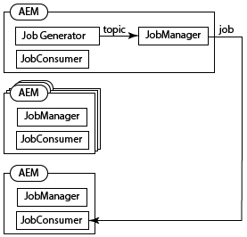
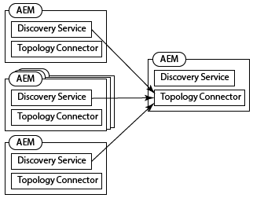
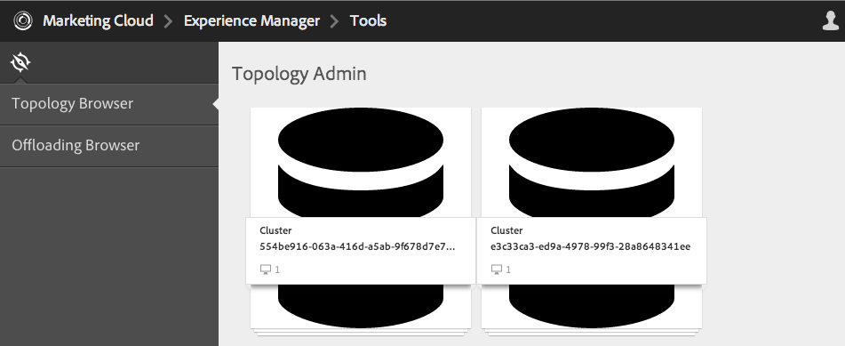
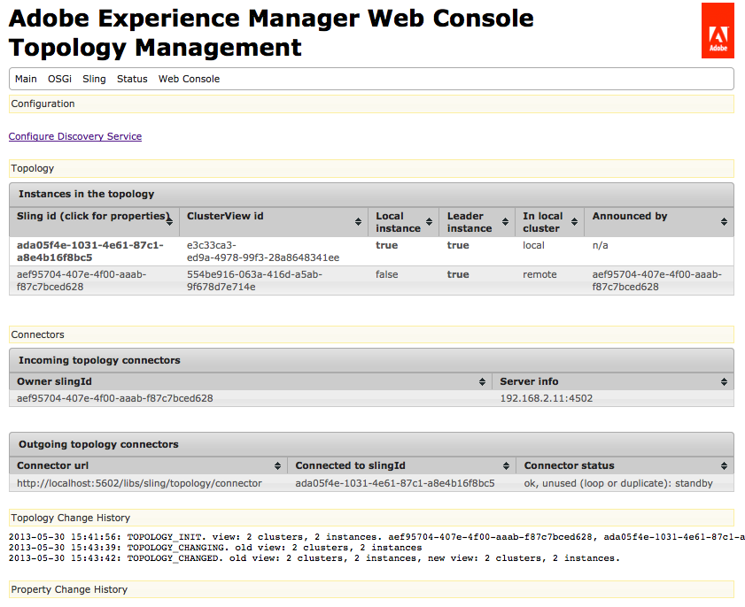
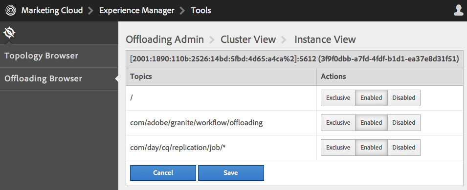
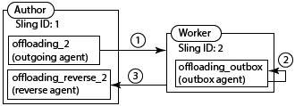
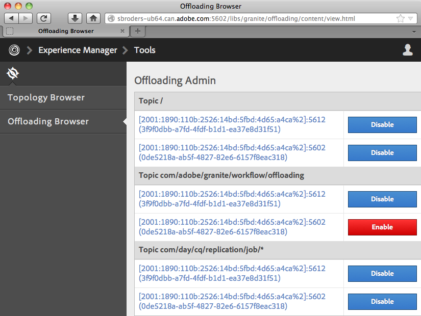

# Offloading Jobs{#offloading-jobs}

## Introduction {#introduction}

Offloading distributes processing tasks among Experience Manager instances in a topology. With offloading, you can use specific Experience Manager instances for performing specific types of processing. Specialized processing enables you to maximize the usage of available server resources.

Offloading is based on the [Apache Sling Discovery](https://sling.apache.org/documentation/bundles/discovery-api-and-impl.html) and Sling JobManager features. To use offloading, you add Experience Manager clusters to a topology and identify the job topics that the cluster process. Clusters are comprised of one or more Experience Manager instances, so that a single instance is considered to be a cluster.

For information about adding instances to a topology, see [Administering Topologies](/help/sites-deploying/offloading.md#administering-topologies).

### Job Distribution {#job-distribution}

The Sling JobManager and JobConsumer enable the creation of jobs that are processed in a topology:

* JobManager: A service that creates jobs for specific topics.
* JobConsumer: A service that executes jobs of one or more topics. Multiple JobConsumer services can be registered for the same topic.

When JobManager creates a job, the Offloading framework selects an Experience Manager cluster in the topology to execute the job:

* The cluster must include one or more instances that are running a JobConsumer that is registered for the job topic.
* The topic must be enabled for at least one instance in the cluster.

See [Configuring Topic Consumption](/help/sites-deploying/offloading.md#configuring-topic-consumption) for information about refining job distribution.

When the Offloading framework selects a cluster to execute a job, and the cluster is comprised of multiple instances, Sling Distribution determines which instance in the cluster executes the job.

### Job Payloads {#job-payloads}

The Offloading framework supports job payloads that associate jobs with resources in the repository. Job payloads are useful when jobs are created for processing resources and the job is offloaded to another computer.

Upon creation of a job, the payload is only guaranteed to be located on the instance that creates the job. When offloading the job, replication agents ensure that the payload is created on the instance that eventually consumes the job. When job execution is complete, reverse replication causes the payload to be copied back to the instance that created the job.

## Administering Topologies {#administering-topologies}

Topologies are loosely coupled Experience Manager clusters that are participating in offloading. A cluster consists of one or more Experience Manager server instances (a single instance is considered as a cluster).

Each Experience Manager instance runs the following Offloading-related services:

* Discovery Service: Sends requests to a Topology Connector to join the topology.
* Topology Connector: Receives the join requests and either accepts or refuses each request.

The Discovery Service of all members of the topology point to the Topology Connector on one of the members. In the sections that follow, this member is referred to as the root member.

Each cluster in the topology contains an instance that is recognized as the leader. The cluster leader interacts with the topology on behalf of the other members of the cluster. When the leader leaves the cluster, a new leader for the cluster is automatically chosen.

### Viewing the Topology {#viewing-the-topology}

Use Topology Browser to explore the state of the topology in which the Experience Manager instance is participating. Topology Browser shows the clusters and instances of the topology.

For each cluster, you see a list of cluster members that indicates the order in which each member joined the cluster, and which member is the Leader. The Current property indicates the instance that you are currently administering.

For each instance in the cluster, you can see several topology-related properties:

* A allow list of topics for the instance's job consumer.
* The endpoints that are exposed for connecting with the topology.
* The job topics for which the instance is registered for offloading.
* The job topics that the instance processes.

1. Using the Touch UI, click the Tools tab. ([http://localhost:4502/tools.html](http://localhost:4502/tools.html))
1. In the Granite Operations area, click Offloading Browser.
1. In the navigation panel, click Topology Browser.

   The clusters that are participating in the topology appear.

   

1. Click a cluster to see a list of the instances in the cluster and their ID, Current status, and Leader status.
1. Click an instance ID to see more detailed properties.

You can also use the Web Console to view topology information. The console provides further information about the topology clusters:

* Which instance is the local instance.
* The Topology Connector services that this instance uses to connect to the topology (outgoing), and the services that connect to this instance (incoming).
* Change history for the topology and instance properties.

Use the following procedure to open the Topology Management page of the Web Console:

1. Open the Web Console in your browser. ([http://localhost:4502/system/console](http://localhost:4502/system/console))
1. Click Main &gt; Topology Management.

   

### Configuring Topology Membership {#configuring-topology-membership}

The Apache Sling Resource-Based Discovery Service runs on each instance to control how Experience Manager instances interact with a topology.

The Discovery Service sends periodic POST requests (heartbeats) to Topology Connector services to establish and maintain connections with the topology. The Topology Connector service maintains a allow list of IP addresses or host names that are allowed to join the topology:

* To join an instance to a topology, specify the URL of the Topology Connector service of the root member.
* To enable an instance to join a topology, add the instance to the allow list of the root member's Topology Connector service.

Use the Web Console or a sling:OsgiConfig node to configure the following properties of the org.apache.sling.discovery.impt.Config service:

<table>
 <tbody>
  <tr>
   <th>Property Name</th>
   <th>OSGi Name</th>
   <th>Description</th>
   <th>Default Value</th>
  </tr>
  <tr>
   <td>Heartbeat timeout (seconds)</td>
   <td>heartbeatTimeout</td>
   <td>The amount of time in seconds to wait for a heartbeat response before the targeted instance is considered unavailable. </td>
   <td>20</td>
  </tr>
  <tr>
   <td>Heartbeat interval (seconds)</td>
   <td>heartbeatInterval</td>
   <td>The amount of time in seconds between heartbeats.</td>
   <td>15</td>
  </tr>
  <tr>
   <td>Minimal Event Delay (seconds)</td>
   <td>minEventDelay</td>
   <td>
When a change occurs to the topology, the amount of time to delay the change of state from TOPOLOGY_CHANGING to TOPOLOGY_CHANGED. Each change that occurs when the state is TOPOLOGY_CHANGING increases the delay by this amount of time.
 
This delay prevents listeners from being flooded with events. 
 
To use no delay, specify 0 or a negative number.
 </td>
   <td>3</td>
  </tr>
  <tr>
   <td>Topology Connector URLs</td>
   <td>topologyConnectorUrls</td>
   <td>The URLs of the Topology Connector services to send heartbeat messages.</td>
   <td>http://localhost:4502/libs/sling/topology/connector</td>
  </tr>
  <tr>
   <td>Topology Connector allow list</td>
   <td>topologyConnectorWhitelist</td>
   <td>The list of IP addresses or host names that the local Topology Connector service allows in the topology. </td>
   <td>
localhost
 
127.0.0.1
 </td>
  </tr>
  <tr>
   <td>Repository Descriptor Name</td>
   <td>leaderElectionRepositoryDescriptor</td>
   <td> </td>
   <td>&lt;no value&gt;</td>
  </tr>
 </tbody>
</table>

Use the following procedure to connect a CQ instance to the root member of a topology. The procedure points the instance to the Topology Connector URL of the root topology member. Perform this procedure on all members of the topology.

1. Open the Web Console in your browser. ([http://localhost:4502/system/console](http://localhost:4502/system/console))
1. Click Main &gt; Topology Management.
1. Click Configure Discovery Service.
1. Add an item to the Topology Connector URLs property, and specify the URL of the root topology member's Topology Connector service. The URL is in the form https://rootservername:4502/libs/sling/topology/connector.

Perform the following procedure on the root member of the topology. The procedure adds the names of the other topology members to its Discovery Service allow list.

1. Open the Web Console in your browser. ([http://localhost:4502/system/console](http://localhost:4502/system/console))
1. Click Main &gt; Topology Management.
1. Click Configure Discovery Service.
1. For each member of the topology, add an item to the Topology Connector allow list property, and specify the host name or IP address of the topology member.

## Configuring Topic Consumption {#configuring-topic-consumption}

Use Offloading Browser to configure topic consumption for the Experience Manager instances in the topology. For each instance, you can specify the topics that it consumes. For example, to configure your topology so that only one instance consumes topics of a specific type, disable the topic on all instances except for one.

Jobs are distributed among instances that have the associated topic enabled using round-robin logic.

1. Using the Touch UI, click the Tools tab. ([http://localhost:4502/tools.html](http://localhost:4502/tools.html))
1. In the Granite Operations area, click Offloading Browser.
1. In the navigation panel, click Offloading Browser.

   The offloading topics and the server instances that that can consume the topics appear.

   

1. To disable the consumption of a topic for an instance, below the topic name click Disable beside the instance.
1. To configure all topic consumption for an instance, click the instance identifier below any topic.

   

1. Click one of the following buttons beside a topic to configure the consumption behavior for the instance, and then click Save:

    * Enabled: This instance consumes jobs of this topic.
    * Disabled: This instance does not consume jobs of this topic.
    * Exclusive: This instance consumes jobs only of this topic.

   **Note:** When you select Exclusive for a topic, all the other topics are automatically set to Disabled.

### Installed Job Consumers {#installed-job-consumers}

Several JobConsumer implementations are installed with Experience Manager. The topics for which these JobConsumers are registered appear in Offloading Browser. Additional topics that appear are those that custom JobConsumers have registered. The following table describes the default JobConsumers.

| Job topic |Service PID |Description |
|---|---|---|
| / |org.apache.sling.event.impl.jobs.deprecated.EventAdminBridge |Installed with Apache Sling. Processes jobs that the OSGi event admin generates, for backward compatibility. |
| com/day/cq/replication/job/&ast; |com.day.cq.replication.impl.AgentManagerImpl |A replication agent that replicates job payloads. |

<!--
| com/adobe/granite/workflow/offloading |com.adobe.granite.workflow.core.offloading.WorkflowOffloadingJobConsumer |Processes jobs that the DAM Update Asset Offloader workflow generates. |
-->

### Disabling and Enabling Topics For an Instance {#disabling-and-enabling-topics-for-an-instance}

The Apache Sling Job Consumer Manager service provides topic allow list and block list properties. Configure these properties to enable or disable the processing of specific topics on an Experience Manager instance.

**Note:** If the instance belongs to a topology, you can also use Offloading Browser on any computer in the topology to enable or disable topics.

The logic that creates the list of enabled topics first allows all the topics that are in the allow list, and then removes topics that are on the block list. By default, all topics are enabled (the allow list value is `*`) and no topics are disabled (the block list has no value).

Use Web Console or a `sling:OsgiConfig` node to configure the following properties. For `sling:OsgiConfig` nodes, the PID of the Job Consumer Manager service is org.apache.sling.event.impl.jobs.JobConsumerManager.

| Property Name in Web Console |OSGi ID |Description |
|---|---|---|
| Topic allow list |job.consumermanager.whitelist |A list of topics that the local JobManager service processes. The default value of &ast; causes all topics to be sent to the registered TopicConsumer service. |
| Topic block list |job.consumermanager.blacklist |A list of topics that the local JobManager service does not process.  |

## Creating Replication Agents For Offloading {#creating-replication-agents-for-offloading}

The offloading framework uses replication to transport resources between author and worker. The offloading framework automatically creates replication agents when instances join the topology. The agents are created with default values. Manually change the password that the agents use for authentication.

>[!CAUTION]
>
>A known issue with the automatically generated replication agents requires you to manually create new replication agents.

Create the replication agents that transport job payloads between instances for offloading. The following illustration shows the agents that are required to offload from the author to a worker instance. The author has a Sling ID of 1 and the worker instance has a Sling ID of 2:

This setup requires the following three agents:

1. An outgoing agent on the author instance that replicates to the worker instance.
1. A reverse agent on the author instance that pulls from the outbox on the worker instance.
1. An outbox agent on the worker instance.

This replication scheme is similar to that used between author and publish instances. However, for the offloading situation all the instances involved are authoring instances.

>[!NOTE]
>
>The Offloading framework uses the topology to obtain the IP addresses of the offloading instances. The framework then automatically creates the replication agents based on these IP addresses. If the IP addresses of the offloading instances later change, the change is automatically propagated on the topology after the instance restarts. However, the Offloading framework does not automatically update the replication agents to reflect the new IP addresses. To avoid this situation, use fixed IP addresses for all instances in the topology.

### Naming the Replication Agents for Offloading {#naming-the-replication-agents-for-offloading}

Use a specific format for the ***Name*** property of the replication agents so that the offloading framework automatically uses the correct agent for specific worker instances.

**Naming the outgoing agent on the author instance:**

`offloading_<slingid>`, where `<slingid>` is the Sling ID of the worker instance.

Example: `offloading_f5c8494a-4220-49b8-b079-360a72f71559`

**Naming the reverse agent on the author instance:**

`offloading_reverse_<slingid>`, where `<slingid>` is the Sling ID of the worker instance.

Example: `offloading_reverse_f5c8494a-4220-49b8-b079-360a72f71559`

**Naming the outbox on the worker instance:**

`offloading_outbox`

### Creating the outgoing agent {#creating-the-outgoing-agent}

1. Create a **Replication Agent** on author. (See the [documentation for replication agents](/help/sites-deploying/replication.md)). Specify any **Title**. The **Name** must follow the naming convention.
1. Create the agent using the following properties:

   | Property |Value |
   |---|---|
   | Settings > Serialization Type |Default |
   | Transport >Transport URI |https://*`<ip of target instance>`*:*`<port>`*`/bin/receive?sling:authRequestLogin=1` |
   | Transport >Transport User |Replication user on target instance |
   | Transport >Transport Password |Replication user password on target instance |
   | Extended > HTTP Method |POST |
   | Triggers > Ignore Default |True |

### Creating the reverse agent {#creating-the-reverse-agent}

1. Create a **Reverse Replication Agent** on author. (See the [documentation for replication agents](/help/sites-deploying/replication.md).) Specify any **Title**. The **Name** must follow the naming convention.
1. Create the agent using the following properties:

   | Property |Value |
   |---|---|
   | Settings > Serialization Type |Default |
   | Transport >Transport URI |https://*`<ip of target instance>`*:*`<port>`*`/bin/receive?sling:authRequestLogin=1` |
   | Transport >Transport User |Replication user on target instance |
   | Transport >Transport Password |Replication user password on target instance |
   | Extended > HTTP Method |GET |

### Creating the outbox agent {#creating-the-outbox-agent}

1. Create a **Replication Agent** on the worker instance. (See the [documentation for replication agents](/help/sites-deploying/replication.md).) Specify any **Title**. The **Name** must be `offloading_outbox`.
1. Create the agent using the following properties.

   | Property |Value |
   |---|---|
   | Settings > Serialization Type |Default |
   | Transport >Transport URI |repo://var/replication/outbox |
   | Trigger > Ignore Default |True |

### Finding the Sling ID {#finding-the-sling-id}

Obtain the Sling ID of an Experience Manager instance using either of the following methods:

* Open the Web Console and, in the Sling Settings, find the value of the Sling ID property ([http://localhost:4502/system/console/status-slingsettings](http://localhost:4502/system/console/status-slingsettings)). This method is useful if the instance is not yet part of the topology.
* Use the Topology browser if the instance is already part of the topology.

<!--
## Offloading the Processing of DAM Assets {#offloading-the-processing-of-dam-assets}

Configure the instances of a topology so that specific instances perform the background processing of assets that are added or updated in DAM.

By default, Experience Manager executes the [!UICONTROL DAM Update Asset] workflow when a DAM asset changes or one is added to DAM. Change the default behavior so that Experience Manager instead executes the [!UICONTROL DAM Update Asset Offloader] workflow. This workflow generates a JobManager job that has a topic of `com/adobe/granite/workflow/offloading`. Then, configure the topology so that the job is offloaded to a dedicated worker.

>[!CAUTION]
>
>No workflow should be transient when used with workflow offloading. For example, the [!UICONTROL DAM Update Asset] workflow must not be transient when used for asset offloading. To set/unset the transient flag on a workflow, see [Transient Workflows](/help/assets/performance-tuning-guidelines.md#workflows).

The following procedure assumes the following characteristics for the offloading topology:

* One or more Experience Manager instance are authoring instances that users interact with for adding or updating DAM assets.
* Users to do not directly interact with one or more Experience Manager instances that process the DAM assets. These instances are dedicated to the background processing of DAM assets.

1. On each Experience Manager instance, configure the Discovery Service so that it points to the root Topography Connector. (See [Configuring Topology Membership](#title4).)
1. Configure the root Topography Connector so that the connecting instances are on the allow list.
1. Open Offloading Browser and disable the `com/adobe/granite/workflow/offloading` topic on the instances with which users interact to upload or change DAM assets.

   

1. On each instance that users interact with to upload or change DAM assets, configure workflow launchers to use the [!UICONTROL DAM Update Asset Offloading] workflow:

    1. Open the Workflow console.
    1. Click the Launcher tab.
    1. Locate the two Launcher configurations that execute the [!UICONTROL DAM Update Asset] workflow. One launcher configuration event type is Node Created, and the other type is Node Modified.
    1. Change both event types so that they execute the [!UICONTROL DAM Update Asset Offloading] workflow. (For information about launcher configurations, see [Starting Workflows When Nodes Change](/help/sites-administering/workflows-starting.md).)

1. On the instances that perform the background processing of DAM assets, disable the workflow launchers that execute the [!UICONTROL DAM Update Asset] workflow.
-->

## Further Reading {#further-reading}

In addition to the details presented on this page, you can also read the following:

* For information about using Java APIs to create jobs and job consumers, see [Creating and Consuming Jobs for Offloading](/help/sites-developing/dev-offloading.md).
