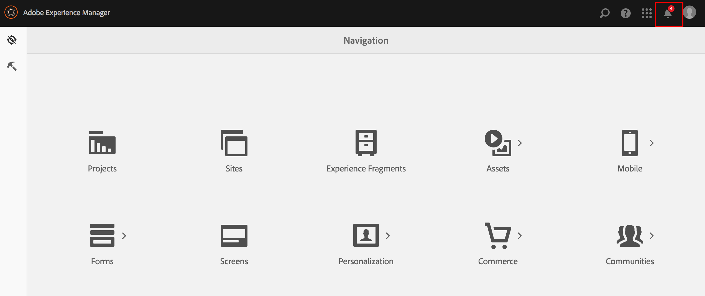
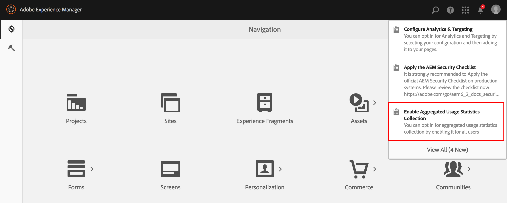
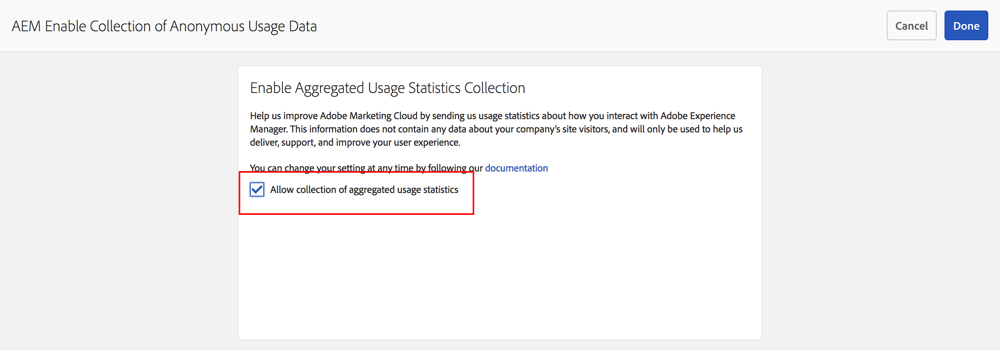
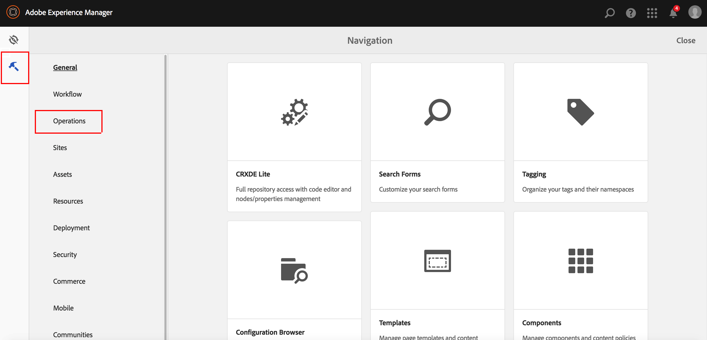
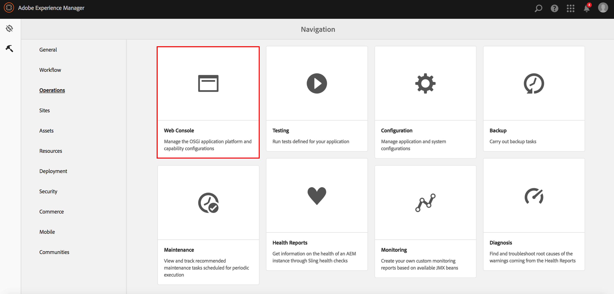
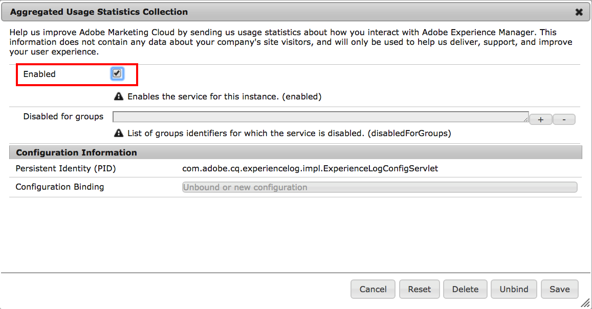

# Opting Into Aggregated Usage Statistics Collection{#opting-into-aggregated-usage-statistics-collection}

## Introduction {#introduction}

You can help improve Adobe Experience Cloud by sending Adobe statistics about how you interact with Adobe Experience Manager (AEM). This information does not contain any data about your company's site visitors and is only used to help Adobe deliver, support, and improve your user experience.

You can opt into usage statistics collection by using either the Touch UI or the Web Console.

>[!NOTE]
>
>There are various data protection and privacy regulations; including, for example, GDPR and CCPA. AEM Sites is ready to help customers with their data protection and privacy compliance obligations. This page guides customers through the procedures to opt-in (or out) of Aggregated Usage Statistics Collection.
>
>For further information, also see the [Adobe's Privacy Center](https://www.adobe.com/privacy.html).

>[!NOTE]
>
>You can opt-out at any time by either using the [Web Console](/help/sites-deploying/opt-in-aggregated-usage-statistics.md#opt-in-by-using-the-web-console) or by not selecting the opt-in option on the AEM opt-in screen.

## Opt-in by using the Touch UI {#opt-in-by-using-the-touch-ui}

The first time you start AEM, you can opt-in by using the Touch UI as follows:

1. On the AEM Navigation screen, click the **Inbox** (bell) icon.

   

1. On the drop-down list, click "**Enable Aggregated Usage Statistics Collection**".

   

1. On the opt-in screen, select "**Allow collection of aggregated usage statistics**".

   

1. Click "**Done**".

## Opt-in by using the Web Console {#opt-in-by-using-the-web-console}

You can opt-in (or opt-out) by using the Web Console as follows:

1. On the AEM Navigation screen, click **Tools** and then **Operations**.

   

1. On the Operations window, click **Web Console**.

   

1. Search for "**Aggregated Usage Statistics Collection**".
1. Click the **Edit** icon.

   

1. Select the **Enabled** checkbox. Alternatively, you can de-select the checkbox if you want to opt-out of usage statistics collection.

   

1. Click **Save**.
