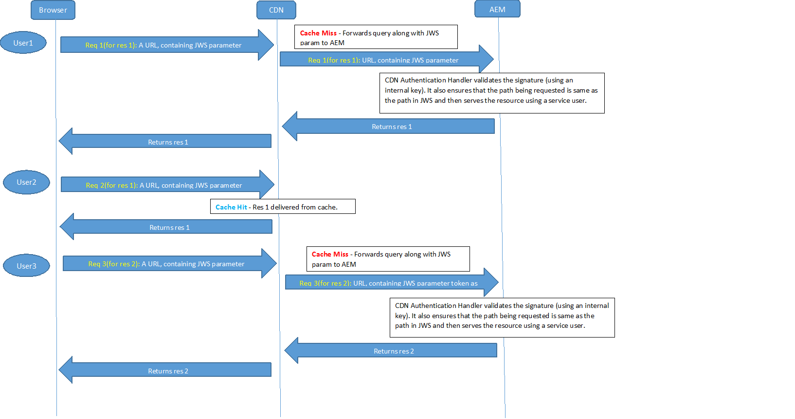

# OSGi Configuration Settings{#osgi-configuration-settings}

[OSGi](https://www.osgi.org/) is a fundamental element in the technology stack of AEM. It is used to control the composite bundles of AEM and their configuration.

OSGi "*provides the standardized primitives that allow applications to be constructed from small, reusable, and collaborative components. These components can be composed into an application and deployed*".

This functionality allows easy management of bundles as they can be stopped, installed, started individually. The interdependencies are handled automatically. Each OSGi Component (see the [OSGi Specification](https://docs.osgi.org/specification/)) is contained in one of the various bundles. When working with AEM, there are several methods of managing the configuration settings for such bundles; see [Configuring OSGi](/help/sites-deploying/configuring-osgi.md) for more details and the recommended practices.

The following OSGi configuration settings (listed according to bundle) are relevant to project implementation. Not all the listed settings need adjusting, some are mentioned to help you understand how AEM operates.

>[!CAUTION]
>
>The list is intended to act as a guideline and is not exhaustive. Not all bundles are listed, nor all parameters for some of the bundles that are.
>
>The configuration necessary varies from project to project.
>
>See the Web console for values used and detailed information about parameters.

>[!NOTE]
>
>The OSGi Configuration Diff tool, part of the [AEM Tools](https://experienceleague.adobe.com/docs/experience-cloud-kcs/kbarticles/KA-17488.html?lang=en), can be used to list the default OSGi configurations.

>[!NOTE]
>
>Further bundles may be required for specific areas of functionality within AEM. In these cases, configuration details can be found on the page related to the appropriate functionality.

**AEM Replication Event Listener** Configure:

* The **Run Modes**, in which replication events are distributed to listeners. For example, if defined as author, it is the system that "initiates" the replication.

* Add the run mode **publish** if the project code processes replication events (reverse replication) in a publish environment. For example, when the Dispatcher is used to flush from the publish environment or when standard replication to other publish instances occurs.

**AEM Repository change listener** Configure:

* The **Paths**, locations to listen for repository events ready for distribution.

**CRX Sling Client Repository** Configure access to the underlying content repository.

* The **Admin Password** should be changed after installation to ensure the [security](/help/sites-administering/security-checklist.md) of your instance.
* Other changes should not be necessary and care must be taken as they can affect access to the repository.

**Apache Felix OSGi Management Console** Configure:

* **Plugins**, the main navigation items (console plugins) to be available in the **Apache Felix Web Management Console** as top-level menu items. Disable any you do not need as each requires space and resources.

>[!CAUTION]
>
>Be sure to configure the following:
>
>**User Name** and **Password**, the credentials for accessing the Apache Felix Web Management Console itself.
>The password must be changed after the initial installation to ensure the [security](/help/sites-administering/security-checklist.md) of your instance.

>[!NOTE]
>
>This configuration should be made using the Felix Console as it is needed at startup - before the repository is available.

**Apache Sling Customizable Request Data Logger** Configure:

* **Logger Name** and **Log Format** to configure the location and format of request and access logging (default: `request.log`). This log file is essential when analyzing performance or debugging functionality related to the web chain. It is paired with the [Apache Sling Request Logger](#apacheslingrequestlogger).

See [AEM Logging](/help/sites-deploying/configure-logging.md) and [Sling Logging](https://sling.apache.org/documentation/development/logging.html).

**Apache Sling Eventing Thread Pool** Configure:

* **Min Pool Size** and **Max Pool Size**, the size of the pool used to hold event threads.

* **Queue Size**, the maximum size of the thread queue if the pool is exhausted.
  The recommended value is `-1` because it sets the queue to unlimited. If a limit is set, losses might occur when it is exceeded.

* Changing these settings can help performance in scenarios with a high number of events. For example, heavy AEM DAM or Workflow usage.
* Values specific to your scenario should be established using tests.
* These settings can affect the performance of your instance, so do not change them without reason and due consideration.

**Apache Sling GET Servlet** Configure some aspects of rendering:

* **Auto Index** to enable/disable directory rendering for browsing.
* **Enable** (or disable) default renditions, such as **HTML**, **Plain Text**, **JSON**, or **XML**.
  Do not disable JSON.

>[!NOTE]
>
>This setting is automatically configured for production instances if you run AEM in [Production Ready Mode](/help/sites-administering/production-ready.md).

**Apache Sling JavaScript Handler** Configure settings for the compilation of .java files as scripts (servlets).

Certain settings can affect performance. Disable these settings where possible, especially for a production instance.

* **Source VM** and **Target VM**, define the JDK version that is used as the runtime JVM

* for production instances:

    * disable **Generate Debug Info**

**Apache Sling JCR Installer** These parameters probably do not need configuration, but can be useful to know when developing or debugging. For example, the installation folders can be useful for checking in or out, or creating a package.

* **Installation folders name regexp** and **Max hierarchy depth of install folders** - specify where, and to which depth, repository folders are searched for resources to be installed. When a wildcard is used (as in .&#42;/install) all appropriate matches are searched, for example, `/libs/sling/install` and `/libs/cq/core/install`.

* **Search Path**, list of paths that jcrinstall searches for resources to be installed, together with a number indicating the weighting factor for that path.

**Apache Sling Job Event Handler** Configure parameters that manage job scheduling:

* **Retry interval**, **Maximum Retries**, **Maximum Parallel Jobs**, **Acknowledge Wait Time**, among others.

* Changing these settings can improve performance in scenarios with a high number of jobs; for example, heavy usage of AEM DAM and Workflows.
* Values specific to your scenario should be established using tests.
* Do not change these settings without reason, only change after due consideration.

**Apache Sling JSP Script Handler** Configure performance relevant settings for the JSP script handler. To improve performance, you should disable as much as possible.

In particular for production instances:

* disable **Generate Debug Info**
* disable **Keep Generated Java&trade;**
* disable **Mapped Content**
* disable **Display Source Fragments**

>[!NOTE]
>
>This setting is automatically configured for production instances if you run AEM in [Production Ready Mode](/help/sites-administering/production-ready.md).

**Apache Sling Logging Configuration** Configure:

* **Log Level** and **Log File**, to define the location and log level of the central logging configuration (error.log). The level can be set to one of `DEBUG`, `INFO`, `WARN`, `ERROR`, and `FATAL`.

* **Number of Log Files** and **Log File Threshold** to define the size and version rotation of the log file.

* **Message Pattern** defines the format of the log messages.

See [AEM Logging](/help/sites-deploying/configure-logging.md#global-logging) and [Sling Logging](https://sling.apache.org/documentation/development/logging.html).

**Apache Sling Logging Logger Configuration (Factory Configuration)** Configure:

* **Log Level**, **Log File** and **Message Format** to define details of the log file and messages.

* **Logger** to define the category; for example, only log for com.day.cq.

* By using **Factory Configurations**, any number of additional configurations can be added to cater with the various log levels and categories needed.
* Such configurations are helpful during development; for example, to log TRACE messages for a specific service in a specific log file.
* Such configurations are helpful in a production environment; for example, to have messages about a specific service logged to an individual log file for easier monitoring.

See [AEM Logging](/help/sites-deploying/configure-logging.md) and [Sling Logging](https://sling.apache.org/documentation/development/logging.html).

**Apache Sling Logging Writer Configuration (Factory Configuration)** Configure:

* **Log File** to define the existence of a log file.
* **Number of Log Files** to define the version rotation.

* The writer can be used by an **Apache Sling Logging Logger Configuration** configuration.

* Such configurations are helpful during development; for example, to log TRACE messages for a specific service in a specific log file.
* Such configurations are helpful in a production environment; for example, to have messages about a specific service logged to an individual log file for easier monitoring.

See [AEM Logging](/help/sites-deploying/configure-logging.md) and [Sling Logging](https://sling.apache.org/documentation/development/logging.html).

**Apache Sling Main Servlet** Configure:

* **Number of Calls per Request** and **Recursion Depth** to protect your system against infinite recursion and excessive script calls.

**Apache Sling MIME Type Service** Configure:

* **MIME Types** to add types that are required by your project to the system. Doing so allows a `GET` request on a file to set the correct content-type header for linking the file type and application.

**Apache Sling Referrer Filter** To address known security issues with Cross-Site Request Forgery (CSRF) in CRX WebDAV and Apache Sling you must configure the Referrer filter.

The referrer filter service is an OSGi service that allows you to configure:

* which http methods should be filtered
* whether an empty referrer header is allowed
* and a list of servers to be allowed in addition to the server host.

See the [Security Checklist - Issues with Cross-Site Request Forgery](/help/sites-administering/security-checklist.md#protect-against-cross-site-request-forgery) for further details.

>[!NOTE]
>
>The Apache Sling Referrer Filter depends on the installation of a quick fix package.

**Apache Sling Request Logger** Configure:

* various parameters to define how requests are logged.
* **Enable Request Log**, to enable, or disable.

* **Enable Access Log**, to enable, or disable.

Paired with the [Apache Sling Customizable Request Data Logger](#apacheslingcustomizablerequestdatalogger).

See [AEM Logging](/help/sites-deploying/configure-logging.md) and [Sling Logging](https://sling.apache.org/documentation/development/logging.html).

**Apache Sling Resource Resolver Factory** Configure central aspects of Sling resource resolution:

* **Resource Search Paths**, add any project-specific paths (but do not remove `/libs` or `/apps`).

* **Virtual URLs** to define your vanity URL mappings.

* **URL Mappings** to define any aliases. For example, from `/content` to `/`.

* **Mapping Location**, the mapper configuration externalized in `/etc/map`.

* Use your local installation (for example, use `https://localhost:4502/system/console/jcrresolver`) to determine which Resource Resolver is active.

See: [https://cwiki.apache.org/confluence/display/SLING/Flexible+Resource+Resolution](https://cwiki.apache.org/confluence/display/SLING/Flexible+Resource+Resolution).

>[!CAUTION]
>
>Configure these options in the repository.
>
>Otherwise, changes made to **URL Mappings** using the Felix console might be overwritten by AEM on the next startup.

**Apache Sling Servlet/Script Resolver and Error Handler** The Sling Servlet and Script Resolver has multiple tasks:

1. It is used as the `ServletResolver` to select the Servlet or Script to call to handle the request.

1. It acts as the `SlingScriptResolver`.

1. It manages error handling by implementing the `ErrorHandler` interface using the same algorithm to select error handling servlets and scripts as is used to resolve request processing servlets and scripts.

Various parameters can be set, including:

* **Execution Paths** - Lists the paths to search for executable scripts. By configuring specific paths, you can limit which scripts can be run. If no path is configured, then the default is used ( `/` = root), allowing the running of all scripts.
  If a configured path value ends with a slash, the whole subtree is searched. Without such a trailing slash, the script is only run if it is an exact match.

* **Script User** - This optional property can specify the repository user account used for reading the scripts. If no account is specified, the `admin` user is used by default.

* **Default Extensions** - The list of extensions for which the default behavior is used. The last path segment of the resource type can be used as the script name.

**Apache HTTP Components Proxy Configuration** - The proxy configuration for all code using the Apache HTTP client, used when an HTTP is made. For example, on replication.

When creating a configuration, do not change the factory configuration. Instead, create a factory configuration for this component using the configuration manager available here: **https://localhost:4502/system/console/configMgr/**. The proxy configuration is available in **org.apache.http.proxyconfigurator.**

>[!NOTE]
>
>In AEM 6.0 and earlier releases, proxy was configured in Day Commons HTTP Client. As of AEM 6.1 and later releases, the proxy configuration has moved to the "Apache HTTP Components Proxy Configuration" instead of the 'Day Commons HTTP Client' config.

**Day CQ Antispam** Configure the anti-spam service (Akismet) used. This feature requires you to register the following:

* **Provider**
* **API key**
* **Registered URL**

**Adobe Granite HTML Library Manager** Configure to control the handling of client libraries (css or js) including, for example, how the underlying structure is seen.

* For production instances:

    * enable **Minify** (to remove CRLF and whitespace characters).
    * enable **Gzip** (to allow files to be gzipped and accessed with one request).
    * disable **Debug**
    * disable **Timing**

* For JS development (especially when firebugging/debugging):

    * disable **Minify**
    * enable **Debug** to separate the files for debugging and use with fire bug.
    * enable **Timing** if interested in timing.
    * enable **Debug** console to see JS console log messages.

>[!CAUTION]
>
>When changing the setting for either **Minify** or **Gzip**, delete the contents of clientlibs cache. See [Knowledge Base article](https://experienceleague.adobe.com/docs/experience-cloud-kcs/kbarticles/KA-16543.html?lang=en) for details.

>[!NOTE]
>
>This setting is automatically configured for production instances if you run AEM in [Production Ready Mode](/help/sites-administering/production-ready.md).

**Day CQ HTTP Header Authentication Handler** System wide settings for the basic authentication method of the HTTP request.

When using [closed user groups](/help/sites-administering/cug.md), you can configure, among others, the following:

* **HTTP Realm**
* The **Default Login Page**

**Day CQ Link Checker Service** Check and if necessary configure:

* **Scheduler Period** to define the interval at which external links are to be automatically checked.

* Check **Bad Link Tolerance Interval** for the period after which an unsuccessful external link is considered bad.
* **Link Check Override Patterns**, to define any paths to be excluded from link checking.

**Day CQ Link Checker Task** Configure settings for a single link checker task (a task which checks an external link):

* Check the intervals defined in **Good Link Test Interval** and **Bad Link Test Interval**

* The various parameters related to proxies for internet access and NTLM that are needed for external access when checking a link.

**Day CQ Mail Service** Configure hostname and access details for the mail server. See the Configuring the Mail Service section.

**Day CQ MCM Newsletter** Configure the various settings used with the newsletter.

**Day CQ Root Mapping** Configure:

* **Target Path** to define where a request to " `/`" is redirected to.

There are two UIs available in AEM:

* the touch-enabled UI is the standard UI
* and the deprecated classic UI is still fully operational

Using AEM Root Mapping you can configure the UI that you want to have as the default for your instance:

* To have the touch-enabled UI as the default UI, the **Target Path** should point to the following:

  ```shell
     /projects.html
  ```

* To have the classic UI as the default UI, the **Target Path** should point to the following:

  ```shell
     /welcome.html
  ```

>[!NOTE]
>
>On a standard installation, the touch-optimized UI is the default UI.

**Adobe Granite SSO Authentication Handler** - Configure SSO (Single Sign On) details. These details are often needed in enterprise author setups, often with LDAP.

Various configuration properties are available:

* **Path**
  The path for which this authentication handler is active. If this parameter is left empty, the authentication handler is disabled. For example, the path / causes the authentication handler to be used for the entire repository.

* **Service Ranking**
  OSGi Framework Service Ranking value is used to indicate the order used for calling this service. This value is an `int` value where higher values designate higher precedence.
  Default value is `0`.

* **Header Names**
  The names of headers that might contain a user ID.

* **Cookie Names**
  The names of cookies that might contain a user ID.

* **Parameter Names**
  The names of request parameters that might provide the user ID.

* **User Map**
  For selected users, the user name extracted from the HTTP request can be replaced with a different one in the credentials object. The mapping is defined here. If the user name `admin` appears on either side of the map, the mapping is ignored. The character "=" must be escaped with a leading "\".

* **Format**
  Indicates the format in which the user ID is provided. Use:

    * `Basic` if the user ID is encoded in the HTTP Basic Authentication format
    * `AsIs` if the user ID is provided in plain text or any regular expression applied value should be used as is or any regular expression

**Day CQ WCM Debug Filter** This is useful when developing as it allows the use of suffixes such as ?debug=layout when accessing a page. For example, https://localhost:4502/cf#/content/geometrixx/en/support.html?debug=layout provides layout information that may be of interest to the developer.

* To ensure performance and security, disable on production instances.

**Day CQ WCM Filter** Configure:

* **WCM Mode** to define the default mode.
* On an author instance, this mode might be `edit`, `disable,preview`, or `analytics`.
  The other modes can be accessed from the sidekick, or the suffix `?wcmmode=disabled` can be used to emulate a production environment.

* On a publish instance, this mode must be set to `disabled` to ensure that no other mode is accessible.

>[!NOTE]
>
>This setting is automatically configured for production instances if you run AEM in [Production Ready Mode](/help/sites-administering/production-ready.md).

**Day CQ WCM Link Checker Configurator** Configure:

* **List of rewrite configurations** to specify a list of locations for content-based link checker configurations. The configurations can be based on run mode. This fact is important to distinguish between author and publish environments, as link checker settings can differ.

**Day CQ WCM Page Manager Factory** Configure:

* **Page Subtree Activation Check** for a user (without replication permissions) to delete or move pages (even if the pages are not activated).

**Day CQ WCM Page Processor** Configure:

* **Paths**, a list of locations where the system listens for page modifications before triggering a `jcr:Event`.

**Adobe Page Impressions Tracker** For an author instance, configure as the following:

* **sling.auth.requirements**: set the value of this property to `-/libs/wcm/stats/tracker`

>[!CAUTION]
>
>This configuration allows anonymous requests to the tracking service.

>[!NOTE]
>
>See [Page Impressions](/help/sites-deploying/configuring.md#enabling-page-impressions) for more information.

**Day CQ WCM Page Statistics** For a publish instance configure:

* **URL to send data** to configure the URL used to track page statistics (is vital if a tracker request goes through the Dispatcher); for example, the default is `https://localhost:4502/libs/wcm/stats/tracker`.

* **Tracking script enabled** to enable ( `true`) or disable ( `false`) the inclusion of the tracking script on the pages. The default value is `false`.

>[!NOTE]
>
>See [Page Impressions](/help/sites-deploying/configuring.md#enabling-page-impressions) for more information.

**Day CQ WCM Version Manager** Control if, and how, versions are managed in your system:

* **Create Version on Activation**, enabled in a standard installation
* **Enable Purging**

* **Purge Paths**, the paths that a search action searches.
* **Implicit Versioning Paths**, the paths where implicit versioning is active.

* **Max Version Age**, the maximum age (in days) of a version

* **Max Number Versions**, the maximum number of versions to keep

See [Version Purging](/help/sites-deploying/version-purging.md) for more information.

**Day CQ Workflow Email Notification Service** Configure the email settings for notifications sent by a workflow.

**CQ Rewriter HTML Parser Factory**

Controls the HTML Parser for the CQ rewriter.

* **Additional Tags to Process** - You can add or remove HTML tags to be processed by the parser. By default, the following tags are processed: A,IMG,AREA,FORM,BASE,LINK,SCRIPT,BODY,HEAD.
* **Preserve Camel Case** - By default, the HTML parser converts attributes in camel case (for example, `eBay`) to lower case (for example, `ebay`). You can turn this setting off to preserve the camel case attributes. This setting is useful when using frontend frameworks such as Angular 2.

**Day Commons JDBC Connections Pool** Configure access to an external database being used as a source for content.

A Factory Configuration, so multiple instances can be configured.

**CDN Rewriter** Communication between AEM and a CDN must be ensured so that assets/binaries are delivered to an end user in a secure way. This process involves the following two tasks:

* Accessing the resource from AEM by way of the CDN the first time (or after it expired in cache).
* Accessing the resource cached in CDN securely. After the resource is cached in CDN, the request does not go to AEM, and all the users who have access to that resource on should be served from CDN.

AEM provides a rewriter for rewriting internal assets URLs to external CDN URLs. It rewrites links to be passed on to the CDN including a JWS signature and expire time to allow the asset to be accessed securely. This feature is to be used on author instances.

The overall flow is as follows:

1. User authenticates with AEM and requests a page with assets.
1. Requested page contains an asset similar to `/content/dam/geometrixx-media/articles/paladin_trailer.jpg/jcr:content/renditions/cq5dam.thumbnail.319.319.png`
1. Rewriter transforms the link to a CDN URL containing a JWS Signature:
   `CDN_domain/content/dam/geometrixx-media/articles/paladin_trailer.jpg/_jcr_content/renditions/cq5dam.thumbnail.319.319.png?cdn_sign=JWS_SIGNATURE`

1. User's browser then forwards the asset request to CDN server
1. CDN should be configured to forward the request to AEM along with the `cdn_sign` parameter.
1. An Authentication Handler validates the `cdn_sign` parameter and returns the asset to CDN which is then delivered to user

The flow between the user's browser, the CDN, and AEM can be visualized as follows.



>[!NOTE]
>
>This feature is only enabled for AEM author instances.

**CDNConfigServiceImpl** Provides CDN configurations

The CDN rewriting feature can be enabled by providing **CDN distribution domain name** in the configuration for com.adobe.cq.cdn.rewriter.impl.CDNConfigServiceImpl.

The service also contains other configuration options like enabling/disabling CDN rewriting, path prefixes for which CDN rewriting is performed, TTL values, and protocol (HTTP or HTTPS).

**CDNRewriter** A rewriter for rewriting internal image URLs to CDN URLs

The **Tag Attributes** value in com.adobe.cq.cdn.rewriter.impl.CDNRewriter can be defined so that only selective image links are rewritten.
