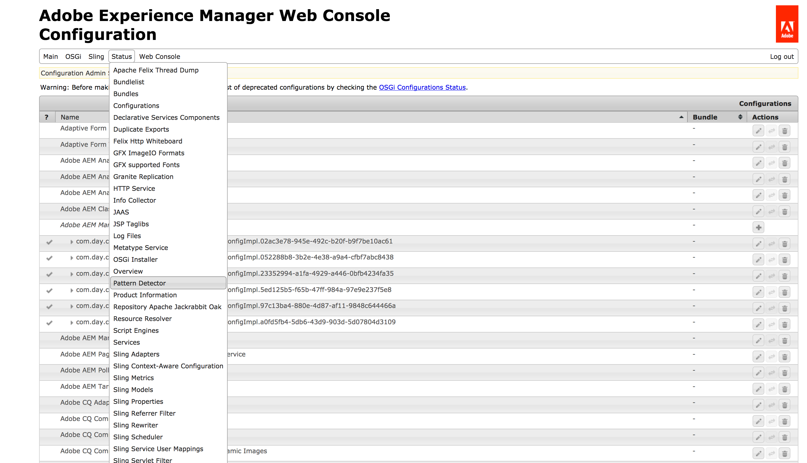

# Assessing the Upgrade Complexity with the Pattern Detector

## Overview {#overview}

This feature lets you check existing AEM instances for their upgradability by detecting patterns in use that:

1. Violate certain rules and are done in areas that will be affected or overwritten by the upgrade
1. Use an AEM 6.x feature or an API that is not backwards compatible on AEM 6.5 and can potentially break after upgrade.

This could serve as an assessment of the development effort that is involved in upgrading to AEM 6.5.

## How to Set Up {#how-to-set-up}

The Pattern Detector is released separately as a [one package](https://experience.adobe.com/#/downloads/content/software-distribution/en/aem.html?package=/content/software-distribution/en/details.html/content/dam/aem/public/adobe/packages/cq650/compatpack/pd-all-aem65) working on any source AEM versions from 6.1 to 6.5 targeting AEM 6.5 upgrade. It can be installed using the [Package Manager](/help/sites-administering/package-manager.md).

## How to Use {#how-to-use}

>[!NOTE]
>
>Pattern Detector can run on any environment, including local development instances. However, to:
>
>* increase the detection rate
>* avoid any slowdowns on business critical instances
>
>both at the same time it is recommended to run it **on staging environments** that are as close as possible to production ones in the areas of user applications, content and configurations.

You can use several methods to check the Pattern Detector output:

* **Via the Felix Inventory console:**

1. Go to the AEM Web Console by browsing to *https://serveraddress:serverport/system/console/configMgr*
1. Select **Status - Pattern Detector** as shown in the image below:

   

* **Via a reactive text based or regular JSON interface**
* **Via a reactive JSON lines interface, **that generates a separate JSON document in each line.

Both of these methods are detailed below:

## Reactive Interface {#reactive-interface}

The reactive interface allows for the processing of the violation report as soon as a suspicion is detected.

The output is currently available under 2 URLs:

1. Plain text interface
1. JSON interface

## Handling the Plain Text Interface {#handling-the-plain-text-interface}

The information in the output is formatted as a series of event entries. There are two channels - one for publishing violations and the second for publishing the current progress.

They can be obtained by using the following commands:

```shell
curl -Nsu 'admin:admin' https://localhost:4502/system/console/status-pattern-detector.txt | tee patterns-report.log | grep SUSPICION
```

The output will look like this:

```
2018-02-13T14:18:32.071+01:00 [SUSPICION] The pattern=ECU/extraneous.content.usage was found by detector=ContentAccessDetector with id=a07fd94318f12312c165e06d890cbd3c2c8b8dad0c030663db8b4c800dd7c33f message="Cross-boundary overlay of internal marked path /libs/granite/operations/components/commons/commons.jsp/jcr:content referenced at /apps/granite/operations/components/commons/commons.jsp/jcr:content with properties redefined: jcr:lastModifiedBy, jcr:mimeType, jcr:data, jcr:lastModified, jcr:uuid". More info at=https://www.adobe.com/go/aem6_EC
```

The progress can be filtered using the `grep` command:

```shell
curl -Nsu 'admin:admin' https://localhost:4502/system/console/status-pattern-detector.txt | tee patterns-report.log | grep PROGRESS
```

Which results in the following output:

```
2018-02-13T14:19:26.909+01:00 [PROGRESS] emitted=127731/52 MB patterns (from=6.5), analysed=45780/16 MB items, found=0 suspicions so far in period=PT5.005S (throughput=34667 items/sec)
2018-02-13T14:19:31.904+01:00 [PROGRESS] emitted=127731/52 MB patterns (from=6.5), analysed=106050/39 MB items, found=0 suspicions so far in period=PT10S (throughput=23378 items/sec)
2018-02-13T14:19:35.685+01:00 [PROGRESS] Finished in period=PT13.782
```

## Handling the JSON Interface {#handling-the-json-interface}

Similarly, JSON can be processed using the [jq tool](https://stedolan.github.io/jq/) as soon as it is published.

```shell
curl -Nsu 'admin:admin' https://localhost:4502/system/console/status-pattern-detector.json | tee patterns-report.json | jq --unbuffered -C 'select(.suspicion == true)'
```

With the output:

```
{
  "timestamp": "2018-02-13T14:20:18.894+01:00",
  "suspicion": true,
  "pattern": {
    "code": "ECU",
    "type": "extraneous.content.usage",
    "detective": "ContentAccessDetector",
    "moreInfo": "https://www.adobe.com/go/aem6_ECU"
  },
  "item": {
    "id": "a07fd94318f12312c165e06d890cbd3c2c8b8dad0c030663db8b4c800dd7c33f",
    "message": "Cross-boundary overlay of internal marked path /libs/granite/operations/components/commons/commons.jsp/jcr:content referenced at /apps/granite/operations/components/commons/commons.jsp/jcr:content with properties redefined: jcr:lastModifiedBy, jcr:mimeType, jcr:data, jcr:lastModified, jcr:uuid"
  }
}
```

The progress is reported every 5 seconds and can fetched by excluding other messages than those marked as suspicions:

```shell
curl -Nsu 'admin:admin' https://localhost:4502/system/console/status-pattern-detector.json | tee patterns-report.json | jq --unbuffered -C 'select(.suspicion == false)'
```

With the output:

```
{
  "suspicion": false,
  "timestamp": "2018-02-13T14:21:17.279+01:00",
  "type": "PROGRESS",
  "database": {
    "patternsEmitted": 127731,
    "patternsEmittedSize": "52 MB",
    "databasesEmitted": [
      "6.5"
    ]
  },
  "state": {
    "itemsAnalysed": 57209,
    "itemsAnalysedSize": "26 MB",
    "suspicionsFound": 0
  },
  "progress": {
    "elapsedTime": "PT5.003S",
    "elapsedTimeMilliseconds": 5003,
    "itemsPerSecond": 36965
  }
}
{
  "suspicion": false,
  "timestamp": "2018-02-13T14:21:22.276+01:00",
  "type": "PROGRESS",
  "database": {
    "patternsEmitted": 127731,
    "patternsEmittedSize": "52 MB",
    "databasesEmitted": [
      "6.5"
    ]
  },
  "state": {
    "itemsAnalysed": 113194,
    "itemsAnalysedSize": "46 MB",
    "suspicionsFound": 0
  },
  "progress": {
    "elapsedTime": "PT10S",
    "elapsedTimeMilliseconds": 10000,
    "itemsPerSecond": 24092
  }
}
{
  "suspicion": false,
  "timestamp": "2018-02-13T14:21:25.762+01:00",
  "type": "FINISHED",
  "database": {
    "patternsEmitted": 127731,
    "patternsEmittedSize": "52 MB",
    "databasesEmitted": [
      "6.5"
    ]
  },
  "state": {
    "itemsAnalysed": 140744,
    "itemsAnalysedSize": "63 MB",
    "suspicionsFound": 1
  },
  "progress": {
    "elapsedTime": "PT13.486S",
    "elapsedTimeMilliseconds": 13486,
    "itemsPerSecond": 19907
  }
}
{
  "suspicion": false,
  "type": "SUMMARY",
  "suspicionsFound": 1,
  "totalTime": "PT13.487S"
}
```

>[!NOTE]
>
>The recommended approach is to save the whole output from curl into the file and then process it via `jq` or `grep` to filter information type.

## Detection scope {#scope}

Currently Pattern Detector lets you check the following:

* OSGi bundles exports and imports mismatch
* Sling resource types and super types (with search-path content overlays) overusages
* definitions of Oak indexes (compatibility)
* VLT packages (overuse)
* rep:User nodes compatibility (in context of OAuth configuration)

>[!NOTE]
>
>Pattern Detector tries to accurately predict the warnings for upgrade. However, it might generate false positives in some scenarios.
