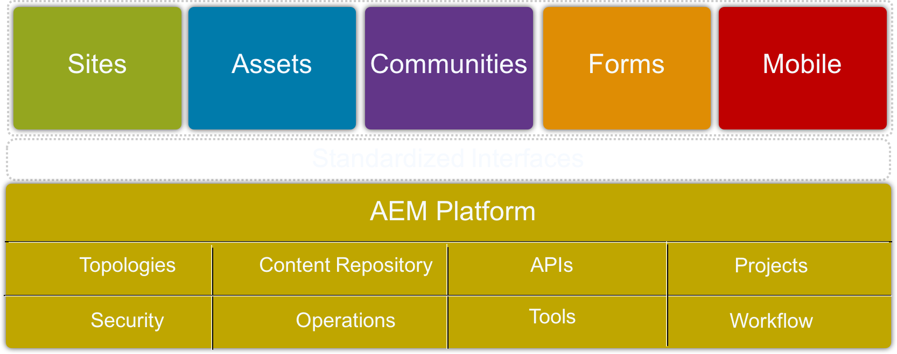
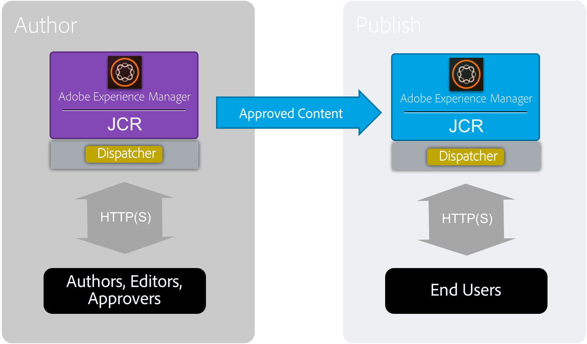
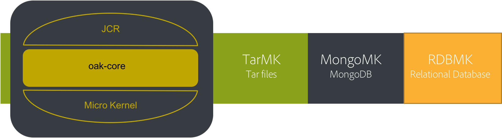
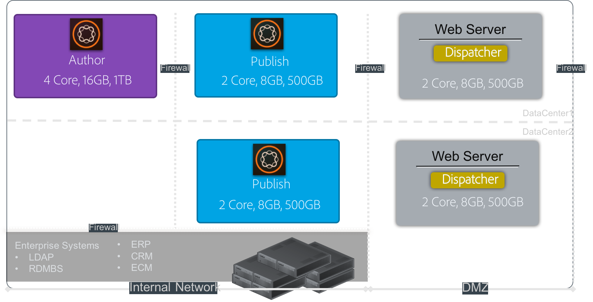
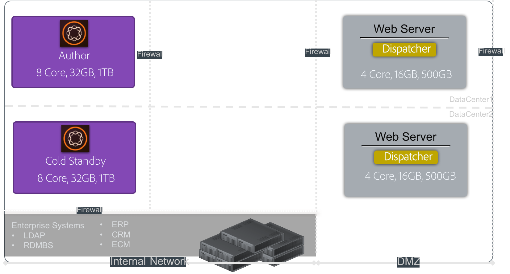
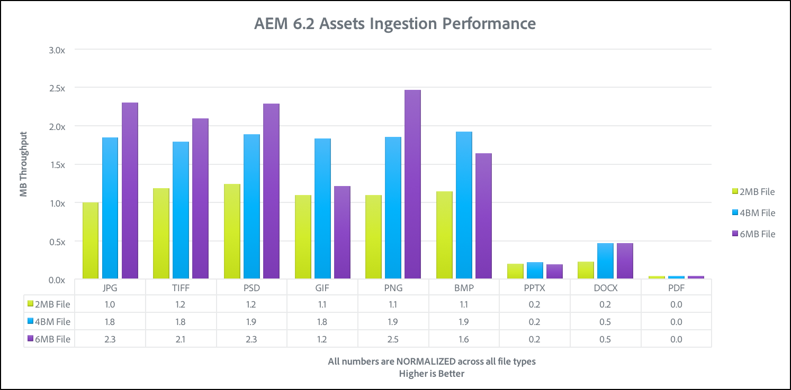
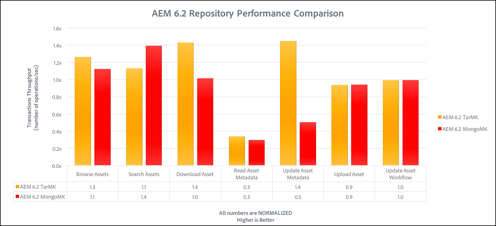
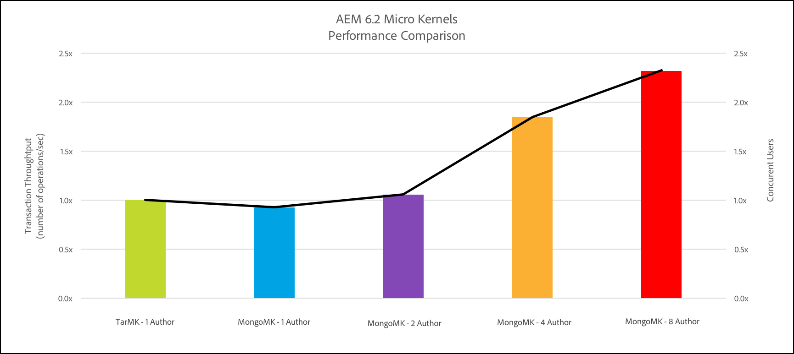

# Performance Guidelines{#performance-guidelines}

This page provides general guidelines on how to optimize the performance of your AEM deployment. If you are new to AEM, review the following pages before you start reading the performance guidelines:

* [AEM Basic Concepts](/help/sites-deploying/deploy.md#basic-concepts)
* [Overview of Storage in AEM](/help/sites-deploying/storage-elements-in-aem-6.md#overview-of-storage-in-aem)
* [Recommended Deployments](/help/sites-deploying/recommended-deploys.md)
* [Technical Requirements](/help/sites-deploying/technical-requirements.md)

Illustrated below are the deployment options available for AEM (scroll to view all the options):

<table>
 <tbody>
  <tr>
   <td>
<strong>AEM</strong>
 
<strong>Product</strong>
 </td>
   <td>
<strong>Topology</strong>
 </td>
   <td>
<strong>Operating System</strong>
 </td>
   <td>
<strong>Application Server</strong>
 </td>
   <td>
<strong>JRE</strong>
 </td>
   <td>
<strong>Security</strong>
 </td>
   <td>
<strong>Micro Kernel</strong>
 </td>
   <td>
<strong>Datastore</strong>
 </td>
   <td>
<strong>Indexing</strong>
 </td>
   <td>
<strong>Web Server</strong>
 </td>
   <td>
<strong>Browser</strong>
 </td>
   <td>
<strong>Experience Cloud</strong>
 </td>
  </tr>
  <tr>
   <td>
Sites
 </td>
   <td>
Non-HA
 </td>
   <td>
Windows
 </td>
   <td>
CQSE
 </td>
   <td>
Oracle
 </td>
   <td>
LDAP
 </td>
   <td>
Tar
 </td>
   <td>
Segment
 </td>
   <td>
Property
 </td>
   <td>
Apache
 </td>
   <td>
Edge
 </td>
   <td>
Target
 </td>
  </tr>
  <tr>
   <td>
Assets
 </td>
   <td>
Publish-HA
 </td>
   <td>
Solaris&trade;
 </td>
   <td>
WebLogic
 </td>
   <td>
IBM&reg;
 </td>
   <td>
SAML
 </td>
   <td>
MongoDB
 </td>
   <td>
File
 </td>
   <td>
Lucene
 </td>
   <td>
IIS
 </td>
   <td>
IE
 </td>
   <td>
Analytics
 </td>
  </tr>
  <tr>
   <td>
Communities
 </td>
   <td>
Author-CS
 </td>
   <td>
Red Hat&reg;
 </td>
   <td>
WebSphere&reg;
 </td>
   <td>
HP
 </td>
   <td>
Oauth
 </td>
   <td>
RDB/Oracle
 </td>
   <td>
S3/Azure
 </td>
   <td>
Solr
 </td>
   <td>
iPlanet
 </td>
   <td>
FireFox
 </td>
   <td>
Campaign
 </td>
  </tr>
  <tr>
   <td>
Forms
 </td>
   <td>
Author-Offload
 </td>
   <td>
HP-UX
 </td>
   <td>
Tomcat
 </td>
   <td>
 
 </td>
   <td>
 
 </td>
   <td>
RDB/DB2
 </td>
   <td>
MongoDB
 </td>
   <td>
 
 </td>
   <td>
 
 </td>
   <td>
Chrome
 </td>
   <td>
Social
 </td>
  </tr>
  <tr>
   <td>
Mobile
 </td>
   <td>
Author-Cluster
 </td>
   <td>
IBM&reg; AIX&reg;
 </td>
   <td>
JBoss&reg;
 </td>
   <td>
 
 </td>
   <td>
 
 </td>
   <td>
RDB/MySQL
 </td>
   <td>
RDBMS
 </td>
   <td>
 
 </td>
   <td>
 
 </td>
   <td>
Safari
 </td>
   <td>
Audience
 </td>
  </tr>
  <tr>
   <td>
Multi-site
 </td>
   <td>
ASRP
 </td>
   <td>
SUSE&reg;
 </td>
   <td>
 
 </td>
   <td>
 
 </td>
   <td>
 
 </td>
   <td>
RDB/SQLServer
 </td>
   <td>
 
 </td>
   <td>
 
 </td>
   <td>
 
 </td>
   <td>
 
 </td>
   <td>
Assets
 </td>
  </tr>
  <tr>
   <td>
Commerce
 </td>
   <td>
MSRP
 </td>
   <td>
Apple OS
 </td>
   <td>
 
 </td>
   <td>
 
 </td>
   <td>
 
 </td>
   <td>
 
 </td>
   <td>
 
 </td>
   <td>
 
 </td>
   <td>
 
 </td>
   <td>
 
 </td>
   <td>
Activation
 </td>
  </tr>
  <tr>
   <td>
Dynamic Media
 </td>
   <td>
JSRP
 </td>
   <td>
 
 </td>
   <td>
 
 </td>
   <td>
 
 </td>
   <td>
 
 </td>
   <td>
 
 </td>
   <td>
 
 </td>
   <td>
 
 </td>
   <td>
 
 </td>
   <td>
 
 </td>
   <td>
Mobile
 </td>
  </tr>
  <tr>
   <td>
Brand Portal
 </td>
   <td>
J2E
 </td>
   <td>
 
 </td>
   <td>
 
 </td>
   <td>
 
 </td>
   <td>
 
 </td>
   <td>
 
 </td>
   <td>
 
 </td>
   <td>
 
 </td>
   <td>
 
 </td>
   <td>
 
 </td>
   <td>
 
 </td>
  </tr>
  <tr>
   <td>
AoD
 </td>
   <td>
 
 </td>
   <td>
 
 </td>
   <td>
 
 </td>
   <td>
 
 </td>
   <td>
 
 </td>
   <td>
 
 </td>
   <td>
 
 </td>
   <td>
 
 </td>
   <td>
 
 </td>
   <td>
 
 </td>
   <td>
 
 </td>
  </tr>
  <tr>
   <td>
LiveFyre
 </td>
   <td>
 
 </td>
   <td>
 
 </td>
   <td>
 
 </td>
   <td>
 
 </td>
   <td>
 
 </td>
   <td>
 
 </td>
   <td>
 
 </td>
   <td>
 
 </td>
   <td>
 
 </td>
   <td>
 
 </td>
   <td>
 
 </td>
  </tr>
  <tr>
   <td>
Screens
 </td>
   <td>
 
 </td>
   <td>
 
 </td>
   <td>
 
 </td>
   <td>
 
 </td>
   <td>
 
 </td>
   <td>
 
 </td>
   <td>
 
 </td>
   <td>
 
 </td>
   <td>
 
 </td>
   <td>
 
 </td>
   <td>
 
 </td>
  </tr>
  <tr>
   <td>
Doc Security
 </td>
   <td>
 
 </td>
   <td>
 
 </td>
   <td>
 
 </td>
   <td>
 
 </td>
   <td>
 
 </td>
   <td>
 
 </td>
   <td>
 
 </td>
   <td>
 
 </td>
   <td>
 
 </td>
   <td>
 
 </td>
   <td>
 
 </td>
  </tr>
  <tr>
   <td>
Process Mgt
 </td>
   <td>
 
 </td>
   <td>
 
 </td>
   <td>
 
 </td>
   <td>
 
 </td>
   <td>
 
 </td>
   <td>
 
 </td>
   <td>
 
 </td>
   <td>
 
 </td>
   <td>
 
 </td>
   <td>
 
 </td>
   <td>
 
 </td>
  </tr>
  <tr>
   <td>
desktop app
 </td>
   <td>
 
 </td>
   <td>
 
 </td>
   <td>
 
 </td>
   <td>
 
 </td>
   <td>
 
 </td>
   <td>
 
 </td>
   <td>
 
 </td>
   <td>
 
 </td>
   <td>
 
 </td>
   <td>
 
 </td>
   <td>
 
 </td>
  </tr>
 </tbody>
</table>

>[!NOTE]
>
>The performance guidelines apply mainly to AEM Sites.

## When to Use the Performance Guidelines {#when-to-use-the-performance-guidelines}

Use the performance guidelines in the following situations:

* **First-time deployment**: When planning to deploy AEM Sites or Assets for the first time, it is important to understand the options available. Especially when configuring the Micro Kernel, Node Store, and Data Store (compared to the default settings). For example, changing the default settings of the Data Store for TarMK to File Data Store.
* **Upgrading to a new version**: When upgrading to a new version, it is important to understand the performance differences compared to the running environment. For example, upgrading from AEM 6.1 to 6.2, or from AEM 6.0 CRX2 to 6.2 OAK.
* **Response time is slow**: When the selected Nodestore architecture is not meeting your requirements, it is important to understand the performance differences compared to other topology options. For example, deploying TarMK instead of MongoMK, or using a File Data Sore instead of an Amazon S3 or Microsoft&reg; Azure Data Store.
* **Adding more authors**: When the recommended TarMK topology is not meeting the performance requirements and upsizing the Author node has reached the maximum capacity available, understand the performance differences. Compare to using MongoMK with three or more Author nodes. For example, deploying MongoMK instead of TarMK.
* **Adding more content**: When the recommended Data Store architecture is not meeting your requirements, it's important to understand the performance differences compared to other Data Store options. Example: using the Amazon S3 or Microsoft&reg; Azure Data Store instead of a File Data Store.

## Introduction {#introduction}

This chapter gives a general overview of the AEM architecture and its most important components. It also provides development guidelines and describes the testing scenarios used in the TarMK and MongoMK benchmark tests.

### The AEM Platform {#the-aem-platform}

The AEM platform consists of the following components:

For more information on the AEM platform, see [What is AEM](/help/sites-deploying/deploy.md#what-is-aem).

### The AEM Architecture {#the-aem-architecture}

There are three important building blocks to an AEM deployment. The **Author Instance** which is used by content authors, editors, and approvers to create and review content. When the content is approved, it is published to a second instance type named the **Publish Instance** from where it is accessed by the end users. The third building block is the **Dispatcher** which is a module that handles caching and URL filtering and is installed on the webserver. For additional information about the AEM architecture, see [Typical Deployment Scenarios](/help/sites-deploying/deploy.md#typical-deployment-scenarios).

### Micro Kernels {#micro-kernels}

Micro Kernels act as persistence managers in AEM. There are three types of Micro Kernels used with AEM: TarMK, MongoDB, and Relational Database (under restricted support). Choosing one to fit your need depends on the purpose of your instance and the deployment type you are considering. For additional information about Micro Kernels, see the [Recommended Deployments](/help/sites-deploying/recommended-deploys.md) page.

### Nodestore {#nodestore}

In AEM, binary data can be stored independently from content nodes. The location where the binary data is stored is referred to as the **Data Store**, while the location of the content nodes and properties is called the **Node Store**.

>[!NOTE]
>
>Adobe recommends TarMK to be the default persistence technology used by customers for both the AEM Author and the Publish instances.

>[!CAUTION]
>
>The Relational Database Micro Kernel is under restricted support. Contact [Adobe Customer Care](https://experienceleague.adobe.com/?support-solution=General&support-tab=home#support) before using this type of Micro Kernel.

### Data Store {#data-store}

When dealing with large number of binaries, it is recommended that you use an external data store instead of the default node stores to maximize performance. For example, if your project requires many media assets, storing them under the File or Azure/S3 Data Store makes accessing them faster than storing them directly inside a MongoDB.

For further details on the available configuration options, see [Configuring Node and Data Stores](/help/sites-deploying/data-store-config.md).

>[!NOTE]
>
>Adobe recommends that you choose the option of deploying AEM on Azure or Amazon Web Services (AWS) using Adobe Managed Services. Customers benefit from a team who has the experience and skills of deploying and operating AEM in these cloud computing environments. See [additional documentation on Adobe Managed Services](https://business.adobe.com/products/experience-manager/managed-services.html?aemClk=t).
>
>For recommendations on how to deploy AEM on Azure or AWS, outside of Adobe Managed Services, Adobe recommends working directly with the cloud provider. Or, work with one of Adobe's partners that support the deployment of AEM in the cloud environment of your choice. The selected cloud provider or partner is responsible for the sizing specifications, design, and implementation of the architecture they are supporting to meet your specific performance, load, scalability, and security requirements.
>
>>See also the [technical requirements](/help/sites-deploying/technical-requirements.md#supported-platforms) page.

### Search {#search-features}

Listed in this section are the custom index providers used with AEM. To know more about indexing, see [Oak Queries and Indexing](/help/sites-deploying/queries-and-indexing.md).

>[!NOTE]
>
>For most deployments, Adobe recommends using the Lucene Index. Use Solr only for scalability in specialized and complex deployments.

### Development Guidelines {#development-guidelines}

Develop for AEM aiming for **performance and scalability**. The following are best practices that you can follow:

**DO**

* Apply separation of presentation, logic, and content
* Use existing AEM APIs (ex: Sling) and tooling (ex: Replication)
* Develop in the context of actual content
* Develop for optimum cacheability
* Minimize number of saves (ex: by using transient workflows)
* Make sure that all HTTP end points are RESTful
* Restrict the scope of JCR observation
* Be mindful of asynchronous thread

**DON'T**

* Don't use JCR APIs directly, if you can
* Don't change /libs, but rather use overlays
* Don't use queries wherever possible
* Don't use Sling Bindings to get OSGi services in Java&trade; code, but rather use:

    * @Reference in a DS component
    * @Inject in a Sling Model
    * sling.getService() in a Sightly Use Class
    * sling.getService() in a JSP
    * a ServiceTracker
    * direct access to the OSGi service registry

For further details about developing on AEM, read [Developing - The Basics](/help/sites-developing/the-basics.md). For additional best practices, see [Development Best Practices](/help/sites-developing/best-practices.md).

### Benchmark Scenarios {#benchmark-scenarios}

>[!NOTE]
>
>All the benchmark tests displayed on this page have been performed in a laboratory setting.

The testing scenarios detailed below are used for the benchmark sections of the TarMK, MongoMk, and TarMK vs MongoMk chapters. To see which scenario was used for a particular benchmark test, read the Scenario field from the [Technical Specifications](/help/sites-deploying/performance-guidelines.md#tarmk-performance-benchmark) table.

**Single Product Scenario**

AEM Assets:

* User interactions: Browse Assets / Search Assets / Download Asset / Read Asset Metadata / Update Asset Metadata / Upload Asset / Run Upload Asset Workflow
* Execution mode: concurrent users, single interaction per user

**Mix Products Scenario**

AEM Sites + Assets:

* Sites user interactions: Read Article Page / Read Page / Create Paragraph / Edit Paragraph / Create Content Page / Activate Content Page / Author Search
* Assets user interactions: Browse Assets / Search Assets / Download Asset / Read Asset Metadata / Update Asset Metadata / Upload Asset / Run Upload Asset Workflow
* Execution mode: concurrent users, mixed interactions per user

**Vertical Use Case Scenario**

Media:

* `Read Article Page (27.4%), Read Page (10.9%), Create Session (2.6%), Activate Content Page (1.7%), Create Content Page (0.4%), Create Paragraph (4.3%), Edit Paragraph (0.9%), Image Component (0.9%), Browse Assets (20%), Read Asset Metadata (8.5%), Download Asset (4.2%), Search Asset (0.2%), Update Asset Metadata (2.4%), Upload Asset (1.2%), Browse Project (4.9%), Read Project (6.6%), Project Add Asset (1.2%), Project Add Site (1.2%), Create Project (0.1%), Author Search (0.4%)`
* Execution mode: concurrent users, mixed interactions per user

## TarMK {#tarmk}

This chapter gives general performance guidelines for TarMK specifying the minimum architecture requirements and the settings configuration. Benchmark tests are also provided for further clarification.

Adobe recommends TarMK to be the default persistence technology used by customers in all deployment scenarios, for both the AEM Author and Publish instances.

For more information about TarMK, see [Deployment Scenarios](/help/sites-deploying/recommended-deploys.md#deployment-scenarios) and [Tar Storage](/help/sites-deploying/storage-elements-in-aem-6.md#tar-storage).

### TarMK Minimum Architecture Guidelines {#tarmk-minimum-architecture-guidelines}

>[!NOTE]
>
>The minimum architecture guidelines presented below are for production environments and high traffic sites. These guidelines are **not** the [minimum specifications](/help/sites-deploying/technical-requirements.md#prerequisites) to run AEM.

To establish good performance when using TarMK, you should start from the following architecture:

* One Author instance
* Two Publish instances
* Two Dispatchers

Illustrated below are the architecture guidelines for AEM sites and AEM Assets.

>[!NOTE]
>
>Binary-less replication should be turned **ON** if the File Datastore is shared.

**Tar Architecture Guidelines for AEM Sites**

**Tar Architecture Guidelines for AEM Assets**

### TarMK Settings Guideline {#tarmk-settings-guideline}

For good performance, you should follow the settings guidelines presented below. For instructions on how to change the settings, [see this page](https://experienceleague.adobe.com/docs/experience-manager-65/deploying/configuring/configuring-performance.html?lang=en).

<table>
 <tbody>
  <tr>
   <td><strong>Setting</strong></td>
   <td><strong>Parameter</strong></td>
   <td><strong>Value</strong></td>
   <td><strong>Description</strong></td>
  </tr>
  <tr>
   <td>Sling Job Queues</td>
   <td><code>queue.maxparallel</code></td>
   <td>Set value to half of the number of CPU cores. </td>
   <td>By default the number of concurrent threads per job queue is equal to the number of CPU cores.</td>
  </tr>
  <tr>
   <td>Granite Transient Workflow Queue</td>
   <td><code>Max Parallel</code></td>
   <td>Set value to half of the number of CPU cores</td>
   <td> </td>
  </tr>
  <tr>
   <td>JVM parameters</td>
   <td>
<code>Doak.queryLimitInMemory</code>
 
<code>Doak.queryLimitReads</code>
 
<code>Dupdate.limit</code>
 
<code>Doak.fastQuerySize</code>
 </td>
   <td>
500000
 
100000
 
250000
 
True
 </td>
   <td>To prevent expansive queries from overloading the systems, add these JVM parameters in the AEM start script.</td>
  </tr>
  <tr>
   <td>Lucene index configuration</td>
   <td>
<code>CopyOnRead</code>
 
<code>CopyOnWrite</code>
 
<code>Prefetch Index Files</code>
 </td>
   <td>
Enabled
 
Enabled
 
Enabled
 </td>
   <td>For more details on the available parameters, see <a href="https://jackrabbit.apache.org/oak/docs/query/lucene.html">this page</a>.</td>
  </tr>
  <tr>
   <td>Data Store = S3 Datastore</td>
   <td>
<code>maxCachedBinarySize</code>
 
<code>cacheSizeInMB</code>
 </td>
   <td>
1048576 (1 MB) or smaller
 
2-10% of max heap size
 </td>
   <td>See also <a href="/help/sites-deploying/data-store-config.md#data-store-configurations">Data Store Configurations</a>.</td>
  </tr>
  <tr>
   <td>DAM Update Asset workflow</td>
   <td><code>Transient Workflow</code></td>
   <td>checked</td>
   <td>This workflow manages the update of assets.</td>
  </tr>
  <tr>
   <td>DAM MetaData Writeback</td>
   <td><code>Transient Workflow</code></td>
   <td>checked</td>
   <td>This workflow manages XMP write-back to the original binary and sets the last modified date in JCR.</td>
  </tr>
 </tbody>
</table>

### TarMK Performance Benchmark {#tarmk-performance-benchmark}

#### Technical Specifications {#technical-specifications}

The benchmark tests were performed on the following specifications:

| |**Author Node** |
|---|---|
| Server |Bare metal hardware (HP) |
| Operating System |Red Hat&reg; Linux&reg; |
| CPU / Cores |Intel(R) Xeon(R) CPU E5-2407 @2.40GHz, 8 cores  |
| RAM |32 GB |
| Disk |Magnetic |
| Java&trade; |Oracle JRE Version 8 |
| JVM Heap |16 GB |
| Product  |AEM 6.2 |
| Nodestore |TarMK |
| Datastore |File DS  |
| Scenario |Single Product: Assets / 30 concurrent threads |

#### Performance Benchmark Results {#performance-benchmark-results}

>[!NOTE]
>
>The numbers presented below have been normalized to 1 as the baseline and are not the actual throughput numbers.

 

## MongoMK {#mongomk}

The primary reason for choosing the MongoMK persistence backend over TarMK is to scale the instances horizontally. This ability means having two or more active author instances always running and using MongoDB as the persistence storage system. The need to run more than one author instance results generally from the fact that the CPU and memory capacity of a single server, supporting all concurrent authoring activities, is no longer sustainable.

For more information about TarMK, see [Deployment Scenarios](/help/sites-deploying/recommended-deploys.md#deployment-scenarios) and [Mongo Storage](/help/sites-deploying/storage-elements-in-aem-6.md#mongo-storage).

### MongoMK Minimum Architecture Guidelines {#mongomk-minimum-architecture-guidelines}

To establish good performance when using MongoMK, you should start from the following architecture:

* Three Author instances
* Two Publish instances
* Three MongoDB instances
* Two Dispatchers

>[!NOTE]
>
>In production environments, MongoDB is always used as a replica set with a primary and two secondaries. Reads and writes go to the primary and reads can go to the secondaries. If storage is not available, one of the secondaries can be replaced with an arbiter, but MongoDB replica sets must always be composed of an odd number of instances.

>[!NOTE]
>
>Binary-less replication should be turned **ON** if the File Datastore is shared.

### MongoMK Settings Guidelines {#mongomk-settings-guidelines}

For good performance, you should follow the settings guidelines presented below. For instructions on how to change the settings, [see this page](https://experienceleague.adobe.com/docs/experience-manager-65/deploying/configuring/configuring-performance.html?lang=en).

<table>
 <tbody>
  <tr>
   <td><strong>Setting</strong></td>
   <td><strong>Parameter</strong></td>
   <td><strong>Value (default)</strong></td>
   <td><strong>Description</strong></td>
  </tr>
  <tr>
   <td>Sling Job Queues</td>
   <td><code>queue.maxparallel</code></td>
   <td>Set value to half of the number of CPU cores. </td>
   <td>By default the number of concurrent threads per job queue is equal to the number of CPU cores.</td>
  </tr>
  <tr>
   <td>Granite Transient Workflow Queue</td>
   <td><code>Max Parallel</code></td>
   <td>Set value to half of the number of CPU cores.</td>
   <td> </td>
  </tr>
  <tr>
   <td>JVM parameters</td>
   <td>
<code>Doak.queryLimitInMemory</code>
 
<code>Doak.queryLimitReads</code>
 
<code>Dupdate.limit</code>
 
<code>Doak.fastQuerySize</code>
 
<code>Doak.mongo.maxQueryTimeMS</code>
 </td>
   <td>
500000
 
100000
 
250000
 
True
 
60000
 </td>
   <td>To prevent expansive queries from overloading the systems, add these JVM parameters in the AEM start script.</td>
  </tr>
  <tr>
   <td>Lucene index configuration</td>
   <td>
<code>CopyOnRead</code>
 
<code>CopyOnWrite</code>
 
<code>Prefetch Index Files</code>
 </td>
   <td>
Enabled
 
Enabled
 
Enabled
 </td>
   <td>For more details on available parameters, see <a href="https://jackrabbit.apache.org/oak/docs/query/lucene.html">this page</a>.</td>
  </tr>
  <tr>
   <td>Data Store = S3 Datastore</td>
   <td>
<code>maxCachedBinarySize</code>
 
<code>cacheSizeInMB</code>
 </td>
   <td>
1048576 (1 MB) or smaller
 
2-10% of max heap size
 </td>
   <td>See also <a href="/help/sites-deploying/data-store-config.md#data-store-configurations">Data Store Configurations</a>.</td>
  </tr>
  <tr>
   <td>DocumentNodeStoreService</td>
   <td>
<code>cache</code>
 
<code>nodeCachePercentage</code>
 
<code>childrenCachePercentage</code>
 
<code>diffCachePercentage</code>
 
<code>docChildrenCachePercentage</code>
 
<code>prevDocCachePercentage</code>
 
<code>persistentCache</code>
 </td>
   <td>
2048
 
35 (25)
 
20 (10)
 
30 (5)
 
10 (3)
 
4 (4)
 
./cache,size=2048,binary=0,-compact,-compress
 </td>
   <td>
The default size of the cache is set to 256 MB.
 
Has impact on the time that it takes to perform cache invalidation.
 </td>
  </tr>
  <tr>
   <td>oak-observation</td>
   <td>
<code>thread pool</code>
 
<code>length</code>
 </td>
   <td>
min &amp; max = 20
 
50000
 </td>
   <td> </td>
  </tr>
 </tbody>
</table>

### MongoMK Performance Benchmark {#mongomk-performance-benchmark}

### Technical Specifications {#technical-specifications-1}

The benchmark tests were performed on the following specifications:

| |**Author node** |**MongoDB node** |
|---|---|---|
| Server |Bare metal hardware (HP) |Bare metal hardware (HP) |
| Operating System |Red Hat&reg; Linux&reg; |Red Hat&reg; Linux&reg; |
| CPU / Cores |Intel(R) Xeon(R) CPU E5-2407 @2.40GHz, 8 cores |Intel(R) Xeon(R) CPU E5-2407 @2.40GHz, 8 cores  |
| RAM |32 GB |32 GB |
| Disk |Magnetic - >1k IOPS |Magnetic - >1k IOPS |
| Java&trade; |Oracle JRE Version 8 |N/A |
| JVM Heap |16 GB |N/A |
| Product  |AEM 6.2 |MongoDB 3.2 WiredTiger |
| Nodestore |MongoMK |N/A |
| Datastore |File DS  |N/A |
| Scenario |Single Product: Assets / 30 concurrent threads |Single Product: Assets / 30 concurrent threads |

### Performance Benchmark Results {#performance-benchmark-results-1}

>[!NOTE]
>
>The numbers presented below have been normalized to 1 as the baseline and are not the actual throughput numbers.

 

## TarMK vs MongoMK {#tarmk-vs-mongomk}

The basic rule to account for when choosing between the two is that TarMK is designed for performance, while MongoMK is used for scalability. Adobe recommends TarMK to be the default persistence technology used by customers in all deployment scenarios, for both the AEM Author and Publish instances.

The primary reason for choosing the MongoMK persistence backend over TarMK is to scale the instances horizontally. This functionality means having two or more active author instances always running and using MongoDB as the persistence storage system. The need to run more than one author instance generally results from the fact that the CPU and memory capacity of a single server, supporting all concurrent authoring activities, is no longer sustainable.

For further details on TarMK vs MongoMK, see [Recommended Deployments](/help/sites-deploying/recommended-deploys.md#microkernels-which-one-to-use).

### TarMK vs MongoMk Guidelines {#tarmk-vs-mongomk-guidelines}

**Benefits of TarMK**

* Purpose-built for content management applications
* Files are always consistent and can be backed up using any file-based backup tool
* Provides a failover mechanism - see [Cold Standby](/help/sites-deploying/tarmk-cold-standby.md) for more details
* Provides high performance and reliable data storage with minimal operational overhead
* Lower TCO (total cost of ownership)

**Criteria for choosing MongoMK**

* Number of named users connected in a day: in the thousands or more
* Number of concurrent users: in the hundreds or more
* Volume of asset ingestions per day: in hundreds of thousands or more
* Volume of page edits per day: in hundreds of thousands or more
* Volume of searches per day: in tens of thousands or more

### TarMK vs MongoMK Benchmarks {#tarmk-vs-mongomk-benchmarks}

>[!NOTE]
>
>The numbers presented below have been normalized to 1 as the baseline and are not actual throughput numbers.

### Scenario 1 Technical Specifications {#scenario-technical-specifications}

<table>
 <tbody>
  <tr>
   <td><strong> </strong></td>
   <td><strong>Author OAK Node</strong></td>
   <td><strong>MongoDB Node</strong></td>
   <td> </td>
  </tr>
  <tr>
   <td>Server</td>
   <td>Bare metal hardware (HP)</td>
   <td>Bare metal hardware (HP)</td>
   <td> </td>
  </tr>
  <tr>
   <td>Operating System</td>
   <td>Red Hat&reg; Linux&reg;</td>
   <td>Red Hat&reg; Linux&reg;</td>
   <td> </td>
  </tr>
  <tr>
   <td>CPU / Cores</td>
   <td>Intel(R) Xeon(R) CPU E5-2407 @2.40GHz, 8 cores</td>
   <td>Intel(R) Xeon(R) CPU E5-2407 @2.40GHz, 8 cores</td>
   <td> </td>
  </tr>
  <tr>
   <td>RAM</td>
   <td>32 GB</td>
   <td>32 GB</td>
   <td> </td>
  </tr>
  <tr>
   <td>Disk</td>
   <td>Magnetic - &gt;1k IOPS</td>
   <td>Magnetic - &gt;1k IOPS</td>
   <td> </td>
  </tr>
  <tr>
   <td>Java&trade;</td>
   <td>Oracle JRE Version 8</td>
   <td>N/A</td>
   <td> </td>
  </tr>
  <tr>
   <td>JVM Heap16GB</td>
   <td>16 GB</td>
   <td>N/A</td>
   <td> </td>
  </tr>
  <tr>
   <td>Product </td>
   <td>AEM 6.2</td>
   <td>MongoDB 3.2 WiredTiger</td>
   <td> </td>
  </tr>
  <tr>
   <td>Nodestore</td>
   <td>TarMK or MongoMK</td>
   <td>N/A</td>
   <td> </td>
  </tr>
  <tr>
   <td>Datastore</td>
   <td>File DS </td>
   <td>N/A</td>
   <td> </td>
  </tr>
  <tr>
   <td>Scenario</td>
   <td>
  Single Product: Assets / 30 concurrent threads per run
 </td>
   <td> </td>
   <td> </td>
  </tr>
 </tbody>
</table>

### Scenario 1 Performance Benchmark Results {#scenario-performance-benchmark-results}

### Scenario 2 Technical Specifications {#scenario-technical-specifications-1}

>[!NOTE]
>
>To enable the same number of Authors with MongoDB as with one TarMK system, you need a cluster with two AEM nodes. A four node MongoDB cluster can handle 1.8 times the number of Authors than one TarMK instance. An eight node MongoDB cluster can handle 2.3 times the number of Authors than one TarMK instance.

<table>
 <tbody>
  <tr>
   <td><strong> </strong></td>
   <td><strong>Author TarMK Node</strong></td>
   <td><strong>Author MongoMK Node</strong></td>
   <td><strong>MongoDB Node</strong></td>
  </tr>
  <tr>
   <td>Server</td>
   <td>AWS c3.8xlarge</td>
   <td>AWS c3.8xlarge</td>
   <td>AWS c3.8xlarge</td>
  </tr>
  <tr>
   <td>Operating System</td>
   <td>Red Hat&reg; Linux&reg;</td>
   <td>Red Hat&reg; Linux&reg;</td>
   <td>Red Hat&reg; Linux&reg;</td>
  </tr>
  <tr>
   <td>CPU / Cores</td>
   <td>32</td>
   <td>32</td>
   <td>32</td>
  </tr>
  <tr>
   <td>RAM</td>
   <td>60 GB</td>
   <td>60 GB</td>
   <td>60 GB</td>
  </tr>
  <tr>
   <td>Disk</td>
   <td>SSD - 10k IOPS</td>
   <td>SSD - 10k IOPS</td>
   <td>SSD - 10k IOPS</td>
  </tr>
  <tr>
   <td>Java&trade;</td>
   <td>Oracle JRE Version 8</td>
   <td>  Oracle JRE Version 8</td>
   <td>N/A</td>
  </tr>
  <tr>
   <td>JVM Heap16GB</td>
   <td>30 GB</td>
   <td>30 GB</td>
   <td>N/A</td>
  </tr>
  <tr>
   <td>Product </td>
   <td>AEM 6.2</td>
   <td>AEM 6.2</td>
   <td>  MongoDB 3.2 WiredTiger</td>
  </tr>
  <tr>
   <td>Nodestore</td>
   <td>TarMK </td>
   <td>MongoMK</td>
   <td>  N/A</td>
  </tr>
  <tr>
   <td>Datastore</td>
   <td>File DS </td>
   <td>  File DS</td>
   <td>  N/A</td>
  </tr>
  <tr>
   <td>Scenario</td>
   <td>
    Vertical use case: Media / 2000 concurrent threads
 </td>
   <td></td>
   <td></td>
  </tr>
 </tbody>
</table>

### Scenario 2 Performance Benchmark Results {#scenario-performance-benchmark-results-1}

### Architecture Scalability Guidelines For AEM Sites and Assets {#architecture-scalability-guidelines-for-aem-sites-and-assets}

## Summary of Performance Guidelines  {#summary-of-performance-guidelines}

The guidelines presented on this page can be summarized as follows:

* **TarMK with File Datastore** - The recommended architecture for most customers:

    * Minimum topology: one Author instance, two Publish instances, two Dispatchers
    * Binary-less replication turned on if the File Datastore is shared

* **MongoMK with File Datastore** - The recommended architecture for horizontal scalability of the Author tier:

    * Minimum topology: three Author instances, three MongoDB instances, two Publish instances, two Dispatchers
    * Binary-less replication turned on if the File Datastore is shared

* **Nodestore** - Stored on the local disk, not a network attached storage (NAS)
* When using **Amazon S3**:

    * The Amazon S3 datastore is shared between the Author and Publish tier
    * Binary-less replication must be turned on
    * Datastore Garbage Collection requires a first run on all Author and Publish nodes, then a second run on Author

* **Custom index should be created in addition to the out of the box index** - Based on most common searches

    * Lucene indexes should be used for the custom indexes

* **Customizing workflow can substantially improve the performance** - Remove the video step in the "Update Asset" workflow, disabling listeners which are not used, and so on.

For more details, also read the [Recommended Deployments](/help/sites-deploying/recommended-deploys.md) page.
