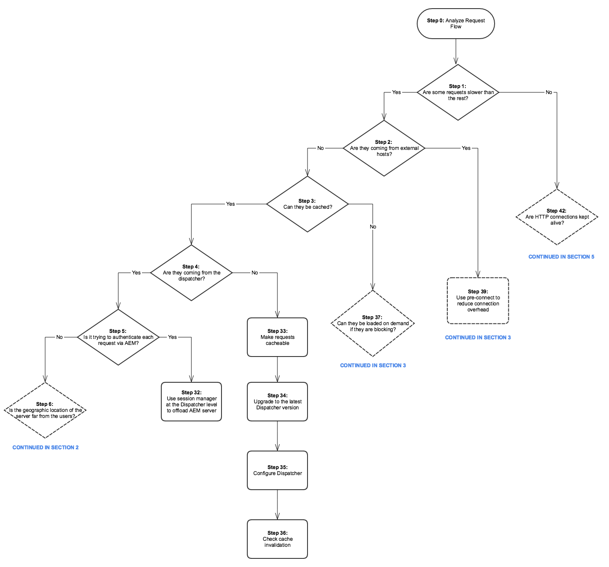
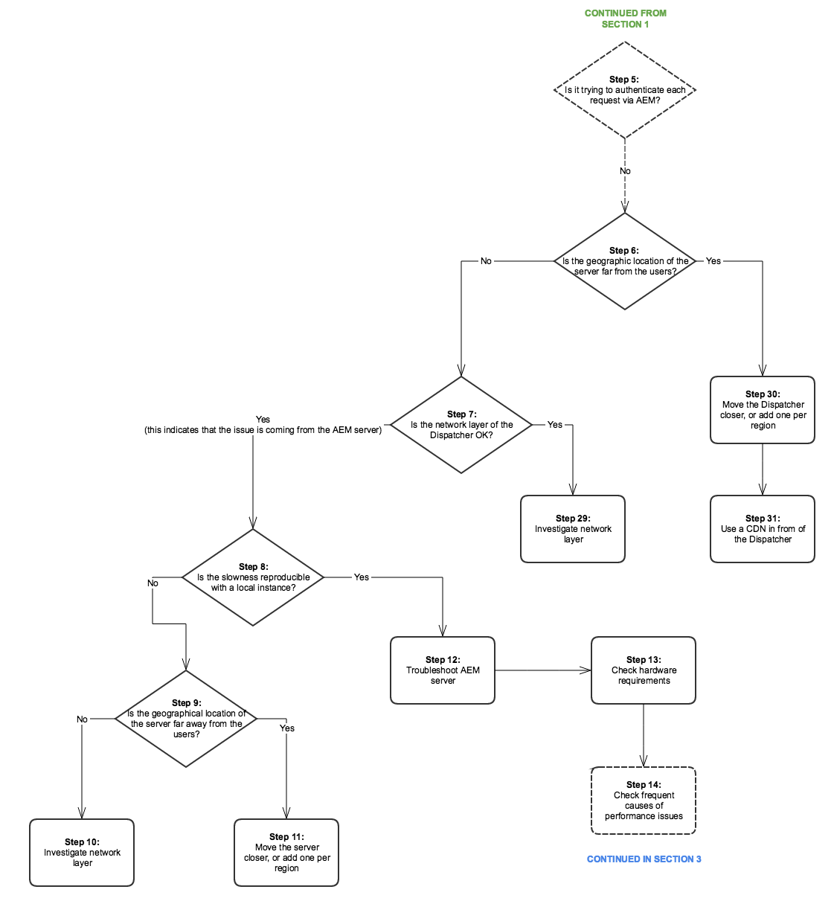
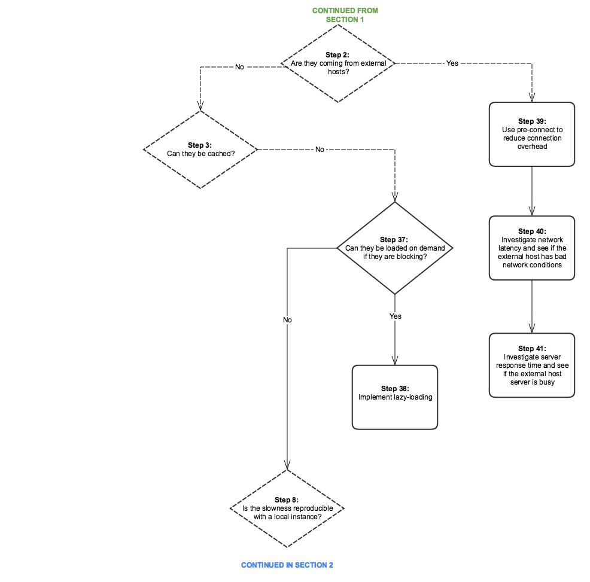
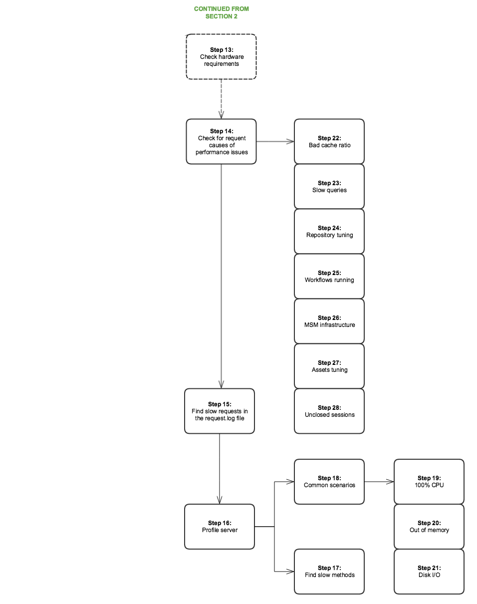
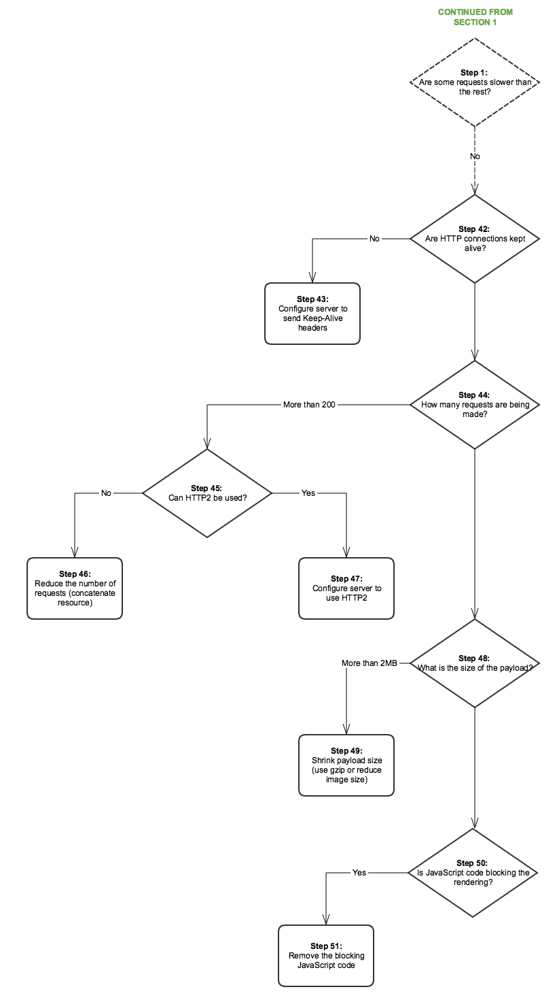

# Performance Tree{#performance-tree}

## Scope {#scope}

The following diagram is meant to provide guidance on the steps to take to troubleshoot performance issues. It is split in five sections for easier reading.

Each step in the diagram is linked to a documentation resource or a recommendation.

## Prerequisites and Assumptions {#prerequisites-and-assumptions}

The assumption is that a performance issue is observed on a given page (either an AEM console or a web page) and can be reproduced consistently. Having a way to test or monitor the performance is a pre-requisite before starting the investigation.

The analysis starts at step 0. The goal is to determine which entity (Dispatcher, external host, or AEM) is responsible for the performance issue then determine which area (server or network) should be investigated.

### Section 1 {#section}

### Section 2 {#section-1}

### Section 3 {#section-2}

### Section 4 {#section-3}

### Section 5 {#section-4}

## Reference Links {#reference-links}

<table>
 <tbody>
  <tr>
   <td><strong>Step</strong></td>
   <td><strong>Title</strong></td>
   <td><strong>Resources</strong></td>
  </tr>
  <tr>
   <td><strong>Step 0</strong></td>
   <td>Analyze Request Flow</td>
   <td>
You can use standard HTTP request analysis in the browser to analyze the request flow. For more info on how to do this analysis on Chrome, see:  
 
<a href="https://developers.google.com/web/tools/chrome-devtools/profile/network-performance/resource-loading">https://developer.chrome.com/docs/devtools/</a>  
 </td>
  </tr>
  <tr>
   <td><strong>Step 2</strong></td>
   <td>Are requests coming from external hosts?</td>
   <td>You can use standard HTTP request analysis in the browser to analyze the request flow. See the above links on how to do this analysis on Chrome.  </td>
  </tr>
  <tr>
   <td><strong>Step 3</strong></td>
   <td>Can the requests be cached?</td>
   <td>For more information on cacheable requests and general Dispatcher performance optimization advice, see <a href="/help/sites-deploying/configuring-performance.md#optimizing-performance-when-using-the-dispatcher">Dispatcher Performance Optimization</a>.</td>
  </tr>
  <tr>
   <td><strong>Step 4</strong></td>
   <td>Are requests coming from the Dispatcher?</td>
   <td>
To see if the requests are cached properly, check the <a href="https://experienceleague.adobe.com/docs/experience-manager-dispatcher/using/configuring/dispatcher-configuration.html?lang=en#debugging">Dispatcher debugging documentation</a>.  
 </td>
  </tr>
  <tr>
   <td><strong>Step 5</strong></td>
   <td>Is the Dispatcher trying to authenticate each request via AEM?</td>
   <td>Check if the Dispatcher sends <code>HEAD</code> requests to AEM for authentication before delivering the cached resource. Look for <code>HEAD</code> requests in the AEM <code>access.log</code>. For more information, see <a href="/help/sites-deploying/configure-logging.md">Logging</a>.  </td>
  </tr>
  <tr>
   <td><strong>Step 6</strong></td>
   <td>Is the geographic location of the Dispatcher far away from the users?</td>
   <td>Move the Dispatcher closer to the users.</td>
  </tr>
  <tr>
   <td><strong>Step 7</strong></td>
   <td>Is the network layer of the Dispatcher OK?</td>
   <td>  Investigate the network layer for saturation and latency issues.
 
 </td>
  </tr>
  <tr>
   <td><strong>Step 8</strong></td>
   <td>Is the slowness reproducible with a local instance?</td>
   <td>  
Use <a href="/help/sites-developing/tough-day.md">Tough Day</a> to replicate "real-world" conditions from the production instances. If this scenario is not realistic for the space of your development, make sure to test the production instance (or an identical staging one) in a different network context.  
 </td>
  </tr>
  <tr>
   <td><strong>Step 9</strong></td>
   <td>Is the geographical location of the server far away from the users?</td>
   <td>Move the server closer to the users.</td>
  </tr>
  <tr>
   <td><strong>Steps 10 and 29</strong></td>
   <td>Investigate network layer</td>
   <td>
Investigate the network layer for saturation and latency issues.
 
For the author tier, it is recommended that the latency does not surpass 100 milliseconds.
 
For more information on performance optimization tips, see <a href="https://helpx.adobe.com/customer-care-office-hours/aem/6x-performance-tuning-best-practices.html">this page</a>.
 </td>
  </tr>
  <tr>
   <td><strong>Step 11</strong></td>
   <td>Move server closer or add one per region</td>
   <td> </td>
  </tr>
  <tr>
   <td><strong>Step 12</strong></td>
   <td>Troubleshoot AEM server</td>
   <td>Check the following sub steps in the diagram for more information.</td>
  </tr>
  <tr>
   <td><strong>Step 13</strong></td>
   <td>Check hardware requirements</td>
   <td>Check the documentation on <a href="/help/managing/hardware-sizing-guidelines.md">Hardware Sizing Guidelines</a>.  </td>
  </tr>
  <tr>
   <td><strong>Step 14</strong></td>
   <td>Check for frequent causes of performance issues</td>
   <td> </td>
  </tr>
  <tr>
   <td><strong>Step 15</strong></td>
   <td>Find slow requests</td>
   <td>
You can check for slow requests by analyzing the <code>request.log</code> or by using <code>rlog.jar</code>.
 
For more information about using rlog.jar, see this page.
 
See <a href="/help/sites-deploying/monitoring-and-maintaining.md#using-rlog-jar-to-find-requests-with-long-duration-times">Find requests with long duration times using rlog.jar</a>.  
 
 
 </td>
  </tr>
  <tr>
   <td><strong>Step 16</strong></td>
   <td>Profile server</td>
   <td>
For information about profiling tools you can use with AEM, see <a href="/help/sites-deploying/monitoring-and-maintaining.md#tools-for-monitoring-and-analyzing-performance">Tools for Monitoring and Analyzing Performance</a>.  
 </td>
  </tr>
  <tr>
   <td><strong>Step 17</strong></td>
   <td>Find slow methods in profiling</td>
   <td> </td>
  </tr>
  <tr>
   <td><strong>Step 18</strong></td>
   <td>Common scenarios of profiling</td>
   <td>See <a href="/help/sites-deploying/monitoring-and-maintaining.md#analyzing-specific-scenarios">Analyzing Specific Scenarios</a> in the Performance Optimization section.  </td>
  </tr>
  <tr>
   <td><strong>Step 19</strong></td>
   <td>100% CPU</td>
   <td><a href="/help/sites-deploying/monitoring-and-maintaining.md#monitoring-performance">https://experienceleague.adobe.com/docs/experience-manager-release-information/aem-release-updates/previous-updates/aem-previous-versions.html</a></td>
  </tr>
  <tr>
   <td><strong>Step 20</strong></td>
   <td>Out of memory</td>
   <td> 
    <ol>
     <li><a href="/help/sites-deploying/monitoring-and-maintaining.md#out-of-memory">Out Of Memory</a></li>
     <li><a href="/help/sites-deploying/troubleshooting.md">My application throws out-of-memory errors</a></li>
     <li><a href="https://experienceleague.adobe.com/docs/experience-cloud-kcs/kbarticles/KA-17482.html?lang=en">Analyze Memory Problems.</a>  </li>
    </ol> </td>
  </tr>
  <tr>
   <td><strong>Step 21</strong></td>
   <td>Disk I/O</td>
   <td>
See the <a href="/help/sites-deploying/monitoring-and-maintaining.md#disk-i-o">Disk I/O</a> section in the Monitoring and Maintaining documentation.
 </td>
  </tr>
  <tr>
   <td><strong>Steps 22 and 22.1</strong></td>
   <td>Cache ratio</td>
   <td>See <a href="/help/sites-deploying/configuring-performance.md#calculating-the-dispatcher-cache-ratio">Calculating the Dispatcher Cache Ratio</a>.    </td>
  </tr>
  <tr>
   <td><strong>Step 23</strong></td>
   <td>Slow queries</td>
   <td><a href="/help/sites-deploying/best-practices-for-queries-and-indexing.md">Best Practices for Queries and Indexing</a></td>
  </tr>
  <tr>
   <td><strong>Step 24</strong></td>
   <td>Repository tuning</td>
   <td>
    <ul>
     <li><a href="https://helpx.adobe.com/customer-care-office-hours/aem/6x-performance-tuning-best-practices.html">Performance Tuning Tips</a></li>
     <li><a href="/help/sites-deploying/configuring-performance.md#configuring-for-performance">Configuring for Performance</a></li>
     <li><a href="https://www.slideshare.net/jukka/repository-performance-tuning">Repository Performance Tuning</a></li>
    </ul> </td>
  </tr>
  <tr>
   <td><strong>Step 25</strong></td>
   <td>Workflows running</td>
   <td>
    <ul>
     <li><a href="/help/sites-deploying/configuring-performance.md#concurrent-workflow-processing">Concurrent Workflow Processing</a></li>
     <li><a href="/help/sites-deploying/configuring-performance.md#configure-the-queue-for-a-specific-workflow">Configure the Queue for a Specific Workflow</a></li>
     <li><a href="/help/sites-administering/workflows-administering.md#regular-purging-of-workflow-instances">Regular Purging of Workflow Instances</a></li>
     <li><a href="/help/sites-developing/workflows.md#transient-workflows">Transient Workflows</a>  </li>
    </ul> 
 
 </td>
  </tr>
  <tr>
   <td><strong>Step 26</strong></td>
   <td>MSM Infrastructure</td>
   <td>
<a href="/help/sites-administering/msm-best-practices.md">Multisite Manager Best Practices</a>  
 </td>
  </tr>
  <tr>
   <td><strong>Step 27</strong></td>
   <td>Assets tuning</td>
   <td>
    <ol>
     <li><a href="/help/sites-deploying/configuring-performance.md#cq-dam-asset-synchronization-service">Assets Synchronization Service</a></li>
     <li><a href="/help/sites-deploying/configuring-performance.md#multiple-dam-instances">Multiple DAM Instances</a></li>
     <li>Performance tuning tips article <a href="https://helpx.adobe.com/customer-care-office-hours/aem/6x-performance-tuning-best-practices.html">here</a>.  </li>
    </ol> </td>
  </tr>
  <tr>
   <td><strong>Step 28</strong></td>
   <td>Unclosed sessions</td>
   <td>
 
 
<a href="/help/sites-administering/troubleshoot.md#checking-for-unclosed-jcr-sessions">Checking for unclosed JCR sessions</a>
 
 
 </td>
  </tr>
  <tr>
   <td><strong>Step 30</strong></td>
   <td>Move Dispatcher closer (add one per "region"?)</td>
   <td> </td>
  </tr>
  <tr>
   <td><strong>Step 31</strong></td>
   <td>Use CDN in front of Dispatcher</td>
   <td><a href="https://experienceleague.adobe.com/docs/experience-manager-dispatcher/using/dispatcher.html?lang=en#using-dispatcher-with-a-cdn">Using Dispatcher with a CDN</a>  </td>
  </tr>
  <tr>
   <td><strong>Step 32</strong></td>
   <td>To offload the AEM server, use session management at the Dispatcher level</td>
   <td>
<a href="https://experienceleague.adobe.com/docs/experience-manager-dispatcher/using/configuring/dispatcher-configuration.html?lang=en#enabling-secure-sessions-sessionmanagement">Enabling Secure Sessions</a>
 </td>
  </tr>
  <tr>
   <td><strong>Step 33</strong></td>
   <td>Make requests cacheable</td>
   <td>
    <ol>
     <li><a href="https://experienceleague.adobe.com/docs/experience-manager-dispatcher/using/dispatcher.html?lang=en">General Dispatcher Configuration</a></li>
     <li><a href="https://experienceleague.adobe.com/docs/experience-manager-dispatcher/using/configuring/dispatcher-configuration.html?lang=en#configuring-the-dispatcher-cache-cache">Configuring the Dispatcher Cache</a></li>
    </ol> 
How to improve cache ratio; make requests cache-able (Dispatcher best practices)
 
Also, consider the below settings to optimize your caching configurations  

    <ol>
     <li>Set a no-cache rule for HTTP request that is not GET</li>
     <li>Configure query strings to not be cacheable</li>
     <li>Do not cache URLs with missing extensions</li>
     <li>Cache authentication headers (possible since Dispatcher version 4.1.10)</li>
    </ol> </td>
  </tr>
  <tr>
   <td><strong>Step 34</strong></td>
   <td>Upgrade Dispatcher version</td>
   <td>
You can download the latest Dispatcher version at this location:
 
<a href="https://experienceleague.adobe.com/docs/experience-manager-dispatcher/using/getting-started/release-notes.html?lang=en">Follow link</a>
 </td>
  </tr>
  <tr>
   <td><strong>Step 35</strong></td>
   <td>Configure Dispatcher</td>
   <td><a href="https://experienceleague.adobe.com/docs/experience-manager-dispatcher/using/configuring/dispatcher-configuration.html?lang=en">Configuring the Dispatcher</a>  </td>
  </tr>
  <tr>
   <td><strong>Step 36</strong></td>
   <td>Check cache invalidation</td>
   <td> 
    <ul>
     <li><a href="https://experienceleague.adobe.com/docs/experience-manager-dispatcher/using/configuring/page-invalidate.html?lang=en#invalidating-dispatcher-cache-from-the-authoring-environment">Cache Invalidation for the Author tier;</a></li>
     <li><a href="https://experienceleague.adobe.com/docs/experience-manager-dispatcher/using/configuring/page-invalidate.html?lang=en#invalidating-dispatcher-cache-from-a-publishing-instance">Cache Invalidation for the Publish tier.</a></li>
    </ul> </td>
  </tr>
  <tr>
   <td><strong>Steps 37 and 38</strong></td>
   <td>Lazy-loading</td>
   <td><a href="https://experienceleague.adobe.com/docs/experience-manager-gems-events/gems/gems2016/aem-web-performance.html?lang=en">See the Gem Session on AEM Web Performance.</a>  </td>
  </tr>
  <tr>
   <td><strong>Step 39</strong></td>
   <td>Use pre-connect to reduce connection overhead</td>
   <td>See the Gem Session above. Also, additional pre-connect documentation on W3c:<a href="https://html.spec.whatwg.org/#linkTypes"> https://html.spec.whatwg.org/#linkTypes</a></td>
  </tr>
  <tr>
   <td><strong>Steps 40 and 41</strong>  </td>
   <td>External hosts latency and response time</td>
   <td>Investigate the latency and response time for the external hosts.</td>
  </tr>
  <tr>
   <td><strong>Steps 45  and 47</strong>  </td>
   <td>Using HTTP/2</td>
   <td>See the Gem Session for steps 37,38 and 39. Also, check out <a href="https://help-forums.adobe.com/content/adobeforums/en/experience-manager-forum/adobe-experience-manager.topic.html/forum__kdzc-does_anyoneknowwhe.html">this</a> forum post on HTTP/2 support.  </td>
  </tr>
  <tr>
   <td><strong>Step 49</strong></td>
   <td>Shrink payload size</td>
   <td><a href="/help/sites-deploying/osgi-configuration-settings.md">Enable Gzip</a> and <a href="https://experienceleague.adobe.com/docs/experience-manager-gems-events/gems/gems2016/aem-web-performance.html?lang=en">shrink the image size</a>.  </td>
  </tr>
  <tr>
   <td><strong>Steps 42 and 43</strong></td>
   <td>Keep-Alive</td>
   <td>
Is the <code>Keep-Alive</code> header present in the different requests to reuse connections? Otherwise, it would mean that each request leads to another connection establishment, which introduces unnecessary overhead. (Standard HTTP request analysis in the browser)
 
You can check the <a href="/help/sites-administering/proxy-jar.md">Proxy Server tool</a> to check for Keep-Alive connections.  
 </td>
  </tr>
  <tr>
   <td><strong>Step 44</strong></td>
   <td>How many requests are made?</td>
   <td>Perform standard HTTP request analysis in the browser.</td>
  </tr>
  <tr>
   <td><strong>Step 46</strong></td>
   <td>Reduce number of requests</td>
   <td>
    <ol>
     <li>Concatenate resources (images, CSS sprites, JSON)  </li>
     <li>Clientlibs embedding:
      <ol>
       <li><a href="/help/sites-developing/clientlibs.md#creating-client-library-folders">Creating Client Library Folders</a> - see heading Using embedding to minimize requests</li>
      </ol> </li>
    </ol> </td>
  </tr>
  <tr>
   <td><strong>Step 48</strong></td>
   <td>What is the size of the payload?</td>
   <td>Standard HTTP request analysis in the browser</td>
  </tr>
  <tr>
   <td><strong>Steps 50 and 51</strong></td>
   <td>JS code blocking</td>
   <td><a href="https://experienceleague.adobe.com/docs/experience-manager-gems-events/gems/gems2016/aem-web-performance.html?lang=en">https://experienceleague.adobe.com/docs/experience-manager-gems-events/gems/gems2016/aem-web-performance.html?lang=en</a></td>
  </tr>
 </tbody>
</table>
