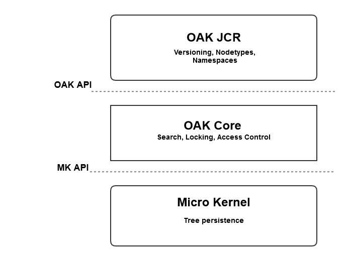
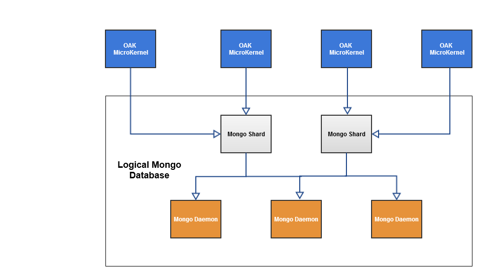

# Introduction to the AEM Platform{#introduction-to-the-aem-platform}

The AEM platform in AEM 6 is based on Apache Jackrabbit Oak.

Apache Jackrabbit Oak is an effort to implement a scalable and performant hierarchical content repository for use as the foundation of modern world-class web sites and other demanding content applications.

It is the successor to Jackrabbit 2 and is used by AEM 6 as the default backend for its content repository, CRX.

## Design principles and goals {#design-principles-and-goals}

Oak implements the [JSR-283](https://jcp.org/en/jsr/detail?id=283) (JCR 2.0) spec. Its principal design objectives are:

* Better support for large repositories
* Multiple distributed cluster nodes for high availability
* Better performance
* Support for many child nodes and Access Control Levels

## Architecture Concept {#architecture-concept}

### Storage {#storage}

The purpose of the Storage layer is to:

* Implement a tree model
* Make storage pluggable
* Provide a clustering mechanism

### Oak Core {#oak-core}

The Oak Core adds several layers to the storage layer:

* Access Level Controls
* Search and Indexing
* Observation

### Oak JCR {#oak-jcr}

The main objective of the Oak JCR is to transform JCR semantics into tree operations. It is also responsible for:

* Implementing the JCR API
* Containing commit hooks that implement JCR constraints

In addition, non-Java implementations are now possible and part of the Oak JCR concept.

## Storage overview {#storage-overview}

The Oak storage layer provides an abstraction layer for the actual storage of the content.

Currently, there are two storage implementations available in AEM6: **Tar Storage** and **MongoDB Storage**.

### Tar Storage {#tar-storage}

The Tar storage uses tar files. It stores the content as various types of records within larger segments. Journals are used to track the latest state of the repository.

There are several key design principles that it was build around:

* **Immutable Segments**

The content is stored in segments that can be up to 256 KB. They are immutable, which makes it easy to cache frequently accessed segments and reduce system errors that may corrupt the repository.

Each segment is identified by a unique identifier (UUID) and contains a continuous subset of the content tree. In addition, segments can reference other content. Each segment keeps a list of UUIDs of other referenced segments.

* **Locality**

Related records like a node and its immediate children are stored in the same segment. Doing so makes searching the repository fast and avoids most cache misses for typical clients that access more than one related node per session.

* **Compactness**

The formatting of records is optimized for size to reduce IO costs and to fit as much content in caches as possible.

### Mongo Storage {#mongo-storage}

The MongoDB storage uses MongoDB for sharding and clustering. The repository tree is kept in one MongoDB database where each node is a separate document.

It has several particularities:

* Revisions

For each update (commit) of the content, a new revision is created. A revision is basically a string that consists of three elements:

1. A timestamp derived from the system time of the machine it was generated on
1. A counter to distinguish revisions created with the same timestamp
1. The cluster node id where the revision was created

* Branches

Branches are supported, which allows client to stage multiple changes and make them visible with a single merge call.

* Previous documents

MongoDB storage adds data to a document with every modification. However, it only deletes data if a cleanup is explicitly triggered. Old data is moved when a certain threshold is met. Previous documents only contain immutable data, which means they only contain committed and merged revisions.

* Cluster node metadata

Data about active and inactive cluster nodes is kept in the database to facilitate cluster operations.

A typical AEM cluster setup with MongoDB storage:

## What is different from Jackrabbit 2? {#what-is-different-from-jackrabbit}

Because Oak is backwards compatible with the JCR 1.0 standard, there is almost no changes on the user level. However, there are some noticeable differences that you must account for when setting up an Oak based AEM installation:

* Oak does not create indexes automatically. As such, custom indexes must be created when necessary.
* Unlike Jackrabbit 2 where sessions always reflect the latest state of the repository, with Oak a session reflects a stable view of the repository from the time the session was acquired. The reason is due to the MVCC model on which Oak is based.
* Same name siblings (SNS) are not supported in Oak.

## Other Platform Related Documentation {#other-platform-related-documentation}

For more information regarding the AEM platform, also check the articles below:

* [Configuring Node Stores and Data Stores in AEM 6](/help/sites-deploying/data-store-config.md)
* [Oak Queries and Indexing](/help/sites-deploying/queries-and-indexing.md)
* [Storage Elements in AEM 6](/help/sites-deploying/storage-elements-in-aem-6.md)
* [AEM with MongoDB](/help/sites-deploying/aem-with-mongodb.md)
