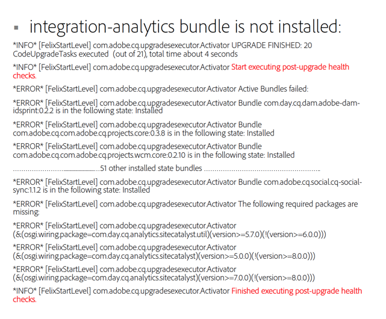

# Post Upgrade Checks and Troubleshooting{#post-upgrade-checks-and-troubleshooting}

## Post Upgrade Checks {#post-upgrade-checks}

Following the [In-Place Upgrade](/help/sites-deploying/in-place-upgrade.md) the following activities should be executed to finalize the upgrade. It is assumed AEM has been started with the 6.5 jar and that the upgraded code base has been deployed.

* [Verify logs for upgrade success](#main-pars-header-290365562)

* [Verify OSGi Bundles](#main-pars-header-1637350649)

* [Verify Oak Version](#main-pars-header-1293049773)

* [Inspect the PreUpgradeBackup folder](#main-pars-header-988995987)

* [Initial Validation of Pages](#main-pars-header-20827371)
* [Apply AEM Service Packs](#main-pars-header-215142387)

* [Migrate AEM features](#main-pars-header-1434457709)

* [Verify Scheduled Maintenance Configurations](#main-pars-header-1552730183)

* [Enable Replication Agents](#main-pars-header-823243751)

* [Enable Custom Scheduled Jobs](#main-pars-header-244535083)

* [Execute Test Plan](#main-pars-header-1167972233)

### Verify logs for Upgrade Success {#verify-logs-for-upgrade-success}

**upgrade.log**

In the past, inspecting the post upgrade state of your instance required careful inspection of various log files, parts of the repository and the launchpad. Generating a post upgrade report can help detect defective upgrades before going live.

The main purpose of this feature is to reduce the need for manual interpretation or complex parsing logic across multiple endpoints required to qualify the success of an upgrade. The solution aims to provide unambiguous information for external automation systems to react on the success or the identified failure of an update.

More specifically, it ensures that:

* Upgrade failures detected by the upgrade framework are centralized in a single upgrade report;
* The upgrade report includes indicators about necessary manual intervention.

To accommodate this, changes have been made in the way logs are generated in the `upgrade.log` file.

Here is a sample report that shows no errors during upgrade:


Here is a sample report that shows a bundle that was not installed during the upgrade process:



**error.log**

The error.log should be carefully reviewed during and following the startup of AEM using the target version jar. Any warnings or errors should be reviewed. In general, it is best to look for issues at the beginning of the log. Errors that occur later in the log may actually be side-effects of a root cause that is called out early in the file. If repeated errors and warnings occur see below for [Analyzing Issues with the Upgrade](/help/sites-deploying/post-upgrade-checks-and-troubleshooting.md#analyzing-issues-with-the-upgrade).

### Verify OSGi Bundles {#verify-osgi-bundles}

Navigate to the OSGi console `/system/console/bundles` and look to see if any bundles are not started. If any bundles are in an installed state, consult the `error.log` to determine the root issue.

### Verify Oak Version {#verify-oak-version}

Following the upgrade you, should see that Oak version has been updated to **1.10.2**. To verify the Oak version, navigate to the OSGi console and look at the version associated with Oak bundles: Oak Core, Oak Commons, Oak Segment Tar.

### Inspect PreUpgradeBackup folder {#inspect-preupgradebackup-folder}

During the upgrade, AEM attempts to back up customizations and store them beneath `/var/upgrade/PreUpgradeBackup/<time-stamp-of-upgrade>`. To view this folder in CRXDE Lite, you may need to [temporarily enable CRXDE Lite](/help/sites-administering/enabling-crxde-lite.md).

The folder with the time stamp should have a property named `mergeStatus` with a value of `COMPLETED`. The **to-process** folder should be empty and the **overwritten** node indicates which nodes were overwritten during the upgrade. Content beneath the leftovers node indicates content that could not be safely merged during the upgrade. If your implementation depends on any of the children nodes (and not already installed by your upgraded code package), they need to be merged manually.

Disable CRXDE Lite following this exercise if on a Stage or Production environment.

### Initial Validation of Pages {#initial-validation-of-pages}

Perform an initial validation against several pages in AEM. If upgrading an Author environment open the Start page and Welcome page ( `/aem/start.html`, `/libs/cq/core/content/welcome.html`). On both Author and Publish environments, open a few application pages and smoke test that they render correctly. If any issues occur consult the `error.log` to troubleshoot.

### Apply AEM Service Packs {#apply-aem-service-packs}

Apply any relevant AEM 6.5 Service Packs if they have been released.

### Migrate AEM Features {#migrate-aem-features}

Several features in AEM require additional steps following the upgrade. A full list of these features and steps to migrate them in AEM 6.5 can be found on the [Upgrading Code and Customizations](/help/sites-deploying/upgrading-code-and-customizations.md) page.

### Verify Scheduled Maintenance Configurations {#verify-scheduled-maintenance-configurations}

#### Enable Data Store Garbage Collection {#enable-data-store-garbage-collection}

If using a File Data Store, ensure that the Data Store Garbage Collection task is enabled and added to the Weekly Maintenance list. Instructions are outlined under [Revision Cleanup](/help/sites-administering/data-store-garbage-collection.md).

>[!NOTE]
>
>This is not recommended for S3 custom data store installations or when using a shared data store.

#### Enable Online Revision Cleanup {#enable-online-revision-cleanup}

If using MongoMK or the new TarMK segment format, ensure that the Revision Clean Up task is enabled and added to the Daily Maintenance list. Instructions are outlined under [Revision Cleanup](/help/sites-deploying/revision-cleanup.md).

### Execute Test Plan {#execute-test-plan}

Execute detailed test plan against as defined [Upgrading Code and Customizations](/help/sites-deploying/upgrading-code-and-customizations.md) under the **Test Procedure** section.

### Enable Replication Agents {#enable-replication-agents}

Once publish environment has been fully upgraded and validated, enable replication agents on the Author Environment. Verify that agents are able to connect to respective Publish instances. See U [pgrade Procedure](/help/sites-deploying/upgrade-procedure.md) for more details on order of events.

### Enable Custom Scheduled Jobs {#enable-custom-scheduled-jobs}

Any scheduled jobs as part of the code base can be enabled at this point.

## Analyzing Issues With The Upgrade {#analyzing-issues-with-upgrade}

This section contains some issue scenarios one might face along the upgrade procedure to AEM 6.3.

These scenarios should help to track down the root cause of issues related to upgrade and should help to identify project or product-specific issues.

### Repository Migration Failing  {#repository-migration-failing-}

The data migration from CRX2 to Oak should be feasible for any scenario starting with Source Instances based on CQ 5.4. Make sure that you exactly follow the upgrade instructions in this document which include the preparation of the `repository.xml`, making sure no custom authenticator is started via JAAS and the instance has been checked for inconsistencies before starting the migration.

If the migration still fails, you can figure out what is the root cause by inspecting the `upgrade.log`. If the issue is not yet known, report it to Customer Support.

### The Upgrade Did Not Run {#the-upgrade-did-not-run}

Before starting the preparation steps, make sure you run the **source** instance first by executing it with the Java&trade; -jar aem-quickstart.jar command. This is required to make sure that the quickstart.properties file is generated properly. If it is missing, the upgrade will not work. Alternatively, you can check whether the file is present by looking under `crx-quickstart/conf` in the installation folder of the source instance. Also, when starting AEM to kick off the upgrade, it must be executed with the Java&trade; -jar aem-quickstart.jar command. Starting up from a start script will not start AEM in upgrade mode.

### Packages and Bundles Fail to Update  {#packages-and-bundles-fail-to-update-}

In case packages fail to install during the upgrade, the bundles they contain will not be updated either. This category of issues is caused by data store misconfiguration. They will also appear as **ERROR** and **WARN** messages in the error.log. Since in most of these cases the default login may fail to work, you can use CRXDE directly to inspect and find the configuration problems.

### Some AEM Bundles are not Switching to the Active State {#some-aem-bundles-are-not-switching-to-the-active-state}

If there are bundles not starting up, check for any unsatisfied dependencies.

In case this problem is present but it is based on a failed package installation which led to bundles not being upgrade they will be deemed incompatible for the new version. For more info on how to troubleshoot this, see **Packages and Bundles Fail to Update** above.

It is also recommended to compare the bundle list of a fresh AEM 6.5 instance with the upgraded one to detect the bundles that were not upgraded. This will provide a closer scope of what to search for in the `error.log`.

### Custom Bundles not Switching to the Active State {#custom-bundles-not-switching-to-the-active-state}

In case your custom bundles are not switching to the active state, it is most likely that there is code that is not importing change API. This will most often lead to unsatisfied dependencies.

API that was removed should be marked as deprecated in one of the pervious releases. You might find instructions about a direct migration of your code in this deprecation notice. Adobe aims for semantic versioning where possible so the versions can indicate breaking changes.

It is also best to check if the change that has caused the problem was necessary and revert it if it is not. Also check if the version increase of the package export was increased more than necessary, following strict semantic versioning.

### Malfunctioning Platform UI {#malfunctioning-platform-ui}

If there is certain UI functionality that is not working properly after the upgrade, you should first check for custom overlays of the interface. Some structures might have changed and the overlay might need an update or is obsolete.

Next, check for any JavaScript errors that can be tracked down to custom added extensions that are hooked to client libraries. The same can apply for custom CSS that might be causing problems to the AEM layout.

Finally, check for misconfiguration that JavaScript might not be able to deal with. This is usually the case with improperly deactivated extensions.

### Malfunctioning Custom Components, Templates or UI Extensions {#malfunctioning-custom-components-templates-or-ui-extensions}

Usually, the root causes for these issues are the same as for bundles that are not started or packages not being installed with the only difference that the issues start occurng when first using the components.

The way to deal with erroneous custom code is to first perform smoke tests to identify the cause. Once you find it, look at the recommendations in this [link] section of the article for ways of fixing them.

### Missing Customizations Under /etc {#missing-customizations-under-etc}

`/apps` and `/libs` are handled well by the upgrade, but changes under `/etc` may be need to be manually restored from `/var/upgrade/PreUpgradeBackup` after upgrading. Make sure to check this location for any content that needs to be manually merged.

### Analyzing the error.log and upgrade.log {#analyzing-the-error.log-and-upgrade.log}

In most situations, the logs need to be consulted for errors to find the cause of a problem. However, with upgrades, it is also necessary to monitor dependency issues as old bundles might not be upgraded properly.

The best way to do this is to strip down the error.log by removing of all messages that are expected to be unrelated to the issue you are facing. You can do this via tool like grep, by using:

```shell
grep -v UnrelatedErrorString
```

Some error messages might not be immediately explicative. In this case, looking at the context in which they occur can also help understand where the error was created. You can separate the error using:

* `grep -B` for adding lines before the error;

or

* `grep -A` for adding lines after.

In a few cases errors can also be found WARN messages as there can be valid cases leading to this state and the application is not always able to decide if this is an actual error. Make sure you consult these messages as well.

### Contacting Adobe Support {#contacting-adobe-support}

If you have gone through the advice on this page and are still seeing issues, contact Adobe Support. To provide as much information as possible to the support engineer who works on your case, make sure you include the upgrade.log file from your upgrade.
