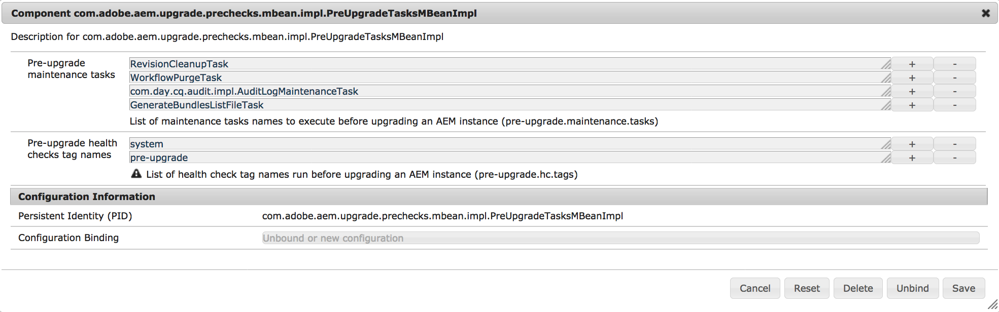

# Pre-Upgrade Maintenance Tasks{#pre-upgrade-maintenance-tasks}

Before beginning your upgrade, it is important to follow these maintenance tasks to ensure that the system is ready and can be rolled back should issues occur:

* [Ensure Sufficient Disk Space](/help/sites-deploying/pre-upgrade-maintenance-tasks.md#ensure-sufficient-disk-space)
* [Fully Back Up AEM](/help/sites-deploying/pre-upgrade-maintenance-tasks.md#fully-back-up-aem)
* [Back Up Changes to /etc](/help/sites-deploying/pre-upgrade-maintenance-tasks.md#backup-changes-etc)
* [Generate The quickstart.properties File](/help/sites-deploying/pre-upgrade-maintenance-tasks.md#generate-quickstart-properties)
* [Configure Workflow and Audit Log Purging](/help/sites-deploying/pre-upgrade-maintenance-tasks.md#configure-wf-audit-purging)
* [Install, Configure, and Run The Pre-Upgrade Tasks](/help/sites-deploying/pre-upgrade-maintenance-tasks.md#install-configure-run-pre-upgrade-tasks)
* [Disable Custom Login Modules](/help/sites-deploying/pre-upgrade-maintenance-tasks.md#disable-custom-login-modules)
* [Remove Updates From The /install Directory](/help/sites-deploying/pre-upgrade-maintenance-tasks.md#remove-updates-install-directory)
* [Stop Any Cold Standby Instances](/help/sites-deploying/pre-upgrade-maintenance-tasks.md#stop-tarmk-coldstandby-instance)
* [Disable Custom Scheduled Jobs](/help/sites-deploying/pre-upgrade-maintenance-tasks.md#disable-custom-scheduled-jobs)
* [Execute Offline Revision Cleanup](/help/sites-deploying/pre-upgrade-maintenance-tasks.md#execute-offline-revision-cleanup)
* [Execute Datastore Garbage Collection](/help/sites-deploying/pre-upgrade-maintenance-tasks.md#execute-datastore-garbage-collection)
* [Upgrade the Database Schema If Needed](/help/sites-deploying/pre-upgrade-maintenance-tasks.md#upgradethedatabaseschemaifneeded)
* [Delete Users that Might Hinder the Upgrade](/help/sites-deploying/pre-upgrade-maintenance-tasks.md#delete-users-that-might-hinder-the-upgrade)

* [Rotate Log Files](/help/sites-deploying/pre-upgrade-maintenance-tasks.md#rotate-log-files)

## Ensure Sufficient Disk Space {#ensure-sufficient-disk-space}

When executing the upgrade, in addition to the content and code upgrade activities, a repository migration must be performed. The migration creates a copy of the repository in the new Segment Tar format. As a result, you need enough disk space to retain a second, potentially larger, version of your repository.

## Fully Back Up AEM {#fully-back-up-aem}

AEM should be fully backed up before beginning the upgrade. Make sure to back up your repository, application installation, datastore, and Mongo instances if applicable. For more information on backing up and restoring an AEM instance, see [Backup and Restore](/help/sites-administering/backup-and-restore.md).

## Back Up Changes to /etc {#backup-changes-etc}

The upgrade process does a good job of maintaining and merging existing content and configurations from under the `/apps` and `/libs` paths in the repository. For changes made to the `/etc` path, including Context Hub configurations, it is often necessary to reapply these changes after the upgrade. While the upgrade makes a backup copy of any changes that it cannot merge under `/var`, Adobe recommends that you back up these changes manually before beginning the upgrade.

## Generate The quickstart.properties File {#generate-quickstart-properties}

When starting AEM from the jar file, a `quickstart.properties` file is generated under `crx-quickstart/conf`. If AEM has only been started with the start script in the past, this file is not present and the upgrade fails. Make sure to check for the existence of this file and restart AEM from the jar file if it is not present.

## Configure Workflow and Audit Log Purging {#configure-wf-audit-purging}

The `WorkflowPurgeTask` and `com.day.cq.audit.impl.AuditLogMaintenanceTask` tasks require separate OSGi configurations and cannot work without them. If they fail during pre-upgrade task execution, missing configurations is the most likely reason. Therefore, make sure to add OSGi configurations for these tasks or remove them altogether from the pre-upgrade optimization tasks list if you do not wish to run them. Documentation for configuring workflow purging tasks can be found at [Administering Workflow Instances](/help/sites-administering/workflows-administering.md) and audit log maintenance task configuration can be found at [Audit Log Maintenance in AEM 6](/help/sites-administering/operations-audit-log.md).

For workflow and audit log purging on CQ 5.6 as well as audit log purging on AEM 6.0, see [Purge workflow and audit nodes](https://helpx.adobe.com/experience-manager/kb/howtopurgewf.html).

## Install, Configure, and Run The Pre-Upgrade Tasks {#install-configure-run-pre-upgrade-tasks}

Because of the level of customization AEM allows, environments usually do not adhere to a uniform way of performing upgrades. As such, it makes creating a standardized procedure for upgrades a difficult process.

In previous versions, it was also difficult for AEM upgrades that were stopped or that have failed to safely resume. This issue led to situations in which restarting the full upgrade procedure was necessary or where defective upgrades were carried out without triggering any warnings.

To address these issues, Adobe has added several enhancements to the upgrade process, making it more resilient and user-friendly. Pre-upgrade maintenance tasks that before had to be performed manually are being optimized and automated. Also, post-upgrade reports have been added so that the process can be fully scrutinized in the hope that any issues are found more easily.

Pre-upgrade maintenance tasks are currently spread over various interfaces which are partially or entirely performed manually. The pre-upgrade maintenance optimization introduced in AEM 6.3 enables a unified way to trigger these tasks and be able to inspect their result on demand.

All tasks included in the pre-upgrade optimization step are compatible with all versions from AEM 6.0 onwards.

### How to Set It Up {#how-to-set-it-up}

In AEM 6.3 and later, the pre-upgrade maintenance optimization tasks come included in the quickstart jar. 

<!-- URLs below are all 404s. This content should probably be removed because it is entirely obsolete.

If you are upgrading from an older version of AEM 6, they are made available through separate packages that you can download from the Package Manager.

You can find the packages at these locations:

* [For upgrading from AEM 6.0](https://www.adobeaemcloud.com/content/marketplace/marketplaceProxy.html?packagePath=/content/companies/public/adobe/packages/cq600/product/pre-upgrade-tasks-content-cq60)

* [For upgrading from AEM 6.1](https://www.adobeaemcloud.com/content/marketplace/marketplaceProxy.html?packagePath=/content/companies/public/adobe/packages/cq610/product/pre-upgrade-tasks-content-cq61)

* [For upgrading from AEM 6.2](https://www.adobeaemcloud.com/content/marketplace/marketplaceProxy.html?packagePath=/content/companies/public/adobe/packages/cq620/product/pre-upgrade-tasks-content-cq62) -->

### How to Use It {#how-to-use-it}

The `PreUpgradeTasksMBean` OSGI component comes preconfigured with a list of pre-upgrade maintenance tasks that can be run all at once. You can configure the tasks by following the below procedure:

1. Go to the Web Console by browsing to *https://serveraddress:serverport/system/console/configMgr*

1. Search for "**preupgradetasks**", then click the first matching component. The full name of the component is `com.adobe.aem.upgrade.prechecks.mbean.impl.PreUpgradeTasksMBeanImpl`

1. Modify the list of maintenance tasks that must be run as shown below:

   

The task list differs depending on the run mode that is being used to start the instance. Below is a description of the run mode that each maintenance task is designed for.

<table>
 <tbody>
  <tr>
   <td><strong>Task</strong></td>
   <td><strong>Run Mode</strong></td>
   <td><strong>Notes</strong></td>
  </tr>
  <tr>
   <td><code>TarIndexMergeTask</code></td>
   <td>crx2</td>
   <td> </td>
  </tr>
  <tr>
   <td><code>DataStoreGarbageCollectionTask</code></td>
   <td>crx2</td>
   <td>Runs mark and sweep. For shared datastores, remove this step and run<br /> manually or properly prepare instances before executing.</td>
  </tr>
  <tr>
   <td><code>ConsistencyCheckTask</code></td>
   <td>crx2</td>
   <td> </td>
  </tr>
  <tr>
   <td><code>WorkflowPurgeTask</code></td>
   <td>crx2/crx3</td>
   <td>Must configure the Adobe Granite Workflow Purge Configuration OSGi before running.</td>
  </tr>
  <tr>
   <td><code>GenerateBundlesListFileTask</code></td>
   <td>crx2/crx3</td>
   <td> </td>
  </tr>
  <tr>
   <td><code>RevisionCleanupTask</code></td>
   <td>crx3</td>
   <td>For TarMK instances on AEM 6.0 to 6.2, manually run Offline Revision Cleanup instead.</td>
  </tr>
  <tr>
   <td><code>com.day.cq.audit.impl.AuditLogMaintenanceTask</code></td>
   <td>crx3</td>
   <td>Must configure the Audit Log Purge Scheduler OSGi configuration before running.</td>
  </tr>
 </tbody>
</table>

>[!CAUTION]
>
>The `DataStoreGarbageCollectionTask` calls a Datastore Garbage Collection operation with the mark and sweep phase if used. For deployments that use a shared datastore, make sure to either reconfigure it properly or prepare the instance to avoid deletion of items referenced by another instance. This process might require running the mark phase manually on all instances before triggering this pre-upgrade task.

### Default Configuration of the Pre-Upgrade Health Checks {#default-configuration-of-the-pre-upgrade-health-checks}

The `PreUpgradeTasksMBeanImpl` OSGI component comes pre-configured with a list of pre-upgrade health check tags to execute when the `runAllPreUpgradeHealthChecks` method is called:

* **system** - the tag used by the granite maintenance health checks

* **pre-upgrade** - a custom tag that could be added to all the health checks that you can set to run before an upgrade

The list is editable. You can use the plus **(+)** and minus **(-)** buttons besides the tags to add more custom tags, or remove the default ones.

**MBean Methods**

The managed bean functionality can be accessed using the [JMX Console](/help/sites-administering/jmx-console.md).

You can access the MBeans by:

1. Going to the JMX Console at *https://serveraddress:serverport/system/console/jmx*
1. Search for **PreUpgradeTasks** and click the result

1. Select any method from the **Operations** section and select **Invoke** in the following window.

Below is a list of all the available methods that the `PreUpgradeTasksMBeanImpl` exposes:

<table>
 <tbody>
  <tr>
   <td><strong>Method Name</strong></td>
   <td><strong>Type</strong></td>
   <td><strong>Description</strong></td>
  </tr>
  <tr>
   <td><code>getAvailablePreUpgradeTasksNames()</code></td>
   <td>INFO</td>
   <td>Displays the list of available pre-upgrade maintenance tasks names.</td>
  </tr>
  <tr>
   <td><code>getAvailablePreUpgradeHealthChecksTagNames()</code></td>
   <td>INFO</td>
   <td>Displays the list of pre-upgrade health checks tag names.</td>
  </tr>
  <tr>
   <td><code>runAllPreUpgradeTasks()</code></td>
   <td>ACTION</td>
   <td>Runs all the pre-upgrade maintenance tasks in the list.</td>
  </tr>
  <tr>
   <td><code>runPreUpgradeTask(preUpgradeTaskName)</code></td>
   <td>ACTION</td>
   <td>Runs the pre-upgrade maintenance task with the name given as the parameter.</td>
  </tr>
  <tr>
   <td><code>isRunAllPreUpgradeTaskRunning()</code></td>
   <td>ACTION_INFO</td>
   <td>Checks if the <code>runAllPreUpgradeTasksmaintenance</code> task is running.</td>
  </tr>
  <tr>
   <td><code>getAnyPreUpgradeTaskRunning()</code></td>
   <td>ACTION_INFO</td>
   <td>Checks if any pre-upgrade maintenance task is running and<br /> returns an array containing the names of currently running tasks.</td>
  </tr>
  <tr>
   <td><code>getPreUpgradeTaskLastRunTime(preUpgradeTaskName)</code></td>
   <td>ACTION</td>
   <td>Displays the exact running time of the pre-upgrade maintenance task with the name given as the parameter.</td>
  </tr>
  <tr>
   <td><code>getPreUpgradeTaskLastRunState(preUpgradeTaskName)</code></td>
   <td>ACTION</td>
   <td>Displays the last running state of the pre-upgrade maintenance task with the name given as the parameter.</td>
  </tr>
  <tr>
   <td><code>runAllPreUpgradeHealthChecks(shutDownOnSuccess)</code></td>
   <td>ACTION</td>
   <td><p>Runs all the pre-upgrade health checks and saves their status in a file named <code>preUpgradeHCStatus.properties</code> that is in the sling home path. If the <code>shutDownOnSuccess</code> parameter is set to <code>true</code>, the AEM instance is shut down, but only if all the pre-upgrade health checks have an OK status.</p> <p>The properties file is used as a precondition for any future upgrade<br /> and the upgrade process is stopped if the pre-upgrade health check<br /> execution failed. If you want to ignore the result of the pre-upgrade<br /> health checks and launch the upgrade anyway, you can delete the file.</p> </td>
  </tr>
  <tr>
   <td><code>detectUsageOfUnavailableAPI(aemVersion)</code></td>
   <td>ACTION</td>
   <td>Lists all the imported packages that are no longer satisfied when<br /> upgrading to the specified AEM version. The target AEM version must be<br /> given as parameter.</td>
  </tr>
 </tbody>
</table>

>[!NOTE]
>
>The MBean methods can be invoked via:
>
>* The JMX Console
>* Any external application that connects to JMX
>* cURL
>

## Disable Custom Login Modules {#disable-custom-login-modules}

>[!NOTE]
>
>This step is only required if you are upgrading from an AEM 5 version. It can be skipped entirely for upgrades from older AEM 6 versions.

The way custom `LoginModules` are configured for authentication at the repository level has fundamentally changed in Apache Oak.

In AEM versions that used CRX2 configuration was placed in the `repository.xml` file, while from AEM 6 onwards it is done in the Apache Felix JAAS Configuration Factory service via the Web Console.

Therefore, any existing configurations will have to be disabled and re-created for Apache Oak after the upgrade.

To disable the custom modules defined in the JAAS configuration of `repository.xml`, you must edit the configuration to use the default `LoginModule`, as in the following example:

```xml
<Security >
             ....
          <!--
                 Use LoginModule authenticating against repository itself
                 -->
                 <LoginModule class = "com.day.crx.core.CRXLoginModule" >
                     <param name = "anonymousId" value = "anonymous" />
                     <param name = "adminId" value ="admin" />
                     <param name = "disableNTLMAuth" value = "true" />
                     <param name = "tokenExpiration" value = "43200000" />
                     <!-- param name="trust_credentials_attribute" value="d5b9167e95dad6e7d3b5d6fa8df48af8"/
                -->
                 </LoginModule >
         </ Security>
```

>[!NOTE]
>
>For more information, see [Authentication with the External Login Module](https://jackrabbit.apache.org/oak/docs/security/authentication/externalloginmodule.html).
>
>For an example of `LoginModule` configuration in AEM 6, see [Configuring LDAP with AEM 6](/help/sites-administering/ldap-config.md).

## Remove Updates From The /install Directory {#remove-updates-install-directory}

>[!NOTE]
>
>Only remove packages from the crx-quickstart/install directory AFTER shutting down the AEM instance. This step is one of the last before starting the in-place upgrade procedure.

Remove any service packs, feature packs, or hotfixes that were deployed through the `crx-quickstart/install` directory on the local file system. Doing so prevents the inadvertent installation of old hotfixes and service packs on top of the new AEM version after the update has completed.

## Stop Any Cold Standby Instances {#stop-tarmk-coldstandby-instance}

If using TarMK cold standby, stop any cold standby instances. Doing so guarantees an efficient way to come back online if there are issues in the upgrade. After the upgrade has completed successfully, the cold standby instances must be rebuilt from the upgraded primary instances.

## Disable Custom Scheduled Jobs {#disable-custom-scheduled-jobs}

Disable any OSGi scheduled jobs that are included in your application code.

## Execute Offline Revision Cleanup {#execute-offline-revision-cleanup}

>[!NOTE]
>
>This step is only necessary for TarMK installations

If using TarMK, you should run Offline Revision Cleanup before upgrading. Doing so makes the repository migration step and subsequent upgrade tasks execute much faster and helps to ensure that Online Revision Cleanup can execute successfully after the upgrade has completed. For information on running Offline Revision Cleanup, see [Performing Offline Revision Cleanup](/help/sites-deploying/storage-elements-in-aem-6.md#performing-offline-revision-cleanup).

## Execute Datastore Garbage Collection {#execute-datastore-garbage-collection}

>[!NOTE]
>
>This step is only necessary for instances running crx3

After running revision cleanup on CRX3 instances, you should run Datastore Garbage Collection to remove any unreferenced blobs in the data store. For instructions, see the documentation on [Data Store Garbage Collection](/help/sites-administering/data-store-garbage-collection.md).

## Upgrade the Database Schema If Needed {#upgrade-the-database-schema-if-needed}

Usually, the underlying Apache Oak stack that AEM uses for persistence takes care of upgrading the database schema, if needed.

However, cases might arise when the schema cannot be upgraded automatically. Such cases are mostly high security environments where the database is running under a user with limited privileges. If such a situation occurs, AEM continues to use the old schema.

To prevent such a scenario from happening, upgrade the schema by doing the following:

1. Shut down the AEM instance that must be upgraded.
1. Upgrade the database schema. Consult the documentation for your database type to see what tooling is necessary to achieve the result.

   For more information on how Oak handles schema upgrades, see [this page on the Apache website](https://jackrabbit.apache.org/oak/docs/nodestore/document/rdb-document-store.html#upgrade).

1. Proceed with upgrading AEM.

## Delete Users that Might Hinder the Upgrade {#delete-users-that-might-hinder-the-upgrade}

>[!NOTE]
>
>This pre-upgrade maintenance task is only necessary if:
>
>* You are upgrading from AEM versions older than AEM 6.3
>* You encounter any of the errors mentioned below during the upgrade.
>

There are exceptional cases when service users might end up in an older AEM version being improperly tagged as regular users.

If such a situation happens, the upgrade fails with a message like the following:

```
ERROR [Apache Sling Repository Startup Thread] com.adobe.granite.repository.impl.SlingRepositoryManager Exception in a SlingRepositoryInitializer, SlingRepository service registration aborted
java.lang.RuntimeException: Unable to create service user [communities-utility-reader]:java.lang.RuntimeException: Existing user communities-utility-reader is not a service user.
```

To work around this issue, make sure you do the following:

1. Detach the instance from production traffic
1. Create a backup of one or more users causing the problem. You can do this task by way of Package Manager. For more information, see [How to Work with Packages.](/help/sites-administering/package-manager.md)
1. Delete one or more users causing the problem. Below is a list of users that might fall under this category:

    1. `dynamic-media-replication`
    1. `communities-ugc-writer`
    1. `communities-utility-reader`
    1. `communities-user-admin`
    1. `oauthservice`
    1. `sling-scripting`

## Rotate Log Files {#rotate-log-files}

Adobe recommends archiving your current log files before beginning your upgrade. Doing so makes it easier to monitor and scan your log files during and after the upgrade to identify and resolve any issues that may occur.
