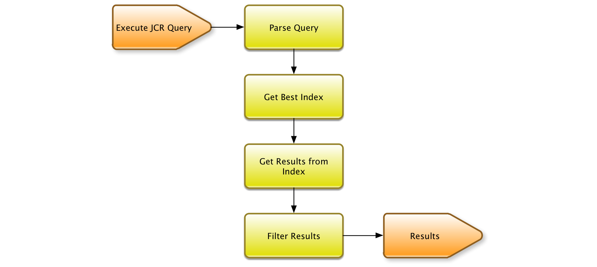
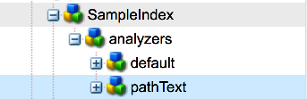
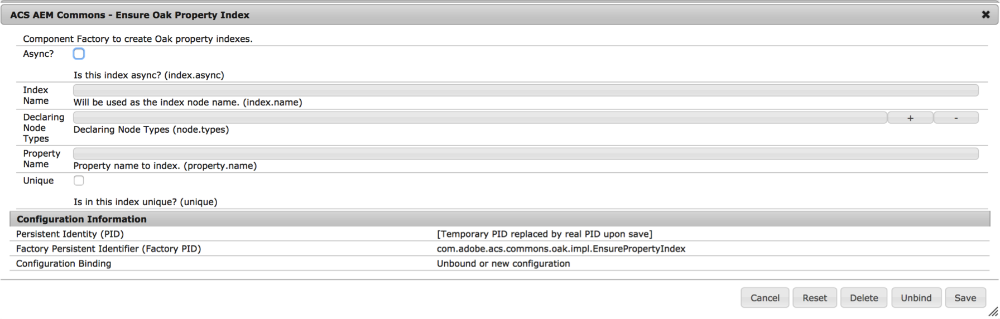

# Oak Queries and Indexing{#oak-queries-and-indexing}

>[!NOTE]
>
>This article is about configuring indexes in AEM 6. For best practices on optimizing query and indexing performance, see [Best Practices for Queries and Indexing](/help/sites-deploying/best-practices-for-queries-and-indexing.md).

## Introduction {#introduction}

Unlike Jackrabbit 2, Oak does not index content by default. Custom indexes must be created when necessary, much like with traditional relational databases. If there is no index for a specific query, many nodes are possibly traversed. The query may still work but it is likely slow.

If Oak encounters a query without an index, a WARN level log message is printed:

```xml
*WARN* Traversed 1000 nodes with filter Filter(query=select ...) consider creating an index or changing the query
```

## Supported query languages {#supported-query-languages}

The Oak query engine supports the following languages:

* XPath (recommended)
* SQL-2
* SQL (deprecated)
* JQOM

## Indexer types and cost calculation {#indexer-types-and-cost-calculation}

The Apache Oak-based backend allows different indexers to be plugged into the repository.

One indexer is the **Property Index**, for which the index definition is stored in the repository itself.

Implementations for **Apache Lucene** and **Solr** are also available by default, which both support fulltext indexing.

The **Traversal Index** is used if no other indexer is available. This means that the content is not indexed and content nodes are traversed to find matches to the query.

If multiple indexers are available for a query, each available indexer estimates the cost of executing the query. Oak then chooses the indexer with the lowest estimated cost.



The above diagram is a high-level representation of the query execution mechanism of Apache Oak.

First, the query is parsed into an Abstract Syntax Tree. Then, the query is checked and transformed into SQL-2 which is the native language for Oak queries.

Next, each index is consulted to estimate the cost for the query. Once that is completed, the results from the cheapest index are retrieved. Finally, the results are filtered, both to ensure that the current user has read access to the result and that the result matches the complete query.

## Configuring the indexes {#configuring-the-indexes}

>[!NOTE]
>
>For a large repository, building an index is a time-consuming operation. This is true for both the initial creation of an index, and reindexing (rebuilding an index after changing the definition). See also [Troubleshooting Oak Indexes](/help/sites-deploying/troubleshooting-oak-indexes.md) and [Preventing Slow Reindexing](/help/sites-deploying/troubleshooting-oak-indexes.md#preventing-slow-re-indexing).

If reindexing is needed in large repositories, specially when using MongoDB and for full-text indexes, consider text pre-extraction, and using oak-run to build the initial index and to reindex.

Indexes are configured as nodes in the repository under the **Oak:index** node.

The type of the index node must be **oak:QueryIndexDefinition.** Several configuration options are available for each indexer as node properties. For more information, see the configuration details for each indexer type below.

### The Property Index {#the-property-index}

The Property Index is useful for queries that have property constraints but are not full-text. It can be configured by following the below procedure:

1. Open CRXDE by going to `http://localhost:4502/crx/de/index.jsp`
1. Create a node under **oak:index**
1. Name the node **PropertyIndex**, and set the node type to **oak:QueryIndexDefinition**
1. Set the following properties for the new node:

    * **type:**  `property` (of type String)
    * **propertyNames:**  `jcr:uuid` (of type Name)

   This particular example indexes the `jcr:uuid` property, whose job is to expose the universally unique identifier (UUID) of the node it is attached to.

1. Save the changes.

The Property Index has the following configuration options:

* The **type** property specifies the type of index, and in this case it must be set to **property**

* The **propertyNames** property indicates the list of the properties that are stored in the index. In case it is missing, the node name is used as a property name reference value. In this example, the **jcr:uuid** property whose job is to expose the unique identifier (UUID) of its node is added to the index.

* The **unique** flag which, if set to **true** adds a uniqueness constraint on the property index.

* The **declaringNodeTypes** property lets you specify a certain node type that the index only applies to.
* The **reindex** flag which if set to **true**, triggers a full content reindex.

### The Ordered Index {#the-ordered-index}

The Ordered index is an extension of the Property index. However, it has been deprecated. Indexes of this type must be replaced with the [Lucene Property Index](#the-lucene-property-index).

### The Lucene Full Text Index {#the-lucene-full-text-index}

A full text indexer based on Apache Lucene is available in AEM 6.

If a full-text index is configured, all queries that have a full-text condition use the full-text index, no matter if there are other conditions that are indexed, and no matter if there is a path restriction.

If no full-text index is configured, then queries with full-text conditions do not work as expected.

Because the index is updated by way of an asynchronous background thread, some full-text searches are unavailable for a small window of time until the background processes are finished.

You can configure a Lucene full-text index by following the below procedure:

1. Open CRXDE and create a node under **oak:index**.
1. Name the node **LuceneIndex** and set the node type to **oak:QueryIndexDefinition**
1. Add the following properties to the node:

    * **type:**  `lucene` (of type String)
    * **async:**  `async` (of type String)

1. Save the changes.

The Lucene Index has the following configuration options:

* The **type** property which specifies the type of index must be set to **lucene**
* The **async** property which must be set to **async**. This sends the index update process to a background thread.
* The **includePropertyTypes** property, which defines what subset of property types are included in the index.
* The **excludePropertyNames** property which defines a list of property names - properties that should be excluded from the index.
* The **reindex** flag which when set to **true**, triggers a full content reindex.

### Understanding Fulltext Search {#understanding-fulltext-search}

The documentation in this section applies to Apache Lucene, ElasticSearch, and fulltext indexes of PostgreSQL, SQLite, and MySQL, for example. The following example is for AEM / Oak / Lucene.

<b>Data to be indexed</b>

The starting point is the data that must be indexed. Take the following documents, as an example:

| <b>Document ID</b> | <b>Path</b> | <b>Fulltext</b> |
| --- | --- | --- |
| 100 | /content/rubik | "Rubik is a Finnish brand." |
| 200 | /content/rubiksCube | "The Rubik's Cube was invented in 1974." |
| 300 | /content/cube | "A cube is a 3-dimensional object." |


<b>Inverted index</b>

The indexing mechanism splits the fulltext into words called "tokens", and builds an index called "inverted index". This index contains the list of documents where it appears for each word. 

Short, common words (also called "stopwords") are not indexed. All tokens are converted to lowercase, and stemming is applied.

Special characters such as *"-"* are not indexed.

| <b>Token</b> | <b>Document IDs</b> |
| --- | --- |
| 194 | ..., 200,... |
| brand | ..., 100,... |
| cube | ..., 200, 300,... |
| dimension | 300 |
| finish | ..., 100,... |
| invent | 200 |
| object | ..., 300,... |
| rubik | ..., 100, 200,... |

The list of documents is sorted. This is handy when querying.

<b>Searching</b>

Below is an example of a query. Notice that all special characters (such as *'*) were replaced with a space:

```
/jcr:root/content//element(\*; cq:Page)`[` jcr:contains('Rubik s Cube')`]`
```

The words are tokenized and filtered in the same way as when indexing (single character words are removed, for example). So in this case, the search is for:

```
+:fulltext:rubik +:fulltext:cube
```

The index consults the list of documents for those words. If there are many documents, the list can be large. As an example, presume they contain the following:


| <b>Token</b> | <b>Document IDs</b> |
| --- | --- |
| rubik | 10, 100, 200, 1000 |
| cube | 30, 200, 300, 2000 |


Lucene flips back-and-forth between the two lists (or round-robin `n` lists, when searching for `n` words):

* Read in the "rubik" gets the first entry: it finds 10
* Read in the "cube" gets the first entry `>` = 10. 10 is not found, then the next one is 30.
* Read in the "rubik" gets the first entry `>` = 30: it finds 100.
* Read in the "cube" gets the first entry `>` = 100: it finds 200.
* Read in the "rubik" gets the first entry `>` = 200. 200 is found. So document 200 is a match for both terms. This is remembered.
* Read in the "rubik" gets the next entry: 1000.
* Read in the "cube" gets the first entry `>` = 1000: it finds 2000.
* Read in the "rubik" gets the first entry `>` = 2000: end of the list.
* Finally, you can stop searching.

The only document found that contains both terms is 200, as in the example below:

| 200 | /content/rubiksCube | "The Rubik's Cube was invented in 1974." |
| --- | --- | --- |

When multiple entries are found, they are then sorted by score.

>[!NOTE]
>
>The search mechanism described in this section uses Lucene indexing, not partial matching like the Linux `grep` command.

### The Lucene Property Index {#the-lucene-property-index}

Since **Oak 1.0.8**, Lucene can be used to create indexes which involve property constraints that are not full-text.

To achieve a Lucene Property Index, the **fulltextEnabled** property must always be set to false.

Take the following example query:

```xml
select * from [nt:base] where [alias] = '/admin'
```

To define a Lucene Property Index for the above query, you can add the following definition by creating a node under **`oak:index`:**

* **Name:** `LucenePropertyIndex`
* **Type:** `oak:QueryIndexDefinition`

Once the node has been created, add the following properties:

* **type:**

  ```xml
  lucene (of type String)

  ```

* **async:**

  ```xml
  async (of type String)

  ```

* **fulltextEnabled:**

  ```xml
  false (of type Boolean)

  ```

* **includePropertyNames:** `["alias"] (of type String)`

>[!NOTE]
>
>Compared to the regular Property Index, the Lucene Property Index is always configured in async mode. Thus, the results returned by the index may not always reflect the most up-to-date state of the repository.

>[!NOTE]
>
>For more specific information on the Lucene Property Index, see the [Apache Jackrabbit Oak Lucene documentation page](https://jackrabbit.apache.org/oak/docs/query/lucene.html).

### Lucene Analyzers {#lucene-analyzers}

Since version 1.2.0, Oak supports Lucene analyzers.

Analyzers are used both when a document is indexed, and at query time. An analyzer examines the text of fields and generates a token stream. Lucene analyzers are composed of a series of tokenizer and filter classes.

The analyzers can be configured by way of the `analyzers` node (of type `nt:unstructured`) inside the `oak:index` definition.

The default analyzer for an index is configured in the `default` child of the analyzers node.



>[!NOTE]
>
>For a list of available analyzers, see the API documentation of the Lucene version you are using.

#### Specifying the Analyzer Class Directly {#specifying-the-analyzer-class-directly}

If you wish to use any out of the box analyzer, you can configure it following the below procedure:

1. Locate the index that you want to use the analyzer with under the `oak:index` node.

1. Under the index, create a child node called `default` of type `nt:unstructured`.

1. Add a property to the default node with the following properties:

    * **Name:** `class`
    * **Type:** `String`
    * **Value:** `org.apache.lucene.analysis.standard.StandardAnalyzer`

   The value is the name of the analyzer class that you want to use.

   You can also set the analyzer to be used with a specific lucene version by using the optional `luceneMatchVersion` string property. A valid syntax for using it with Lucene 4.7 would be:

    * **Name:** `luceneMatchVersion`
    * **Type:** `String`
    * **Value:** `LUCENE_47`

   If `luceneMatchVersion` is not provided, Oak uses the version of Lucene it is shipped with.

1. If you want to add a stopwords file to the analyzer configurations, you can create a node under the `default` one with the following properties:

    * **Name:** `stopwords`
    * **Type:** `nt:file`

#### Creating Analyzers by way of Composition {#creating-analyzers-via-composition}

Analyzers can also be composed based on `Tokenizers`, `TokenFilters`, and `CharFilters`. You can do this by specifying an analyzer and creating children nodes of its optional tokenizers and filters that are applied in listed order. See also [https://cwiki.apache.org/confluence/display/solr/AnalyzersTokenizersTokenFilters#Specifying_an_Analyzer_in_the_schema](https://cwiki.apache.org/confluence/display/solr/AnalyzersTokenizersTokenFilters#Specifying_an_Analyzer_in_the_schema)

Consider this node structure as an example:

* **Name:** `analyzers`

    * **Name:** `default`

        * **Name:** `charFilters`
        * **Type:** `nt:unstructured`

            * **Name:** `HTMLStrip`
            * **Name:** `Mapping`

        * **Name:** `tokenizer`

            * **Property Name:** `name`

                * **Type:** `String`
                * **Value:** `Standard`

        * **Name:** `filters`
        * **Type:** `nt:unstructured`

            * **Name:** `LowerCase`
            * **Name:** `Stop`

                * **Property name:** `words`

                    * **Type:** `String`
                    * **Value:** `stop1.txt, stop2.txt`

                * **Name:** `stop1.txt`

                    * **Type:** `nt:file`

                * **Name:** `stop2.txt`

                    * **Type:** `nt:file`

The name of the filters, charFilters, and tokenizers are formed by removing the factory suffixes. Thus:

* `org.apache.lucene.analysis.standard.StandardTokenizerFactory` becomes `standard`

* `org.apache.lucene.analysis.charfilter.MappingCharFilterFactory` becomes `Mapping`

* `org.apache.lucene.analysis.core.StopFilterFactory` becomes `Stop`

Any configuration parameter required for the factory is specified as the property of the node in question.

For cases such as loading stop words where content from external files must be loaded, the content can be provided by creating a child node of `nt:file` type for the file in question.

### The Solr Index {#the-solr-index}

The purpose of the Solr index is full-text search but it can also be used to index search by path, property restrictions, and primary type restrictions. This means that the Solr index in Oak can be used for any type of JCR query.

The integration in AEM happens at the repository level so that Solr is one of the possible indexes that can be used in Oak, the new repository implementation shipped with AEM.

It can be configured to work as a remote server with the AEM instance.

### Configuring AEM with a single remote Solr server {#configuring-aem-with-a-single-remote-solr-server}

AEM can also be configured to work with a remote Solr server instance:

1. Download and extract the latest version of Solr. For more info on how to do this, see the [Apache Solr Installation documentation](https://solr.apache.org/guide/6_6/installing-solr.html).
1. Now, create two Solr shards. You can do this by creating folders for each shard in the folder where Solr has been unpacked:

    * For the first shard, create the folder:

   `<solrunpackdirectory>\aemsolr1\node1`

    * For the second shard, create the folder:

   `<solrunpackdirectory>\aemsolr2\node2`

1. Locate the example instance in the Solr package. It is in a folder called " `example`" in the root of the package.
1. Copy the following folders from the example instance to the two shard folders ( `aemsolr1\node1` and `aemsolr2\node2`):

    * `contexts`
    * `etc`
    * `lib`
    * `resources`
    * `scripts`
    * `solr-webapp`
    * `webapps`
    * `start.jar`

1. Create a folder called " `cfg`" in each of the two shard folders.
1. Place your Solr and Zookeeper configuration files in the newly created `cfg` folders.

   >[!NOTE]
   >
   >For more info on Solr and ZooKeeper configuration, consult the [Solr Configuration documentation](https://cwiki.apache.org/confluence/display/solr/ConfiguringSolr) and the [ZooKeeper Getting Started Guide](https://zookeeper.apache.org/doc/r3.1.2/zookeeperStarted.html).

1. Start the first shard with ZooKeeper support by going to `aemsolr1\node1` and running the following command:

   ```xml
   java -Xmx2g -Dbootstrap_confdir=./cfg/oak/conf -Dcollection.configName=myconf -DzkRun -DnumShards=2 -jar start.jar
   ```

1. Start the second shard by going to `aemsolr2\node2` and running the following command:

   ```xml
   java -Xmx2g -Djetty.port=7574 -DzkHost=localhost:9983 -jar start.jar
   ```

1. After both shards have been started, test that everything is up and running by connecting to the Solr interface at `http://localhost:8983/solr/#/`
1. Start AEM and go to the Web Console at `http://localhost:4502/system/console/configMgr`
1. Set the following configuration under **Oak Solr remote server configuration**:

    * Solr HTTP URL: `http://localhost:8983/solr/`

1. Choose **Remote Solr** in the drop-down list under **Oak Solr** server provider.

1. Go to CRXDE and login as Admin.
1. Create a node called **solrIndex** under **oak:index**, and set the following properties:

    * **type:** solr (of type String)
    * **async:** async (of type String)
    * **reindex:** true (of type Boolean)

1. Save the changes.

#### Recommended configuration for Solr {#recommended-configuration-for-solr}

Below is an example of a base configuration that can be used with all three Solr deployments described in this article. It accommodates the dedicated property indexes that are already present in AEM; do not use with other applications.

To properly use it, you must place the contents of the archive directly in the Solr Home Directory. If there are multi-node deployments, it should go directly under the root folder of each node.

Recommended Solr configuration files

[Get File](assets/recommended-conf.zip)

### AEM Indexing Tools {#aem-indexing-tools}

AEM 6.1 also integrates two indexing tools present in AEM 6.0 as part of the Adobe Consulting Services Commons toolset:

1. **Explain Query**, a tool designed to help administrators understand how queries are executed;
1. **Oak Index Manager**, a Web User Interface for maintaining existing indexes.

You can now reach them by going to **Tools - Operations - Dashboard - Diagnosis** from the AEM Welcome screen.

For more information on how to use them, see the [Operations Dashboard documentation](/help/sites-administering/operations-dashboard.md).

#### Creating Property Indexes by way of OSGi {#creating-property-indexes-via-osgi}

The ACS Commons package also exposes OSGi configurations that can be used to create property indexes.

You can access it from the Web Console by searching for "**Ensure Oak Property Index**".



### Troubleshooting indexing issues {#troubleshooting-indexing-issues}

Situations may arise where queries take a long time to execute, and the general system response time is slow.

This section presents a set of recommendations on what must be done to track down the cause of such issues and advice on how to resolve them.

#### Preparing Debugging Info for Analysis {#preparing-debugging-info-for-analysis}

The easiest way to get the required information for the query being run is by way of the [Explain Query tool](/help/sites-administering/operations-dashboard.md#explain-query). This lets you collect the precise information that is needed to debug a slow query without the need to consult the log level information. This is desirable if you know the query that is being debugged.

If this is not possible for any reason, you can gather the indexing logs in a single file and use it to troubleshoot your particular problem.

#### Enable Logging {#enable-logging}

To enable logging, you must enable **DEBUG** level logs for the categories pertaining to Oak indexing and queries. These categories are:

* org.apache.jackrabbit.oak.plugins.index
* org.apache.jackrabbit.oak.query
* com.day.cq.search

The **com.day.cq.search** category is only applicable if you are using the AEM provided QueryBuilder utility.

>[!NOTE]
>
>It is important that the logs are only set to DEBUG for the duration the query you want to troubleshoot is being run. Otherwise, many events are generated in the logs over time. Because of this, once the required logs are collected switch back to INFO level logging for the categories mentioned above.

You can enable logging by following this procedure:

1. Point your browser to `https://serveraddress:port/system/console/slinglog`
1. Click the **Add new Logger** button in the lower part of the console.
1. In the newly created row, add the categories mentioned above. You can use the **+** sign to add more than one category to a single logger.
1. Choose **DEBUG** from the **Log level** drop-down list.
1. Set the output file to `logs/queryDebug.log`. This correlates all the DEBUG events into a single log file.
1. Run the query or render the page that is using the query you wish to debug.
1. Once you have executed the query, go back to the logging console and change the log level of the newly created logger to **INFO**.

#### Index Configuration {#index-configuration}

The way the query gets evaluated is largely affected by the index configuration. It is important to get the index configuration analyzed or sent to support. You can either get the configuration as a content package or get a JSON rendition.

Usually, the indexing configuration is stored under the `/oak:index` node in CRXDE, you can get the JSON version at:

`https://serveraddress:port/oak:index.tidy.-1.json`

If the index is configured at a different location, change the path accordingly.

#### MBean output {#mbean-output}

Sometimes it is helpful to provide the output of index-related MBeans for debugging. You can do this by:

1. Going to the JMX console at:
`https://serveraddress:port/system/console/jmx`

1. Search for the following MBeans:

    * Lucene Index statistics
    * CopyOnRead support statistics
    * Oak Query Statistics
    * IndexStats

1. Click each of the MBeans so you can get performance statistics. Create a screenshot or note them down in case a support submission is necessary.

You can also get the JSON variant of these statistics at the following URLs:

* `https://serveraddress:port/system/sling/monitoring/mbeans/org/apache/jackrabbit/oak/%2522LuceneIndex%2522.tidy.-1.json`
* `https://serveraddress:port/system/sling/monitoring/mbeans/org/apache/jackrabbit/oak/%2522LuceneIndex%2522.tidy.-1.json`
* `https://serveraddress:port/system/sling/monitoring/mbeans/org/apache/jackrabbit/oak/%2522LuceneIndex%2522.tidy.-1.json`
* `https://serveraddress:port/system/sling/monitoring/mbeans/org/apache/jackrabbit/oak/%2522LuceneIndex%2522.tidy.-1.json`

You can also provide consolidated JMX output by way of `https://serveraddress:port/system/sling/monitoring/mbeans/org/apache/jackrabbit/oak.tidy.3.json`. This would include all Oak related MBean details in JSON format.

#### Other Details {#other-details}

You can gather additional details to help troubleshoot the problem, such as:

1. The Oak version that your instance is running on. You can see this by opening CRXDE and looking at the version in the lower right corner of the welcome page, or by checking the version of the `org.apache.jackrabbit.oak-core` bundle.
1. The QueryBuilder Debugger output of the troublesome query. The debugger can be accessed at: `https://serveraddress:port/libs/cq/search/content/querydebug.html`
