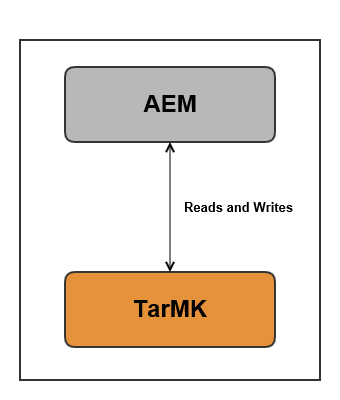
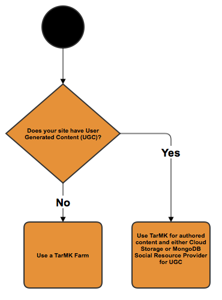

# Recommended Deployments{#recommended-deployments}

>[!NOTE]
>
>This page refers to recommended topologies for AEM. For more information on clustering capabilities and how to configure them, see the [Apache Sling Discovery API documentation](https://sling.apache.org/documentation/bundles/discovery-api-and-impl.html).

MicroKernels act as persistence managers starting from AEM 6.2. Choosing one to fit your needs depends on the purpose of your instance and the deployment type you are considering.

The below examples are meant to be an indication of what are their recommended uses in the most common AEM setups.

## Deployment scenarios {#deployment-scenarios}

### Single TarMK Instance {#single-tarmk-instance}

In this scenario, a single TarMK instance runs on a single server.

**This is the default deployment for author instances.**

The advantages:

* Simple
* Easy maintenance
* Good performance

The disadvantages:

* Not scalable beyond the limits of server capacity
* No failover capacity

### TarMK Cold Standby {#tarmk-cold-standby}

One TarMK instance acts as the primary instance. The repository from the primary is replicated to a standby failover system.

The cold standby mechanism can also be used as a backup because the complete repository is constantly replicated to the failover server. The failover server is running in cold standby mode, which means that only the HttpReceiver of the instance is running.

The advantages:

* Simplicity
* Maintainability
* Performance
* Failover

The disadvantages:

* Not scalable beyond the limits of the server capacity
* One server is idle most of the time
* The failover is not automatic. It has to be detected externally before the failover system can start serving requests.

>[!NOTE]
>
>For more info on how to configure AEM with TarMK Cold Standby, see [this](/help/sites-deploying/tarmk-cold-standby.md) article.

>[!NOTE]
>
>The Cold Standby deployment in this TarMK example requires that both the primary and standby instances be licensed separately, as there is constant replication to the failover server. For more information about licensing, consult the [Adobe General Licensing Terms](https://www.adobe.com/legal/terms/enterprise-licensing.html).

### TarMK Farm {#tarmk-farm}

Multiple Oak instances run each with one TarMK instance. The TarMK repositories are independent and need to be kept in sync.

Keeping the repositories in sync is provided with the fact that the author server is publishing the same content to each farm member. For more information, see [Replication](/help/sites-deploying/replication.md).

For AEM Communities, user generated content (UGC) is never replicated. For supporting UGC on a TarMK Farm, see [considerations for AEM Communities](#considerations-for-aem-communities).

**This is the default deployment for publish environments.**

The advantages:

* Performance
* Scalability for read access
* Failover

### Oak Cluster with MongoMK Failover for High Availability in a Single Datacenter {#oak-cluster-with-mongomk-failover-for-high-availability-in-a-single-datacenter}

This approach implies multiple Oak instances accessing a MongoDB replica set within a single data center, in effect creating an active-active cluster for the AEM author environment. Replica sets in MongoDB are used to provide high availability and redundancy in case of a hardware or network failure.

The advantages:

* Ability to scale horizontally with new AEM author instances
* High availability, redundancy, and automated failover of data layer

The disadvantages:

* Performance can be lower than with TarMK for some scenarios

### Oak Cluster with MongoMK Failover Across Multiple Datacenters {#oak-cluster-with-mongomk-failover-across-multiple-datacenters}

This approach implies multiple Oak instances accessing a MongoDB replica set across multiple data centers, in effect creating an active-active cluster for the AEM author environment. With multiple data centers, MongoDB replication provides the same high availability and redundancy but now includes the ability to handle a data center outage.

The advantages:

* Ability to scale horizontally with new AEM author instances
* High availability, redundancy, and automated failover of data layer (including data center outages)

>[!NOTE]
>
>In the diagram above, AEM Server 3 and AEM Server 4 are presented with an inactive status assuming a network latency in between the AEM Servers in Data Center 2 and the MongoDB primary node in Data Center 1 that is higher than the requirement documented [here](/help/sites-deploying/aem-with-mongodb.md#checklists). If the maximum latency is compatible with the requirements, for instance through the use of availability zones, then the AEM servers in Data Center 2 can be active as well, creating an active-active AEM cluster across multiple datacenters.

>[!NOTE]
>
>For additional information on the MongoDB architectural concepts described in this section, see [MongoDB Replication](https://docs.mongodb.org/manual/replication/).

## Microkernels: which one to use {#microkernels-which-one-to-use}

The basic rule that needs to be taken into account when choosing between the two available micro kernels is that TarMK is designed for performance, while MongoMK is used for scalability.

You can use these decision matrices to establish what is the best type of deployment suited to your requirements.

Adobe highly recommends TarMK to be the default persistence technology used by customers in all deployment scenarios, for both the AEM Author and Publish instances, except in the use cases outlined below.

### Exceptions for choosing AEM MongoMK over TarMK on Author Instances {#exceptions-for-choosing-aem-mongomk-over-tarmk-on-author-instances}

The primary reason for choosing the MongoMK persistence backend over TarMK is to scale the instances horizontally. This means having two or more active author instances running at all times and using MongoDB as the persistence storage system. The need to run more than one author instance results generally from the fact that the CPU and memory capacity of a single server, supporting all concurrent authoring activities, is no longer sustainable.

It is almost impossible to predict what the exact concurrency model will be after a new site goes live. Therefore, Adobe recommends you consider the following criteria when evaluating whether to use MongoMK and two or more Author active nodes:

1. Number of named users connected in a day: in the thousands or more.
1. Number of concurrent users: in the hundreds or more.
1. Volume of asset ingestions per day: in hundreds of thousands or more.
1. Volume of page edits per day: in hundreds of thousands or more (including automated updates via Multi Site Manager or news feed ingestions for example).
1. Volume of searches per day: in tens of thousands or more.

>[!NOTE]
>
>Tough Day can be used to evaluate the performance of the customer's application in the context of the hardware configuration deployed. More information about this tool is available [here](/help/sites-developing/tough-day.md).

A minimum deployment with MongoDB will typically involve the following topology:

* A MongoDB replica set consisting of one primary node, two secondary nodes with each of the MongoDB instances running in an availability zone with a latency under 15 milliseconds across each node;
* A cluster of author instances with one leader node, one non-leader node and both active at all time, with each of the author instances running in each of the datacenters, where the MongoDB primary and secondary instances are running.

Additionally, it is highly recommended to configure the datastore on a shared file system or Amazon S3, such that the assets or binaries are not stored within MongoDB. This will ensure optimal performance within the deployment.

One of the additional benefits of deploying a MongoDB replica set with a cluster of two or more author instances is having an automated recovery scenario with minimal downtime if there are author instances, MongoDB replica or a complete datacenter failure. Nonetheless, the choice of MongoMK over TarMK should not be solely driven by the recovery requirement, as TarMK can also provide a minimal downtime solution with a controlled failover mechanism.

If the above criteria are not expected to be met during the first 18 months of deployment, it is encouraged to first deploy AEM using TarMK, then re-evaluate your configuration at a later date when the above criteria apply, and finally determine whether to remain on TarMK or migrate to MongoMK.

### Exceptions for choosing AEM MongoMK over TarMK on Publish Instances {#exceptions-for-choosing-aem-mongomk-over-tarmk-on-publish-instances}

It is not recommended to deploy MongoMK for publish instances. The publish tier of the deployment is almost always deployed as a farm of fully independent publish instances running TarMK, which are kept in sync by replicating content from the author instances. This "shared nothing" architecture, proper to the publish instances, allows the deployment of the publish tier to scale horizontally in a linear fashion. The farm topology also provides the benefit of applying any update or upgrade to publish instances on a rolling basis, such that any change to the publish tier will not require any downtime.

This does not apply to AEM Communities using MongoMK clusters on the publish tier whenever there's more than one publisher. If choosing JSRP (see [Community Content Storage](/help/communities/working-with-srp.md)), then a MongoMK cluster would be appropriate, as would any publish side cluster regardless of the MK chosen, such as MongoDB or RDB.

### Prerequisites and Recommendations when deploying AEM with MongoMK {#prerequisites-and-recommendations-when-deploying-aem-with-mongomk}

A set of prerequisites and recommendations is available if you are considering a MongoMK deployment for AEM:

**Mandatory prerequisites for MongoDB deployments:**

1. MongoDB deployment architecture and sizing must be part of the project implementation with help from Adobe Consulting or MongoDB Architects who are familiar with AEM;
1. MongoDB expertise must be present within the partner or customer team to have confidence in being able to sustain and maintain an existing or new MongoDB environment;
1. You may choose to deploy the commercial or open source version of MongoDB (AEM supports both), but must purchase a MongoDB Maintenance and Support contract directly from MongoDB Inc;
1. Overall AEM and MongoDB architectures and infrastructures should be well defined and validated by an Adobe AEM Architect;
1. Review the support model for AEM deployments that include MongoDB.

**Strong recommendations for MongoDB deployments:**

* Consult the [MongoDB Deployment Review for Adobe Experience Manager](https://www.mongodb.com/lp/contact/mongodb-adobe-experience-manager);
* Review the [MongoDB Operations Checklist](https://docs.mongodb.org/manual/administration/production-checklist/);
* Attend a [certification class on MongoDB - available online](https://university.mongodb.com/).

>[!NOTE]
>
>For all additional questions about these guidelines, prerequisites, and recommendations contact [Adobe Customer Care](https://helpx.adobe.com/marketing-cloud/contact-support.html).

### Considerations for AEM Communities {#considerations-for-aem-communities}

For sites which plan to deploy [AEM Communities](/help/communities/overview.md), it is recommended to [choose a deployment](/help/communities/working-with-srp.md#characteristicsofstorageoptions) optimized for handling UGC posted by community members from the publish environment.

By using a [common store](/help/communities/working-with-srp.md), UGC does not need to be replicated between author and other publish instances to obtain a consistent view of the UGC.

Below are a set of decisional matrices that can assist you in choosing the best type of persistence for your deployment:

#### Choosing the deployment type for author instances {#choosing-the-deployment-type-for-author-instances}

#### Choosing the deployment type for publish instances {#choosing-the-deployment-type-for-publish-instances}

>[!NOTE]
>
>MongoDB is third-party software and is not included in the AEM licensing package. For more information see the [MongoDB licensing policy](https://www.mongodb.org/about/licensing/) page.
>
>To get the most of your AEM deployment, Adobe recommends licensing the MongoDB Enterprise version to benefit from professional support.
>
>The license includes a standard replica set, which is composed of one primary and two secondary instances that can be used for either the author or the publish deployments.
>
>In case you wish to run both author and publish on MongoDB, two separate licenses need to be purchased.
>
>For more information, see the [MongoDB for Adobe Experience Manager page](https://www.mongodb.com/lp/contact/mongodb-adobe-experience-manager).
