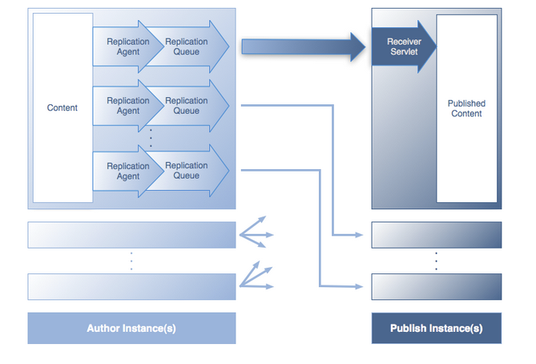
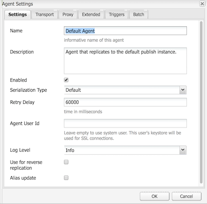
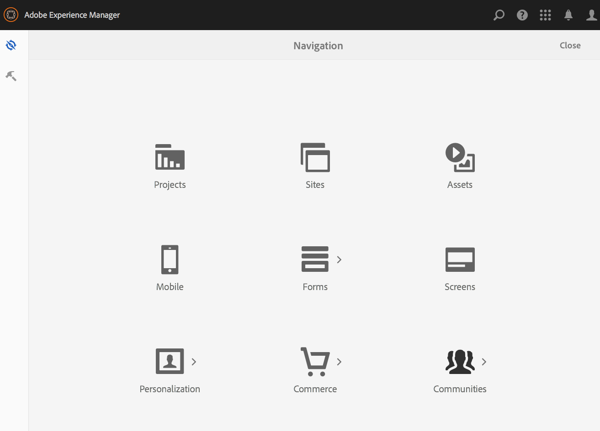
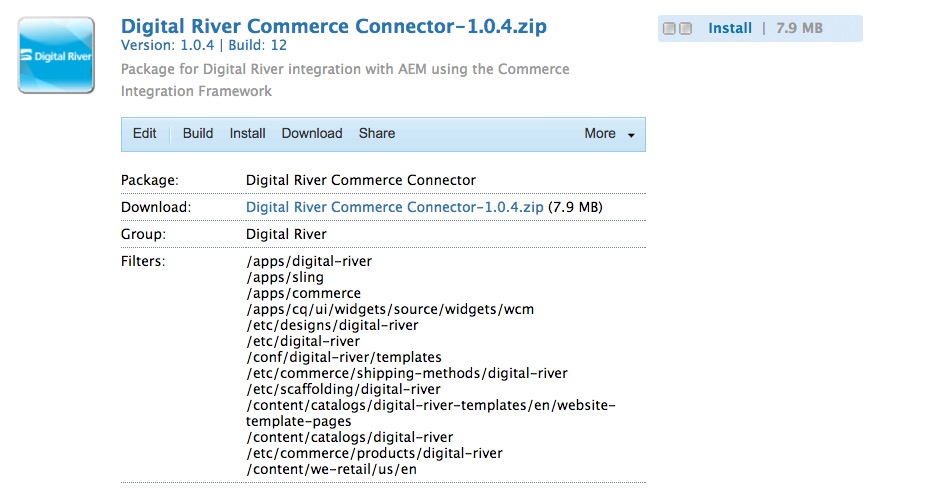
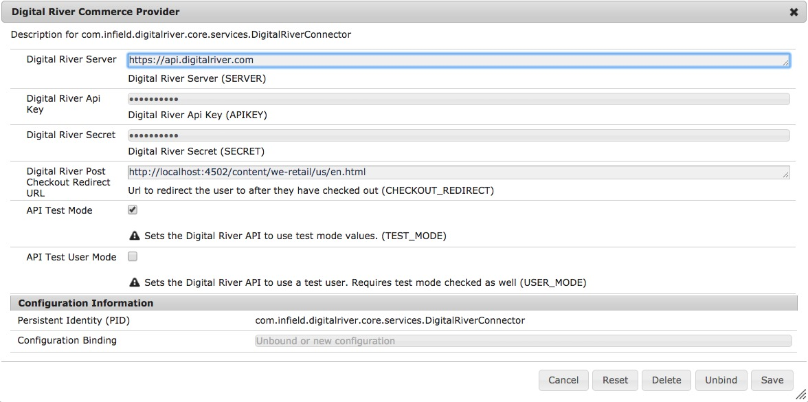
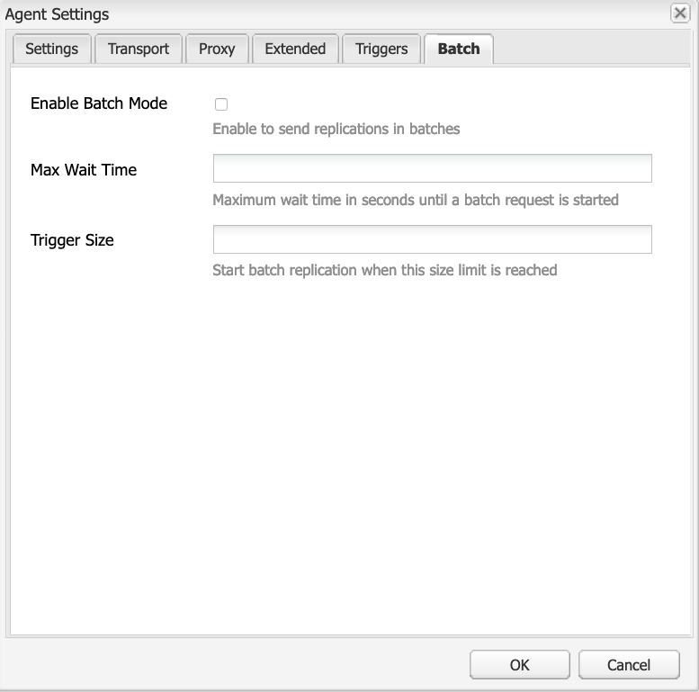

# Replication{#replication}

Replication agents are central to Adobe Experience Manager (AEM) as the mechanism used to:

* [Publish (activate)](/help/sites-authoring/publishing-pages.md#activatingcontent) content from an Author to a Publish environment.
* Explicitly flush content from the Dispatcher cache.
* Return user input (for example, form input) from the Publish environment to the Author environment (under control of the Author environment).

Requests are [queued](/help/sites-deploying/osgi-configuration-settings.md#apacheslingjobeventhandler) to the appropriate agent for processing.

>[!NOTE]
>
>User data (users, user groups, and user profiles) are not replicated between Author and Publish instances.
>
>For multiple Publish instances, user data is Sling distributed when [User Synchronization](/help/sites-administering/sync.md) is enabled.

## Replicating from Author to Publish {#replicating-from-author-to-publish}

Replication, to a Publish instance or Dispatcher, takes place in several steps:

* the Author requests that certain content be Published (activated); this can be initiated by a manual request, or by automatic triggers which have been preconfigured.
* the request is passed to the appropriate default replication agent; an environment can have several default agents that are always selected for such actions.
* the replication agent "packages" the content and places it in the replication queue.
* in the Websites tab the [colored status indicator](/help/sites-authoring/publishing-pages.md#determiningpagepublicationstatus) is set for the individual pages.
* the content is lifted from the queue and transported to the Publish environment using the configured protocol; usually this is HTTP.
* a servlet in the Publish environment receives the request and publishes the received content; the default servlet is `https://localhost:4503/bin/receive`.

* multiple Author and Publish environments can be configured.

### Replicating from Publish to Author {#replicating-from-publish-to-author}

Some features allow users to enter data on a Publish instance.

Sometimes, a type of replication known as reverse replication, is needed to return this data to the Author environment from where it is redistributed to other Publish environments. Due to security considerations, any traffic from the Publish to the Author environment must be strictly controlled.

Reverse replication uses an agent in the Publish environment which references the Author environment. This agent places the data into an outbox. This outbox is matched with replication listeners in the Author environment. The listeners poll the outboxes to collect any data entered and then distribute it as necessary. This ensures that the Author environment controls all traffic.

In other cases, such as for Communities features (for example, forums, blogs, comments, and reviews), the amount of user-generated content (UGC) being entered in the Publish environment is difficult to efficiently synchronize across AEM instances using replication.

AEM [Communities](/help/communities/overview.md) never uses replication for UGC. Instead, the deployment for Communities requires a common store for UGC (see [Community Content Storage](/help/communities/working-with-srp.md)).

### Replication - Out of the Box {#replication-out-of-the-box}

The we-retail website that is included in a standard installation of AEM can be used to illustrate replication.

To follow this example, and use the default replication agents, [install AEM](/help/sites-deploying/deploy.md) with:

* the Author environment on port `4502`
* the Publish environment on port `4503`

>[!NOTE]
>
>Enabled by default :
>
>* Agents on Author : Default Agent (publish)
>
>Effectively disabled by default (as of AEM 6.1) :
>
>* Agents on Author : Reverse Replication Agent (publish_reverse)
>* Agents on Publish : Reverse Replication (outbox)
>
>To check the status of either the agent or the queue, use the **Tools** console.
>See [Monitoring your Replication Agents](#monitoring-your-replication-agents).

#### Replication (Author to Publish) {#replication-author-to-publish}

1. Navigate to the support page on the Author environment.
   **https://localhost:4502/content/we-retail/us/en/experience.html** `<pi>`
1. Edit the page so you can add some new text.
1. **Activate Page** so you can publish the changes.
1. Open the support page on the Publish environment:
   **https://localhost:4503/content/we-retail/us/en/experience.html**
1. You can now see the changes that you entered on Author.

This replication is actioned from the Author environment by the:

* **Default Agent (publish)**
  This agent replicates content to the default Publish instance.
  Details of this (configuration and logs) can be accessed from the Tools console of the Author environment; or:
  `https://localhost:4502/etc/replication/agents.author/publish.html`.

#### Replication Agents - Out of the Box {#replication-agents-out-of-the-box}

The following agents are available in a standard AEM installation:

* [Default Agent](#replication-author-to-publish)
  Used for replicating from Author to Publish.

* Dispatcher Flush
  This is used for managing the Dispatcher cache. See [Invalidating Dispatcher Cache from the Authoring Environment](https://experienceleague.adobe.com/docs/experience-manager-dispatcher/using/configuring/page-invalidate.html#invalidating-dispatcher-cache-from-the-authoring-environment) and [Invalidating Dispatcher Cache from a Publishing Instance](https://experienceleague.adobe.com/docs/experience-manager-dispatcher/using/configuring/page-invalidate.html#invalidating-dispatcher-cache-from-a-publishing-instance) for more information.

* [Reverse Replication](#reverse-replication-publish-to-author)
  Used for replicating from Publish to Author. Reverse replication is not used for Communities features, such as forums, blogs, and comments. It is effectively disabled as the outbox is not enabled. Use of reverse replication would require custom configuration.

* Static Agent
  This is an "Agent that stores a static representation of a node into the filesystem."
  For example, with the default settings, content pages and dam assets are stored under `/tmp`, either as HTML or the appropriate asset format. See the `Settings` and `Rules` tabs for the configuration.
  This was requested so that when the page is requested directly from the application server the content can be seen. This is a specialized agent and (probably) is not required for most instances.

## Replication Agents - Configuration Parameters {#replication-agents-configuration-parameters}

When configuring a replication agent from the Tools console, four tabs are available within the dialog:

### Settings {#settings}

* **Name**

  A unique name for the replication agent.

* **Description**

  A description of the purpose this replication agent serves.

* **Enabled**

  Indicates if the replication agent is enabled.

  When the agent is **enabled**, the queue is shown as:

    * **Active** when items are being processed.
    * **Idle** when the queue is empty.
    * **Blocked** when items are in the queue, but cannot be processed; for example, when the receiving queue is disabled.

* **Serialization Type**

  The type of serialization:

    * **Default**: Set if the agent is to be automatically selected.
    * **Dispatcher Flush**: Select this if the agent is to be used for flushing the Dispatcher cache.

* **Retry Delay**

  The delay (waiting time in milliseconds) between two retries, should a problem be encountered.

  Default: `60000`

* **Agent User Id**

  Depending on the environment, the agent uses this user account to:

    * collect and package the content from the Author environment
    * create and write the content on the Publish environment

  Leave this field empty to use the system user account (the account defined in sling as the administrator user; by default this is `admin`).

  >[!CAUTION]
  >
  >For an agent on the Author environment this account *must* have read access to all paths that you want to have replicated.

  >[!CAUTION]
  >
  >For an agent on the Publish environment this account *must* have the create/write access required to replicate the content.

  >[!NOTE]
  >
  >This can be used as a mechanism for selecting specific content for replication.

* **Log Level**

  Specifies the level of detail to be used for log messages.

    * `Error`: only errors are logged
    * `Info`: errors, warnings, and other informational messages are logged
    * `Debug`: a high level of detail is used in the messages, primarily for debug purposes

  Default: `Info`

* **Use for reverse replication**

  Indicates whether this agent is used for reverse replication; returns user input from the Publish to Author environment.

* **Alias update**

  Selecting this option enables alias or vanity path invalidation requests to Dispatcher. Also, see [Configuring a Dispatcher Flush Agent](/help/sites-deploying/replication.md#configuring-a-dispatcher-flush-agent).

#### Transport {#transport}

* **URI**

  This specifies the receiving servlet at the target location. In particular, you can specify the hostname (or alias) and context path to the target instance here.

  For example:

    * A Default Agent may replicate to `https://localhost:4503/bin/receive`
    * A Dispatcher Flush agent may replicate to `https://localhost:8000/dispatcher/invalidate.cache`

  The protocol specified here (HTTP or HTTPS) determines the transport method.

  For Dispatcher Flush agents, the URI property is used only if you use path-based virtualhost entries to differentiate between farms, you use this field to target the farm to invalidate. For example, farm #1 has a virtual host of `www.mysite.com/path1/*` and farm #2 has a virtual host of `www.mysite.com/path2/*`. You can use a URL of `/path1/invalidate.cache` to target the first farm and `/path2/invalidate.cache` to target the second farm.

* **User**

  The user name of the account to be used for accessing the target.

* **Password**

  Password for the account to be used for accessing the target.

* **NTLM Domain**

  Domain for NTML authentication.

* **NTLM Host**

  Host for NTML authentication.

* **Enable relaxed SSL**

  Enable if you want self-certified SSL certificates to be accepted.

* **Allow expired certs**

  Enable if you want expired SSL certificates to be accepted.

#### Proxy {#proxy}

The following settings are only needed if a proxy is needed:

* **Proxy Host**

  Hostname of the proxy used for transport.

* **Proxy Port**

  Port of the proxy.

* **Proxy User**

  The user name of the account to be used.

* **Proxy Password**

  Password of the account to be used.

* **Proxy NTLM Domain**

  The proxy NTLM domain.

* **Proxy NTLM Host**

  The proxy NTLM domain.

#### Extended {#extended}

* **Interface**

  Here you can define the socket interface to bind to.

  This sets the local address to be used when creating connections. If this is not set, the default address is used. This is useful for specifying the interface to use on multi-homed or clustered systems.

* **HTTP Method**

  The HTTP method to be used.

  For a Dispatcher Flush agent, this is nearly always GET and should not be changed (POST would be another possible value).

* **HTTP Headers**

  These are used for Dispatcher Flush agents and specify elements that must be flushed.

  For a Dispatcher Flush agent the three standard entries should not need changing:

    * `CQ-Action:{action}`
    * `CQ-Handle:{path}`
    * `CQ-Path:{path}`

  These are used, as appropriate, to indicate the action to be used when flushing the handle or path. The subparameters are dynamic:

    * `{action}` indicates a replication action

    * `{path}` indicates a path

  They are substituted by the path/action relevant to the request and therefore do not need to be "hardcoded":

  >[!NOTE]
  >
  >If you have installed AEM in a context other than the recommended default context, then you must register the context in the HTTP Headers. For example:
  >`CQ-Handle:/<*yourContext*>{path}`

* **Close Connection**

  Enable so you can close the connection after each request.

* **Connect Timeout**

  Timeout (in milliseconds) to be applied when trying to establish a connection.

* **Socket Timeout**

  Timeout (in milliseconds) to be applied when waiting for traffic after a connection has been established.

* **Protocol Version**

  Version of the protocol. For example, `1.0` for HTTP/1.0.

#### Triggers {#triggers}

These settings are used to define triggers for automated replication:

* **Ignore default**

  If checked, the agent is excluded from default replication; this means it is not used if a content author issues a replication action.

* **On Modification**

  Here a replication by this agent is automatically triggered when a page is modified. Used for Dispatcher Flush agents, but also for reverse replication.

* **On Distribute**

  If checked, the agent automatically replicates any content that is marked for distribution when it is modified.

* **On-/Offtime reached**

  This triggers automatic replication (to activate or deactivate a page as appropriate) when the ontimes or offtimes defined for a page occur. This is primarily used for Dispatcher Flush agents.

* **On Receive**

  If checked, the agent chains replicate whenever receiving replication events.

* **No Status Update**

  When checked, the agent does not force a replication status update.

* **No Versioning**

  When checked, the agent does not force versioning of activated pages.

## Configuring your Replication Agents {#configuring-your-replication-agents}

For information about connecting replication agents to the Publish instance using MSSL, see [Replicating Using Mutual SSL](/help/sites-deploying/mssl-replication.md).

### Configuring your Replication Agents from the Author Environment {#configuring-your-replication-agents-from-the-author-environment}

From the Tools tab in the Author environment, you can configure replication agents that reside in either the Author environment (**Agents on Author**) or the Publish environment (**Agents on Publish**). The following procedures illustrate the configuration of an agent for the Author environment, but can be used for both.

>[!NOTE]
>
>When a Dispatcher handles HTTP requests for Author or Publish instances, the HTTP request from the replication agent must include the PATH header. In addition to the following procedure, you must add the PATH header to the Dispatcher list of client headers. See [/clientheaders (Client Headers)](https://experienceleague.adobe.com/docs/experience-manager-dispatcher/using/configuring/dispatcher-configuration.html#specifying-the-http-headers-to-pass-through-clientheaders).
>

1. Access the **Tools** tab in AEM.
1. Click **Replication** (left pane to open the folder).
1. Double-click **Agents on Author** (either the left or the right pane).
1. Click the appropriate agent name (which is a link) to show detailed information on that agent.
1. Click **Edit** so the configuration dialog box is opened:

   

1. The values provided should be sufficient for a default installation. If you make changes, click **OK** to save them (see [Replication Agents - Configuration Parameters](#replication-agents-configuration-parameters) for information on individual parameters).

>[!NOTE]
>
>A standard installation of AEM specifies `admin` as the user for transport credentials within the default replication agents.
>
>This should be changed to a site-specific replication user account with the privileges to replicate the required paths.

### Configuring Reverse Replication {#configuring-reverse-replication}

Reverse replication is used to get user content generated on a Publish instance back to an Author instance. This is commonly used for features such as surveys and registration forms.

For security reasons, most network topologies do not allow connections *from* the "Demilitarized Zone" (a subnetwork that exposes the external services to an untrusted network such as the Internet).

As the Publish environment is usually in the DMZ, to get content back to the Author environment the connection must be initiated from the Author instance. This is done with:

* an *outbox* in the Publish environment where the content is placed.
* an agent (publish) in the Author environment which periodically polls the outbox for new content.

>[!NOTE]
>
>For AEM [Communities](/help/communities/overview.md), replication is not used for user-generated content on a Publish instance. See [Community Content Storage](/help/communities/working-with-srp.md).

To do this, you need:

**A reverse replication agent in the Author environment** &ndash; Acts as the active component to collect information from the outbox in the Publish environment:

If you want to use reverse replication, ensure that this agent is activated.

**A reverse replication agent in the Publish environment (an outbox)** &ndash; The passive element as it acts as an "outbox". User input is placed here, from where it is collected by the agent in the Author environment.

### Configuring Replication for Multiple Publish Instances {#configuring-replication-for-multiple-publish-instances}

>[!NOTE]
>
>Only content is replicated - user data is not (users, user groups, and user profiles).
>
>To synchronize user data across multiple Publish instances, enable [User Synchronization](/help/sites-administering/sync.md).

After installation, a default agent is already configured for replication of content to a Publish instance running on port 4503 of the localhost.

To configure replication of content for an additional Publish instance, create and configure a new replication agent:

1. Open the **Tools** tab in AEM.
1. Select **Replication**, then **Agents on Author** in the left panel.
1. Select **New...**.
1. Set the **Title** and **Name**, then select **Replication Agent**.
1. Click **Create** so you can create the agent.
1. Double-click the new agent item so the configuration panel opens.
1. Click **Edit** - the **Agent Settings** dialog box opens - the **Serialization Type** is already defined as Default, this must remain so.

    * In the **Settings** tab:

        * Activate **Enabled**.
        * Enter a **Description**.
        * Set the **Retry Delay** to `60000`.

        * Leave the **Serialization Type** as `Default`.

    * In the **Transport** tab:

        * Enter the required URI for the new Publish instance; for example,
          `https://localhost:4504/bin/receive`.

        * Enter the site-specific user account used for replication.
        * You can configure other parameters as required.

1. Click **OK**.

You can then test the operation by updating, then publishing, a page in the Author environment.

The updates appear on all Publish instances that have been configured as above.

If you encounter any problems, you can check the logs on the Author instance. Depending on the level of detail required you can also set the **Log Level** to `Debug` using the **Agent Settings** dialog as above.

>[!NOTE]
>
>This can be combined with use of the [Agent User Id](#agentuserid) to select different content for replicating to the individual Publish environments. For each Publish environment:
>
>1. Configure a replication agent for replicating to that Publish environment.
>1. Configure a user account; with the access rights required to read the content that is replicated to that specific Publish environment.
>1. Assign the user account as the **Agent User Id** for the replication agent.
>

### Configuring a Dispatcher Flush agent {#configuring-a-dispatcher-flush-agent}

Default agents are included with the installation. However, a certain configuration is still needed and the same applies if you are defining a new agent:

1. Open the **Tools** tab in AEM.
1. Click **Deployment**.
1. Select **Replication** and then **Agents on Publish**.
1. Double-click the **Dispatcher Flush** item to open the overview.
1. Click **Edit** - the **Agent Settings** dialog box opens:

    * In the **Settings** tab:

        * Activate **Enabled**.
        * Enter a **Description**.
        * Leave the **Serialization Type** as `Dispatcher Flush`, or set it as such if creating an agent.

        * (optional) Select **Alias update** to enable alias or vanity path invalidation requests to Dispatcher.

    * In the **Transport** tab:

        * Enter the required URI for the new Publish instance; for example,
          `https://localhost:80/dispatcher/invalidate.cache`.

        * Enter the site-specific user account used for replication.
        * You can configure other parameters as required.

   For Dispatcher Flush agents, the URI property is used only if you use path-based virtualhost entries to differentiate between farms, you use this field to target the farm to invalidate. For example, farm #1 has a virtual host of `www.mysite.com/path1/*` and farm #2 has a virtual host of `www.mysite.com/path2/*`. You can use a URL of `/path1/invalidate.cache` to target the first farm and `/path2/invalidate.cache` to target the second farm.

   >[!NOTE]
   >
   >If you have installed AEM in a context other than the recommended default context, configure the [HTTP Headers](#extended) in the **Extended** tab.

1. Click **OK**.
1. Return to the **Tools** tab, from here you can **Activate** the **Dispatcher Flush** agent (**Agents on Publish**).

The **Dispatcher Flush** replication agent is not active on the Author. You can access the same page in the Publish environment by using the equivalent URI; for example, `https://localhost:4503/etc/replication/agents.publish/flush.html`.

### Controlling Access to Replication Agents {#controlling-access-to-replication-agents}

Access to the pages used to configure the replication agents can be controlled by using user and/or group page permissions on the `etc/replication` node.

>[!NOTE]
>
>Setting such permissions does not affect users replicating content (for example, from the Websites console or sidekick option). The replication framework does not use the "user session" of the current user to access replication agents when replicating pages.

### Configuring your Replication Agents from CRXDE Lite {#configuring-your-replication-agents-from-crxde-lite}

>[!NOTE]
>
>The creation of replication agents is only supported in the `/etc/replication` repository location. This is needed for the associated ACLs to be properly handled. Creating a replication agent in another location of the tree might lead to unauthorized access.

Various parameters of your replication agents can be configured using CRXDE Lite.

If you navigate to `/etc/replication`, you can see the following three nodes:

* `agents.author`
* `agents.publish`
* `treeactivation`

The two `agents` hold configuration information about the appropriate environment, and are only active when that environment is running. For example, `agents.publish` is only used in the Publish environment. The following screenshot shows the Publish agent in the Author environment, as included with AEM WCM:

## Monitoring your Replication Agents {#monitoring-your-replication-agents}

To monitor a replication agent:

1. Access the **Tools** tab in AEM.
1. Click **Replication**.
1. Double-click the link to agents for the appropriate environment (either the left or the right pane). For example, **Agents on Author**.

   The resulting window shows an overview of all your replication agents for the Author environment, including their target and status.

1. Click the appropriate agent name (which is a link) to show detailed information on that agent:

   

   Here you can do the following:

    * See whether the agent is enabled.
    * See the target of any replications.
    * See whether the replication queue is active (enabled).
    * See whether there are any items in the queue.
    * **Refresh** or **Clear** to update the display of queue entries. This helps you see that items enter and leave the queue.

    * **View Log** to access the log of any actions by the replication agent.
    * **Test Connection** to the target instance.
    * **Force Retry** on any queue items, if necessary.

   >[!CAUTION]
   >
   >Do not use the "Test Connection" link for the Reverse Replication Outbox on a Publish instance.
   >
   >
   >If a replication test is performed for an Outbox queue, any items that are older than the test replication are reprocessed with every reverse replication.
   >
   >
   >If such items exist in a queue, they can be found with the following XPath JCR query and should be removed.
   >
   >
   >`/jcr:root/var/replication/outbox//*[@cq:repActionType='TEST']`

## Batch Replication {#batch-replication}

The batch replication does not replicate individual pages or assets, but waits for the fist threshold of the two, based on time or size, to be triggered.

It then packs all replication items into a package, which is then replicated as one single file to the Publisher.

The Publisher unpacks all the items, save them and report back to the Author.

### Configuring Batch Replication {#configuring-batch-replication}

1. Go to `http://serveraddress:serverport/siteadmin`
1. Press the **[!UICONTROL Tools]** icon in the upper-side of the screen
1. From the left-hand side navigation rail, go to **[!UICONTROL Replication - Agents on Author]** and double-click **[!UICONTROL Default Agent]**.
   * You can also reach the default Publish replication agent by going directly to `http://serveraddress:serverport/etc/replication/agents.author/publish.html`
1. Press the **[!UICONTROL Edit]** button above the replication queue.
1. In the following window, go to the **[!UICONTROL Batch]** tab:
   
1. Configure the agent.

### Parameters {#parameters}

* `[!UICONTROL Enable Batch Mode]` - enables or disables batch replication mode
* `[!UICONTROL Max Wait Time]` - Maximum wait time until a batch request is started, in seconds. The default is 2 seconds.
* `[!UICONTROL Trigger Size]` - Starts batch replication when this size limit 

## Additional Resources {#additional-resources}

For details about troubleshooting, you can read the [Troubleshooting Replication](/help/sites-deploying/troubleshoot-rep.md) page.
