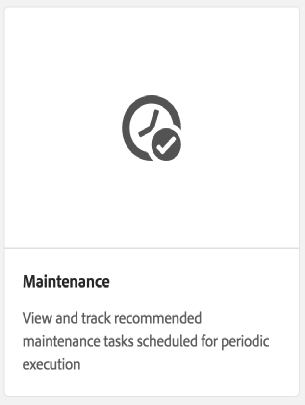
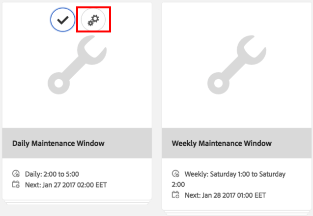
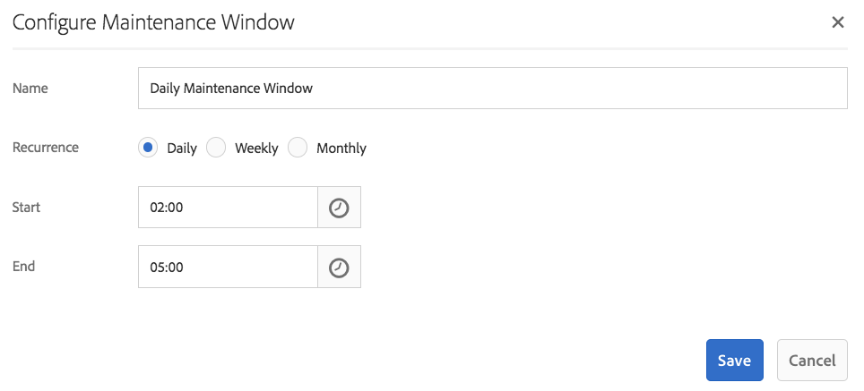
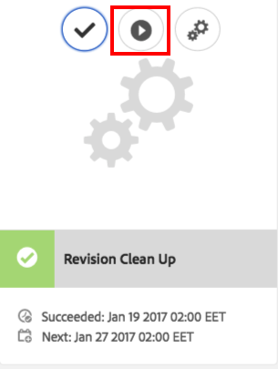
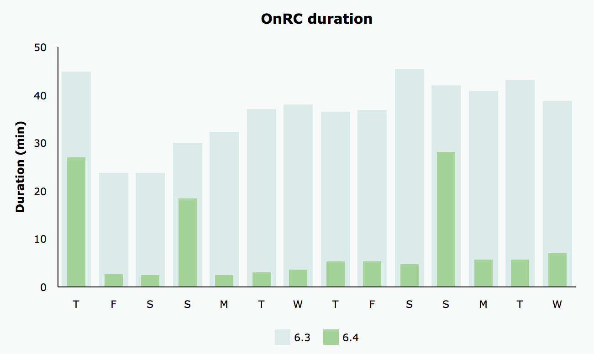
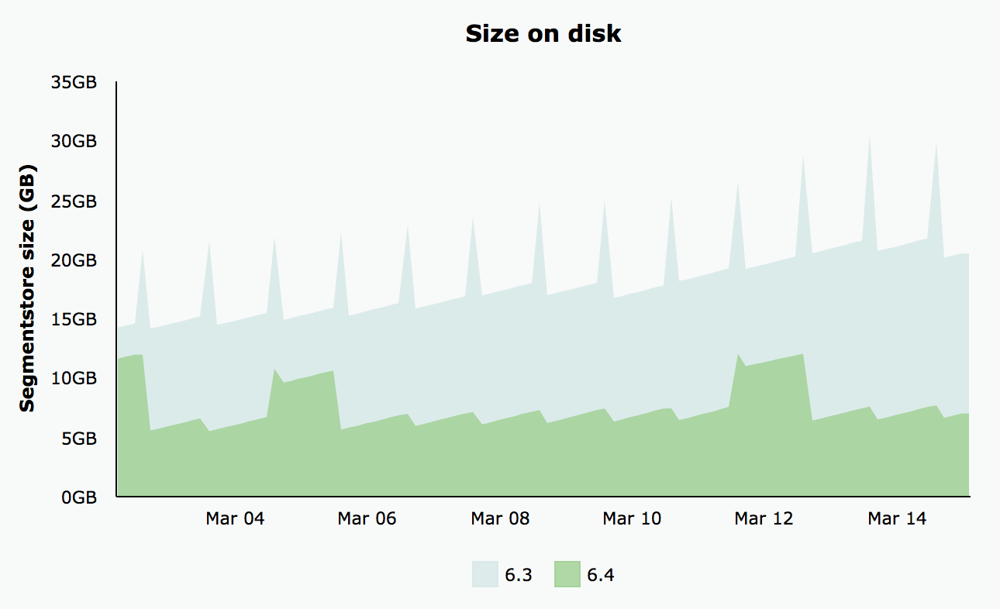

# Revision Cleanup{#revision-cleanup}

## Introduction {#introduction}

Each update to the repository creates a new content revision. As a result, with each update, the size of the repository grows. Old revisions need to be cleaned up to free disk resources - this is important to avoid uncontrolled repository growth. This maintenance functionality is called Revision Cleanup. It has been available as an offline routine since AEM 6.0.

With AEM 6.3 and higher, an online version of this functionality called Online Revision Cleanup was introduced. Compared to Offline Revision Cleanup where the AEM instance has to be shut down, Online Revision Cleanup can be run while the AEM instance is online. Online Revision Cleanup is turned on by default and it is the recommended way of performing a revision cleanup.

**Note**: [See the Video](https://helpx.adobe.com/experience-manager/kt/platform-repository/using/revision-cleanup-technical-video-use.html) for an introduction and how to use Online Revision Cleanup.

The revision cleanup process consists of three phases: **estimation**, **compaction** and **clean up**. Estimation determines whether to run the next phase (compaction) or not based on how much garbage might be collected. During the compaction phase segments and tar files are rewritten leaving out any unused content. The clean up phase subsequently removes the old segments including any garbage they may contain. The offline mode can usually reclaim more space because the online mode needs to account for AEM's working set which retains additional segments from being collected.

For more details regarding Revision Cleanup, see the following links:

* [How to Run Online Revision Cleanup](/help/sites-deploying/revision-cleanup.md#how-to-run-online-revision-cleanup)
* [Online Revision Cleanup Frequently Asked Questions](/help/sites-deploying/revision-cleanup.md#online-revision-cleanup-frequently-asked-questions)
* [How to Run Offline Revision Cleanup](/help/sites-deploying/revision-cleanup.md#how-to-run-offline-revision-cleanup)

Additionally, you can also read the [official Oak documentation.](https://jackrabbit.apache.org/oak/docs/nodestore/segment/overview.html)

### When to use Online Revision Cleanup as opposed to Offline Revision Cleanup? {#when-to-use-online-revision-cleanup-as-opposed-to-offline-revision-cleanup}

**Online Revision Cleanup is the recommended way of performing revision cleanup.** Offline Revision cleanup should be used only on a exceptional basis - for example, before migrating to the new storage format or if you are requested by Adobe Customer Care to do so.

## How to Run Online Revision Cleanup {#how-to-run-online-revision-cleanup}

Online Revision Cleanup is configured by default to automatically run once a day on both AEM Author and Publish instances. All you need to do is define the maintenance window during a period with the least user activity. You can configure the Online Revision Cleanup task as follows:

1. In the main AEM window, go to **Tools - Operations - Dashboard - Maintenance** or point your browser to: `https://serveraddress:serverport/libs/granite/operations/content/maintenance.html`

   

1. Hover over **Daily Maintenance Window** and click the **Settings** icon.

   

1. Enter the desired values (recurrence, start time, end time) and click **Save**.

   

Alternatively, if you want to run the revision cleanup task manually, you can:

1. Go to **Tools - Operations - Dashboard - Maintenance** or browse directly to `https://serveraddress:serverport/libs/granite/operations/content/maintenance.html`
1. Click the **Daily Maintenance Window**.
1. Hover over the **Revision Cleanup** icon.
1. Click **Run**.

   

### Running Online Revision Cleanup After Offline Revision Cleanup {#running-online-revision-cleanup-after-offline-revision-cleanup}

The revision cleanup process reclaims old revisions by generations. This means that each time you run revision cleanup a new generation is created and kept on the disk. There is a difference however between the two types of revision cleanup: offline revision cleanup keeps one generation while online revision cleanup keeps two generations. So, when you run online revision cleanup **after** offline revision cleanup the following happens:

1. After the first online revision cleanup run the repository will double in size. This happens because there are now two generations that are kept on disk.
1. During the subsequent runs, the repository will temporarily grow while the new generation is created and then stabilize back to the size it had after the first run, as the online revision cleanup process reclaims the previous generation.

Also, keep in mind that depending on the type and number of commits, each generation can vary in size compared to the previous one, so the final size can vary from one run to the other.

Due to this fact, it is recommended to size the disk at least two or three times larger than the initially estimated repository size.

## Full And Tail Compaction Modes  {#full-and-tail-compaction-modes}

**AEM 6.5** introduces **two new modes** for the **compaction** phase of the Online Revision Cleanup process:

* The **full compaction** mode rewrites all the segments and tar files in the whole repository. The subsequent cleanup phase can thus remove the maximum amount of garbage across the repository. Since full compaction affects the whole repository it requires a considerable amount of system resources and time to complete. Full compaction corresponds to the compaction phase in AEM 6.3.
* The **tail compaction** mode rewrites only the most recent segments and tar files in the repository. The most recent segments and tar files are those that have been added since the last time either full or tail compaction ran. The subsequent cleanup phase can thus only remove the garbage contained in the recent part of the repository. Since tail compaction only affects a part of the repository it requires considerably less system resources and time to complete than full compaction.

These compaction modes constitute a trade-off between efficiency and resource consumption: while tail compaction is less effective it also has less impact on normal system operation. In contrast, full compaction is more effective but has a bigger impact on normal system operation.

AEM 6.5 also introduces a more efficient content deduplication mechanism during compaction, which further reduces the on-disk footprint of the repository.

The two charts below, present results from internal laboratory testing that illustrate the reduction of average execution times and the average footprint on disk in AEM 6.5 compared to AEM 6.3:

 

### How To Configure Full and Tail Compaction {#how-to-configure-full-and-tail-compaction}

The default configuration runs tail compaction on week days and full compaction on Sundays. The default configuration can be changed by using the new configuration value `full.gc.days` of the `RevisionCleanupTask` [maintenance task](/help/sites-deploying/revision-cleanup.md#how-to-run-online-revision-cleanup).

When you configure the `full.gc.days` value be aware that full compaction will run during the day(s) defined in the value and tail compaction will run during the days that are not defined in the value. For example, if you configure full compaction to run on Sunday then tail compaction will run Monday to Saturday. If, for example, you configure full compaction to run every day of the week then tail compaction will not run at all.

Also, take into consideration that:

* **Tail compaction** is less effective and it has less impact on normal system operations. It is thus intended to be run during business days.
* **Full compaction** is more effective but has also a bigger impact on normal system operations. It is thus intended to be used off business days.
* Both tail compaction and full compaction should be scheduled to run during off-peak hours.

### Troubleshooting {#troubleshooting}

When using the new compaction modes, keep in mind the following:

* You can monitor the input/output (I/O) activity, for example: I/O operations, CPU waiting for IO, commit queue size. This helps determine whether the system is becoming I/O bound and requires upsizing.
* The `RevisionCleanupTaskHealthCheck` indicates the overall health status of the Online Revision Cleanup. It works the same way as in AEM 6.3 and does not distinguish between full and tail compaction.
* The log messages carry relevant information about the compaction modes. For example, when Online Revision Cleanup starts, the corresponding log messages will indicate the compaction mode. Additionally, in some corner cases, the system will revert to full compaction when it was scheduled to run a tail compaction and the log messages will indicate this change. The log samples bellow indicate the compaction mode and the change from tail to full compaction:

```
TarMK GC: running tail compaction
TarMK GC: no base state available, running full compaction instead
```

### Known Limitations {#known-limitations}

In some cases, alternating between the tail and full compaction modes delays the cleanup process. More precisely, the repository will grow after a full compaction (it will double in size). The extra space will be reclaimed in the subsequent tail compaction, when the repository will drop below the pre-full compaction size. Parallel maintenance task executions should also be avoided.

**It is recommended to size the disk at least two or three times larger than the initially estimated repository size.**

## Online Revision Cleanup Frequently Asked Questions {#online-revision-cleanup-frequently-asked-questions}

### AEM 6.5 Upgrade Considerations {#aem-upgrade-considerations}

<table style="table-layout:auto">
 <tbody>
  <tr>
   <td>Questions </td>
   <td>Answers</td>
  </tr>
  <tr>
   <td>What should I be aware of when I upgrade to AEM 6.5?</td>
   <td><p>The persistence format of TarMK will change with AEM 6.5. These changes do not require a proactive migration step. Existing repositories will go through a rolling migration, which is transparent to the user. The migration process is initiated the first time AEM 6.5 (or related tools) access the repository.</p> <p><strong>Once the migration to the AEM 6.5 persistence format has been initiated the repository can not be reverted back to the previous AEM 6.3 persistence format.</strong></p> </td>
  </tr>
 </tbody>
</table>

### Migrating to Oak Segment Tar {#migrating-to-oak-segment-tar}

<table style="table-layout:auto">
 <tbody>
  <tr>
   <td><strong>Questions</strong></td>
   <td><strong>Answers</strong></td>
   <td> </td>
  </tr>
  <tr>
   <td><strong>Why do I need to migrate the repository?</strong></td>
   <td><p>In AEM 6.3 changes to the storage format were needed, especially for improving the performance and efficacy of Online Revision Cleanup. These changes are not backwards compatible, and repositories created with the old Oak Segment (AEM 6.2 and previous) must be migrated.</p> <p>Additional benefits of changing the storage format:</p>
    <ul>
     <li>Better scalability (optimized segment size).</li>
     <li>Faster <a href="/help/sites-administering/data-store-garbage-collection.md" target="_blank">Data Store Garbage Collection</a>.<br /> </li>
     <li>Ground work for future enhancements.</li>
    </ul> </td>
   <td> </td>
  </tr>
  <tr>
   <td><strong>Is the previous Tar format still supported?</strong></td>
   <td>Only the new Oak Segment Tar is supported with AEM 6.3 or higher.</td>
   <td> </td>
  </tr>
  <tr>
   <td><strong>Is the content migration always mandatory?</strong></td>
   <td>Yes. Unless you start with a fresh instance, you will always have to migrate the content.</td>
   <td> </td>
  </tr>
  <tr>
   <td><strong>Can I upgrade to 6.3 or higher and do the migration later (for example, using another maintenance window)?</strong></td>
   <td>No, as explained above, the content migration is mandatory.</td>
   <td> </td>
  </tr>
  <tr>
   <td><strong>Can downtime be avoided when migrating?</strong></td>
   <td>No. This is a one time effort that cannot be done on a running instance.</td>
   <td> </td>
  </tr>
  <tr>
   <td><strong>What happens if I accidentally run against the wrong repository format?</strong></td>
   <td>If you try to run the oak-segment module against an oak-segment-tar repository (or vice versa), startup will fail with an <em>IllegalStateException</em> with the message "Invalid segment format". No data corruption will occur.</td>
   <td> </td>
  </tr>
  <tr>
   <td><strong>Will a reindex of the search indexes be necessary?</strong></td>
   <td>No. Migrating from oak-segment to oak-segment-tar introduces changes in the container format. The contained data is not affected and will not be modified.</td>
   <td> </td>
  </tr>
  <tr>
   <td><strong>How to best calculate the expected disk space needed during and after the migration?</strong></td>
   <td>The migration is equivalent to recreating the segmentstore in the new format. This can be used to estimate the additional disk space needed during migration. After the migration, the old segment store can be deleted to reclaim space.</td>
   <td> </td>
  </tr>
  <tr>
   <td><strong>How to best estimate the duration of the migration?</strong></td>
   <td>Migration performance can be greatly improved if <a href="/help/sites-deploying/revision-cleanup.md#how-to-run-offline-revision-cleanup">offline revision cleanup</a> is executed prior to the migration. All customers are advised to execute it as a pre-requisite of the upgrade process. In general, the duration of the migration should be similar to the duration of the offline revision cleanup task, assuming that the offline revision cleanup task has been executed before the migration.</td>
   <td> </td>
  </tr>
 </tbody>
</table>

### Running Online Revision Cleanup {#running-online-revision-cleanup}

<table style="table-layout:auto">
 <tbody>
  <tr>
   <td><strong>Questions</strong></td>
   <td><strong>Answers</strong></td>
   <td> </td>
  </tr>
  <tr>
   <td><strong>How frequently should Online Revision Cleanup be executed?</strong></td>
   <td>Once per day. This is the default configuration in the Operations Dashboard.</td>
   <td> </td>
  </tr>
  <tr>
   <td><strong>How can I configure the start time of the Online Revision Cleanup maintenance task ?</strong></td>
   <td>See the <a href="/help/sites-deploying/revision-cleanup.md#how-to-run-online-revision-cleanup">How to run Online Revision Cleanup</a> section. </td>
   <td> </td>
  </tr>
  <tr>
   <td><strong>Is there a maximum frequency that should not be exceeded for Online Revision Cleanup?</strong></td>
   <td>It is recommended to run Online Revision Cleanup once per day, as configured by default.<br /> </td>
   <td> </td>
  </tr>
  <tr>
   <td><strong>What are the key indicators that determine the frequency at which Online Revision Cleanup should be ran?</strong></td>
   <td>There is no need to determine the frequency as Online Revision Cleanup is configured as a maintenance task and it automatically runs each day.</td>
   <td> </td>
  </tr>
  <tr>
   <td><strong>Why does Online Revision Cleanup not reclaim any space when run for the first time?</strong></td>
   <td>Online Revision Cleanup reclaims old revisions by generations. A fresh generation is generated every time revision cleanup runs. Only the content that is at least two generations old will be reclaimed, which means that on a first run there is nothing to reclaim.</td>
   <td> </td>
  </tr>
  <tr>
   <td><strong>Why does the first Online Revision Cleanup not reclaim any space when run after the Offline Revision Cleanup ?</strong></td>
   <td><p>Offline Revision Cleanup is reclaiming everything but the latest generation compared to latest two generations for Online Revision Cleanup. In the case of a fresh repository, Online Revision Cleanup will not reclaim any space when executed for the first time after the Offline Revision Cleanup because there is no generation old enough to be reclaimed.</p> <p>Aditionally, read the "Running Online Revision Cleanup after Offline Revision Cleanup" section of <a href="/help/sites-deploying/revision-cleanup.md#how-to-run-online-revision-cleanup">this chapter</a>.</p> </td>
   <td> </td>
  </tr>
  <tr>
   <td><strong>Would Author and Publish typically have different Online Revision Cleanup windows?</strong></td>
   <td>This depends on office hours and the traffic patterns of the customer online presence. The maintenance windows should be configured outside of the main production times to allow for the best cleanup efficacy. For multiple AEM Publish instances (TarMK Farm), maintenance windows for Online Revision Cleanup should be staggered.</td>
   <td> </td>
  </tr>
  <tr>
   <td><strong>Are there any prerequisites before running Online Revision Cleanup?</strong></td>
   <td><p>Online Revision Cleanup is available only with AEM 6.3 and higher releases. Also, if you are using an older version of AEM you need to migrate to the new <a href="/help/sites-deploying/revision-cleanup.md#migrating-to-oak-segment-tar">Oak Segment Tar</a>.</p> </td>
   <td> </td>
  </tr>
  <tr>
   <td><strong>What are the factors that determine the duration of the Online Revision Cleanup?</strong></td>
   <td>The factors are:<br />
    <ul>
     <li>Repository size</li>
     <li>Load on the system (requests per minute, specifically write operations)</li>
     <li>Activity pattern (reads versus writes)</li>
     <li>Hardware specifications (CPU performance, Memory, IOPS)</li>
    </ul> </td>
   <td> </td>
  </tr>
  <tr>
   <td><strong>Can authors still work while Online Revision Cleanup is running?</strong></td>
   <td>Yes, Online Revision Cleanup can cope with concurrent writes. However, Online Revision Cleanup works faster and more efficiently without concurrent write transactions. It is recommended to schedule the Online Revision Cleanup maintenance task to a relatively quiet time without a lot traffic.</td>
   <td> </td>
  </tr>
  <tr>
   <td><strong>What are the minimum requirements for disk space and heap memory when running Online Revision Cleanup?</strong></td>
   <td><p>Disk space is continuously monitored during Online Revision Cleanup. Should the available disk space drop below a critical value, the process will be cancelled. The critical value is 25% of the current disk footprint of the repository and it is not configurable.</p> <p><strong>It is recommended to size the disk at least two or three times larger than the initially estimated repository size.</strong></p> <p>Free heap space is continuously monitored during the cleanup process. Should the free heap space drop below a critical value, the process is cancelled. The critical value is configured through org.apache.jackrabbit.oak.segment.SegmentNodeStoreService#MEMORY_THRESHOLD. The default value is 15%.</p> <p>Recommendations for minimum compaction heap sizing are not separated from the AEM memory sizing recommendations. As a general rule: <strong>If an AEM instance is sized well enough to cope with the use cases and expected payload thereon, the cleanup process will obtain enough memory.</strong></p> </td>
   <td> </td>
  </tr>
  <tr>
   <td><strong>What is the expected performance impact while running Online Revision Cleanup?</strong></td>
   <td>Online Revision Cleanup is a background process that reads from and writes to the repository concurrently to normal system operations. In particular, it might need to acquire exclusive access to the repository for a short period of time, preventing other threads from writing into the repository.</td>
   <td> </td>
  </tr>
  <tr>
   <td><strong>How long is the Online Revision Cleanup expected to run?</strong></td>
   <td>It should take no longer than 2 hours to be executed according to the latest performance tests we performed internally.</td>
   <td> </td>
  </tr>
  <tr>
   <td><strong>What should be done if Online Revision Cleanup takes longer?</strong></td>
   <td>
    <ul>
     <li>Ensure that it is executed daily.<br /> </li>
     <li>Ensure that it is executed during minimal repository activities by configuring the maintenance windows in Operations Dashboard accordingly.</li>
     <li>Scale up system resources (CPU, Memory, I/O).</li>
    </ul> </td>
   <td> </td>
  </tr>
  <tr>
   <td><strong>What happens if Online Revision Cleanup exceeds configured Maintenance Windows?</strong></td>
   <td>Make sure other maintenance tasks are not delaying its execution. This could be the case if more maintenance tasks than Online Revision Cleanup are executed within the same maintenance window. Note that maintenance tasks are executed sequentially without a configurable order.</td>
   <td> </td>
  </tr>
  <tr>
   <td><strong>Why is revision garbage collection skipped?</strong></td>
   <td><p>Revision Cleanup relies on an estimation phase to decide if there is enough garbage to be cleaned. The estimator compares the current size against the size of the repository after it was last compacted. If the size exceeds the configured delta, cleanup will run. The size delta is set at 1 GB. This effectively means that if the repository size did not grow by 1 GB since the last cleanup run, the new revision cleanup iteration will be skipped. </p> <p>Below are the relevant log entries for the estimation phase:</p>
    <ul>
     <li>Revision GC will run: <em>Size delta is N% or N/N (N/N bytes), so running compaction</em></li>
     <li>Revision GC will <strong>not</strong> run: <em>Size delta is N% or N/N (N/N bytes), so skipping compaction for now</em></li>
    </ul> </td>
   <td> </td>
  </tr>
  <tr>
   <td><strong>Is it possible to safely abort the auto compaction if the performance impact is too high?</strong></td>
   <td>Yes. Since AEM 6.3 it can be safely stopped via the Maintenance Task Window within the Operations Dashboard or via JMX.</td>
   <td> </td>
  </tr>
  <tr>
   <td><strong>If the AEM instance is shutdown during a scheduled cleanup task, does the process abort safely, or is the shutdown blocked until the compaction has finished ?</strong></td>
   <td>Revision Cleanup will be interrupted and the repository will shut down safely.</td>
   <td> </td>
  </tr>
  <tr>
   <td><strong>What happens when the system crashes during Online Revision Cleanup?</strong></td>
   <td>There is no risk of data corruption in such cases. Garbage leftovers will be cleaned up by a subsequent run.</td>
   <td> </td>
  </tr>
  <tr>
   <td><strong>What is the impact of not running Online Revision Cleanup?</strong></td>
   <td>Performance degradation over time.</td>
   <td> </td>
  </tr>
  <tr>
   <td><strong>Which revisions are being collected ?</strong></td>
   <td>By default, the Online Revision Cleanup only collects revisions that are at least 24 hours old.</td>
   <td> </td>
  </tr>
  <tr>
   <td><strong>What happens in case of too much interference from concurrent writes to the repository?</strong></td>
   <td><p>If there's write concurrency on the system, online revision cleanup might require exclusive write access to be able to commit the changes at the end of a compaction cycle. The system will go into <strong>forceCompact mode</strong>, as explained in more detail in the <a href="https://jackrabbit.apache.org/oak/docs/nodestore/segment/overview.html" target="_blank">oak documentation</a>. During force compact, an exclusive write lock is acquired in order to finally commit the changes without any concurrent writes interfering. To limit the impact on response times a time out value can be defined. This value is set to 1 minute by default, which means that if force compact does not complete within 1 minute the compaction process will be aborted in favour of concurrent commits.</p> <p>The duration of force compact depends on the following factors:</p>
    <ul>
     <li>hardware: specifically IOPS. The duration decreases with more IOPS.</li>
     <li>segment store size: duration increases with the size of the segment store.</li>
    </ul> </td>
   <td> </td>
  </tr>
  <tr>
   <td><p><strong>How is Online Revision Cleanup executed on a standby instance?</strong></p> </td>
   <td><p>In a cold standby setup, only the primary instance needs to be configured to run Online Revision Cleanup. On the standby instance, Online Revision Cleanup does not need to be scheduled specifically.</p> <p>The corresponding operation on a standby instance is the Automatic Cleanup - this corresponds to the cleanup phase of the Online Revision Cleanup. The Automatic Cleanup is run on the standby instance after the execution of the Online Revision Cleanup on the primary instance.</p> <p>Estimation and compaction phases will not be run on a standby instance.</p> </td>
   <td> </td>
  </tr>
  <tr>
   <td><strong>Is Offline Revision Cleanup able to free more disk space than Online Revision Cleanup?</strong></td>
   <td><p>Offline Revision Cleanup can immediately remove old revisions while Online Revision Cleanup needs to account for old revisions still being referenced by the application stack. The former can thus remove garbage more aggressively than the latter where the effect is amortised over the course of a few garbage collection cycles.</p> <p>Aditionally, read the "Running Online Revision Cleanup after Offline Revision Cleanup" section of <a href="/help/sites-deploying/revision-cleanup.md#how-to-run-online-revision-cleanup">this chapter</a>.</p> </td>
   <td> </td>
  </tr>
  <tr>
   <td>Any considerations about memory mapped file operations?</td>
   <td>
    <ul>
     <li><strong>On Windows environments</strong>, regular file access is always enforced so memory mapped access is not used. As a general advice, all the available RAM should be allocated to the heap and the segmentCache size should be increased. You increase the segmentCache by adding the segmentCache.size option to the org.apache.jackrabbit.oak.segment.SegmentNodeStoreService.config (for example, segmentCache.size=20480). Remember to leave out some RAM for the operating system and other processes.</li>
     <li><strong>On non Windows environments</strong>, increase the size of the physical memory to improve the memory mapping of the repository.</li>
    </ul> </td>
   <td>
    <ul>
     <li> </li>
    </ul> </td>
  </tr>
 </tbody>
</table>

### Monitoring Online Revision Cleanup {#monitoring-online-revision-cleanup}

<table style="table-layout:auto">
 <tbody>
  <tr>
   <td><strong>What needs to be monitored during Online Revision Cleanup?</strong></td>
   <td>
    <ul>
     <li>Disk space should be monitored when Online Revision Cleanup is enabled. The cleanup will not run or it will terminate preemptively when there is insufficient disk space.</li>
     <li>Check the logs for the completion time of the Online Revision Cleanup. It should not take longer than 2 hours.</li>
     <li>Number of checkpoints. If there are more than 3 checkpoints when compaction runs it is recommended to clean up the checkpoints.</li>
    </ul> </td>
   <td> </td>
  </tr>
  <tr>
   <td><strong>How to check if the Online Revision Cleanup has completed successfully?</strong></td>
   <td><p>You can check if the Online Revision Cleanup has completed successfully by checking the logs.</p> <p>For example, "<code>TarMK GC #{}: compaction completed in {} ({} ms), after {} cycles</code>" means the compaction step completed successfully unless preceded by the message "<code>TarMK GC #{}: compaction gave up compacting concurrent commits after {} cycles</code>", which means there was too much concurrent load.</p> <p>Correspondingly there is a message "<code>TarMK GC #{}: cleanup completed in {} ({} ms</code>" for the successful completion of the cleanup step.</p> </td>
   <td><p> </p> </td>
  </tr>
  <tr>
   <td><strong>Where can we find the statistics of the last Online Revision Cleanup executions ?</strong></td>
   <td><p>Status, progress and statistics are exposed via JMX (<code>SegmentRevisionGarbageCollection</code> MBean). For more details about the <code>SegmentRevisionGarbageCollection</code> MBean, read the <a href="https://jackrabbit.apache.org/oak/docs/nodestore/segment/overview.html#monitoring-via-jmx" target="_blank">following paragraph</a>.</p> <p>Progress can be tracked via the <code>EstimatedRevisionGCCompletion</code> attribute of the <code>SegmentRevisionGarbageCollection MBean.</code></p> <p>You can obtain a reference of the MBean using the <code>ObjectName org.apache.jackrabbit.oak:name="Segment node store revision garbage collection",type="SegmentRevisionGarbageCollection"</code>.</p> <p>Note that the statistics are only available since the last system start. External monitoring tooling could be leveraged to keep the data beyond AEM uptime. See <a href="/help/sites-administering/operations-dashboard.md#monitoring-with-nagios" target="_blank">the AEM documentation for attaching health checks to Nagios as an example for an external monitoring tool</a>.</p> </td>
   <td> </td>
  </tr>
  <tr>
   <td><strong>What are relevant log entries?</strong></td>
   <td>
    <ul>
     <li>Online Revision Cleanup has started / stopped
      <ul>
       <li>Online Revision Cleanup is composed of three phases: estimation, compaction and cleanup. Estimation can force compaction and cleanup to skip if the repository does not contain enough garbage. In the latest version of AEM, the message "<code>TarMK GC #{}: estimation started</code>" marks the start of estimation, "<code>TarMK GC #{}: compaction started, strategy={}</code>" marks the start of compaction and "T<code>arMK GC #{}: cleanup started. Current repository size is {} ({} bytes</code>" marks the start of cleanup.</li>
      </ul> </li>
     <li>Disk space gained by the revision cleanup
      <ul>
       <li>Space is reclaimed only when the cleanup phase completes. The completion of the cleanup phase is marked by the log message "T<code>arMK GC #{}: cleanup completed in {} ({} ms</code>". Post cleanup size is {} ({} bytes) and space reclaimed {} ({} bytes). Compaction map weight/depth is {}/{} ({} bytes/{}).".</li>
      </ul> </li>
     <li>A problem occured during the revision cleanup
      <ul>
       <li>There are many failure conditions, all of them are marked by WARN or ERROR log messages staring with "TarMK GC".</li>
      </ul> </li>
    </ul> <p>Also, see the <a href="/help/sites-deploying/revision-cleanup.md#troubleshooting-based-on-error-messages">Troubleshooting Based on Error Messages</a> section below.</p> </td>
   <td> </td>
  </tr>
  <tr>
   <td><strong>How to check how much space was reclaimed after Online Revision Cleanup has completed?</strong></td>
   <td>There is a message in the log at the end of the cleanup cycle: "<code>TarMK GC #3: cleanup completed</code>" that includes the size of the repository and the amount of reclaimed garbage.</td>
   <td> </td>
  </tr>
  <tr>
   <td><strong>How to check the integrity of the repository after Online Revision Cleanup has completed?</strong></td>
   <td><p>A repository integrity check is not needed after the Online Revision Cleanup. </p> <p>However, you can perform the following actions to check the repository status after cleanup:</p>
    <ul>
     <li>A repository <a href="/help/sites-deploying/consistency-check.md" target="_blank">traversal check</a></li>
     <li>Use the oak-run tool after the cleanup process has completed to check for inconsistencies. For further info on how to do this, check the <a href="https://github.com/apache/jackrabbit-oak/blob/trunk/oak-doc/src/site/markdown/nodestore/segment/overview.md#check" target="_blank">Apache Documentation.</a> You do not need to shut down AEM to run the tool.</li>
    </ul> </td>
   <td> </td>
  </tr>
  <tr>
   <td><strong>How to detect if Online Revision Cleanup has failed and what are the steps to recover?</strong></td>
   <td>Failure conditions are marked by WARN or ERROR log messages starting with "TarMK GC". Also, see the <a href="/help/sites-deploying/revision-cleanup.md#troubleshooting-based-on-error-messages">Troubleshooting Based on Error Messages</a> section below.</td>
   <td> </td>
  </tr>
  <tr>
   <td><strong>What information is exposed in the Revision Cleanup Health Check? How and when do they contribute to the colour coded status levels? </strong></td>
   <td><p>The Revision Clean-up Health Check is part of the <a href="/help/sites-administering/operations-dashboard.md#health-reports" target="_blank">Operations Dashboard</a>.<br /> </p> <p>The status will be <strong>GREEN</strong> if the last execution of the Online Revision Cleanup maintenance task has completed succesfully.</p> <p>It will be <strong>YELLOW</strong> if the Online Revision Cleanup maintenance task was cancelled once.<br /> </p> <p>It will be <strong>RED</strong> if the Online Revision Cleanup maintenance task was cancelled three times in a row. <strong>In this case manual interaction is required</strong> or Online Revision Clean-up is likely to fail again. For more information, read the <a href="/help/sites-deploying/revision-cleanup.md#troubleshooting-online-revision-cleanup">Troubleshooting</a> section below.<br /> </p> <p>Also note that the Health Check status will be reset after a system restart. So a freshly restarted instance will show a green status on the Revision Cleanup Health Check. External monitoring tooling could be leveraged to keep the data beyond AEM uptime. See <a href="/help/sites-administering/operations-dashboard.md#monitoring-with-nagios">the AEM documentation for attaching health checks to Nagios as an example for an external monitoring tool</a>.</p> </td>
   <td> </td>
  </tr>
  <tr>
   <td><p><strong>How to monitor Automatic Cleanup on a standby instance?</strong></p> </td>
   <td><p>Status, progress and statistics are exposed via JMX by using the <code>SegmentRevisionGarbageCollection</code> MBean. See also the following <a href="https://jackrabbit.apache.org/oak/docs/nodestore/segment/overview.html#monitoring-via-jmx" target="_blank">Oak documentation</a>. </p> <p>You can obtain a reference of the MBean by using the <code>ObjectName org.apache.jackrabbit.oak:name="Segment node store revision garbage collection",type="SegmentRevisionGarbageCollection"</code>.</p> <p>Note that the statistics are available only since the last system start. External monitoring tooling could be leveraged to keep the data beyond the AEM uptime. Also, see See <a href="/help/sites-administering/operations-dashboard.md#monitoring-with-nagios" target="_blank">the AEM documentation for attaching health checks to Nagios as an example for an external monitoring tool</a>.</p> <p>The log files can also be used to check the status, progress and statistics of the Automatic Cleanup.</p> </td>
   <td> </td>
  </tr>
  <tr>
   <td><p><strong>What needs to be monitored during Automatic Cleanup on a standby instance?</strong></p> </td>
   <td>
    <ul>
     <li>Disk space should be monitored when the Automatic Cleanup is run.</li>
     <li>Completion time (via the logs) to ensure that 2 hours are not exceeded.</li>
     <li>Segmentstore size after the Automatic Cleanup has run. The size of the segmentstore on the standby instance should be approximately the same as the one on the primary instance.</li>
    </ul> </td>
   <td> </td>
  </tr>
 </tbody>
</table>

### Troubleshooting Online Revision Cleanup {#troubleshooting-online-revision-cleanup}

<table style="table-layout:auto">
 <tbody>
  <tr>
   <td><strong>What is the worst that can happen if you do not run Online Revision Cleanup?</strong></td>
   <td>The AEM instance will run out of disk space, which will cause outages in production.</td>
   <td> </td>
  </tr>
  <tr>
   <td><strong>Is high user traffic problematic for running Online Revision Cleanup on a publish instance ?</strong></td>
   <td>High user traffic impacts whether the compaction phase is able to successfully finish or not.<br /> </td>
   <td> </td>
  </tr>
  <tr>
   <td><strong>According to the Health Check and the log entries, Online Revision Cleanup has not completed successfully three times in a row. What is required to make Online Revision Cleanup complete successfully?</strong></td>
   <td>You can take several steps in order to find and fix the issue:<br />
    <ul>
     <li>First, check the log entries<br /> </li>
     <li>Depending on the information in the logs, take appropriate action:
      <ul>
       <li>If the logs show five missed compact cycles and a timeout on the <code>forceCompact</code> cycle, schedule the maintenance window to a quiet time when the amount of repository writes is low. You can check repository writes in the repositoy metrics monitoring tool located at <em>https://serveraddress:serverport/libs/granite/operations/content/monitoring/page.html</em></li>
       <li>If the cleanup stopped at the end of the maintenance window, make sure the configuration of the maintenance window in the Maintenance Tasks user interface is big enough</li>
       <li>If available heap memory is not sufficient, make sure instance has enough memory.</li>
       <li>In case of a late reaction, the segmentstore might grow too much for Online Revision Cleanup to complete even within a longer maintenance window. For example, if there was no successful Online Revision Cleanup completed in the last week then it is recommended to plan an offline maintenance and to execute Offline Revision Cleanup in order to bring the segmenstore back to a manageable size.</li>
      </ul> </li>
    </ul> </td>
   <td> </td>
  </tr>
  <tr>
   <td><strong>What needs be done once the Healthcheck alert is on?</strong></td>
   <td>See the previous point.</td>
   <td> </td>
  </tr>
  <tr>
   <td><strong>What happens if Online Revision Cleanup runs out of time during the scheduled maintenance window?</strong></td>
   <td>Online Revision Cleanup will be cancelled and the leftovers will be removed. It will start again next time the maintenance window is scheduled.</td>
   <td> </td>
  </tr>
  <tr>
   <td><strong>What is causing <code>SegmentNotFoundException</code> instances to be logged in the <code>error.log</code> and how can I recover?</strong></td>
   <td><p>A <code>SegmentNotFoundException</code> is logged by the TarMK when it tries to access a storage unit (a segment) that it can not find. There are three scenarios that could cause this issue:</p>
    <ol>
     <li>An application that circumvents the recommended access mechanisms (like Sling and the JCR API) and uses a lower level API/SPI to access the repository and then exceeds the retention time of a segment. That is, it keeps a reference to an entity longer than the retention time allowed by the Online Revision Cleanup (24 hours by default). This case is transient and doesn't lead to data corruption. To recover, the oak-run tool should be used to confirm the transient nature of the exception (the oak-run check should not report any errors). In order to do this the instance needs to be taken offline and restarted afterwards.</li>
     <li>An external event caused the corruption of the data on the disk. This can be a disk failure, out of disk space or an accidental modification of the required data files. In this case, the instance needs to be taken offline and repaired using the oak-run check. For more details on how to perform the oak-run check, read the following <a href="https://github.com/apache/jackrabbit-oak/blob/trunk/oak-doc/src/site/markdown/nodestore/segment/overview.md#check" target="_blank">Apache documentation</a>.</li>
     <li>All other occurrences should addressed through the <a href="https://helpx.adobe.com/marketing-cloud/contact-support.html" target="_blank">Adobe Customer Care</a>.</li>
    </ol> </td>
   <td> </td>
  </tr>
 </tbody>
</table>

### Troubleshooting Based On Error Messages {#troubleshooting-based-on-error-messages}

The error.log will be verbose if there are incidents during the online revision cleanup process. The following matrix aims to explain the most common messages and to provide possible solutions:

<!---| **Phase** |**Log Messages** |**Explanation** |**Next Steps** |
|---|---|---|---|
|   |  |  |  |
| Estimation |TarMK GC #2: estimation skipped because compaction is paused |The estimation phase is skipped when compaction is disabled on the system by configuration. |Enable Online Revision Cleanup. |
|   |TarMK GC #2: estimation interrupted: ${REASON}. Skipping compaction. |The estimation phase terminated prematurely. Some examples of events that could interrupt the estimation phase: not enough memory or disk space on the host system. |Depends on the given reason. |
| Compaction |TarMK GC #2: compaction paused |As long as the compaction phase is paused by configuration, neither the estimation phase nor the compaction phase will be executed. |Enable online revision cleanup. |
|   |TarMK GC #2: compaction cancelled: ${REASON}. |The compaction phase terminated prematurely. Some examples of events that could interrupt the compaction phase: not enough memory or disk space on the host system. Moreover, compaction can also be cancelled by shutting down the system or by explicitly cancelling it via administrative interfaces such as the Maintenance Window within the Operations Dashobard. |Depends on the given reason. |
|   |TarMK GC #2: compaction failed in 32.902 min (1974140 ms), after 5 cycles |This message doesn’t mean that there was an unrecoverable error, but only that compaction was terminated after a certain amount of attempts. Also, read the [following paragraph](https://jackrabbit.apache.org/oak/docs/nodestore/segment/overview.html#how-does-compaction-works-with-concurrent-writes). |Read the following [Oak documentation](https://jackrabbit.apache.org/oak/docs/nodestore/segment/overview.html#how-does-compaction-works-with-concurrent-writes), and the last question of the [Running Online Revision Cleanup](/help/sites-deploying/revision-cleanup.md#running-online-revision-cleanup) section. |
| Cleanup |TarMK GC #2: cleanup interrupted |Cleanup has been cancelled by shutting down the repository. No impact on consistency is expected. Also, disk space is most likely not reclaimed to full extent. It will be reclaimed during next revision cleanup cycle. |Investigate why repository has been shut down and going forward try to avoid shutting down the repository during maintenance windows. |-->

<table style="table-layout:auto">
 <tbody>
  <tr>
    <th>Phase</th>
    <th>Log Messages</th>
    <th>Explanation</th>
    <th>Next Steps</th>
  </tr>  
  <tr>
    <td>Estimation</td>
    <td>TarMK GC #2: estimation skipped because compaction is paused.</td>
    <td>The estimation phase is skipped when compaction is disabled on the system by configuration.</td>
    <td>Enable Online Revision Cleanup.</td>
  </td>
  </tr>
  <tr>
    <td>N/A</td>
    <td>TarMK GC #2: estimation interrupted: ${REASON}. Skipping compaction.</td>
    <td>The estimation phase terminated prematurely. Some examples of events that could interrupt the estimation phase: not enough memory or disk space on the host system.</td>
    <td>Depends on the given reason.</td>
  </td>
  </tr>
  <tr>
    <td>Compaction</td>
    <td>TarMK GC #2: compaction paused.</td>
    <td>As long as the compaction phase is paused by configuration, neither the estimation phase nor the compaction phase will be executed.</td>
    <td>Enable online revision cleanup.</td>
  </td>
  </tr>
   <tr>
    <td>N/A</td>
    <td>TarMK GC #2: compaction cancelled: ${REASON}.</td>
    <td>The compaction phase terminated prematurely. Some examples of events that could interrupt the compaction phase: not enough memory or disk space on the host system. Moreover, compaction can also be cancelled by shutting down the system or by explicitly cancelling it via administrative interfaces such as the Maintenance Window within the Operations Dashboard.</td>
    <td>Depends on the given reason.</td>
  </td>
  </tr>
  <tr>
    <td>N/A</td>
    <td>TarMK GC #2: compaction failed in 32.902 min (1974140 ms), after 5 cycles.</td>
    <td>This message doesn’t mean that there was an unrecoverable error, but only that compaction was terminated after a certain amount of attempts. Also, read the <a href="https://jackrabbit.apache.org/oak/docs/nodestore/segment/overview.html#how-does-compaction-works-with-concurrent-writes">following paragraph.</a></td>
    <td>Read the following <a href="https://jackrabbit.apache.org/oak/docs/nodestore/segment/overview.html#how-does-compaction-works-with-concurrent-writes">Oak documentation</a>, and the last question of the Running Online Revision Cleanup section.</a></td>
  </td>
  </tr>
  <tr>
    <td>Cleanup</td>
    <td>TarMK GC #2: cleanup interrupted.</td>
    <td>Cleanup has been cancelled by shutting down the repository. No impact on consistency is expected. Also, disk space will most likely not be reclaimed to full extent. It will be reclaimed during next revision cleanup cycle.</td>
    <td>Investigate why the repository has been shut down and going forward try to avoid shutting down the repository during maintenance windows.</td>
  </td>
  </tr>
  </tbody>
</table>

## How to Run Offline Revision Cleanup {#how-to-run-offline-revision-cleanup}

>[!CAUTION]
>
>Use a Oak-run tool release which has a version number (both major and minor) that matches the Oak core version of your AEM installation. For example, if your AEM instance has Oak core version 1.22.x you should use the latest version of Oak-run tool 1.22.x.

Adobe provides a tool called **Oak-run** to perform revision cleanup. It can be downloaded at the following location:

[https://repo1.maven.org/maven2/org/apache/jackrabbit/oak-run/](https://repo1.maven.org/maven2/org/apache/jackrabbit/oak-run/)

The tool is a runnable jar that can be manually run to compact the repository. The process is called offline revision cleanup because the repository needs to be shut down in order to properly run the tool. Make sure to plan the cleanup in accordance with your maintenance window.

For tips on how to increase the performance of the cleanup process, see [Increasing the Performance of Offline Revision Cleanup](/help/sites-deploying/revision-cleanup.md#increasing-the-performance-of-offline-revision-cleanup).

>[!NOTE]
>
>You can also clear old checkpoints before the maintenance takes place (steps 2 and 3 in the procedure below). This is recommended only for instances that have more than 100 checkpoints.

1. Always make sure you have a recent backup of the AEM instance.

   Shut down AEM.

1. (Optional) Use the tool to find old checkpoints:

   ```xml
   java -jar oak-run.jar checkpoints install-folder/crx-quickstart/repository/segmentstore
   ```

1. (Optional) Then, delete the unreferenced checkpoints:

   ```xml
   java -jar oak-run.jar checkpoints install-folder/crx-quickstart/repository/segmentstore rm-unreferenced
   ```

1. Run the compaction and wait for it to complete:

   ```xml
   java -jar -Dsun.arch.data.model=32 oak-run.jar compact install-folder/crx-quickstart/repository/segmentstore
   ```

### Increasing the Performance of Offline Revision Cleanup {#increasing-the-performance-of-offline-revision-cleanup}

The oak-run tool introduces several features that aim to increase the performance of the revision cleanup process and minimize the maintenance window as much as possible.

The list includes several command line parameters, as described below:

* **-mmap.** You can set this as true or false. If set to true, memory mapped access is used. If set to false, file access is used. If not specified, memory mapped access is used on 64 bit systems and file access is used on 32 bit systems. On Windows, regular file access is always enforced and this option is ignored. **This parameter has replaced the -Dtar.memoryMapped parameter.**

* **-Dupdate.limit**. Defines the threshold for the flush of a temporary transaction to disk. The default value is 10000.

* **-Dcompress-interval**. Number of compaction map entries to keep until compressing the current map. The default is 1000000. You should increase this value to an even higher number for faster throughput, if enough heap memory is available. **This parameter has been removed in Oak version 1.6 and has no effect.**

* **-Dcompaction-progress-log**. The number of compacted nodes that will be logged. The default value is 150000, which means that the first 150000 compacted nodes will be logged during the operation. Use this in conjunction with the next parameter documented below.

* **-Dtar.PersistCompactionMap.** Set this parameter to true to use disk space instead of heap memory for compaction map persistance. Requires the oak-run tool **versions 1.4** and higher. For further details, see question 3 in the [Offline Revision Cleanup Frequently Asked Questions](/help/sites-deploying/revision-cleanup.md#offline-revision-cleanup-frequently-asked-questions) section. **This parameter has been removed in Oak version 1.6 and has no effect.**

* **--force.** Force compaction and ignore a non matching segment store version.

>[!CAUTION]
>
>Using the `--force` parameter will upgrade the segment store to the latest version, which is incompatible with older Oak versions. Also, take into consideration that no downgrade is possible. As a general rule, you should use these parameters with caution and only if you are knowledgeble about how to use them.

An example of the parameters in use:

```xml
java -Dupdate.limit=10000 -Dcompaction-progress-log=150000 -Dlogback.configurationFile=logback.xml -Xmx8g -jar oak-run-*.jar checkpoints <repository>
```

### Additional Methods of Triggering Revision Cleanup {#additional-methods-of-triggering-revision-cleanup}

In addition to the methods presented above, you can also trigger the revision cleanup mechanism by using the JMX console as follows:

1. Open the JMX Console by going to [http://localhost:4502/system/console/jmx](http://localhost:4502/system/console/jmx)
1. Click the **RevisionGarbageCollection** MBean.
1. In the next window, click **startRevisionGC()** and then **Invoke** to start the Revision Garbage Collection job.

### Offline Revision Cleanup Frequently Asked Questions {#offline-revision-cleanup-frequently-asked-questions}

<table style="table-layout:auto">
 <tbody>
  <tr>
   <td><strong>What are the factors that determine the duration of the Offline Revision Cleanup?</strong></td>
   <td><p>The repository size and the amount of revisions that need to be cleaned up determines the duration of the cleanup.</p> </td>
  </tr>
  <tr>
   <td><strong>What is the difference between a revision and a page version?</strong></td>
   <td>
    <ul>
     <li><strong>Oak revision:</strong> Oak organizes all the content in a large tree hierarchy that consists of nodes and properties. Each snapshot or revision of this content tree is immutable, and changes to the tree are expressed as a sequence of new revisions. Typically, each content modification triggers a new revision. See also <a href="https://jackrabbit.apache.org/dev/ngp.html" target="_blank"> Follow link</a>.</li>
     <li><strong>Page Version:</strong> Versioning creates a "snapshot" of a page at a specific point in time. Typically, a new version is created when a page is activated. For more information, see <a href="/help/sites-authoring/working-with-page-versions.md" target="_blank">Working with Page Versions</a>.</li>
    </ul> </td>
  </tr>
  <tr>
   <td><strong>How to speed up the Offline Revision Cleanup task if it does not complete within 8 hours ?</strong></td>
   <td>If the revision task does not complete within 8 hours and the <a href="/help/sites-administering/operations-dashboard.md#diagnosis-tools" target="_blank">thread dumps</a> reveal that the main hotspot is <code>InMemoryCompactionMap.findEntry</code>, use the following parameter with the oak-run tool <strong>versions 1.4 </strong>or higher: <code>-Dtar.PersistCompactionMap=true</code>. Be aware that the <code>-Dtar.PersistCompactionMap</code> parameter has been removed in Oak version 1.6.</td>
  </tr>
 </tbody>
</table>
