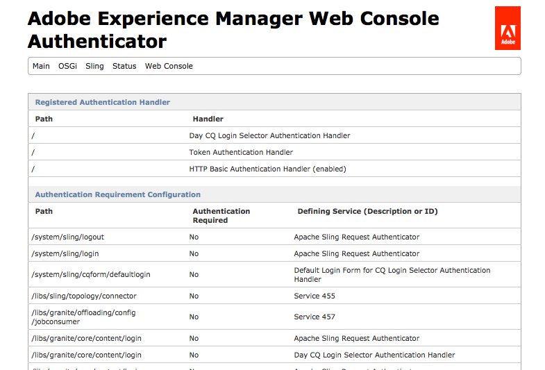

# Single Sign On {#single-sign-on}

Single Sign On (SSO) allows a user to access multiple systems after providing authentication credentials (such as a user name and password) once. A separate system (known as the trusted authenticator) performs the authentication and provides Experience Manager with the user credentials. Experience Manager checks and enforces the access permissions for the user (that is, determines which resources the user is allowed to access).

The SSO Authentication Handler service ( `com.adobe.granite.auth.sso.impl.SsoAuthenticationHandler`) processes the authentication results that the trusted authenticator provides. The SSO Authentication Handler searches for an SSO Identifier (SSID) as the value of a special attribute in the following locations in this order:

1. Request Headers
1. Cookies
1. Request Parameters

When a value is found, the search is finished and this value is used.

Configure the following two services to recognize the name of the attribute that stores the SSID :

* The login module.
* The SSO Authentication service.

Specify the same attribute name for both services. The attribute is included in the `SimpleCredentials` that is provided to `Repository.login`. The value of the attribute is irrelevant and ignored, the mere presence of it is important and verified.

## Configuring SSO {#configuring-sso}

To configure SSO for a AEM instance, you configure the [SSO Authentication Handler](/help/sites-deploying/osgi-configuration-settings.md#adobegranitessoauthenticationhandler):

1. When working with AEM, there are several methods of managing the configuration settings for such services; see [Configuring OSGi](/help/sites-deploying/configuring-osgi.md) for more details and the recommended practices.

   For example, for NTLM set:

    * **Path:** as required; for example, `/`
    * **Header Names**: `LOGON_USER`
    * **ID Format**: `^<DOMAIN>\\(.+)$`

      Where `<*DOMAIN*>` is replaced by the name of your own domain.

   For CoSign:

    * **Path:** as required; for example, `/`
    * **Header Names**: remote_user
    * **ID Format:** AsIs

   For SiteMinder:

    * **Path:** as required; for example, `/`
    * **Header Names:** SM_USER
    * **ID Format**: AsIs

1. Confirm that Single Sign On is working as required; including authorization.

>[!CAUTION]
>
>Make sure that users cannot access AEM directly if SSO is configured.
>
>By requiring users to go through a web server that runs your SSO system's agent, it is ensured that no user can directly send a header, cookie, or parameter that will lead the user to be trusted by AEM, as the agent will filter such information if sent from the outside.
>
>Any user who can directly access your AEM instance without going through the web server will be able to act as any user by sending the header, cookie, or parameter if the names are known.
>
>Also make sure that of headers, cookies, and request parameter names, you only configure the one that is required for your SSO setup.
>

>[!NOTE]
>
>Single Sign On is often used with [LDAP](/help/sites-administering/ldap-config.md).

>[!NOTE]
>
>If you are also using the [Dispatcher](https://experienceleague.adobe.com/docs/experience-manager-dispatcher/using/dispatcher.html) with the Microsoft&reg; Internet Information Server (IIS), then additional configuration is required in:
>
>* `disp_iis.ini`
>* IIS
>
>In `disp_iis.ini` set:
>(see [installing the Dispatcher with the Microsoft&reg; Internet Information Server](https://experienceleague.adobe.com/docs/experience-manager-dispatcher/using/getting-started/dispatcher-install.html#microsoft-internet-information-server) for full details)
>
>* `servervariables=1` (forwards IIS server variables as request headers to the remote instance)
>* `replaceauthorization=1` (replaces any header named "Authorization" other than "Basic" with its "Basic" equivalent)
>
>In IIS:
>
>* disable **Anonymous access**
>
>* enable **Integrated Windows authentication**
>

You can see which authentication handler is being applied to any section of the content tree by using the **Authenticator** option of the Felix Console; for example:

`http://localhost:4502/system/console/slingauth`

The handler that best matches the path is queried first. For example, if you configure handler-A for the path `/` and handler-B for the path `/content`, then a request to `/content/mypage.html` will query handler-B first.



### Example {#example}

For a cookie request (using the URL `http://localhost:4502/libs/wcm/content/siteadmin.html`):

```xml
GET /libs/cq/core/content/welcome.html HTTP/1.1
Host: localhost:4502
Cookie: TestCookie=admin
```

Using the following configuration:

* **Path**: `/`

* **Header Names**: `TestHeader`

* **Cookie Names**: `TestCookie`

* **Parameter Names**: `TestParameter`

* **ID Format**: `AsIs`

The response would be:

```xml
HTTP/1.1 200 OK
Connection: Keep-Alive
Server: Day-Servlet-Engine/4.1.24
Content-Type: text/html;charset=utf-8
Date: Thu, 23 Aug 2012 09:58:39 GMT
Transfer-Encoding: chunked

<!DOCTYPE HTML PUBLIC "-//W3C//DTD HTML 4.01//EN" "https://www.w3.org/TR/html4/strict.dtd">
<html>
<head>
    <meta http-equiv="content-type" content="text/html; charset=UTF-8">
    <title>Welcome to Adobe&reg; CQ5</title>
....
```

This also works if you request:
`http://localhost:4502/libs/cq/core/content/welcome.html?TestParameter=admin`

Or you can use the following curl command to send the `TestHeader` header to `admin:`
`curl -D - -H "TestHeader: admin" http://localhost:4502/libs/cq/core/content/welcome.html`

>[!NOTE]
>
>When using the request parameter in a browser, you only see some of the HTML - without CSS. This is because all the requests from the HTML are made without the request parameter.

## Removing AEM Sign Out Links {#removing-aem-sign-out-links}

When using SSO, sign in and sign out are handled externally, so that AEM's own sign-out links are no longer applicable and should be removed.

The sign-out link on the welcome screen can be removed using the following steps.

1. Overlay `/libs/cq/core/components/welcome/welcome.jsp` to `/apps/cq/core/components/welcome/welcome.jsp`
1. remove the following part from the jsp.

   `<a href="#" onclick="signout('<%= request.getContextPath() %>');" class="signout"><%= i18n.get("sign out", "welcome screen") %>`

To remove the sign-out link that is available in the user's personal menu in the top-right corner, follow these steps:

1. Overlay `/libs/cq/ui/widgets/source/widgets/UserInfo.js` to `/apps/cq/ui/widgets/source/widgets/UserInfo.js`

1. Remove the following part from the file:

   ```
   menu.addMenuItem({
       "text":CQ.I18n.getMessage("Sign out"),
       "cls": "cq-userinfo-logout",
       "handler": this.logout
   });
   menu.addSeparator();
   ```
