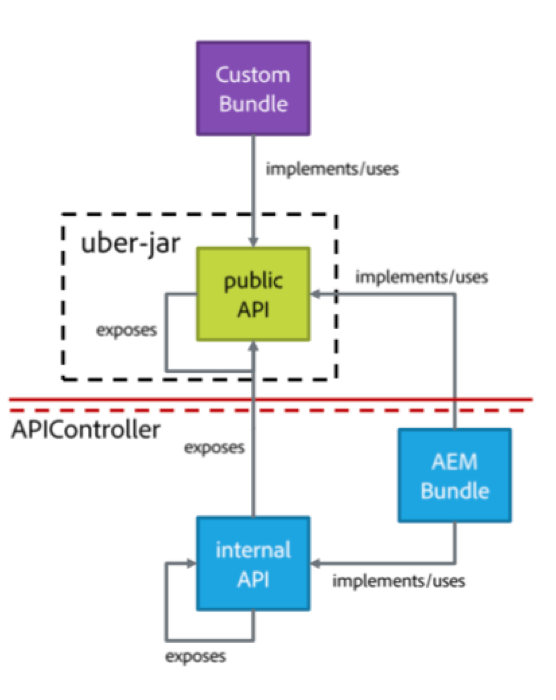
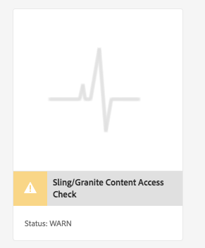
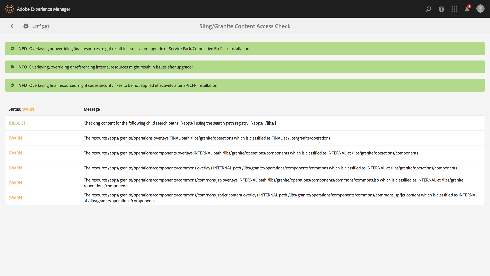
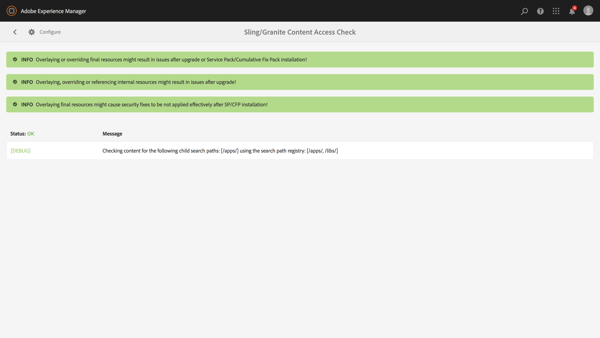

# Sustainable Upgrades{#sustainable-upgrades}

## Customization Framework {#customization-framework}

### Architecture (Functional / Infrastructure / Content / Application)  {#architecture-functional-infrastructure-content-application}

The Customization Framework feature is designed to help reduce the violations in non-extensible areas of the code (like APIS) or content (like overlays) that are not upgrade-friendly.

There are two components of the customization framework: the **API Surface** and the **Content Classification**.

#### API Surface {#api-surface}

In previous releases of Adobe Experience Manager (AEM), many APIs were exposed by way of the Uber Jar. Some of these APIs were not intended for use by customers, but were exposed to support AEM functionality across bundles. Going forward, the Java&trade; APIs are marked as Public or Private to indicate to customers which APIs are safe to use in the context of upgrades. Other specifics include:

* Java&trade; APIs marked as `Public` can be used and referenced by custom implementation bundles.

* The Public APIs are backwards compatible with the installation of a compatibility package.
* The compatibility package contains a compatibility Uber JAR to ensure backwards compatibility
* Java&trade; APIs marked as `Private` are intended to only be used by AEM internal bundles, not by custom bundles.

>[!NOTE]
>
>The concept of `Private` and `Public` in this context should not be confused with Java&trade; notions of public and private classes.

#### Content Classifications {#content-classifications}

AEM has long used the principal of overlays and Sling Resource Merger to allow customers to extend and customize AEM functionality. Predefined functionality that powers the AEM consoles and UI are stored in **/libs**. Customers are never to modify anything beneath **/libs** but could add additional content beneath **/apps** to overlay and extend the functionality defined in **/libs** (See Developing with Overlays for more information). This still caused numerous issues when upgrading AEM as the content in **/libs** might change causing the overlay functionality to break in unexpected ways. Customers could also extend AEM components through inheritance by way of `sling:resourceSuperType`, or simply reference a component in **/libs** directly by way of sling:resourceType. Similar upgrade issues could occur with reference and override use cases.

To make it safer and easier for customers to understand what areas of **/libs** are safe to use and overlay the content in **/libs** has been classified with the following mixins:

* **Public (granite:PublicArea)** - Defines a node as public so that it can be overlaid, inherited ( `sling:resourceSuperType`) or used directly ( `sling:resourceType`). Nodes beneath /libs marked as Public are safe to upgrade with the addition of a Compatibility Package. In general, customers should only use nodes marked as Public.

* **Abstract (granite:AbstractArea)** - Defines a node as abstract. Nodes can be overlaid or inherited ( `sling:resourceSupertype`) but not used directly ( `sling:resourceType`).

* **Final (granite:FinalArea)** - Defines a node as final. Nodes classified as final ideally should not be overlaid or inherited. Final nodes can be used directly by way of `sling:resourceType`. Subnodes under final node are considered internal by default.

* ***Internal (granite:InternalArea)*** *- *Defines a node as internal. Nodes classified as internal ideally should not be overlaid, inherited, or used directly. These nodes are meant only for internal functionality of AEM

* **No Annotation** - Nodes inherit classification based on the tree hierarchy. The / root is by default Public. **Nodes with a parent classified as Internal or Final are also to be treated as Internal.**

>[!NOTE]
>
>These policies are only enforced against Sling search path-based mechanisms. Other areas of **/libs** like a client-side library may be marked as `Internal`, but could still be used with standard clientlib inclusion. It is important that a customer continues to respect the Internal classification in these cases.

#### CRXDE Lite Content Type Indicators {#crxde-lite-content-type-indicators}

Mixins applied in CRXDE Lite show content nodes and trees that are marked as `INTERNAL` as being dimmed (grayed out). For `FINAL`, only the icon is dimmed. The children of these nodes also appear dimmed. The Overlay Node functionality is disabled in both these cases.

**Public**

**Final**

**Internal**

**Content Health Check**

>[!NOTE]
>
>As of AEM 6.5, Adobe recommends using the Pattern Detector to detect content access violations. Pattern detector reports are more detailed, detect more issues, and reduce the probability of false positives.
>
>For more information, see [Assessing the Upgrade Complexity with the Pattern Detector](/help/sites-deploying/pattern-detector.md).

AEM 6.5 ships with a health check to alert customers if overlaid or referenced content is used in a way inconsistent with the content classification.

The** Sling/Granite Content Access Check** is a new health check that monitors the repository to see if customer code is improperly accessing protected nodes in AEM.

This scans **/apps** and typically takes several seconds to complete.

To access this new health check, do the following:

1. From the AEM Home Screen, navigate to **Tools > Operations > Health Reports**
1. Click **Sling/Granite Content Access Check**.

   

After the scan is complete, a list of warnings appears, notifying an end user of the protected node that is being improperly referenced:

After fixing the violations, it returns to green state:

The health check displays information collected by a background service that asynchronously checks whenever an overlay or resource type is used across all Sling search paths. If content mixins are used incorrectly, it reports a violation.
