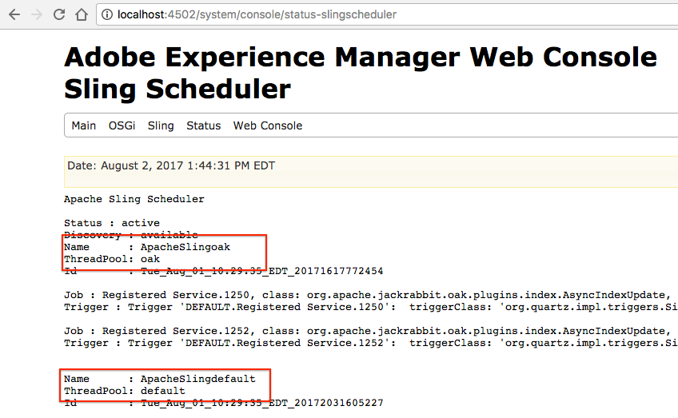
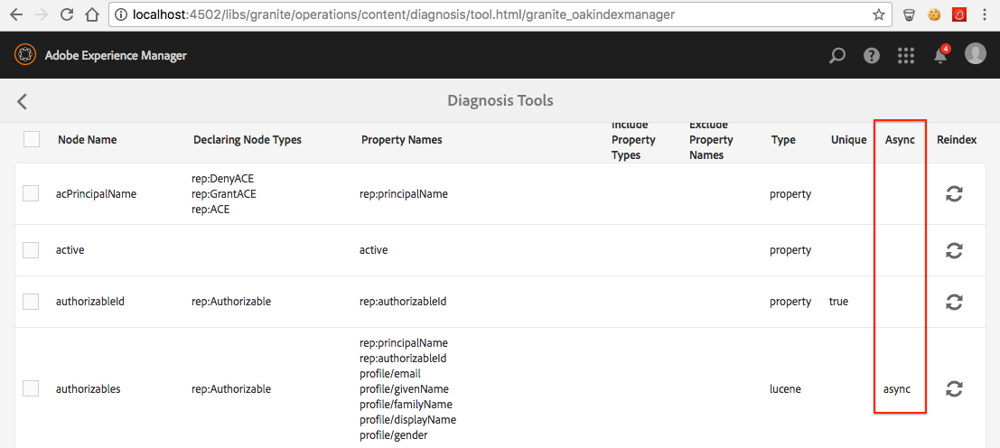

# Troubleshooting Oak Indexes{#troubleshooting-oak-indexes}

## Slow Reindexing  {#slow-re-indexing}

AEM's internal reindexing process collects repository data and stores it in Oak indexes to support performant querying of content. In exceptional circumstances, the process can become slow or even stuck. This page acts as a troubleshooting guide to help identify if the indexing is slow, find the cause, and resolve the issue.

It is important to distinguish between reindexing that takes an inappropriately long amount of time, and reindexing that takes a long amount of time because it's indexing vast quantities of content. For example, the time it takes to index content scales with the amount of content, so large production repositories take longer to reindex than small development repositories.

See the [Best Practices on Queries and Indexing](/help/sites-deploying/best-practices-for-queries-and-indexing.md) for additional information on when and how to reindex content.

## Initial Detection {#initial-detection}

Initial detection slow indexing requires reviewing the `IndexStats` JMX MBeans. On the affected AEM instance, do the following:

1. Open the Web Console and click the JMX tab or go to https://&lt;host&gt;:&lt;port&gt;/system/console/jmx (for example, [http://localhost:4502/system/console/jmx](http://localhost:4502/system/console/jmx)).
1. Navigate to the `IndexStats` Mbeans.
1. Open the `IndexStats` MBeans for " `async`" and " `fulltext-async`".

1. For both MBeans, check if the **Done** timestamp and **LastIndexTime** timestamp are less than 45 mins from the current time.

1. For either MBean, if the time value (**Done** or **LastIndexedTime**) is greater than 45 mins from the current time, then the index job is either failing or taking too long. This problem causes the asynchronous indexes to be stale.

## Indexing is paused after a forced shutdown {#indexing-is-paused-after-a-forced-shutdown}

A forced shutdown results in AEM suspending asynchronous indexing for up to 30 minutes after the restart. And, it typically requires another 15 minutes to complete the first reindexing pass, for a total of about 45 minutes (tying back to the [Initial Detection](/help/sites-deploying/troubleshooting-oak-indexes.md#initial-detection) timeframe of 45 minutes). If indexing is paused after a forced shutdown:

1. First, determine if the AEM instance was shut down in a forced manner (the AEM process was forcefully killed, or a power failure occurred) and later restarted.

    * [AEM logging](/help/sites-deploying/configure-logging.md) can be reviewed for this purpose.

1. If the forced shutdown occurred, upon restart, AEM automatically suspends reindexing for up to 30 minutes.
1. Wait approximately 45 minutes for AEM to resume normal asynchronous indexing operations.

## Thread pool overloaded {#thread-pool-overloaded}

>[!NOTE]
>
>For AEM 6.1, ensure that [AEM 6.1 CFP 11](https://experienceleague.adobe.com/docs/experience-manager-release-information/aem-release-updates/previous-updates/aem-previous-versions.html?lang=en) is installed.

In exceptional circumstances, the thread pool used to manage asynchronous indexing may become overloaded. To isolate the indexing process, a thread pool can be configured to prevent other AEM work from interfering with Oak's ability to index content in a timely manner. In such cases, do the following:

1. Define a new, isolated thread pool for the Apache Sling Scheduler to use for asynchronous indexing:

    * On the affected AEM instance, navigate to AEM OSGi Web Console&gt;OSGi&gt;Configuration&gt;Apache Sling Scheduler or go to https://&lt;host&gt;:&lt;port&gt;/system/console/configMgr (for example, [http://localhost:4502/system/console/configMgr](http://localhost:4502/system/console/configMgr))
    * Add an entry to the "Allowed Thread Pools" field with the value of "oak".
    * To save the changes, click **Save** in the bottom-right.

   

1. Verify that the new Apache Sling Scheduler thread pool is registered and displays in the Apache Sling Scheduler Status web console.

    * Navigate to the AEM OSGi Web console&gt;Status&gt;Sling Scheduler or go to https://&lt;host&gt;:&lt;port&gt;/system/console/status-slingscheduler (for example, [http://localhost:4502/system/console/status-slingscheduler](http://localhost:4502/system/console/status-slingscheduler))
    * Verify that the following pool entries exist:

        * ApacheSlingoak
        * ApacheSlingdefault

   

## Observation queue is full {#observation-queue-is-full}

If too many changes and commits are made to the repository in a short amount of time, indexing can be delayed due to a full observation queue. First, determine if the observation queue is full:

1. Go to the Web Console and click the JMX tab or go to https://&lt;host&gt;:&lt;port&gt;/system/console/jmx (for example, [http://localhost:4502/system/console/jmx](http://localhost:4502/system/console/jmx))
1. Open the Oak Repository Statistics MBean and determine if any `ObservationQueueMaxLength` value is greater than 10,000.

    * In normal operations, this maximum value must always eventually reduce to zero (especially in the `per second` section) so verify that the `ObservationQueueMaxLength`'s seconds metrics are 0.
    * If the values are 10,000 or more, and increase steadily, it indicates at least one (possibly more) queue cannot be processed as fast as new changes (commits) occur.
    * Each observation queue has a limit (10,000 by default) and if the queue hits that limit, its processing degrades.
    * When using MongoMK, as queue lengths grow large, internal Oak cache performance degrades. This correlation can be seen in an increased `missRate` for the `DocChildren` cache in the `Consolidated Cache` statistics MBean.

1. To avoid exceeding acceptable observation queue limits, it is recommended to:

    * Lower the constant rate of commits. Short spikes in commits are acceptable, but the constant rate should be reduced.
    * Increase the size of the `DiffCache` as described in [Performance tuning tips > Mongo Storage Tuning > Document cache size](/help/sites-deploying/configuring-performance.md).

## Identifying and remediating a stuck reindexing process {#identifying-and-remediating-a-stuck-re-indexing-process}

Reindexing can be considered "completely stuck" under two conditions:

* Reindexing is slow, to the point where no significant progress is reported in log files regarding the number of nodes traversed.

    * For example, if there are no messages over the course of an hour, or if progress is so slow that it takes a week or more to finish.

* Reindexing is stuck in an endless loop if repeated exceptions appear in the log files (for example, `OutOfMemoryException`) in the indexing thread. The repetition of one or more same exceptions in the log, indicates Oak attempts to index the same thing repeatedly, but fails on the same issue.

To identify and fix a stuck reindexing process, do the following:

1. To identify the cause of stuck indexing, the following information must be collected:

    * Collect 5 minutes of thread dump, one thread dump every 2 seconds.
    * [Set DEBUG level and logs for the appenders](/help/sites-deploying/configure-logging.md).

        * *org.apache.jackrabbit.oak.plugins.index.AsyncIndexUpdate*
        * *org.apache.jackrabbit.oak.plugins.index.IndexUpdate*

    * Collect data from the async `IndexStats` MBean:

        * Navigate to AEM OSGi Web Console&gt;Main&gt;JMX&gt;IndexStat&gt;async

          or go to [http://localhost:4502/system/console/jmx/org.apache.jackrabbit.oak%3Aname%3Dasync%2Ctype%3DIndexStats](http://localhost:4502/system/console/jmx/org.apache.jackrabbit.oak%3Aname%3Dasync%2Ctype%3DIndexStats)

    * Use [oak-run.jar's console mode](https://github.com/apache/jackrabbit-oak/tree/trunk/oak-run) to collect the details of what exists under the * `/:async`* node.
    * Collect a list of repository checkpoints by using the `CheckpointManager` MBean:

        * AEM OSGi Web Console&gt;Main&gt;JMX&gt;CheckpointManager&gt;listCheckpoints()

          or go to [http://localhost:4502/system/console/jmx/org.apache.jackrabbit.oak%3Aname%3DSegment+node+store+checkpoint+management%2Ctype%3DCheckpointManager](http://localhost:4502/system/console/jmx/org.apache.jackrabbit.oak%3Aname%3DSegment+node+store+checkpoint+management%2Ctype%3DCheckpointManager)

1. After collecting all the information outlined in Step 1, restart AEM.

    * Restarting AEM may solve the problem if there is a high concurrent load (observation queue overflow or something similar).
    * If a restart does not solve the problem, open an issue with [Adobe Customer Care](https://experienceleague.adobe.com/?support-solution=General&support-tab=home#support) and provide all the information collected in Step 1.

## Safely aborting asynchronous reindexing {#safely-aborting-asynchronous-re-indexing}

Reindexing can be safely aborted (stopped before it is completed) via the `async, async-reindex`and f `ulltext-async` indexing lanes ( `IndexStats` Mbean). For more information, also see the Apache Oak documentation on [How to Abort Reindexing](https://jackrabbit.apache.org/oak/docs/query/indexing.html#abort-reindex). Also, consider the following:

* The reindexing of Lucene and Lucene Property Indexes can be aborted as they are naturally asynchronous.
* The reindexing of Oak Property Indexes can only be aborted if reindexing was initiated via the `PropertyIndexAsyncReindexMBean`.

To safely abort reindexing, follow these steps:

1. Identify the IndexStats MBean that controls the reindexing lane that must be stopped.

    * Navigate to the appropriate IndexStats MBean via the JMX console by going to either AEM OSGi Web Console&gt;Main&gt;JMX or https://&lt;host&gt;:&lt;port&gt;/system/console/jmx (for example, [http://localhost:4502/system/console/jmx](http://localhost:4502/system/console/jmx))
    * Open the IndexStats MBean based on the reindexing lane that you wish to stop ( `async`, `async-reindex`, or `fulltext-async`)

        * To identify the appropriate lane and thus the IndexStats MBean instance, look at the Oak Indexes "async" property. The "async" property contains the lane name: `async`, `async-reindex`, or `fulltext-async`.
        * The lane is also available by accessing AEM's Index Manager in the "Async" column. To access the Index manager, navigate to Operations&gt;Diagnosis&gt;Index Manager.

   

1. Invoke the `abortAndPause()` command on the appropriate `IndexStats` MBean.
1. Mark the Oak index definition appropriately to prevent resuming reindexing when the indexing lane resumes.

    * When reindexing an **existing** index, set the reindex property to false

        * `/oak:index/someExistingIndex@reindex=false`

    * Or else, for a **new** index, either:

        * Set the type property to disabled

            * `/oak:index/someNewIndex@type=disabled`

        * or remove the index definition entirely

   Commit the changes to the repository when complete.

1. Finally, resume asynchronous indexing on the aborted indexing lane.

    * In the `IndexStats` MBean that issued the `abortAndPause()` command in Step 2, invoke the `resume()`command.

## Preventing slow reindexing {#preventing-slow-re-indexing}

It is best to reindex during quiet periods (for example, not during a large content ingest), and ideally during maintenance windows when AEM's load is known and controlled. Also, ensure that the reindexing does not take place during other maintenance activities.
