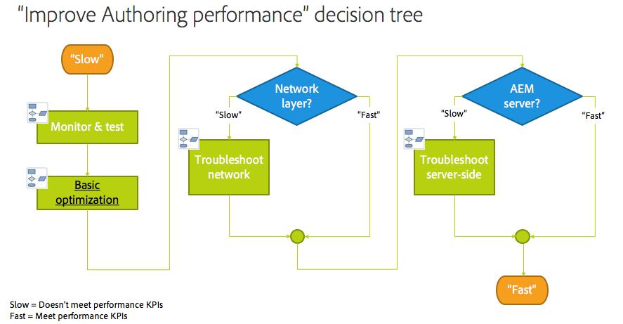
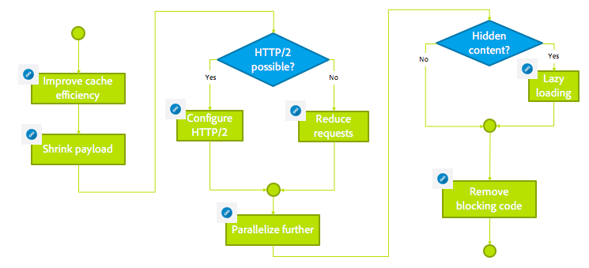

# Troubleshooting installation issues with AEM{#troubleshooting}

This section includes detailed information on logs available to help you troubleshoot and also includes information on some of the problems you might encounter with AEM.

## Troubleshoot Author Performance {#troubleshoot-author-performance}

Analyzing slow performance on Authoring instance can become complex. As first step it is required to figure out on which level of the technology stack the performance is decreasing.

The following decision tree provides guidance to narrow down the bottleneck.

## Basic Optimization {#basic-optimization}

## Configuring log files and audit logs {#configuring-log-files-and-audit-logs}

AEM records detailed logs that you might want to configure to troubleshoot installation issues. For information, see the [Working with Audit Records and Log Files](/help/sites-deploying/monitoring-and-maintaining.md#working-with-audit-records-and-log-files) section.

## Using the Verbose Option {#using-the-verbose-option}

When you start AEM WCM, you can add the -v (verbose) option to the command line as in: java -jar cq-wcm-quickstart-&lt;version&gt;.jar -v.

The verbose option displays some of the Quickstart log output on the console, so it can be used for troubleshooting.

## Common Installation Issues {#common-installation-issues}

The following section describes some installation issues and their solutions.

### Double-clicking the Quickstart jar has no effect or opens the jar file with another program (for example, archive manager) {#double-clicking-the-quickstart-jar-does-not-have-any-effect-or-opens-the-jar-file-with-another-program-for-example-archive-manager}

This issue usually indicates a problem with the way your operating system's desktop environment is configured to open files with extension .jar. It may also indicate that you do not have Java&trade; installed, or that you are using an unsupported version of Java&trade;.

As jar files use the ubiquitous ZIP format, some of the archiving programs may automatically configure the desktop to open jar files as archive files.

To troubleshoot, do the following:

* Double check that you have at least Java&trade; version 1.6 installed.
* Try a context menu (usually right-mouse click) on the AEM WCM Quickstart, and select "Open With...."
* Check if Java&trade; or Sun Java&trade; is listed, and try to run AEM WCM with it. If you have multiple Java&trade; versions installed, select the supported one.

  If you succeed with this step, and your operating system offers an option to always use the selected program to run the .jar files, select it. Double-clicking should work from now on.

* Sometimes reinstalling the supported Java&trade; version helps restore the correct association.
* You can always run CRX using the command line or start/stop scripts as described earlier in this document.

### My application running on CRX throws out-of-memory errors {#my-application-running-on-crx-throws-out-of-memory-errors}

>[!NOTE]
>
>See also [Analyze Memory Problems](https://experienceleague.adobe.com/docs/experience-cloud-kcs/kbarticles/KA-17482.html?lang=en).

CRX itself has a low memory footprint. If the application running within CRX has bigger memory requirements or requests memory-heavy operations (for example, large transactions), the JVM instance where CRX runs must be started with appropriate memory settings.

Use Java&trade; command options to define memory settings of the JVM (for example, java -Xmx512m -jar crx&ast;.jar to set heapsize to 512 MB).

Specify the memory setting option while starting AEM WCM from the command line. The AEM WCM start/stop scripts or custom scripts for managing AEM WCM startup can also be modified to define the required memory settings.

If you have already defined your heapsize to 512 MB, you may want to analyze the memory issue further by creating a heap dump:

To automatically create a heap dump when running out of memory, use the following command:

java -Xmx256m -XX:+HeapDumpOnOutOfMemoryError -jar &ast;.jar

This method generates a heap dump file (**java_...hprof**) whenever the process runs out of memory. The process may continue to run after the heap dump was generated. Usually, one heap dump file is enough to analyze the problem.

### The AEM Welcome screen does not display in the browser after double-clicking AEM Quickstart {#the-aem-welcome-screen-does-not-display-in-the-browser-after-double-clicking-aem-quickstart}

In certain situations, the AEM WCM Welcome screens does not automatically display even though the repository itself is successfully running. This issue may depend on operating system setup, browser configuration, or similar factors.

The usual symptom is that the AEM WCM Quickstart window displays "AEM WCM starting up, waiting for server startup...." If that message displays for a relatively long time, enter the AEM WCM URL into the browser window manually, using the default 4502 port, or the port on which the instance is running: http://localhost:4502/.

Also, logs may reveal the reason for the browser not starting.

Sometimes, the AEM WCM Quickstart window has the message "AEM WCM running on http://localhost:port/" and the browser does not start automatically. In this case, click the URL in the AEM WCM Quickstart window (it is a hyperlink) or manually enter the URL in the browser.

If everything else fails, check the logs to find out what has happened.

### The Website Does Not Load or Fails Intermittently with Java&trade; 11 {#the-website-does-not-load-or-fails-intermittently-with-java11}

There is a known issue with AEM 6.5 running on Java&trade; 11 where the website might not load or fail intermittently.

If this issue occurs, do the following:

1. Open the `sling.properties` file under the `crx-quickstart/conf/` folder
1. Locate the following line:
  
   `org.osgi.framework.bootdelegation=sun.,com.sun.`

1. Replace it with the following:

   `org.osgi.framework.bootdelegation=sun.,com.sun.,jdk.internal.reflect,jdk.internal.reflect.*`

1. Restart the instance.

## Troubleshooting Installations with an Application Server {#troubleshooting-installations-with-an-application-server}

### Page Not Found returned when requesting a geometrixx-outdoor page {#page-not-found-returned-when-requesting-a-geometrixx-outdoor-page}

**Applies to WebLogic 10.3.5 and JBoss&reg; 5.1**

When a request to geometrixx-outdoors/en page returns a 404 (Page Not Found), you may recheck that you have set the additional sling property in the sling.properties file needed for these specific Application Servers.

See in the *Deploy AEM web application* steps for the details.

### Response header size can be greater than 4 KB {#response-header-size-can-be-greater-than-kb}

502 errors can indicate that the web server cannot handle the size of the AEM HTTP response header. AEM can generate HTTP response headers that include cookies of size greater than 4 KB. Ensure that your servlet container is configured so that the maximum response header size can exceed 4 KB.

For example, for Tomcat 7.0, the maxHttpHeaderSize attribute of the [HTTP Connector](https://tomcat.apache.org/tomcat-7.0-doc/config/http.html) controls limitations on header size.

## Uninstalling Adobe Experience Manager {#uninstalling-adobe-experience-manager}

Because AEM installs into a single directory, there is no need for an uninstall utility. Uninstalling can be as simple as deleting the entire installation directory, although how you uninstall AEM depends on what you want to achieve and what persistent storage you use.

If persistent storage is embedded in the installation directory, for example, in the default TarPM installation, deleting folders removes data as well.

>[!NOTE]
>
>Adobe recommends that you back up your repository before deleting AEM. If you delete the entire &lt;cq-installation-directory&gt;, you also delete the repository. To keep the repository data before deleting, move or copy the &lt;cq-installation-directory&gt;/crx-quickstart/repository folder somewhere else before deleting the other folders.

If your installation of AEM uses external storage, for example, a database server, removing folder does not remove the data automatically, but it does remove the storage configuration, which makes restoring the JCR content difficult.

### JSP files are not compiled on JBoss&reg; {#jsp-files-are-not-compiled-on-jboss}

If you install or update JSP files to Experience Manager on JBoss&reg; and the corresponding servlets are not compiled, ensure the JBoss&reg; JSP compiler is correctly configured. For information, see the
[JSP Compilation Issues in JBoss&reg;](https://helpx.adobe.com/experience-manager/kb/jsps-dont-compile-jboss.html) article.
