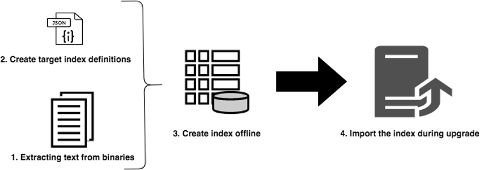
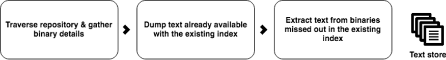
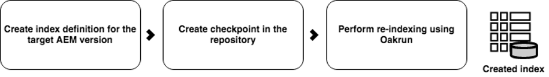

# Using Offline Reindexing To Reduce Downtime During an Upgrade {#offline-reindexing-to-reduce-downtime-during-upgrades}

## Introduction {#introduction}

One of the key challenges in upgrading Adobe Experience Manager is the downtime associated with the author environment when an in-place upgrade is performed. Content authors will not be able to access the environment during an upgrade. Therefore it is desirable to minimize the amount of time it takes to perform the upgrade. For large repositories, especially AEM Assets projects, which typically have large data stores and a high level of asset uploads per hour, reindexing of Oak indexes takes a significant percentage of the upgrade time.

This section describes how to use the Oak-run tool to reindex the repository **before** performing the upgrade, thus reducing the amount of downtime during the actual upgrade. The steps presented can be applied to [Lucene](https://jackrabbit.apache.org/oak/docs/query/lucene.html) indexes for versions AEM 6.4 and higher.

## Overview {#overview}

New versions of the AEM introduce changes to Oak index definitions as the feature set is expanded. Changes to the Oak indexes force reindexing when upgrading the AEM instance. Reindexing is expensive for asset deployments as text in assets (for example, text in pdf file) is extracted and indexed. With MongoMK repositories, data is persisted over the network, further increasing the amount of time reindexing takes.

The problem most customers are facing during an upgrade is reducing the downtime window. The solution is to **skip** the reindexing activity during the upgrade. This can be achieved by creating the new indeces **prior** to performing the upgrade, then simply importing them during the upgrade.

## Approach {#approach}



The idea is to create the index before the upgrade, against the index definitions of the target AEM version using the [Oak-run](/help/sites-deploying/indexing-via-the-oak-run-jar.md) tool. The above diagram shows the offline reindexing approach.

In addition, this is the order of the steps as described in the approach:

1. Text from binaries is extracted first
2. Target index definitions are created
3. Offline indexes are created
4. The indexes are then imported during the upgrade process

### Text Extraction {#text-extraction}

To enable full indexing in AEM, text from binaries such as PDF is extracted and added to the index. This is usually an expensive step in the indexing process. Text extraction is an optimization step advocated especially for reindexing asset repositories as they stores large number of binaries.



Text from binaries stored in the system can be extracted using thge oak-run tool with the tika library. A clone of the production systems can be taken before upgrade and can be used for this text extraction process. This process then creates the text store, by going through the following steps:

**1. Traverse the repository and gather the details of binaries**

This step produces a CSV file containing a tuple of binaries, containing a path and a blob id.

Execute the below command from the directory where you wish to create the index from. The example below assumes the repository home directory. 

```
java java -jar oak-run.jar tika <nodestore path> --fds-path <datastore path> --data-file text-extraction/oak-binary-stats.csv --generate
```

Where `nodestore path` is the `mongo_ur` or `crx-quickstart/repository/segmentstore/`

Use the `--fake-ds-path=temp` parameter instead of `–fds-path` to speed up the process.

**2. Reuse the binary text store available in the existing index**

Dump the index data from the existing system and extract the text store.

You can dump the existing index data using the following command:

```
java -jar oak-run.jar index <nodestore path> --fds-path=<datastore path> --index-dump
```

Where `nodestore path` is the `mongo_ur` or `crx-quickstart/repository/segmentstore/`

Then, use the above index dump to populate the store:

```
java -jar oak-run.jar tika --data-file text-extraction/oak-binary-stats.csv --store-path text-extraction/store --index-dir ./indexing-result/index-dumps/<oak-index-name>/data populate
```

Where `oak-index-name` is the name of the full text index, for example, "lucene".

**3. Run the text extraction process using the tika library for the binaries missed out in the above step**

```
java -cp oak-run.jar:tika-app-1.21.jar org.apache.jackrabbit.oak.run.Main tika --data-file text-extraction/oak-binary-stats.csv --store-path text-extraction/store --fds-path <datastore path> extract
```

Where `datastore path` is the path to the binary data store.

The created text store can be updated and reused for reindexing scenarios in the future.

For more details around the text extraction process, see the [Oak-run documentation](https://jackrabbit.apache.org/oak/docs/query/pre-extract-text.html).

### Offline Reindexing {#offline-reindexing}



Create the Lucene index offline before the upgrade. If using MongoMK, it is recommended to run it directly on one of the MongoMk nodes, as this avoids network overhead.

To create the index offline, follow the below steps:

**1. Generate Oak Lucene index definitions for the target AEM version**

Dump the existing index definitions. Index definitions which underwent change were generated using the Adobe Granite repository bundle of the target AEM version and oak-run.

To dump the index definition from the **source** AEM instance, run this command: 

>[!NOTE]
>
>For more details on dumping index definitions, consult the [Oak documentation](https://jackrabbit.apache.org/oak/docs/query/oak-run-indexing.html#async-index-data).

```
java -jar oak-run.jar index --fds-path <datastore path> <nodestore path> --index-definitions
```

Where `datastore path` and `nodestore path` are from the **source** AEM instance.

Then, generate index definitions from the **target** AEM version using target version's Granite repository bundle.

```
java -cp oak-run.jar:bundle-com.adobe.granite.repository.jar org.apache.jackrabbit.oak.index.IndexDefinitionUpdater --in indexing-definitions_source.json --out merge-index-definitions_target.json --initializer com.adobe.granite.repository.impl.GraniteContent
```

>[!NOTE]
>
>The above index definition creation process is supported only from the `oak-run-1.12.0` version onwards. Targeting is done using the Granite repository bundle `com.adobe.granite.repository-x.x.xx.jar`.

The above steps create a JSON file called `merge-index-definitions_target.json` which is the index definition.

**2. Create a checkpoint in the repository**

Create a checkpoint in the production **source** AEM instance with a long lifetime. This should be done before cloning the repository.

Via JMX console located at `http://serveraddress:serverport/system/console/jmx`, go to `CheckpointMBean` and create a checkpoint with a long enough lifetime (for example, 200 days). For this, invoke `CheckpointMBean#createCheckpoint` with `17280000000` as the argument for the lifetime duration in milliseconds.

Once this is done, copy the newly created checkpoint id and validate the lifetime using JMX `CheckpointMBean#listCheckpoints`.

>[!NOTE]
>
>This checkpoint will be deleted when the index is imported later.

For more details, consult [checkpoint creation](https://jackrabbit.apache.org/oak/docs/query/oak-run-indexing.html#out-of-band-create-checkpoint) from the Oak documentation.

**Perform offline indexing for the generated index definitions**

Lucene reindexing can be done offline using oak-run. This process creates index data in the disk under `indexing-result/indexes`. It does **not** write to the repository and thus does not require stopping the running AEM instance. The created text store is fed into this process:

```
java -Doak.indexer.memLimitInMB=500 -jar oak-run.jar index <nodestore path> --reindex --doc-traversal-mode --checkpoint <checkpoint> --fds-path <datastore path> --index-definitions-file merge-index-definitions_target.json --pre-extracted-text-dir text-extraction/store

Sample <checkpoint> looks like r16c85700008-0-8
—fds-path: path to data store.
--pre-extracted-text-dir: Directory of pre-extracted text.
merge-index-definitions_target: JSON file having merged definitions for the target AEM instance. indexes in this file will be re-indexed.
```

Usage of the `--doc-traversal-mode` parameter is handy with MongoMK installations as it improves the reindex time significantly by spooling repository content into a local flat file. However, it requires additional disk space of double the size of the repository.

If there is MongoMK, this process can be accelerated if this step is executed in an instance closer to the MongoDB instance. If run on the same machine, network overhead can be avoided.

Additional technical details can be found in the [oak-run documentation for indexing](https://jackrabbit.apache.org/oak/docs/query/oak-run-indexing.html).

### Importing indexes {#importing-indexes}

With AEM 6.4 and newer versions, AEM has the built in capability to import indexes from disc on startup sequence. The folder `<repository>/indexing-result/indexes` is watched for the presence of index data during startup. You can copy the pre-created index into the above location during the [upgrade process](in-place-upgrade.md#performing-the-upgrade) before starting with the new version of the **target** AEM jar. AEM imports it into the repository and removes the corresponding checkpoint from the system. Thus a reindex is completely avoided.

## Additional Tips and Troubleshooting {#troubleshooting}

Below you will find some helpful tips and troubleshooting instructions.

### Reduce the Impact on the Live Production System {#reduce-the-impact-on-the-live-production-system}

It is recommended to clone the production system and create the offline index using the clone. This eliminates any potential impact on the production system. However, the checkpoint required for importing index needs to be present in the production system. Therefore creating a checkpoint before taking the clone is critical.

### Prepare a Runbook and Trial Run {#prepare-a-runbook-and-trial-run}

It is recommended to prepare a [runbook](https://experienceleague.adobe.com/docs/experience-manager-65/deploying/upgrading/upgrade-planning.html#building-the-upgrade-and-rollback-runbook) and perform a few trials before running the upgrade in production.

### Doc Traversal Mode With Offline Indexing {#doc-traversal-mode-with-offline-indexing}

Offline indexing requires multiple traversals of the entire repository. With MongoMK installations, the repository is accessed over the network impacting the performance of the indexing process. One option is to run the offline indexing process on the MongoDB replica itself which will eliminate the network overhead. Another option is usage of doc traversal mode.

Doc traversal mode can be applied by adding the command line parameter `—doc-traversal` to the oak-run command for offline indexing. This mode spools a copy of the entire repository in the local disk as a flat file and uses it to run the indexing.
