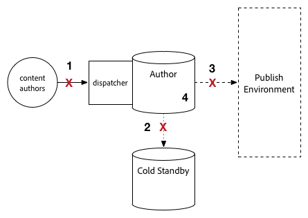
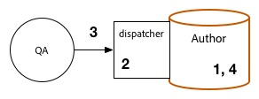
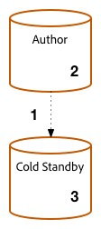
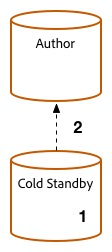
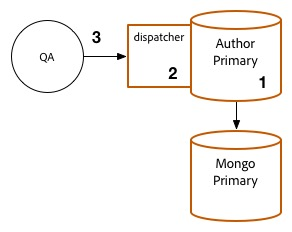
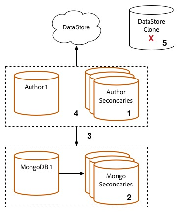
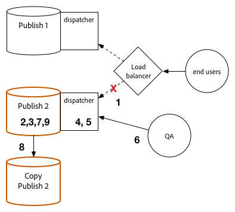
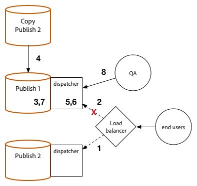
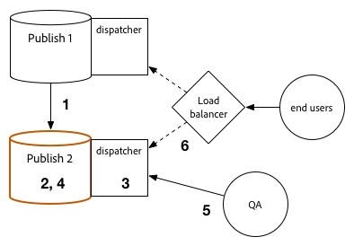
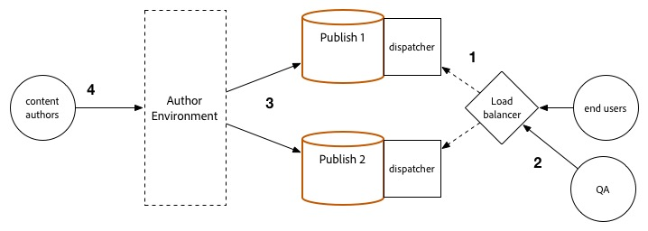

# Upgrade Procedure {#upgrade-procedure}

>[!NOTE]
>
>The upgrade requires downtime for the Author tier as most Adobe Experience Manager (AEM) upgrades are performed in-place. By following these best practices, you can minimize or eliminate Publish tier downtime.

When upgrading your AEM environments, you must consider the differences in approach between upgrading author environments or publish environments to minimize downtime for both you authors and end users. This page outlines the high-level procedure for upgrading an AEM topology currently running on a version of AEM 6.x. Because the process differs between author and publish tiers and Mongo and TarMK based deployments, each tier and microkernel has been listed in a separate section. When executing your deployment, Adobe recommends first upgrading your author environment, determining success, and then proceeding to the publish environments.

<!--
>[!IMPORTANT]
>
>The downtime during the upgrade can be significally reduced by indexing the repository before performing the upgrade. For more information, see [Using Offline Reindexing To Reduce Downtime During an Upgrade](/help/sites-deploying/upgrade-offline-reindexing.md)
-->

## TarMK Author Tier {#tarmk-author-tier}

### Starting Topology {#starting-topology}

The assumed topology for this section consists of an Author server running on TarMK with a Cold Standby. Replication occurs from the Author server to the TarMK publish farm. While not illustrated here, this approach can also be used for deployments that use offloading. Make sure to upgrade or rebuild the offloading instance on the new version after disabling replication agents on the Author instance and before re-enabling them.

### Upgrade Preparation {#upgrade-preparation}

1. Stop content authoring.

1. Stop the standby instance.

1. Disable replication agents on the author.

1. Run the [pre-upgrade maintenance tasks](/help/sites-deploying/pre-upgrade-maintenance-tasks.md).

### Upgrade Execution {#upgrade-execution}

1. Run the [in-place upgrade](/help/sites-deploying/in-place-upgrade.md).
1. Update the Dispatcher module *if needed*.

1. QA validates the upgrade.

1. Shut down the author instance.

### If Successful {#if-successful}

1. Copy the upgraded instance to create a Cold Standby.

1. Start the Author instance.

1. Start the Standby instance.

### If Unsuccessful (Rollback) {#if-unsuccessful-rollback}

1. Start the Cold Standby instance as the new Primary.

1. Rebuild the Author environment from the Cold Standby.

## MongoMK Author Cluster {#mongomk-author-cluster}

### Starting Topology {#starting-topology-1}

The assumed topology for this section consists of a MongoMK Author cluster with at least two AEM Author instances, backed by at least two MongoMK databases. All Author instances share a datastore. These steps should apply to both S3 and File datastores. Replication occurs from the Author servers to the TarMK Publish farm.

### Upgrade Preparation {#upgrade-preparation-1}

1. Stop content authoring.
1. Clone the data store for backup.
1. Stop all but one AEM Author instance, your primary Author.
1. Remove all but one MongoDB node from the replica set, your primary Mongo instance.
1. Update the `DocumentNodeStoreService.cfg` file on the primary Author to reflect your single member replica set.
1. Restart the primary Author to ensure that it restarts properly.
1. Disable replication agents on the primary Author.
1. Run [pre-upgrade maintenance tasks](/help/sites-deploying/pre-upgrade-maintenance-tasks.md) on the primary Author instance.
1. If necessary, upgrade MongoDB on the primary Mongo instance to version 3.2 with WiredTiger.

### Upgrade Execution {#Upgrade-execution-1}

1. Run an [in-place upgrade](/help/sites-deploying/in-place-upgrade.md) on the primary Author.
1. Update the Dispatcher or Web Module *if needed*.
1. QA validates the upgrade.

### If Successful {#if-successful-1}

1. Create new 6.5 Author instances, connected to the upgraded Mongo instance.

1. Rebuild the MongoDB nodes that were removed from the cluster.

1. Update the `DocumentNodeStoreService.cfg` files to reflect the full replica set.

1. Restart the Author instances, one at a time.

1. Remove the cloned data store.

### If Unsuccessful (Rollback)  {#if-unsuccessful-rollback-2}

1. Reconfigure the secondary Author instances to connect to the cloned data store.

1. Shut down the upgraded Author primary instance.

1. Shut down the upgraded Mongo primary instance.

1. Start up the secondary Mongo instances with one of them as the new primary.

1. Configure the `DocumentNodeStoreService.cfg` files on the secondary Author instances to point to the replica set of not yet upgraded Mongo instances.

1. Start up the secondary Author instances.

1. Clean up the upgraded author instances, Mongo node, and data store.

## TarMK Publish Farm {#tarmk-publish-farm}

### TarMK Publish Farm {#tarmk-publish-farm-1}

The assumed topology for this section consists of two TarMK publish instances, fronted by Dispatchers that are in turn fronted by a load balancer. Replication occurs from the Author server to the TarMK Publish farm.

### Upgrade Execution {#upgrade-execution-2}

1. Stop traffic to the Publish 2 instance at the load balancer.
1. Run [pre-upgrade maintenance](/help/sites-deploying/pre-upgrade-maintenance-tasks.md) on Publish 2.
1. Run an [in-place upgrade](/help/sites-deploying/in-place-upgrade.md) on Publish 2.
1. Update the Dispatcher or Web Module *if needed*.
1. Flush the Dispatcher cache.
1. QA validates Publish 2 through the Dispatcher, behind the firewall.
1. Shutdown Publish 2.
1. Copy the Publish 2 instance.
1. Start Publish 2.

### If Successful {#if-successful-2}

1. Enable traffic to Publish 2.
1. Stop traffic to Publish 1.
1. Stop the Publish 1 instance.
1. Replace the Publish 1 instance with a copy of Publish 2.
1. Update the Dispatcher or Web Module *if needed*.
1. Flush the Dispatcher cache for Publish 1.
1. Start Publish 1.
1. QA validates Publish 1 through the Dispatcher, behind the firewall.

### If Unsuccessful (Rollback) {#if-unsuccessful-rollback-1}

1. Create a copy of Publish 1.
1. Replace the Publish 2 instance with a copy of Publish 1.
1. Flush the Dispatcher cache for Publish 2.
1. Start Publish 2.
1. QA validates Publish 2 through the Dispatcher, behind the firewall.
1. Enable traffic to Publish 2.

## Final Upgrade Steps {#final-upgrade-steps}

1. Enable traffic to Publish 1.
1. QA performs final validation from a public URL.
1. Enable replication agents from the Author environment.
1. Resume content authoring.
1. Perform [post-upgrade checks](/help/sites-deploying/post-upgrade-checks-and-troubleshooting.md).

