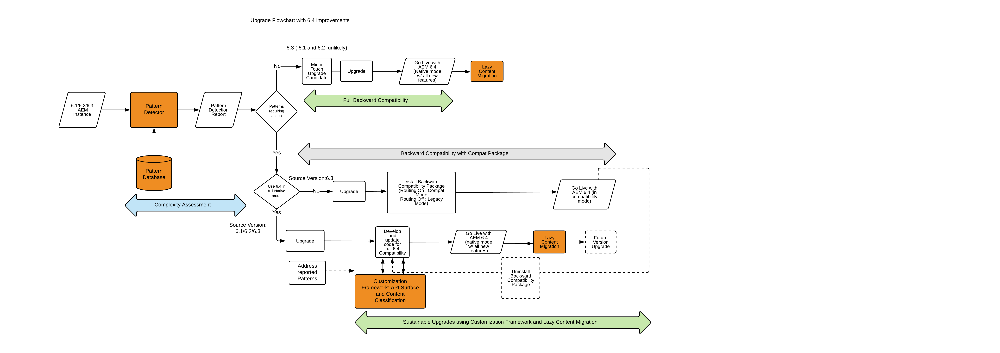

# Upgrading to AEM 6.4{#upgrading-to-aem}

In this section, we cover upgrading an AEM installation to AEM 6.4:

* [Planning Your Upgrade](/help/sites-deploying/upgrade-planning.md)
* [Assessing the Upgrade Complexity with Pattern Detector](/help/sites-deploying/pattern-detector.md)
* [Backward Compatibility in AEM 6.4](/help/sites-deploying/backward-compatibility.md)
* [Upgrade Procedure](/help/sites-deploying/upgrade-procedure.md)
* [Upgrading Code and Customizations](/help/sites-deploying/upgrading-code-and-customizations.md)
* [Pre-Upgrade Maintenance Tasks](/help/sites-deploying/pre-upgrade-maintenance-tasks.md)
* [Performing an In-Place Upgrade](/help/sites-deploying/in-place-upgrade.md)
* [Post Upgrade Checks and Troubleshooting](/help/sites-deploying/post-upgrade-checks-and-troubleshooting.md)
* [Sustainable Upgrades](/help/sites-deploying/sustainable-upgrades.md)
* [Lazy Content Migration](/help/sites-deploying/lazy-content-migration.md)
* [Repository Restructuring in AEM 6.4](/help/sites-deploying/repository-restructuring.md)

For easier reference to the AEM instances involved in these procedures, the following terms are used throughout these articles:

* The *source* instance is the AEM instance that you are upgrading from.
* The *target* instance is the one that you are upgrading to.

>[!NOTE]
>
>As part of the efforts to improve the reliability of upgrades, AEM 6.4 has undergone a comprehensive repository restructuring. For more information on how to align with the new structure, see [Repository Restructuring in AEM 6.4](/help/sites-deploying/repository-restructuring.md)

## What Has Changed? {#what-has-changed}

The following are major changes of note over the last several releases of AEM:

AEM 6.0 introduced the new Jackrabbit Oak repository. Persistence Managers were replaced by [Micro Kernels](/help/sites-deploying/recommended-deploys.md). Starting from version 6.1, CRX2 is no longer supported. A migration tool called crx2oak needs to be run to migrate CRX2 repositories from 5.6.1 instances. For more information, see [Using the CRX2OAK Migration Tool](/help/sites-deploying/using-crx2oak.md).

If Asset Insights is to be used and you are upgrading from a version older than AEM 6.2, assets must be migrated and have IDs generated through a JMX bean. In our internal tests, 125K assets on a TarMK environment were migrated in an hour, but your results may vary.

AEM 6.3 introduced a new format for the `SegmentNodeStore`, which is the basis of the TarMK implementation. If you are upgrading from a version older than AEM 6.3, this will require a repository migration as part of the upgrade, involving system downtime.

Adobe Engineering estimates this to be around 20 minutes. Note that reindexing will not be necessary. Additionally, a new version of the crx2oak tool has been released to work with the new repository format.

**This migration is not required if upgrading from AEM 6.3 to AEM 6.4.**

The pre-upgrade maintenance tasks have been optimized to support automation.

The crx2oak tool command line usage options have been changed to be automation friendly and support more upgrade paths.

The post-upgrade checks have also been made automation friendly.

Periodic garbage collection of revisions and data store garbage collection are now routine maintenance tasks that need to be performed periodically. With the introduction of AEM 6.3, Adobe supports and recommends Online Revision Cleanup. See [Revision Cleanup](/help/sites-deploying/revision-cleanup.md) for information on how to configure these tasks.

**AEM 6.4** introduces the [Pattern Detector](/help/sites-deploying/pattern-detector.md) for assessment of complexity of the upgrade as you start planning for the upgrade. 6.4 also has a strong focus on [backward compatibility](/help/sites-deploying/backward-compatibility.md) of features. Finally, best practices for [sustainable upgrades](/help/sites-deploying/sustainable-upgrades.md) are also added.

For more details about what else has changed in recent AEM versions, see the complete release notes:

* [https://helpx.adobe.com/experience-manager/6-2/release-notes.html](https://helpx.adobe.com/experience-manager/6-2/release-notes.html)
* [https://helpx.adobe.com/experience-manager/6-3/release-notes.html](https://helpx.adobe.com/experience-manager/6-3/release-notes.html)
* [https://helpx.adobe.com/experience-manager/6-4/release-notes.html](https://helpx.adobe.com/experience-manager/6-4/release-notes.html)

## Upgrade Overview {#upgrade-overview}

Upgrading AEM is a multi-step, sometimes multi-month process. The following outline has been provided as an overview of what is included in an upgrade project and the content that has been included in this documentation:

## Upgrade Flow with 6.4 Upgrade Improvements {#upgrade-overview-1}

The diagram below captures the overall recommended flow highlight the upgrade approach. Please note the refernce to the new features we have introduced. The upgrade should start with the Pattern Detector(see [Assessing the Upgrade Complexity with Pattern Detector](/help/sites-deploying/pattern-detector.md)) which should let you decide the path you want to take for compatibility with AEM 6.4 based on the patterns in the generated report.

There was a big focus in 6.4 to keep all the new features backward compatible, but in cases where you still see some backward compatibility issues, the compatibility mode allows you to temporarily defer development to keep your custom code compliant with 6.4. This approach helps you avoid development effort immediately after the upgrade(see [Backward Compatibility in AEM 6.4](/help/sites-deploying/backward-compatibility.md)).

Finally, in your 6.4 development cycle, features introduced under Sustainable Upgrades(see [Sustainable Upgrades](/help/sites-deploying/sustainable-upgrades.md)) help you follow best practices to make future upgrades even more efficient and seamless.

