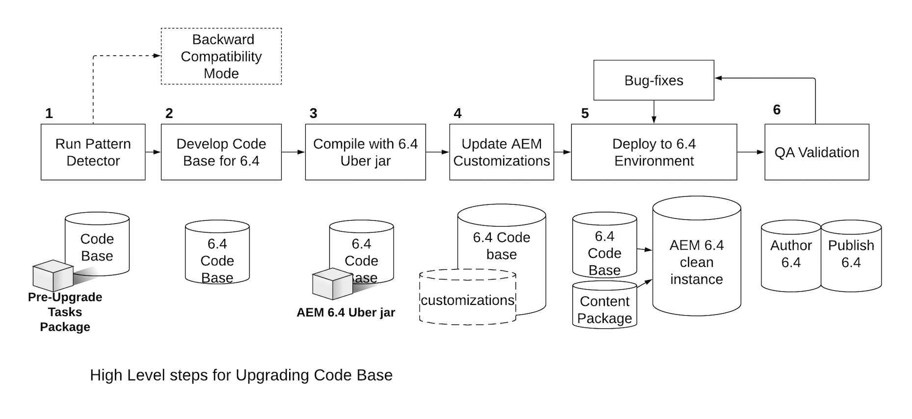

# Upgrading Code and Customizations{#upgrading-code-and-customizations}

When planning an upgrade the following areas of an implementation need to be investigated and addressed.

* [Upgrade the Code Base](#upgrade-code-base)
* [Align with 6.4 Repository Structure](#align-repository-structure)
* [AEM Customizations](#aem-customizations)
* [Testing Procedure](#testing-procedure)

## Overview {#overview}

1. **Pattern Detector** - Run the Pattern Detector as described in upgrade planning and described in detail in [this page](/help/sites-deploying/pattern-detector.md) to get a pattern detector report that contains more details on areas that need to be addressed in addition to the unvailable APIs/bundles in the Target version of AEM. The Pattern Detection report should give you an indication of any incompatibilities in your code, if there are none then your deployment is already 6.4 compatible, you can still choose to do new development for utilizing 6.4 functionality, but you do't need it just for maintaining compatibility. If there are incompatibilities reported then you can choose to either a) Run in compatibility mode and defer your development for new 6.4 features or compatibility, b) Decide to do development after upgrade, and move to step 2. Please see please see [Backward Compatibility in AEM 6.4](/help/sites-deploying/backward-compatibility.md) for more details.

1. **Develop Code Base for 6.4** - Create a dedicated branch or repository for the code base for the Target version. Use info from Pre-Upgrade Compatibility to plan areas of code to update.
1. **Compile with 6.4 Uber jar** - Update code base POMs to point to 6.4 uber jar and compile code against this.
1. **Update AEM Customizations** - Any customizations or extensions to AEM should be updated/validated to work in 6.4 and added to the 6.4 code base. Includes UI Search Forms, Assets Customizations, anything using /mnt/overlay

1. **Deploy to 6.4 Environment** - A clean instance of AEM 6.4 (Author + Publish) should be stood up in a Dev/QA environment. Updated code base and a representative sample of content (from current production) should be deployed.
1. **QA Validation and Bug fix** - QA should validate the application on both Author and Publish instances of 6.4. Any bugs found should be fixed and committed to the 6.4 code base. Repeat Dev-Cycle as necessary until all bugs are fixed.

Before proceeding with an upgrade you should have a stable application code base that has been thoroughly tested against the target version of AEM. Based on observations made in testing there could be ways to optimize the custom code. This might include refactoring the code to avoid traversing the repository, custom indexing to optimize search, or use of unordered nodes in JCR, amongst others.

In addition to the option of upgrading your code base and customizations to work with the new AEM version, 6.4 also helps manage your customizations more efficiently with the Backward Compatibility feature as described on [this page](/help/sites-deploying/backward-compatibility.md).

As mentioned above and shown in the diagram below,running the [Pattern Detector](/help/sites-deploying/pattern-detector.md) in the first step will help you assess the overall complexity of the upgrade and whether you want to run in compatibility mode or update your customizations to use all the new AEM 6.4 features. Please see the [Backward Compatibility in AEM 6.4](/help/sites-deploying/backward-compatibility.md) page for more details.
[ ](assets/upgrade-code-base-highlevel.png) 

## Upgrade the Code Base {#upgrade-code-base}

### Create a Dedicated Branch for 6.4 Code in Version Control {#create-a-dedicated-branch-for-6-4-code-in-version-control}

All code and configurations required for your AEM implementation should be managed using some form of version control. A dedicated branch in version control should be created for managing any changes needed for the code base in the target version of AEM. Iterative testing of the code base against the target version of AEM and subsequent bug fixes will be managed in this branch.

### Update the AEM Uber Jar version {#update-the-aem-uber-jar-version}

The AEM Uber jar includes all AEM APIs as a single dependency in your Maven project's `pom.xml`. It is always a best practice to include the Uber Jar as a single dependency instead of including individual AEM API dependencies. When upgrading the code base the version of the Uber Jar should be changed to point to the target version of AEM. If your project was developed on a version of AEM prior to the existence of the Uber Jar all individual AEM API dependencies should be removed and replaced by a single inclusion of the Uber Jar for the target version of AEM. The code base should then be recompiled against the new version of the Uber Jar. Any deprecated APIs or methods should be updated to be compatible with the target version of AEM.

```
<dependency>
    <groupId>com.adobe.aem</groupId>
    <artifactId>uber-jar</artifactId>
    <version>6.4.0</version>
    <classifier>apis</classifier>
    <scope>provided</scope>
</dependency>
```

### Phase out use of Administrative Resource Resolver {#phase-out-use-of-administrative-resource-resolver}

The use of an administrative session through `SlingRepository.loginAdministrative()` and `ResourceResolverFactory.getAdministrativeResourceResolver()` was quite prevalent in code bases prior to AEM 6.0. These methods have been deprecated for security reasons as they give too broad of a level of access. [In future versions of Sling these methods will be removed](https://sling.apache.org/documentation/the-sling-engine/service-authentication.html#deprecation-of-administrative-authentication). It is highly recommended to refactor any code to use Service Users instead. More information about Service Users and [how to phase out administrative sessions can be found here](/help/sites-administering/security-service-users.md#how-to-phase-out-admin-sessions).

### Queries and Oak Indexes {#queries-and-oak-indexes}

Any use of queries in the code base needs to be thoroughly tested as part of upgrading the code base. For customers upgrading from Jackrabbit 2 (versions of AEM older than 6.0) this is especially important as Oak does not index content automatically and custom indexes may need to be created. If upgrading from an AEM 6.x version the out of the box Oak index definitions may have changed and could effect existing queries.

Several tools for tools for analyzing and inspecting query performance are available:

* [AEM Index Tools](/help/sites-deploying/queries-and-indexing.md)  

* [Operations Diagnosis Tools - Query Performance](/help/sites-administering/operations-dashboard.md#diagnosis-tools)  

* [Oak Utils](https://oakutils.appspot.com/). This is an open source tool that is not maintained by Adobe.

### Classic UI Authoring {#classic-ui-authoring}

Classic UI authoring is still available in AEM 6.4 but is being deprecated. More information can be found [here](/help/release-notes/deprecated-removed-features.md#pre-announcement-for-next-release). If your application is currently running on the Classic UI author environment it is recommended to upgrade to AEM 6.4 and continue using the Classic UI. Migration to the Touch UI can then be planned as separate project to be completed over several development cycles. In order to use the Classic UI in AEM 6.4 several OSGi configurations are needed to be committed to the code base. More details on how to configure this can be found [here](/help/sites-administering/enable-classic-ui.md).

>[!NOTE]
>
>To help you move away from classic UI and take advantage of the latest AEM technologies, consider leveraging the [AEM Modernization Tools](/help/sites-developing/modernization-tools.md) to make your migration easier.

## Align with 6.4 Repository Structure {#align-repository-structure}

To make upgrades easier and ensure that configurations are not overwritten during an upgrade, the repository is restructured in 6.4 to separate content from configuration.

Therefore, a number of settings must be moved to no longer reside under `/etc` as had been the case in the past. To review the full set of repository restructuring concerns that must be reviewed and accomodated in the updated to AEM 6.4, see [Repository Restructuring in AEM 6.4](/help/sites-deploying/repository-restructuring.md).

## AEM Customizations  {#aem-customizations}

All customizations to the AEM authoring environment in the source version of AEM need to be identified. Once identified, it is recommended that each customizations be stored in version control or at a minimum backed up as a part of a content package. All customizations should be deployed and validated in a QA or Staging environment running the target version of AEM prior to a production upgrade.

### Overlays in general {#overlays-in-general}

It is a common practice to extend AEM out of the box functionality by overlaying nodes and/or files under /libs with additional nodes under /apps. These overlays should be tracked in version control and tested against the target version of AEM. If a file (be it JS, JSP, HTL) is overlayed, it is recommended to leave a comment on what functionality has been augmented for easier regression testing on the target version of AEM. More information about overlays in general can be found [here](/help/sites-developing/overlays.md). Instructions for specific AEM overlays can be found below.

### Upgrading Custom Search Forms {#upgrading-custom-search-forms}

Custom Search Facets require some manual adjustments after the upgrade in order to function properly. For more details, see [Upgrading Custom Search Forms](/help/sites-deploying/upgrading-custom-search-forms.md).

### Assets UI Customizations {#assets-ui-customizations}

>[!NOTE]
>
>This procedure is required only for upgrades from versions older than AEM 6.2.

Instances that have customized Assets deployments need to be prepared for the upgrade. This is needed to ensure that all customized content is compatible with the new 6.4 node structure.

You can prepare customizations to the Assets UI by doing the following:

1. On the instance that needs to be upgraded, open CRXDE Lite by going to `https://server:port/crx/de/index.jsp` 

1. Go to the following node:

    * `/apps/dam/content`

1. Rename the content node to **content_backup**. You can do this by right clicking the explorer pane in the left hand side of the window and choosing **Rename**.  

1. Once the node has been renamed, create a new node named content under `/apps/dam` named **content** and set its node type to **sling:Folder**.  

1. Move all the children nodes of **content_backup** to the newly created content node. You can do this by right clicking each children node in the explorer pane and selecting **Move**.  

1. Delete the **content_backup** node.  

1. The updated nodes beneath `/apps/dam` with the correct node type of `sling:Folder` should ideally be saved into version control and deployed with the code base or at a minimum backed up as content package.

### Generating Asset IDs for Existing Assets {#generating-asset-ids-for-existing-assets}

To generate asset IDs for existing assets, upgrade the assets when you upgrade your AEM instance to run AEM 6.4. This is required to enable the [Assets Insights feature](/help/assets/touch-ui-asset-insights.md). For more details, see [Adding Embed code](/help/assets/touch-ui-using-page-tracker.md#adding-embed-code).

To upgrade assets, configure the Associate Asset IDs package in the JMX console. Depending on the number of assets in the repository, `migrateAllAssets` may take a long time. Our internal tests estimate roughly one hour for 125 thousand assets on TarMK.


If you require asset IDs for a subset of your entire assets, use the `migrateAssetsAtPath` API.

For all other purposes, use the `migrateAllAssets()` API.

### InDesign Script Customizations {#indesign-script-customizations}

Adobe recommends putting custom scripts at `/apps/settings/dam/indesign/scripts` location. More information about InDesign Script customizations can be found [here](/help/assets/indesign.md#configuring-the-aem-assets-workflow).

### Recovering ContextHub Configurations {#recovering-contexthub-configurations}

ContextHub configurations are effected by an upgrade. Instructions on how to recover existing ContextHub configurations can be found [here](/help/sites-administering/contexthub-config.md#recovering-contexthub-configurations-after-upgrading).

### Workflow Customizations {#workflow-customizations}

It is a common practice to update modify out of the box workflows to add or remove un-needed functionality. A common workflow that is customized is the DAM Update Asset workflow. All workflows required for a custom implementation should be backed up and stored in version control as they may be overwritten during an upgrade.

### Editable Templates {#editable-templates}

>[!NOTE]
>
>This procedure is required only for Sites upgrades using Editable Templates from AEM 6.2

The structure for Editable templates changed between AEM 6.2 and 6.3. If you are upgrading from 6.2 or earlier and If your site content is built using editable templates you will need to use the [Responsive Nodes Clean Up Tool](https://github.com/Adobe-Marketing-Cloud/aem-sites-template-migration). The tool is meant to run **_after_** an upgrade in order to clean up content. It will need to be run on both Author and Publish tiers.

### CUG Implementation Changes {#cug-implementation-changes}

The implementation of Closed User Groups has changed significantly to address performance and scalability limitations in previous versions of AEM. The previous version of CUG was deprecated in 6.3 and the new implementation is only supported in the Touch UI. If you are upgrading from 6.2 or ealier then Instructions to migrate to the new CUG implementation can be found [here](/help/sites-administering/closed-user-groups.md#upgrade-cug).

## Testing Procedure {#testing-procedure}

A comprehensive test plan should be prepared for testing upgrades. Testing the upgraded code base and application will need to be done in lower environments first. Any bugs found should be fixed in an iterative fashion until the code base is stable, only then should higher level environments be upgraded.

### Testing the Upgrade Procedure {#testing-the-upgrade-procedure}

The upgrade procedure as outlined here should be tested on Dev and QA environments as documented in your customized run book (see [Planning Your Upgrade](/help/sites-deploying/upgrade-planning.md)). The upgrade procedure should be repeated until all steps are documented in the upgrade run book and the upgrade process is smooth.

### Implementation Test Areas  {#implementation-test-areas-}

Below are critical areas of any AEM implementation that should be covered by your test plan once the environment has been upgraded and the upgraded code base has been deployed.

<table> 
 <tbody> 
  <tr> 
   <td><strong>Functional Test Area</strong></td> 
   <td><strong>Description</strong></td> 
  </tr> 
  <tr> 
   <td>Published Sites</td> 
   <td>Testing the AEM implementation and associated code on the publish tier<br /> through the dispatcher. Should include criteria for page updates and<br /> cache invalidation.</td> 
  </tr> 
  <tr> 
   <td>Authoring</td> 
   <td>Testing the AEM implementation and associated code on the Author tier. Should include page, component authoring and dialogs.</td> 
  </tr> 
  <tr> 
   <td>Integrations with Marketing Cloud Solutions</td> 
   <td>Validating integrations with products like Analytics, DTM, and Target.</td> 
  </tr> 
  <tr> 
   <td>Integrations with 3rd Party Systems</td> 
   <td>Any 3rd party integrations should be validated on both Author and Publish tiers.</td> 
  </tr> 
  <tr> 
   <td>Authentication, Security and Permissions</td> 
   <td>Any authentication mechanisms like LDAP/SAML should be validated.<br /> Permissions and groups should be tested on both Author and Publish<br /> tiers.</td> 
  </tr> 
  <tr> 
   <td>Queries</td> 
   <td>Custom indexes and queries should be tested along with query performance.</td> 
  </tr> 
  <tr> 
   <td>UI Customizations</td> 
   <td>Any extensions or customizations to the AEM UI in the author environment.</td> 
  </tr> 
  <tr> 
   <td>Workflows</td> 
   <td>Custom and/or out of the box workflows and functionality.</td> 
  </tr> 
  <tr> 
   <td>Performance Testing</td> 
   <td>Load testing should be performed on both Author and Publish tiers that simulate real-world scenarios.</td> 
  </tr> 
 </tbody> 
</table>

### Document Test Plan and Results {#document-test-plan-and-results}

A test plan should be created that covers the above implementation test areas. In many cases it will make sense to separate the test plan by Author and Publish task lists. This test plan should be executed on Dev, QA, and Stage environments prior to upgrading Production environments. Test results and performance metrics should be captured on lower environments to provide comparison when upgrading Stage and Production environments.
