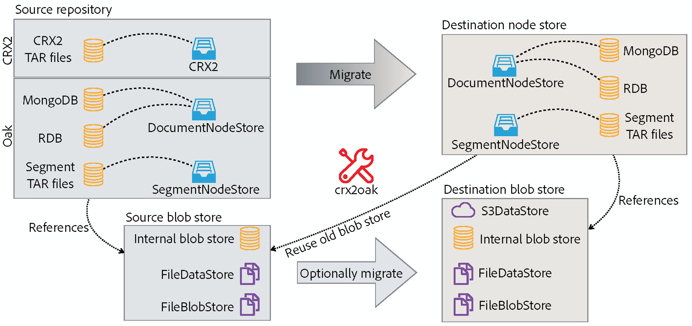
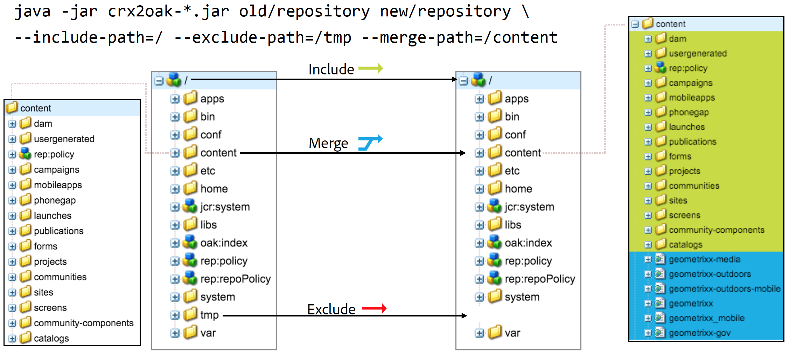
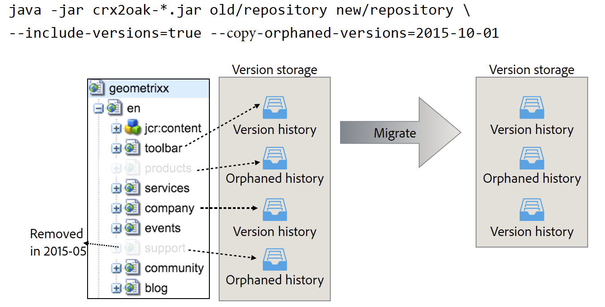

# Using the CRX2Oak Migration Tool{#using-the-crx-oak-migration-tool}

## Introduction {#introduction}

CRX2Oak is a tool designed to migrate data between different repositories.

It can be used to migrate data from older CQ versions based on Apache Jackrabbit 2 to Oak, and it can also be used to copy data between Oak repositories.

You can download the newest version of crx2oak from the public Adobe repository at this location:
[https://repo1.maven.org/maven2/com/adobe/granite/crx2oak/](https://repo1.maven.org/maven2/com/adobe/granite/crx2oak/)

>[!NOTE]
>
>For more information on Apache Oak and key concepts of AEM persistance, see [Introduction to the AEM Platform](/help/sites-deploying/platform.md).

## Migration Use Cases {#migration-use-cases}

The tool can be used for:

* Migrating from older CQ 5 versions to AEM 6
* Copying data between multiple Oak repositories
* Converting data between different Oak MicroKernel implementations.

Support for migrating repositories using external Blob Stores (commonly known as Data Stores) is provided in different combinations. One possible migration path is from a CRX2 repository that is using an external `FileDataStore` to an Oak repository using a `S3DataStore`.

The below diagram illustrates all the possible migration combinations supported by CRX2Oak:



## Features {#features}

CRX2Oak is called during AEM upgrades in a fashion in which the user can specify a predefined migration profile that automates the reconfiguration of persistence modes. This is called the quickstart mode.

It can also be run separately in case it requires more customization. However, note that in this mode changes are made only to the repository and any additional reconfiguration of AEM needs to be performed manually. This is called the standalone mode.

Another thing to note is that with the default settings in standalone mode, only the Node Store will be migrated and the new repository will re-use the old binary storage.

### Automated Quickstart Mode {#automated-quickstart-mode}

Since AEM 6.3, CRX2Oak is able to handle user defined migration profiles that can be configured with all the migration options already available. This allows for both higher flexibility, and the ability to automate configuration of AEM, features that are not available if you are using the tool in standalone mode.

In order to switch CRX2Oak to quickstart mode you need to define the path to crx-quickstart folder in the AEM installation directory via this operating system environmental variable:

**For UNIX based systems and macOS:**

```shell
export SLING_HOME="/path/to/crx-quickstart"
```

**For Windows:**

```shell
SET "SLING_HOME=/path/to/crx-quickstart"
```

#### Resume Support {#resume-support}

The migration can be interrupted at any time, with the possibility to resume it afterwards.

#### Customizable Upgrade Logic {#customizable-upgrade-logic}

Custom Java logic cand also be implemented using `CommitHooks`. Custom `RepositoryInitializer` classes can be implemented in order to initialize the repository with custom values.

#### Support for Memory Mapped Operations {#support-for-memory-mapped-operations}

CRX2Oak also supports memory mapped operations by default. Memory mapping greatly improves performance and should be used whenever possible.

>[!CAUTION]
>
>Note however that memory mapped operations are not supported for Windows platforms. Therefore, it is recommended to add the **--disable-mmap** parameter when performing the migration on Windows.

#### Selective Migration of Content {#selective-migration-of-content}

By default, the tool migrates the whole repository under the `"/"` path. However, you have complete control over which content should be migrated.

If there is any part of the content that is not required on the new instance, you can use the `--exclude-path` parameter to exclude the content and optimize the upgrade procedure.

#### Path Merging {#path-merging}

If data needs to be copied between two repositories and you have a content path that is different on both instances, you can define it in the `--merge-path` parameter. Once you do, CRX2Oak will copy only the new nodes to the destination repository and will keep the old ones in place.



#### Version Support {#version-support}

By default, AEM will create a version of each node or page that gets modified, and store it in the repository. The versions can be then used to restore the page to an earlier state.

However, these versions are never purged even if the original page is deleted. When dealing with repositories that have been in operation for a long time, the migration might need to process a lot of redundant data caused by orphaned versions.

A useful feature for these types of situations is the addition of the `--copy-versions` parameter. It can be used to skip the version nodes during migration or copy of a repository.

You can also choose whether to copy orphaned versions by adding `--copy-orphaned-versions=true`.

Both parameters also support a `YYYY-MM-DD` date format, in case you want to copy versions no later than a specific date.



#### Open Source Version {#open-source-version}

An open source version of CRX2Oak is available in the form of oak-upgrade. It supports all the features except for:

* CRX2 support
* Migration profile support
* Support for automated AEM reconfiguration

See the [Apache Documentation](https://jackrabbit.apache.org/oak/docs/migration.html) for more information.

## Parameters {#parameters}

### Node Store Options {#node-store-options}

* `--cache`: Cache size in MB (default is `256`)

* `--mmap`: Enable memory mapped file access for Segment Store
* `--src-password:` Password for the source RDB database

* `--src-user:` User for the source RDB

* `--user`: User for the targed RDB

* `--password`: Password for the target RDB.

### Migration Options {#migration-options}

* `--early-shutdown`: Shuts down the source JCR2 repository after nodes are copied and before the commit hooks are applied
* `--fail-on-error`: Forces a failure of the migration if the nodes cannot be read from the source repository.
* `--ldap`: Migrates LDAP users from a CQ 5.x instance to an Oak based one. In order for this to work, the Identity Provider in the Oak configuration needs to be named ldap. For more information, see the [LDAP documentation](/help/sites-administering/ldap-config.md).

* `--ldap-config:` Use this in conjunction with the `--ldap` parameter for CQ 5.x repositories that used multiple LDAP servers for authentication. You can use it to point to the CQ 5.x `ldap_login.conf` or `jaas.conf` configuration files. The format is `--ldapconfig=path/to/ldap_login.conf`.

### Version Store Options {#version-store-options}

* `--copy-orphaned-versions`: Skips copying orphaned versions. Parameters supported are: `true`, `false` and `yyyy-mm-dd`. Defaults to `true`.

* `--copy-versions:` Copies the version storage. Parameters: `true`, `false`, `yyyy-mm-dd`. Defaults to `true`.

#### Path Options {#path-options}

* `--include-paths:` Comma-separated list of paths to include during copy
* `--merge-paths`: Comma-separated list of paths to merge during copy
* `--exclude-paths:` Comma-separated list of paths to exclude during copy.

### Source Blob Store Options {#source-blob-store-options}

* `--src-datastore:` The datastore directory to be used as a source `FileDataStore`

* `--src-fileblobstore`: The datastore directory to be used as a source `FileBlobStore`

* `--src-s3datastore`: The datastore directory to be used for the source `S3DataStore`

* `--src-s3config`: The configuration file for the source `S3DataStore`.

### Destination BlobStore Options {#destination-blobstore-options}

* `--datastore:` The datastore directory to be used as a target `FileDataStore`

* `--fileblobstore:` The datastore directory to be used as a target `FileBlobStore`

* `--s3datastore`: The datastore directory to be used for the target `S3DataStore`

* `--s3config`: The configuration file for the target `S3DataStore`.

### Help Options {#help-options}

* `-?, -h, --help:` Shows help information.

## Debugging {#debugging}

You can also enable debug information for the migration process in order to troubleshoot any issues that might appear during the process. You can do this differently depending on the mode you wish to run the tool in:

<table>
 <tbody>
  <tr>
   <td><strong>CRX2Oak Mode</strong></td>
   <td><strong>Action</strong></td>
  </tr>
  <tr>
   <td>Quickstart mode</td>
   <td>You can add the <strong>--log-level TRACE</strong> or <strong>--log-level DEBUG </strong>options to the command line when running CRX2Oak. In this mode logs are automatically redirected to the <strong>upgrade.log file</strong>.</td>
  </tr>
  <tr>
   <td>Standalone mode</td>
   <td><p>Add the <strong>--trace</strong> options to the CRX2Oak command line to show TRACE events on standard output (you need to redirect logs yourself using redirection character: '&gt;' or 'tee' command for later inspection).</p> </td>
  </tr>
 </tbody>
</table>

## Other Considerations {#other-considerations}

When migrating to a MongoDB replica set, make sure you set the `WriteConcern` parameter to `2` on all connections to the Mongo databases.

You can do this by adding the `w=2` parameter at the end of the connection string, like this:

```xml
java -Xmx4092m -jar crx2oak.jar crx-quickstart/repository/ mongodb://localhost:27017/aem-author?replicaset=replica1&w=2
```

>[!NOTE]
>
>For more information, see the MongoDB Connection String documentation on [Write Concerns](https://docs.mongodb.org/manual/reference/connection-string/#write-concern-options).
