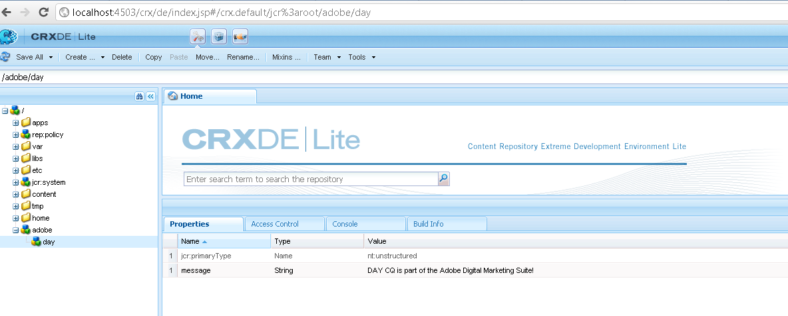

# How to programmatically access the AEM JCR{#how-to-programmatically-access-the-aem-jcr}

You can programmatically modify nodes and properties located within the Adobe CQ repository, which is part of the Adobe Experience Cloud. To access the CQ repository, you use the Java&trade; Content Repository (JCR) API. You can use the Java&trade; JCR API to create, replace, update, and delete (CRUD) content located within the Adobe CQ repository. For more information about the Java&trade; JCR API, see [https://jackrabbit.apache.org/jcr/jcr-api.html](https://jackrabbit.apache.org/jcr/jcr-api.html).

>[!NOTE]
>
>This development article modifies the Adobe CQ JCR from an external Java&trade; application. In contrast, you can modify the JCR from within an OSGi bundle using the JCR API. For details, see [Persisting CQ data in the Java&trade; Content Repository](https://helpx.adobe.com/experience-manager/using/persisting-cq-data-java-content1.html).

>[!NOTE]
>
>To use the JCR API, add the `jackrabbit-standalone-2.4.0.jar` file to your Java&trade; application's class path. You can obtain this JAR file from the Java&trade; JCR API web page at [https://jackrabbit.apache.org/jcr/jcr-api.html](https://jackrabbit.apache.org/jcr/jcr-api.html).

>[!NOTE]
>
>To learn how to query the Adobe CQ JCR using the JCR Query API, see [Querying Adobe Experience Manager Data using the JCR API](https://helpx.adobe.com/experience-manager/using/querying-experience-manager-data-using1.html).

## Create a Repository instance {#create-a-repository-instance}

Although there are different ways to connect to a repository and establish a connection, this development article uses a static method that belongs to the `org.apache.jackrabbit.commons.JcrUtils` class. The name of the method is `getRepository`. This method takes a string parameter that represents the URL of the Adobe CQ server. For example, `http://localhost:4503/crx/server`.

The `getRepository` method returns a `Repository` instance, as shown in the following code example.

```java
//Create a connection to the AEM JCR repository running on local host
Repository repository = JcrUtils.getRepository("http://localhost:4503/crx/server");
```

## Create a Session instance {#create-a-session-instance}

The `Repository` instance represents the CRX repository. You use the `Repository` instance to establish a session with the repository. To create a session, invoke the `Repository` instance's `login` method and pass a `javax.jcr.SimpleCredentials` object. The `login` method returns a `javax.jcr.Session` instance.

You create a `SimpleCredentials` object by using its constructor and passing the following string values:

* The user name;
* The corresponding password

When passing the second parameter, call the String object's `toCharArray` method. The following code shows how to call the `login` method that returns a `javax.jcr.Sessioninstance`.

```java
//Create a Session instance
javax.jcr.Session session = repository.login( new SimpleCredentials("admin", "admin".toCharArray()));
```

## Create a Node instance {#create-a-node-instance}

Use a `Session` instance to create a `javax.jcr.Node` instance. A `Node` instance lets you perform node operations. For example, you can create a node. To create a node that represents the root node, invoke the `Session` instance's `getRootNode` method, as shown in the following line of code.

```java
//Create a Node
Node root = session.getRootNode();
```

Once you create a `Node` instance, you can perform tasks such as creating another node and adding a value to it. For example, the following code creates two nodes and adds a value to the second node.

```java
// Store content
Node day = adobe.addNode("day");
day.setProperty("message", "Adobe CQ is part of the Adobe Digital Marketing Suite!");
```

## Retrieve Node Values {#retrieve-node-values}

To retrieve a node and its value, invoke the `Node` instance's `getNode` method and pass a string value that represents the fully qualified path to the node. Consider the node structure created in the previous code example. To retrieve the day node, specify adobe/day, as shown in the following code:

```java
// Retrieve content
Node node = root.getNode("adobe/day");
System.out.println(node.getPath());
System.out.println(node.getProperty("message").getString());

```

## Create nodes in the Adobe CQ Repository {#create-nodes-in-the-adobe-cq-repository}

The following Java&trade; code example represents a Java&trade; class that connects to Adobe CQ, creates a `Session` instance, and adds new nodes. A node is assigned a data value and then the value of the node and its path is written out to the console. When you are done with the Session, be sure to log out.

```java
/*
 * This Java Quick Start uses the jackrabbit-standalone-2.4.0.jar
 * file. See the previous section for the location of this JAR file
 */

import javax.jcr.Repository;
import javax.jcr.Session;
import javax.jcr.SimpleCredentials;
import javax.jcr.Node;

import org.apache.jackrabbit.commons.JcrUtils;
import org.apache.jackrabbit.core.TransientRepository;

public class GetRepository {

public static void main(String[] args) throws Exception {

try {

    //Create a connection to the CQ repository running on local host
    Repository repository = JcrUtils.getRepository("http://localhost:4503/crx/server");

   //Create a Session
   javax.jcr.Session session = repository.login( new SimpleCredentials("admin", "admin".toCharArray()));

  //Create a node that represents the root node
  Node root = session.getRootNode();

  // Store content
  Node adobe = root.addNode("adobe");
  Node day = adobe.addNode("day");
  day.setProperty("message", "Adobe CQ is part of the Adobe Digital Marketing Suite!");

  // Retrieve content
  Node node = root.getNode("adobe/day");
  System.out.println(node.getPath());
  System.out.println(node.getProperty("message").getString());

  // Save the session changes and log out
  session.save();
  session.logout();
  }
 catch(Exception e){
  e.printStackTrace();
  }
 }
}
```

After you run the full code example and create the nodes, you can view the new nodes in the **[!UICONTROL CRXDE Lite]**, as shown in the following illustration.


