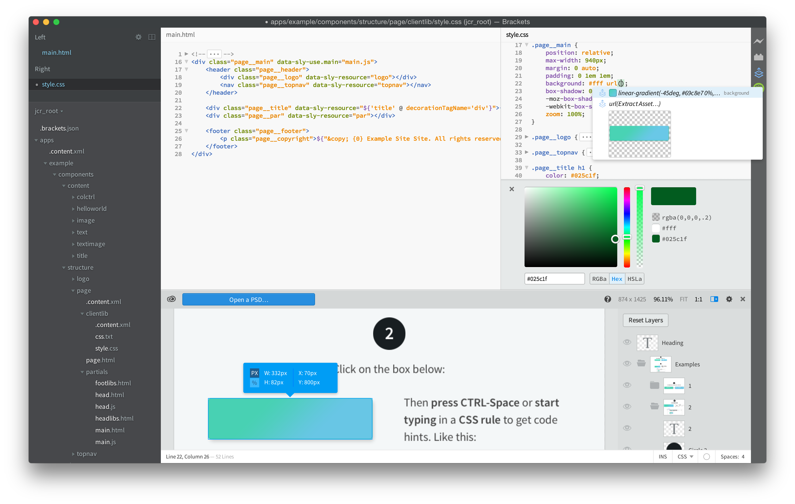
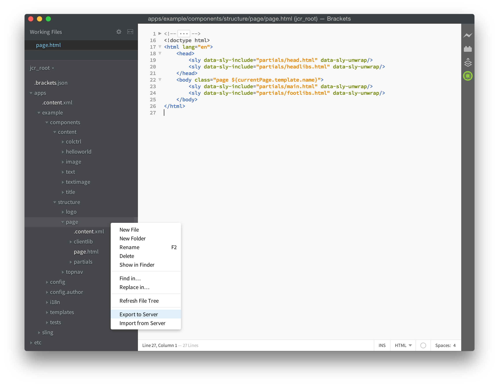

# AEM Brackets Extension{#aem-brackets-extension}

## Overview {#overview}

The AEM Brackets Extension provides a smooth workflow to edit AEM components and client libraries, and uses the power of the [Brackets](https://brackets.io/) code editor, which gives access from within the code editor to Photoshop files and layers. The easy synchronization provided by the extension (no Maven or File Vault required) increases developer efficiency and also helps front-end developers with limited AEM knowledge to participate on projects. This extension also provides some support for the [HTML Template Language (HTL)](https://experienceleague.adobe.com/docs/experience-manager-htl/content/overview.html), which takes away the complexity of JSP to make component development easier and more secure.

### Features {#features}

The main features of the AEM Brackets Extension are:

* Automated synchronization of changed files to the AEM development instance.
* Manual bidirectional synchronization of files and folders.
* Full content-package synchronization of the project.
* HTL code completion for expressions and `data-sly-*` block statements.

Additionally, Brackets comes with many useful features for AEM font-end developers:

* Photoshop file support to extract information from a PSD file, like layers, measurements, colors, fonts, texts, and so on.
* Code hints from the PSD, to easily reuse this extracted information in the code.
* CSS preprocessor support, like LESS and SCSS.
* And hundreds of additional extensions that cover more specific needs.

## Installation {#installation}

### Brackets {#brackets}

The AEM Brackets Extension supports Brackets version 1.0 or greater.

Download the latest Brackets version from [brackets.io](https://brackets.io/).

### The Extension {#the-extension}

To install the extension proceed as follows:

1. Open Brackets. In menu **File**, select **Extension Manager…**
1. Enter **AEM** in the search bar and look for **AEM Brackets Extension**.

   

1. Click **Install**.
1. Close the dialog and Extension Manager after the installation completed.

## Getting Started {#getting-started}

### The Content-Package Project {#the-content-package-project}

After the extension has been installed, you can start developing AEM components by opening a content-package folder from your file system with Brackets.

The project has to contain at least:

1. a `jcr_root` folder (for example, `myproject/jcr_root`)

1. a `filter.xml` file (for example, `myproject/META-INF/vault/filter.xml`); for more details about the structure of the `filter.xml` file see the [Workspace Filter definition](https://jackrabbit.apache.org/filevault/filter.html).

In Brackets' **File** menu, choose **Open Folder…** and pick either the `jcr_root` folder, or the parent project folder.

>[!NOTE]
>
>If you do not have of your own a project with a content-package, you can try the [HTL TodoMVC Example](https://github.com/Adobe-Marketing-Cloud/aem-sightly-sample-todomvc). On GitHub, click **Download ZIP**, extract the files locally, and as instructed above, open the `jcr_root` folder in Brackets. Then follow the steps below to setup the **Project Settings**, and finally upload the whole package to your AEM development instance by doing an **Export Content Package** as instructed further down in the Full Content-Package Synchronization section.
>
>After these steps, you should be able to access the `/content/todo.html` URL on your AEM development instance and you can start doing modifications to the code in Brackets and see how, after doing a refresh in the web browser, the changes were immediately synchronized to the AEM server.

### Project Settings {#project-settings}

To synchronize your content to and from an AEM development instance, you need to define your Project Settings. This can be done by going to the **AEM** menu and choosing **Project Settings…**

The Project Settings let you define the following:

1. The server URL (for example, `http://localhost:4502`)
1. Wether to tolerate servers that do not have a valid HTTPS certificate (keep unchecked, unless required)
1. The username used for synchronizing content (for example, `admin`)
1. The user's password (for example, `admin`)

## Synchronizing Content {#synchronizing-content}

The AEM Brackets Extension provides following types of content synchronization for files and folders that are allowed by the filtering rules defined in `filter.xml`:

### Automated Synchronization Of Changed Files {#automated-synchronization-of-changed-files}

This will only synchronize changes from Brackets to the AEM instance, but never the other way around.

### Manual Bidirectional Synchronization {#manual-bidirectional-synchronization}

In the Project Explorer, open the contextual menu by right-clicking on any file or folder, and the **Export to Server** or **Import from Server** options can be accessed.

>[!NOTE]
>
>If the selected entry is outside of the `jcr_root` folder, the **Export to Server** and **Import from Server** contextual menu entries are disabled.

### Full Content-Package Synchronization {#full-content-package-synchronization}

In the **AEM** menu, the **Export Content Package** or **Import Content Package** options let you synchronize the whole project with the server.

### Synchronization Status {#synchronization-status}

The AEM Brackets Extension features a notification icon in the toolbar on the right of the Brackets window, which indicates the status of the last synchronization:

* green - all files have been synchronized successfully
* blue - a sync operation is in progress
* yellow - some of the files were not synchronized
* red - none of the files were synchronized

Clicking on the notification icon opens the Synchronization Status report dialog box that lists of all the status for each synchronized file.

>[!NOTE]
>
>Only content that's marked as included by the filtering rules from `filter.xml` will be synchronized, regardless of the synchronization method used.
>
>Additionally, `.vltignore` files are supported for excluding content from synchronizing to and from the repository.

## Editing HTL Code {#editing-htl-code}

The AEM Brackets Extension also features some auto-completion to ease the writing of HTL attributes and expressions.

### Attribute Auto-Completion {#attribute-auto-completion}

1. In an HTML attribute, type `sly`. The attribute is auto-completed to `data-sly-`.
1. Select the HTL attribute in the dropdown list.

### Expression Auto-Completion {#expression-auto-completion}

Within an expression `${}`, common variable names are auto-completed.

## More Information {#more-information}

The AEM Brackets Extension is an open-source project, hosted on GitHub by the [Adobe Marketing Cloud](https://github.com/Adobe-Marketing-Cloud) organization, under the Apache License, version 2.0:

* Code repository: [https://github.com/Adobe-Marketing-Cloud/aem-sightly-brackets-extension](https://github.com/Adobe-Marketing-Cloud/aem-sightly-brackets-extension)
* Apache License, version 2.0: [https://www.apache.org/licenses/LICENSE-2.0.html](https://www.apache.org/licenses/LICENSE-2.0.html)

The Brackets code editor is also an open-source project, hosted on GitHub by the [Adobe Systems Incorporated](https://github.com/adobe) organization:

* Code repository: [https://github.com/adobe/brackets](https://github.com/adobe/brackets)

Feel free to contribute!
