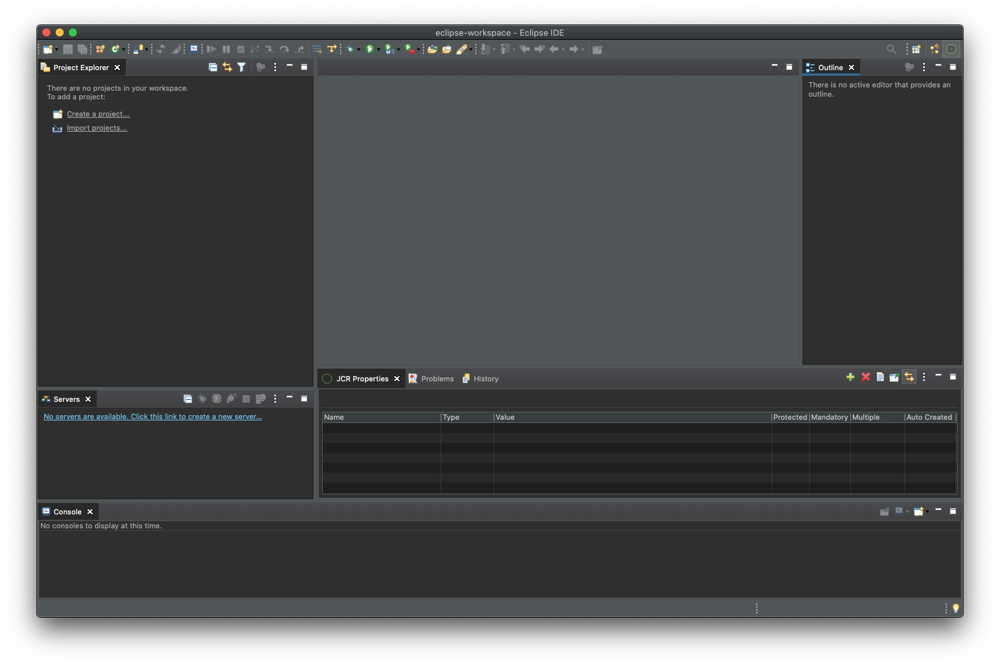
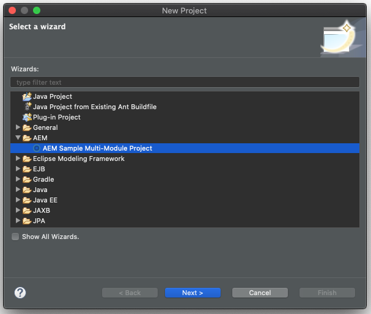
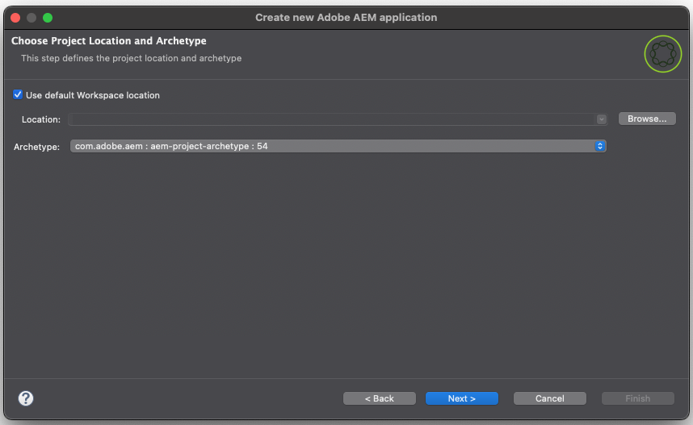
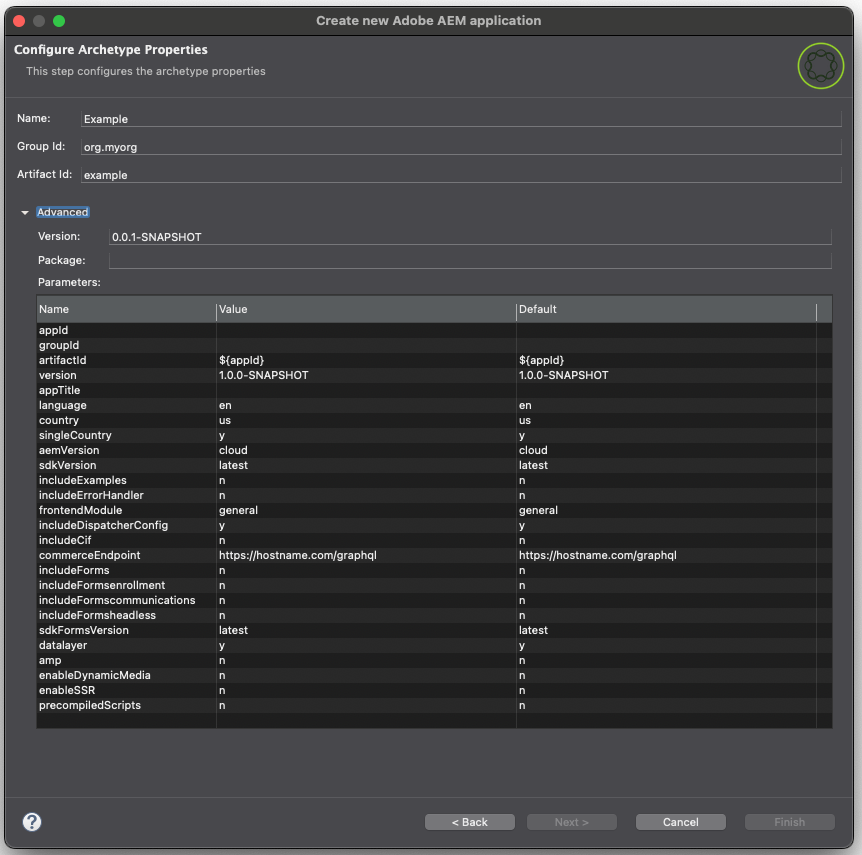
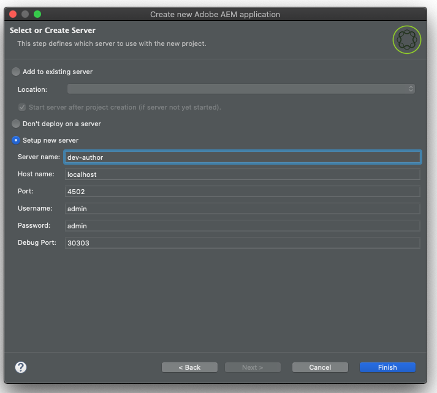

# AEM Developer Tools for Eclipse {#aem-developer-tools-for-eclipse}

 

## Overview {#overview}

_Experience Manager Developer Tools for Eclipse_ is an Eclipse plugin based on the [Eclipse plugin for Apache Sling](https://sling.apache.org/documentation/development/ide-tooling.html) released under the Apache License 2.

It offers several features that make AEM development easier:

* Seamless integration with AEM instances through Eclipse Server Connector
* Synchronization for both content and OSGi bundles
* Debugging support with code hot-swapping capability
* Simple Bootstrap of AEM Projects by way of a specific Project Creation Wizard
* Easy editing of JCR properties

## Requirements {#requirements}

Before using the AEM Developer Tools, you need to:

* Download and install [Eclipse IDE for Enterprise Java and Web Developers.](https://www.eclipse.org/downloads/packages/)
  * Version 1.4.0 of the AEM Developer Tools for Eclipse is compatible with Eclipse 2022-12 (4.26) or newer and requires Java 17 or newer to run.
* Configure your Eclipse installation to ensure that you have at least 1 GB of heap memory by editing your `eclipse.ini` configuration file as described in the [Eclipse FAQ.](https://wiki.eclipse.org/FAQ_How_do_I_increase_the_heap_size_available_to_Eclipse%3F)

>[!NOTE]
>
>On macOS, you need to right-click **Eclipse.app**, and then select **Show Package Contents** to find your `eclipse.ini`.

## How to Install the AEM Developer Tools for Eclipse {#how-to-install-the-aem-developer-tools-for-eclipse}

When you have fulfilled the [requirements](#requirements) above, you can install the developer tools plugin as follows:

1. Open the [AEM Developer Tools Web Site.](https://eclipse.adobe.com/)

1. Copy the **Installation Link**.

   * Alternatively you can download an archive instead of using the installation link.
   * This method allows offline installation but you do not receive automatic update notifications.

1. In Eclipse, open the **Help** menu.
1. Click **Install New Software**.
1. Click **Add...**.
1. In the **Name** field, enter `AEM Developer Tools`.
1. In the **Location** field, copy the installation URL.
1. Click **Add**.
1. Check both **AEM** and **Sling** plugins.
1. Click **Next**.
1. In the **Install Details** window, review the items to be installed and click **Next** again.
1. Accept the license agreements and click **Finish**.
1. In the **Trust Authorities** dialog that appears, select the authority/site `https://eclipse.adobe.com` and click **Trust Selected**.
1. In the **Trust Artifacts** dialog that appears, select the code signers and click **Trust Selected**.
1. Click **RestartNow** to restart Eclipse.

## The AEM Perspective {#the-aem-perspective}

In Eclipse, a **Perspective** determines the actions and views available within a window and enables task-oriented interaction with resources in Eclipse. For more details about perspectives, see the [Eclipse documentation.](https://help.eclipse.org/latest/index.jsp).

The _Experience Manager Development Tools for Eclipse_ provide an AEM perspective that offers you full control over your AEM projects and instances. To open the AEM perspective:

1. From the Eclipse menu bar, select **Window** &gt; **Perspective** &gt; **Open Perspective** &gt; **Other**.
1. Select **AEM** in the dialog and click **Open**.



## Sample Multi-Module Project {#sample-multi-module-project}

The _Experience Manager Developer Tools for Eclipse_ come with a sample multi-module project that helps you quickly get up to speed with a project setup in Eclipse. It also serves as a best-practice guide to several AEM features, leveraging the [AEM Project Archetype.](https://github.com/adobe/aem-project-archetype)

Follow these steps to create the sample project:

1. In the **File** &gt; **New** &gt; **Project** menu, browse to the **AEM** section and select **AEM Sample Multi-Module Project**.

   

1. Click **Next**.

   >[!NOTE]
   >
   >This step might take a moment because [m2eclipse](https://eclipse.dev/m2e/) must scan the archetype catalogs.

1. `com.adobe.aem : aem-project-archetype : <highest-number>` should be automatically selected in the **Archetype** drop-down. Select a previous version if desired. Click **Next**.

   

1. Provide the following fields for the sample project:

   * **Name**
   * **Group Id**
   * **Artifact Id**
   * **appId** - You may need to expand the **Advanced** options to set this value.
   * **appTitle** - You may need to expand the **Advanced** options to set this value.
   * **Package** - You may need to expand the **Advanced** options to set this value.

   

1. Click **Next**.

1. Configure an AEM server to which Eclipse connects by selecting **Setup new server** and providing a server name and the necessary connection details.

   

   * To use the debugger feature, you need to start AEM in debug mode by providing the `-agentlib` parameter, for example:

   ```text
   $ java -agentlib:jdwp=transport=dt_socket,server=y,suspend=n,address=*:5005 -jar aem-author-p4502.jar

   ```

   >[!TIP]
   >
   >For more details on debugging your project running on a local AEM SDK, please see the document [Remote debugging the AEM SDK.](https://experienceleague.adobe.com/en/docs/experience-manager-learn/cloud-service/debugging/debugging-aem-sdk/remote-debugging)

1. Click **Finish**.

The project structure is created. It may take a moment to download the necessary artifacts to the project.

>[!NOTE]
>
>On a fresh installation or when Maven dependencies have not been previously downloaded, Eclipse may report that the project was created with errors. In this case, follow the procedure described in the section [Resolving Invalid Project Definition.](#resolving-invalid-project-definition)

## How To Import Existing Projects {#how-to-import-existing-projects}

Use the **New Project** feature to create the basic project structure.

1. Follow the instructions to create a [Sample Multi-Module Project,](#sample-multi-module-project) which creates a basic project structure with a healthy separation of concerns:

   * `PROJECT.ui.apps` for `/apps` and `/etc` content
   * `PROJECT.ui.content` for `/content` that is authored
   * `PROJECT.core` for Java bundles
   * `PROJECT.it.launcher` and `PROJECT.it.tests` for integration tests

1. Replace the content of your `PROJECT.ui.apps` project with the `apps` and `etc` folders of your package:

   1. In the **Project Explorer** panel, expand `PROJECT.ui.apps` &gt; `src` &gt; `main` &gt; `content` &gt; `jcr_root` &gt; `apps`.
   1. Right-click the `apps` folder and choose **Show In** &gt; **System Explorer**.
   1. Delete the `apps` and `etc` folders there.
   1. In the same location, place the `apps` and `etc` folders of your content package.
   1. In Eclipse, right-click the `PROJECT.ui.apps` project and choose **Refresh**.

1. Then do the same for the `PROJECT.ui.content` and replace its content folder with the one of your packages:

   1. In the **Project Explorer** panel, expand `PROJECT.ui.content` &gt; `src` &gt; `main` &gt; `content` &gt; `jcr_root` &gt; `content`.
   1. Right-click the deeper content folder and choose **Show In** &gt; **System Explorer**.
   1. Delete the content folder there.
   1. In the same location, place the content folder of your content package.
   1. In Eclipse, right-click the `PROJECT.ui.content` project and choose **Refresh**.

1. Update the `filter.xml` files of these two projects to correspond to the content of your content package by opening the `META-INF/vault/filter.xml` file of your content package in a separate text/code editor.

   * This is an example of how your `filter.xml` file can look:

   ```xml
   <?xml version="1.0" encoding="UTF-8"?>
   <workspaceFilter version="1.0">
       <filter root="/apps/foo"/>
       <filter root="/apps/foundation/components/bar"/>
       <filter root="/etc/designs/foo"/>
       <filter root="/content/foo"/>
       <filter root="/content/dam/foo"/>
       <filter root="/content/usergenerated/content/foo"/>
   </workspaceFilter>
   ```

1. As for the content of your package that was split into two projects, you must also split these filter rules into two and update the `filter.xml` files of the two projects accordingly.

   1. In Eclipse, open `PROJECT.ui.apps/src/main/content/META-INF/filter.xml`.
   1. Replace the content of the `<workspaceFilter>` element with the rules of your package that start with `/apps` and `/etc`
      * For example:

        ```xml
        <?xml version="1.0" encoding="UTF-8"?>
        <workspaceFilter version="1.0">
           <filter root="/apps/foo"/>
           <filter root="/apps/foundation/components/bar"/>
           <filter root="/etc/designs/foo"/>
        </workspaceFilter>
        ```

   1. Then open `PROJECT.ui.content/src/main/content/META-INF/filter.xml`.
   1. Replace the rules with the ones of your package that start with `/content`.
      * For example:

        ```xml
        <?xml version="1.0" encoding="UTF-8"?>
        <workspaceFilter version="1.0">
           <filter root="/content/foo"/>
           <filter root="/content/dam/foo"/>
           <filter root="/content/usergenerated/content/foo"/>
        </workspaceFilter>
        ```

1. Make sure to save all your changes. You can now synchronize that new content to your AEM instance.

1. In the **Servers** panel, make sure that your connection is started, and if, not start it.

1. Click the **Clean and Publish** icon.

Once done, your package should be running on your instance. On save, any change automatically gets synchronized to the instance.

If you want to re-build a package out of your project, right-click the `PROJECT.ui.apps` or `PROJECT.ui.content` and choose **Run As** &gt; **Maven Install**.

You now have a target folder created with your package inside (called, for example, `PROJECT.ui.apps-0.0.1-SNAPSHOT.zip`).

## Troubleshooting {#troubleshooting}

### Resolving Invalid Project Definition {#resolving-invalid-project-definition}

To resolve invalid dependencies and project definition proceed as follows:

1. Select all created projects.
1. Right-click.
1. In the context menu, select **Maven** &gt; **Update Projects**.
1. Check **Force Updates of Snapshot/Releases**.
1. Click **OK**.

Eclipse downloads the required dependencies. This may take a moment.

## More information {#more-information}

The official Apache Sling IDE tooling for Eclipse website provides useful additional information:

* The [**Apache Sling IDE tooling for Eclipse** User Guide](https://sling.apache.org/documentation/development/ide-tooling.html) guides you through the overall concepts, server integration, and deployment capabilities supported by the AEM Development Tools.
* [Troubleshooting Apache Sling IDE tooling](https://sling.apache.org/documentation/development/ide-tooling.html#troubleshooting)
* [Known issues list](https://sling.apache.org/documentation/development/ide-tooling.html#known-issues)

The following official [Eclipse](https://www.eclipse.org/) documentation can help to set up your environment:

* [Getting Started with Eclipse](https://eclipseide.org/getting-started/)
* [Eclipse Luna Help System](https://help.eclipse.org/latest/index.jsp)
* [Maven Integration (m2eclipse)](https://www.eclipse.org/m2e/)
