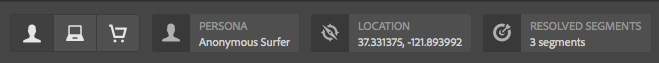
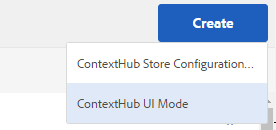
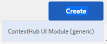
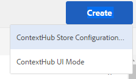

# Configuring ContextHub {#configuring-contexthub}

ContextHub is a framework for storing, manipulating, and presenting context data. For more detail on ContextHub, please see the [developer documentation](/help/sites-developing/contexthub.md). ContextHub replaces [Client Context](/help/sites-administering/client-context.md) in the touch UI.

Configure the [ContextHub](/help/sites-developing/contexthub.md) toolbar to control whether it appears in Preview mode, to create ContextHub stores, and add UI modules using the Touch-Optimized UI.

## Disabling ContextHub {#disabling-contexthub}

By default, ContextHub is enabled in an AEM installation. ContextHub can be disabled to prevent it from loading js/css and initializing. 

<!--
There are two options to disable ContextHub:

* Edit the ContextHub's configuration and check the option **Disable ContextHub**

    1. In the rail click or tap **Tools &gt; Sites &gt; ContextHub**
    1. Click or tap the appropriate **Configuration Container**
    1. Select the **ContextHub Configuration** and click or tap **Edit Selected Element**
    1. Click or tap **Disable ContextHub** and click or tap **Save**

or
-->

* Use CRXDE Lite to set the property `disabled` to **true** under `/libs/settings/cloudsettings/legacy/contexthub`

>[!NOTE]
>
>[Due to repository restructuring in AEM 6.4,](/help/sites-deploying/repository-restructuring.md) the location of ContextHub configurations changed from `/etc/cloudsettings` to:
>
>* `/libs/settings/cloudsettings`
>* `/conf/global/settings/cloudsettings`
>* `/conf/<tenant>/settings/cloudsettings`

## Showing and Hiding the ContextHub UI {#showing-and-hiding-the-contexthub-ui}

Configure the Adobe Granite ContextHub OSGi service to show or hide the [ContextHub UI](/help/sites-authoring/ch-previewing.md) on your pages. The PID of this service is `com.adobe.granite.contexthub.impl.ContextHubImpl.`

To configure the service you can either use the [Web Console](/help/sites-deploying/configuring-osgi.md#osgi-configuration-with-the-web-console) or use a [JCR node in the repository](/help/sites-deploying/configuring-osgi.md#osgi-configuration-in-the-repository):

* **Web Console:** To show the UI, select the Show UI property. To hide the UI, clear the Hide UI property.
* **JCR node:** To show the UI, set the boolean `com.adobe.granite.contexthub.show_ui` property to `true`. To hide the UI, set the property to `false`.

When showing the ContextHub UI, it only appears on pages on AEM author instances. The UI does not appear on pages of publish instances.

## Adding ContextHub UI Modes and Modules {#adding-contexthub-ui-modes-and-modules}

Configure the UI modes and modules that appear in the ContextHub toolbar in Preview mode:

* UI Modes: Groups of related modules
* Modules: Widgets that expose context data from a store and enable authors to manipulate the context

UI modes appear as a series of icons on the left side of the toolbar. When selected, the modules of a UI mode appear to the right.



Icons are references from the [Coral UI icon library](https://helpx.adobe.com/experience-manager/6-4/sites/developing/using/reference-materials/coral-ui/coralui3/Coral.Icon.html#availableIcons).

### Adding a UI Mode {#adding-a-ui-mode}

Add a UI mode to group related ContextHub modules. When you create the UI mode, you provide the title and icon that appear in the ContextHub toolbar.

1. On the Experience Manager rail, click or tap Tools &gt; Sites &gt; Context Hub.
1. Click or tap the default Configuration Container.
1. Click or tap the Context Hub Configuration.
1. Click or tap the Create button, and then click or tap Context Hub UI Mode.

   

1. Provide values for the following properties:

    * UI Mode Title: The title that identifies the UI mode
    * Mode Icon: The selector for the [Coral UI icon](https://helpx.adobe.com/experience-manager/6-4/sites/developing/using/reference-materials/coral-ui/coralui3/Coral.Icon.html#availableIcons) to use, for example `coral-Icon--user`
    * Enabled: Select to show the UI mode in the ContextHub toolbar

1. Click or tap Save.

### Adding a UI Module {#adding-a-ui-module}

Add a ContextHub UI module to a UI mode so that it appears in the ContextHub toolbar for previewing page content. When you add a UI module, you are creating an instance of a module type that is registered with ContextHub. To add a UI module, you must know the name of the associated module type.

AEM provides a base UI module type as well several sample UI Module types upon which you can base a UI module. The following table provides a brief description of each one. For information about developing a custom UI module, see [Creating ContextHub UI Modules](/help/sites-developing/ch-extend.md#creating-contexthub-ui-module-types).

The UI module properties include a detail configuration where you can provide values for module-specific properties. You provide the detail configuration in JSON format. The Module Type column in the table provides links to information about the JSON code required for each UI module type.

| Module Type |Description |Store |
|---|---|---|
| [contexthub.base](/help/sites-developing/ch-samplemodules.md#contexthub-base-ui-module-type) |A generic UI module type |Configured in the UI module properties |
| [contexthub.browserinfo](/help/sites-developing/ch-samplemodules.md#contexthub-browserinfo-ui-module-type) |Displays information about the browser |surferinfo |
| [contexthub.datetime](/help/sites-developing/ch-samplemodules.md#contexthub-datetime-ui-module-type) |Displays date and time information |datetime |
| [contexthub.device](/help/sites-developing/ch-samplemodules.md#contexthub-device-ui-module-type) |Display the client device |emulators |
| [contexthub.location](/help/sites-developing/ch-samplemodules.md#contexthub-location-ui-module-type) |Displays the latitude and longitude of the client, as well as the location on a map. Enables you to change the location. |geolocation |
| [contexthub.screen-orientation](/help/sites-developing/ch-samplemodules.md#contexthub-screen-orientation-ui-module-type) |Displays the screen orientation of the device (landscape or portrait) |emulators |
| [contexthub.tagcloud](/help/sites-developing/ch-samplemodules.md#contexthub-tagcloud-ui-module-type) |Displays statistics about page tags |tagcloud |
| [granite.profile](/help/sites-developing/ch-samplemodules.md#granite-profile-ui-module-type) |Displays the profile information for the current user, including authorizableID, displayName and familyName. You can change the value of displayName and familyName. |profile |

1. On the Experience Manager rail, click or tap Tools &gt; Sites &gt; ContextHub.
1. Click or tap the Configuration Container to which you want to add a UI module.
1. Click or typ the ContextHub Configuration to which you want to add the UI module.
1. Click or tap the UI mode to which you are adding the UI module.
1. Click or tap the Create button, then click or tap ContextHub UI Module (generic).

   

1. Provide values for the following properties:

    * UI Module Title: A title that identifies the UI module
    * Module Type: The module type
    * Enabled: Select to show the UI module in the ContextHub toolbar

1. (Optional) To override the default store configuration, enter a JSON object to configure the UI Module.
1. Click or tap Save.

## Creating a ContextHub Store {#creating-a-contexthub-store}

Create a Context Hub store to persist user data and access the data as needed. ContextHub stores are based on registered store candidates. When you create the store, you need the value of the storeType with which the store candidate was registered. (See [Creating Custom Store Candidates](/help/sites-developing/ch-extend.md#creating-custom-store-candidates).)

### Detailed Store Configuration {#detailed-store-configuration}

When you configure a store, the Detail Configuration property enables you to provide values for store-specific properties. The value is based on the `config` parameter of the store's `init` function. Therefore, whether you need to provide this value, and the format of the value, depends on the store.

The value of the Detail Configuration property is a `config` object in JSON format.

### Sample Store Candidates {#sample-store-candidates}

AEM provides the following sample store candidates upon which you can base a store.

| Store Type |Description |
|---|---|
| [aem.segmentation](/help/sites-developing/ch-samplestores.md#aem-segmentation-sample-store-candidate) |Store for resolved and unresolved ContextHub segments. Automatically retrieves segments from the ContextHub SegmentManager |
| [aem.resolvedsegments](/help/sites-developing/ch-samplestores.md#aem-resolvedsegments-sample-store-candidate) |Stores the currently resolved segments. Listens to the ContextHub SegmentManager service to automatically update the store |
| [contexthub.geolocation](/help/sites-developing/ch-samplestores.md#contexthub-geolocation-sample-store-candidate) |Stores the latitude and longitude of the browser location. |
| [contexthub.datetime](/help/sites-developing/ch-samplestores.md#contexthub-datetime-sample-store-candidate) |Stores the current date, time, and season for the browser location |
| [granite.emulators](/help/sites-developing/ch-samplestores.md#granite-emulators-sample-store-candidate) |Defines properties and capabilities for a number of devices, and detects the current client device |
| [contexthub.generic-jsonp](/help/sites-developing/ch-samplestores.md#contexthub-generic-jsonp-sample-store-candidate) |Retrieves and stores data from a JSONP service |
| [granite.profile](/help/sites-developing/ch-samplestores.md#granite-profile-sample-store-candidate) |Stores profile data for the current user |
| [contexthub.surferinfo](/help/sites-developing/ch-samplestores.md#contexthub-surferinfo-sample-store-candidate) |Stores information about the client, such as device information, browser type, and window orientation |
| [contexthub.tagcloud](/help/sites-developing/ch-samplestores.md#contexthub-tagcloud-sample-data-store) |Stores page tags and tag counts |

1. On the Experience Manager rail, click or tap Tools &gt; Sites &gt; ContextHub.
1. Click or tap the default configuration container.
1. Click or tap Contexthub Configuration
1. To add a store, click or tap the Create icon and then click or tap ContexHub Store Configuration.

   

1. Provide values for the basic configuration properties and then click or tap Next:

    * **Configuration Title:** The title that identifies the store
    * **Store Type:** The value of the storeType property of the store candidate upon which to base the store
    * **Required:** Select
    * **Enabled:** Select to enable the store

1. (Optional) To override the default store configuration, enter a JSON object in the Detail Configuration (JSON) box.
1. Click or tap Save.

## Example: Using a JSONP Service  {#example-using-a-jsonp-service}

This example illustrates how to configure a store and display the data in a UI module. In this example, the MD5 service of the jsontest.com site is used as a data source for a store. The service returns the MD5 hash code of a given string, in JSON format.

A contexthub.generic-jsonp store is configured so that it stores data for the service call `https://md5.jsontest.com/?text=%22text%20to%20md5%22`. The service returns the following data which is displayed in a UI module:

```xml
{
   "md5": "919a56ab62b6d5e1219fe1d95248a2c5",
   "original": "\"text to md5\""
}
```

### Creating a contexthub.generic-jsonp Store {#creating-a-contexthub-generic-jsonp-store}

The contexthub.generic-jsonp sample store candidate enables you to retrieve data from a JSONP service or a web servcie that returns JSON data. For this store candidate, use the store configuration to provide details about the JSONP service to use.

The [init](/help/sites-developing/contexthub-api.md#init-name-config) function of the `ContextHub.Store.JSONPStore` Javascript class defines a `config` object that initializes this store candidate. The `config` object contains a `service` object that includes details about the JSONP service. To configure the store, you provide the `service` object in JSON format as the value for the Detail Configuration property.

To save data from the MD5 service of the jsontest.com site, use the procedure in [Creating a ContextHub Store](/help/sites-developing/ch-configuring.md#creating-a-contexthub-store) using the following properties:

* **Configuration Title:** md5
* **Store Type:** contexthub.generic-jsonp
* **Required:** Select
* **Enabled:** Select
* **Detail Configuration (JSON):**

  ```xml
  {
   "service": {
   "jsonp": false,
   "timeout": 1000,
   "ttl": 1800000,
   "secure": false,
   "host": "md5.jsontest.com",
   "port": 80,
   "params":{
   "text":"text to md5"
       }
     }
   }
  ```

### Adding a UI Module for the md5 Data {#adding-a-ui-module-for-the-md-data}

Add a UI module to the ContextHub toolbar to display the data that is stored in the example md5 store. In this example, the contexthub.base module is used to produce the following UI module:


Use the procedure in [Adding a UI Module](#adding-a-ui-module) to add the UI module to an existing UI Mode, such as the sample Perona UI Mode. For the UI Module, use the following property values:

* **UI Module Title:** MD5
* **Module Type:** contexthub.base
* **Detail Configuration (JSON):**

  ```xml
  {
   "icon": "coral-Icon--data",
   "title": "MD5 Converstion",
   "storeMapping": { "md5": "md5" },
   "template": "<p> {{md5.original}}</p>;
                <p>{{md5.md5}}</p>"
  }
  ```

## Debugging ContextHub {#debugging-contexthub}

A debugging mode for the ContextHub can be enabled to allow for troubleshooting. The debug mode can be enabled either through the ContextHub configuration or via CRXDE.

### Via the Configuration {#via-the-configuration}

Edit the ContextHub's configuration and check the option **Debug**

1. In the rail click or tap **Tools &gt; Sites &gt; ContextHub**
1. Click or tap the default **Configuration Container**
1. Select the **ContextHub Configuration** and click or tap **Edit Selected Element**
1. Click or tap **Debug** and click or tap **Save**

### Via CRXDE {#via-crxde}

Use CRXDE Lite to set the property `debug` to **true** under:

* `/conf/global/settings/cloudsettings` or
* `/conf/<tenant>/settings/cloudsettings`

>[!NOTE]
>
>For ContextHub configurations still located under their legacy paths, the locaiton to set the `debug property` is is `/libs/settings/cloudsettings/legacy/contexthub`.

### Silent Mode {#silent-mode}

Silent mode suppresses all debug information. Unlike the normal debug option, which can be set independently for each ContextHub configuration, silent mode is a global setting which takes precedent over any debug settings on the ContextHub configuration level.

This is useful for your publish instance, where you don't want any debug information at all. Because it is a global setting, it is enabled via OSGi.

1. Open the **Adobe Experience Manager Web Console Configuration** at `http://<host>:<port>/system/console/configMgr`
1. Search for **Adobe Granite ContextHub**
1. Click the configuration **Adobe Granite ContextHub** to edit its properties
1. Check the option **Silent Mode** and click **Save**

## Recovering ContextHub Configurations After Upgrading {#recovering-contexthub-configurations-after-upgrading}

When an [upgrade to AEM](/help/sites-deploying/upgrade.md) is performed, the ContextHub configurations are backed up and stored in a safe location. During the upgrade, the default ContextHub configurations are installed, replacing the existing configurations. The backup is required to preserve any changes or additions that you have made.

ContextHub configurations are stored in a folder named `contexthub` under the following nodes:

* `/conf/global/settings/cloudsettings`
* `/conf/<tenant>/settings/cloudsettings`

After an upgrade, the backup is stored in a folder named `contexthub` below a node named:

`/conf/global/settings/cloudsettings/default-pre-upgrade_yyyymmdd_xxxxxxx` or
`/conf/<tenant>/settings/cloudsettings/default-pre-upgrade_yyyymmdd_xxxxxxx`

The `yyyymmdd` portion of the node name is the date when the upgrade was performed.

To recover your ContextHub configurations, use CRXDE Lite to copy the nodes that represent your stores, UI modes, and UI modules from below the `default-pre-upgrade_yyyymmdd_xxxxxx` node to below:

* `/conf/global/settings/cloudsettings` or
* `/conf/<tenant>/settings/cloudsettings`
