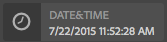
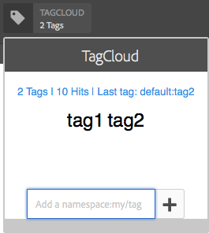

# Sample ContextHub UI Module Types {#sample-contexthub-ui-module-types}

ContextHub provides several sample UI modules that you can use in your solutions. The following information is provided:

* The main features of the UI module.
* Where to find the source code so that you can open it for learning purposes.
* How to configure the UI module.

For information about adding UI modules to ContextHub, see [Adding a UI Module](ch-configuring.md#adding-a-ui-module). For information about developing UI modules, see [Creating ContextHub UI Module Types](/help/sites-developing/ch-extend.md#creating-contexthub-ui-module-types).

## contexthub.base UI Module Type {#contexthub-base-ui-module-type}

The contexthub.base UI module type is the base type for all other UI module types. As such it provides generic features for rendering store data.

The following features are available:

* **Title and icon:** Specify a title for the UI module and an icon. The icon can be referenced using a URL or from the Coral UI icon library.
* **Store data:** Identify one or more stores from which to retrieve data.
* **Content:** Specify the content that appears in the UI module as it appears in the ContextHub toolbar.
* **Popover content:** Specify the content that appears in a popover when the UI module is clicked or tapped.
* **Fullscreen mode:** Control whether fullscreen mode is allowed.

The source code is located at /libs/granite/contexthub/code/ui/container/js/ContextHub.UI.BaseModuleRenderer.js.

### Configuration {#configuration}

Configure the contexthub.base UI module using a JavaScript object in JSON format. Include any of the following properties to configure the UI module features:

* **image:** A URL to an image to display as the icon.
* **icon:** The name of a [Coral UI icon](https://helpx.adobe.com/experience-manager/6-4/sites/developing/using/reference-materials/coral-ui/coralui3/Coral.Icon.html) class. If you specify a value for both the icon and image properties, the image is used.

* **title:** A title for the UI module. The title appears when the pointer is paused over the UI module icon.
* **fullscreen:** A boolean value that indicates whether the UI module supports fullscreen mode. Use `true` to support fullscreen and `false` to prevent fullscreen mode.

* **template:** A [Handlebars](https://handlebarsjs.com/) template that specifies the content to render in the ContextHub toolbar. Use at most two `<p>` tags.

* **storeMapping:** A key/store mapping. Use the key in Handlebar templates to access the associated ContextHub store data.
* **list:** An array of items to display as a list in a popover when the UI module is clicked. If you include this item, do not include popoverTemplate. The value is an array of objects with the following keys:

  * title: The text to display for this item
  * image: (Optional) A URL to an image that should be displayed on the left
  * icon: (Optional) A CUI icon class that should be displayed on the left; ignored if an image is specified
  * selected: (Optional) A boolean value that specifies whether this item should be displayed as selected (true=selected). By default, selected items appear, using a bold font. Use a `listType` property to configure other appearances (see below).

* **listType:** The style to use for popover list items. Use one of the following values:

  * checkmark
  * checkbox
  * radio

* **popoverTemplate:** A Handlebars template that specifies the content to render in the popover when the UI module is clicked. If you include this item, do not include the `list` item.

### Example {#example}

The following example configures a contexthub.base UI module to display information from a [contexthub.emulators](/help/sites-developing/ch-samplestores.md#granite-emulators-sample-store-candidate) store. The `template` item demonstrates how to obtain data from the store by using the key that the `storeMapping` item establishes.

```xml
{
   "icon": "coral-Icon--move",
    "title": "Screen Resolution",
    "storeMapping": {
      "emulator": "emulators"
    },
    "template": "<p>{{{ i18n \"Resolution\"}}}</p><p>{{{emulator.currentDevice.width}}} x {{{emulator.currentDevice.height}}}</p>"
}
```


## contexthub.browserinfo UI Module Type {#contexthub-browserinfo-ui-module-type}

The contexthub.browserinfo UI module displays information about the client web browser and operating system. Information is obtained from the surferinfo store, based on the [contexthub.surferinfo](/help/sites-developing/ch-samplestores.md#contexthub-surferinfo-sample-store-candidate) store candidate.


The source code for the UI module is located at /libs/granite/contexthub/components/modules/browserinfo. Although contexthub.browserinfo extends the contexthub.base UI module, it does not override or provide additional functions. The implementation provides a default configuration for rendering browser information.

### Configuration {#configuration-1}

Instances of the contexthub.browserinfo UI module do not require a value for the Detail Configuration. The following JSON text represents the default configuration of the module.

```xml
{
   "icon":"coral-Icon--globe",
   "title":"Browser/OS Information",
   "storeMapping":{"surferinfo":"surferinfo"},
   "template":"<p>{{surferinfo.browser.family}} {{surferinfo.browser.version}}</p><p>{{surferinfo.os.name}} {{surferinfo.os.version}}</p>"
}
```

## contexthub.datetime UI Module Type {#contexthub-datetime-ui-module-type}

The contexthub.datetime UI module displays the date and time that is stored in a store named datetime that is based on the [contexthub.datetime](/help/sites-developing/ch-samplestores.md#contexthub-datetime-sample-store-candidate) store candidate.



The module provides a popover form that enables you to change the date and time in the store.

The source of the contexthub.datetime UI module is located at /libs/granite/contexthub/components/modules/datetime.

### Configuration {#configuration-2}

Instances of the contexthub.datetime UI module do not require a value for the Detail Configuration. The following JSON text represents the default configuration of the module.

```xml
{
   "icon":"coral-Icon--clock",
   "title":"DATE&TIME",
   "clickable":true,
   "storeMapping":{"d":"datetime"},
   "template":"<p class=\"contexthub-module-line1\">{{i18n \"Date&Time\"}}</p><p class=\"contexthub-module-line2\">{{d.formatted.locale.date}} {{d.formatted.locale.time}}</p>",
   "popoverTemplate":"<div class=\"datetime center\"><div class=\"coral-DatePicker-calendar\" data-init=\"datepicker\"><input class=\"coral-Textfield\" type=\"datetime\" value=\"{{d.formatted.iso}}\"><button class=\"coral-Button coral-Button--secondary coral-Button--square\" title=\"{{i18n \"Datetime picker\"}}\"><i class=\"coral-Icon coral-Icon--calendar coral-Icon--sizeS\"></i></button></div></div>"
}
```

## contexthub.location UI Module Type {#contexthub-location-ui-module-type}

The contexthub.location UI module displays the longitude and latitude of the client. The module provides a popover that displays a Google map that you can click to change the current location. The module obtains information from a ContextHub store named geolocation that is based on the [contexthub.geolocation](/help/sites-developing/ch-samplestores.md#contexthub-geolocation-sample-store-candidate) store candidate.


The source of the UI module is located at /etc/cloudsettings/default/contexthub/geolocation.

### Configuration {#configuration-4}

Instances of the contexthub.location UI module do not require a value for the Detail Configuration. The following JSON text represents the default configuration of the module.

```xml
{
 "icon":"coral-Icon--compass",
 "title":"Location",
 "clickable":true,
 "editable":{"key":"/geolocation","disabled":[],"hidden":["/geolocation/generatedThumbnail","/geolocation/city","/geolocation/country"]},
 "fullscreen":true,
 "storeMapping":{"g":"geolocation"},
 "template":"<p>{{i18n \"Location\"}}</p><p>{{g.address.postalCode}} {{g.address.city}}{{#if g.address.city}}{{#if g.address.region}},{{/if}}{{/if}} {{g.address.region}}</p>",
 "list":[
  {"title":"Basel, Switzerland",
  "data":{"longitude":7.58929,"latitude":47.554746,"city":"Basel","country":"Switzerland"}},
  {"title":"Melbourne, Australia",
  "data":{"longitude":144.96328,"latitude":-37.814107,"city":"Melbourne","country":"Australia"}},
  {"title":"Beijing, China",
  "data":{"longitude":116.407526,"latitude":39.90403,"city":"Beijing","country":"China"}},
  {"title":"New York, NY, USA",
  "data":{"longitude":-74.005973,"latitude":40.714353,"city":"New York","country":"United States"}},
  {"title":"Paris, France",
  "data":{"longitude":2.352222,"latitude":48.856614,"city":"Paris","country":"France"}},
  {"title":"Rio de Janeiro, Brazil",
  "data":{"longitude":-43.20071,"latitude":-22.913395,"city":"Rio","country":"Brazil"}},
  {"title":"San Jose, CA, USA",
  "data":{"longitude":-121.894955,"latitude":37.339386,"city":"San Jose","country":"United States"}},
  {"title":"Tokyo, Japan",
  "data":{"longitude":139.691706,"latitude":35.689487,"city":"Shinjuku","country":"Japan"}}
 ],
 "listType":"checkmark"
}
```

## contexthub.screen-orientation UI Module Type {#contexthub-screen-orientation-ui-module-type}

The contexthub.screen-orientation UI module displays the current screen orientation of the client. Although disabled by default, the module provides a popover that enables you to select an orientation. The module obtains information from a ContextHub store named emulators that is based on the [granite.emulators](/help/sites-developing/ch-samplestores.md#granite-emulators-sample-store-candidate) store candidate.


The source of the UI module is located at /libs/granite/contexthub/components/modules/screen-orientation.

### Configuration {#configuration-5}

Instances of the contexthub.screen-orientation UI module do not require a value for the Detail Configuration. The following JSON text represents the default configuration of the module. The `clickable` property is `false` by default. If you override the default configuration to set `clickable` to `true`, clicking the module reveals a popup where you can select the orientation.

```xml
{
   "icon":"coral-Icon--rotateRight",
   "title":"Screen Orientation",
   "clickable":false,
   "storeMapping":{"emulator":"emulators"},
   "template":"<p>{{{ i18n \"Screen Orientation\" }}}</p><p>{{{ emulator.currentDevice.orientation }}}",
   "listReference":"/emulators/orientations",
   "listType":"checkmark"
}
```

## contexthub.tagcloud UI Module Type {#contexthub-tagcloud-ui-module-type}

The contexthub.tagcloud UI module displays information about tags. On the toolbar the UI module shows the number of tags. The popup reveals a tagcloud and a texbox for adding new tags. The UI module obtains information from a ContextHub store named tagcloud that is based on the [contexthub.tagcloud](/help/sites-developing/ch-samplestores.md#contexthub-tagcloud-sample-data-store) store candidate.



The source of the UI module is located at /libs/granite/contexthub/components/modules/tagcloud.

### Configuration {#configuration-6}

Instances of the contexthub.tagcloud UI module do not require a value for the Detail Configuration. The following JSON text represents the default configuration of the module.

```xml
{
   "icon":"coral-Icon--tag",
   "title":"TagCloud",
   "clickable":true,
   "storeMapping":{"t":"tagcloud"},
   "maxTags":20,
   "template":"<p class=\"contexthub-module-line1\">{{i18n \"TagCloud\"}}</p><p class=\"contexthub-module-line2\">{{stats.total}} {{i18n \"Tags\"}}</p>",
   "popoverTemplate":"<div class=\"contexthub-popover-content center\"><p class=\"stats\">{{stats.total}} {{i18n \"Tags\"}} | {{stats.hits}} {{i18n \"Hits\"}} | {{i18n \"Last tag\"}}: {{#if stats.recent}}{{stats.recent}}{{else}}{{i18n \"Unknown\"}}{{/if}}</p><p class=\"tagcloud\">{{#each tags}}<span class=\"tag{{this.weight}}\">{{this.name}}</span> {{/each}}</p><div class=\"coral-InputGroup\"><input type=\"text\" class=\"coral-InputGroup-input coral-Textfield tag-name\" placeholder=\"{{i18n \"Add a namespace:my/tag\"}}\" pattern=\"^[A-Za-z0-9_\\-]+(:[A-Za-z0-9_\\-\\/]+)?$\" title=\"{{i18n \"namespace:my/tag\"}}\"><span class=\"coral-InputGroup-button\"><button class=\"coral-Button coral-Button--secondary coral-Button--square contexthub-new-tag\" type=\"button\" title=\"{{i18n \"increment\"}}\"><i class=\"coral-Icon coral-Icon--sizeS coral-Icon--add\"></i></button></span></div></div>"
}
```

## granite.profile UI Module Type {#granite-profile-ui-module-type}

The granite.profile ContextHub UI module displays the display name of the current user. The popup reveals the login name of the user and enables you to change the value of the display name. The UI module obtains information from a ContextHub store named profile that is based on the [granite.profile](/help/sites-developing/ch-samplestores.md#granite-profile-sample-store-candidate) store candidate.


The source of the UI module is at /libs/granite/contexthub/components/modules/profile.

### Configuration {#configuration-7}

Instances of the grantie.profile UI module do not require a value for the Detail Configuration. The following JSON text represents the default configuration of the module.

```xml
{
   "icon":"coral-Icon--user",
   "title":"Profile",
   "clickable":true,
   "editable":{
      "key":"/profile",
      "disabled":["/profile/authorizableId"],
      "hidden":["/profile/avatar","/profile/path"]},
   "storeMapping":{"p":"profile"},
   "template":"<p class=\"contexthub-module-line1\">{{i18n \"Persona\"}}</p><p class=\"contexthub-module-line2\">{{p.displayName}}</p>",
   "listType":"checkmark"
}
```
