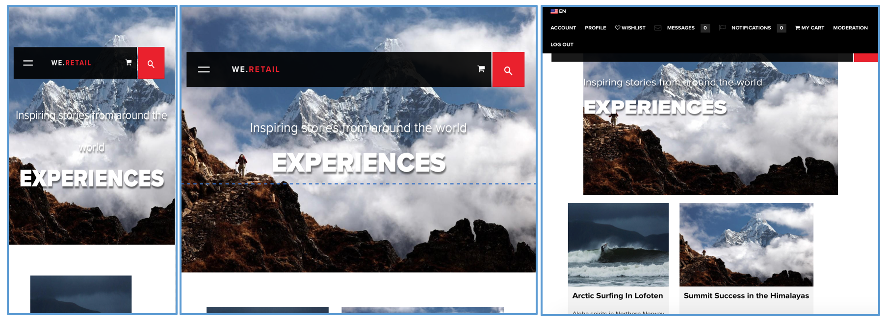
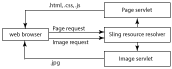

# Client Context in Detail{#client-context-in-detail}

>[!NOTE]
>
>Client Context has been superseded by ContextHub. Please see the [related documentation](/help/sites-developing/contexthub.md) for details.

The Client Context represents a dynamically assembled collection of user data. You can use the data to determine the content to show on a web page in a given situation (content targeting). The data is also available for web site analytics, and to any JavaScript on the page.

Client Context consists mainly of the following aspects:

* The session store that contains the user data.
* The UI that displays the user data and provides tools for simulating the user experience.
* A [JavaScript API](/help/sites-developing/ccjsapi.md) for interacting with session stores.

To create a standalone session store and add it to Client Context, or create a session store that is tied to a Context Store component. AEM installs several Context Store components that you can use right away. You can use these components as a basis for your components.

For information about opening Client Context, configuring the information that it displays, and simulating the user experience, see [Client Context](/help/sites-administering/client-context.md).

## Session Stores {#session-stores}

The Client Context includes various session stores that contain user data. Store data comes from the following sources:

* The client web browser.
* The server (see [JSONP Store](/help/sites-administering/client-context.md#main-pars-variable-8) for storing information from 3rd-party sources)

The Client Context framework provides a [JavaScript API](/help/sites-developing/ccjsapi.md) that you can use to interact with session stores to read and write user data, and listen and react to store events. You can also create session stores for user data that you use for content targeting or other purposes.

Session store data remains on the client. The Client Context does not write data back to the server. To send data to the server, use a form or develop custom JavaScript.

Each session store is a collection of property-value pairs. The session store represents a collection of data (of any kind), the conceptual meaning of which can be decided by the designer and/or developer. The following example JavaScript code defines an object that represents the profile data that session store might contain:

```
{
  age: 20,
  authorizableId: "aparker@geometrixx.info",
  birthday: "27 Feb 1992",
  email: "aparker@geometrixx.info",
  formattedName: "Alison Parker",
  gender: "female",
  path: "/home/users/geometrixx/aparker@geometrixx.info/profile"
}
```

A session store can be persisted across browser sessions, or can last only for the browser session in which it is created.

>[!NOTE]
>
>Store persistence uses either browser storage or cookies (the `SessionPersistence` cookie). Browser storage is more common.
>
>When the browser is closed and reopened, a session store can be loaded with the values from a persisted store. Clearing the browser cache is then needed to remove the old values.

### Context Store Components {#context-store-components}

A context store component is a CQ component that can be added to Client Context. Typically, context store components display data from a session store with which they are associated. However, the information that context store components display is not limited to session store data.

Context store components can include the following items:

* JSP scripts that define the appearance in Client Context.
* Properties for listing the component in Sidekick.
* Edit dialogs for configuring component instances.
* JavaScript that initializes the session store.

For a description of the installed Context Store Components that you can add to Context Store, see [Available Client Context Components](/help/sites-administering/client-context.md#available-client-context-components).

>[!NOTE]
>
>Page Data is no longer in the client context as a default component. If needed, you can add this by editing the client context, adding the **Generic Store Properties** component, then configuring this to define the **Store** as `pagedata`.

### Targeted Content Delivery {#targeted-content-delivery}

Profile information is also used for delivering [targeted content](/help/sites-authoring/content-targeting-touch.md).

 

## Adding Client Context To A Page {#adding-client-context-to-a-page}

Include the Client Context component to the body section of your web pages to enable Client Context. The path of the Client Context component node is `/libs/cq/personalization/components/clientcontext`. To include the component, add the following code to the JSP file of your page component, located just below the `body` element of your page:

```java
<cq:include path="clientcontext" resourceType="cq/personalization/components/clientcontext"/>
```

The clientcontext component causes the page to load the client libraries that implement Client Context.

* The Client Context JavaScript API.
* The Client Context framework that supports session stores, event management, etc.
* Segments that are defined.
* The init.js scripts that are generated for each context store component that has been added to Client Context.
* (Author instance only) The Client Context UI.

The Client Context UI is available only on the author instance.

## Extending Client Context {#extending-client-context}

To extend Client Context, create a session store and optionally display the store data:

* Create a session store for the user data that you need for content targeting and web analytics.
* Create a context store component to enable administrators to configure the associated session store, and to display store data in Client Context for testing purposes.

>[!NOTE]
>
>If you have (or create) a `JSONP` service that can provide the data, you can simply use the `JSONP` context store component and map it to the JSONP service. This will handle the session store.

### Creating a Session Store {#creating-a-session-store}

Create a session store for the data that you need to add to and retrieve from Client Context. Generally, you use the following procedure to create a session store:

1. Create a client library folder that has a `categories` property value of `personalization.stores.kernel`. Client Context automatically loads the client libraries of this category.

1. Configure the client library folder so that it has a dependency on the `personalization.core.kernel` client library folder. The `personalization.core.kernel` client library provides the Client Context JavaScript API.

1. Add the JavaScript that creates and initializes the session store.

Including the JavaScript in the personalization.stores.kernel client library causes the store to be created when the Client Context framework is loaded.

>[!NOTE]
>
>If you are creating a session store as part of a context store component, you can alternatively place the JavaScript in the init.js.jsp file of the component. In this case, the session store is created only if the component is added to Client Context.

#### Types of Session Stores {#types-of-session-stores}

Session stores are either created and available during a browser session, or are persisted in browser storage or cookies. The Client Context JavaScript API defines several classes that represent both types of data stores:

* ` [CQ_Analytics.SessionStore](/help/sites-developing/ccjsapi.md#cq-analytics-sessionstore)`: These objects reside only in the page DOM. The data is created and persisted during the lifetime of the page.
* ` [CQ_Analytics.PerstistedSessionStore](/help/sites-developing/ccjsapi.md#cq-analytics-persistedsessionstore)`: These objects reside in the page DOM and are persisted either in browser storage or cookies. The data is available across pages and across user sessions.

The API also provides extensions of these classes that are specialized for storing JSON data or JSONP data:

* Session-only objects: [CQ_Analytics.JSONStore](/help/sites-developing/ccjsapi.md#cq-analytics-jsonstore) and [CQ_Analytics.JSONPStore](/help/sites-developing/ccjsapi.md#cq-analytics-jsonpstore).

* Persisted objects: [CQ_Analytics.PersistedJSONStore](/help/sites-developing/ccjsapi.md#cq-analytics-persistedjsonstore) and [CQ_Analytics.PersistedJSONPStore](/help/sites-developing/ccjsapi.md#cq-analyics-persistedjsonpstore).

#### Creating the Session Store Object {#creating-the-session-store-object}

The JavaScript of your client library folder creates and initializes the session store. The session store must then be registered using Context Store Manager. The following example creates and registers a [CQ_Analytics.SessionStore](/help/sites-developing/ccjsapi.md#cq-analytics-sessionstore) object.

```
//Create the session store
if (!CQ_Analytics.MyStore) {
    CQ_Analytics.MyStore = new CQ_Analytics.SessionStore();
    CQ_Analytics.MyStore.STOREKEY = "MYSTORE";
    CQ_Analytics.MyStore.STORENAME = "mystore";
    CQ_Analytics.MyStore.data={};
}
//register the session store
if (CQ_Analytics.ClientContextMgr){
    CQ_Analytics.ClientContextMgr.register(CQ_Analytics.MyStore)
}
```

For storing JSON data, the following example creates and registers a [CQ_Analytics.JSONStore](/help/sites-developing/ccjsapi.md#cq-analytics-sessionstore) object.

```
if (!CQ_Analytics.myJSONStore) {
    CQ_Analytics.myJSONStore = CQ_Analytics.JSONStore.registerNewInstance("myjsonstore",{});
}
```

### Creating a Context Store Component {#creating-a-context-store-component}

Create a context store component to render session store data in Client Context. Once created, you can drag your context store component onto Client Context to render data from a session store. Context store components consist of the following items:

* JSP script for rendering the data.
* An edit dialog.
* A JSP script for initializing the session store.
* (Optional) A client library folder that creates the session store. There is no need to include the client library folder if the component uses an existing session store.

#### Extending the Provided Context Store Components {#extending-the-provided-context-store-components}

AEM provides the genericstore and the genericstoreproperties context store components that you can extend. The structure of your store data determines the component that you extend:

* Property-value pairs: Extend the `GenericStoreProperties` component. This component automatically renders stores of property-value pairs. Several interaction points are supplied:

    * `prolog.jsp` and `epilog.jsp`: component interaction that allows you to add server side logic before or after the component rendering.

* Complex data: Extend the `GenericStore` component. Your session store will then need a "renderer" method that will be called every time the component needs to be rendered. The renderer function is called with two parameters:

    * `@param {String} store`
      The store to render

    * `@param {String} divId`
      Id of the div into which the store has to be rendered.

>[!NOTE]
>
>All Client Context components are extensions of either the Generic Store or Generic Store Properties components. Several examples are installed in the `/libs/cq/personalization/components/contextstores` folder.

#### Configuring the Appearance in Sidekick {#configuring-the-appearance-in-sidekick}

When editing Client Context, context store components appear in Sidekick. As with all components, the `componentGroup` and `jcr:title` properties of the client context component determine the group and name of the component.

All components that have a `componentGroup` property value of `Client Context` appear in Sidekick by default. If you use a different value for the `componentGroup` property, you must manually add the component to Sidekick using Design mode.

#### Context Store Component Instances {#context-store-component-instances}

When you add a context store component to Client Context, a node that represents the component instance is created below `/etc/clientcontext/default/content/jcr:content/stores`. This node contains the property values that are configured using the edit dialog of the component.

When Client Context is initialized, these nodes are processed.

#### Initializing the Associated Session Store {#initializing-the-associated-session-store}

Add an init.js.jsp file to your component to generate JavaScript code that initializes the session store that your context store component uses. For example, use the initialization script to retrieve configuration properties for the component and use them to populate the session store.

The JavaScript that is generated is added to the page when Client Context is initialized on page load on both the author and publish instances. This JSP is executed before the context store component instance is loaded and rendered.

The code must set the mime type of the file to `text/javascript`, or it is not executed.

>[!CAUTION]
>
>The init.js.jsp script is run on the author and publish instance, but only if the context store component is added to Client Context.

The following procedure creates the init.js.jsp script file and adds the code that sets the correct mime type. The code that performs the store initialization would follow.

1. Right-click the context store component node and click Create &gt; Create File.
1. In the Name field, type `init.js.jsp` and then click OK.
1. At the top of the page, add the following code and then click Save All.

   ```java
   <%@page contentType="text/javascript" %>
   ```

### Rendering Session Store Data for genericstoreproperties Components {#rendering-session-store-data-for-genericstoreproperties-components}

Display session store data in Client Context using a consistent format.

#### Displaying Property Data {#displaying-property-data}

The personalization taglib provides the `personalization:storePropertyTag` tag that displays the value of a property from a session store. To use the tag, include the following line of code in your JSP file:

```xml
<%@taglib prefix="personalization" uri="https://www.day.com/taglibs/cq/personalization/1.0" %>
```

The tag has the following format:

```xml
<personalization:storePropertyTag propertyName="property_name" store="session_store_name"/>
```

The `propertyName` attribute is the name of the store property to display. The `store` attribute is the name of the registered store. The following example tag displays the value of the `authorizableId` property of the `profile` store:

```xml
<personalization:storePropertyTag propertyName="authorizableId" store="profile"/>
```

#### HTML Structure {#html-structure}

The personalization.ui client library folder (/etc/clientlibs/foundation/personalization/ui/themes/default) provides the CSS styles that Client Context uses to format the HTML code. The following code illustrates the suggested structure to use for displaying store data:

```xml
<div class="cq-cc-store">
   <div class="cq-cc-thumbnail">
      <div class="cq-cc-store-property">
           <!-- personalization:storePropertyTag for the store thumbnail image goes here -->
      </div>
   </div>
   <div class="cq-cc-content">
       <div class="cq-cc-store-property cq-cc-store-property-level0">
           <!-- personalization:storePropertyTag for a store property goes here -->
       </div>
       <div class="cq-cc-store-property cq-cc-store-property-level1">
           <!-- personalization:storePropertyTag for a store property goes here -->
       </div>
       <div class="cq-cc-store-property cq-cc-store-property-level2">
           <!-- personalization:storePropertyTag for a store property goes here -->
       </div>
       <div class="cq-cc-store-property cq-cc-store-property-level3">
           <!-- personalization:storePropertyTag for a store property goes here -->
       </div>
   </div>
   <div class="cq-cc-clear"></div>
</div>
```

The `/libs/cq/personalization/components/contextstores/profiledata` context store component uses this structure to display data from the profile session store. The `cq-cc-thumbnail` class places the thumbnail image. The `cq-cc-store-property-level*x*` classes format the alphanumeric data:

* level0, level1, and level2 are distributed vertically, and use a white font.
* level3, and any additional levels, are distributed horizontally, and use a white font with a darker background.



### Rendering Session Store Data for genericstore Components {#rendering-session-store-data-for-genericstore-components}

To render store data using a genericstore component, you need to:

* Add the personalization:storeRendererTag tag to the component JSP script to identify the name of the session store.
* Implement a renderer method on the session store class.

#### Identifying the genericstore Session Store {#identifying-the-genericstore-session-store}

The personalization taglib provides the `personalization:storePropertyTag` tag that displays the value of a property from a session store. To use the tag, include the following line of code in your JSP file:

```xml
<%@taglib prefix="personalization" uri="https://www.day.com/taglibs/cq/personalization/1.0" %>
```

The tag has the following format:

```java
<personalization:storeRendererTag store="store_name"/>
```

#### Implementing the Session Store renderer Method {#implementing-the-session-store-renderer-method}

Your session store will then need a "renderer" method that will be called every time the component needs to be rendered. The renderer function is called with two parameters:

* @param {String} store
  The store to render
* @param {String} divId
  Id of the div into which the store has to be rendered.

## Interacting with Session Stores {#interacting-with-session-stores}

Use JavaScript to interact with session stores.

### Accessing Session Stores {#accessing-session-stores}

Obtain a session store object to read or write data to the store. [CQ_Analytics.ClientContextMgr](/help/sites-developing/ccjsapi.md#cq-analytics-clientcontextmgr) provides access to stores based on the store name. Once obtained, use the methods of the [CQ_Analytics.SessionStore](/help/sites-developing/ccjsapi.md#cq-analytics-sessionstore) or [CQ_Analytics.PersistedSessionStore](/help/sites-developing/ccjsapi.md#cq-analytics-persistedsessionstore) to interact with store data.

The following example obtains the `profile` store and then retrieves the `formattedName` property from the store.

```
function getName(){
   var profilestore = CQ_Analytics.ClientContextMgr.getRegisteredStore("profile");
   if(profilestore){
      return profilestore.getProperty("formattedName", false);
   } else {
      return null;
   }
}
```

### Creating a Listener to react to a Session Store Update {#creating-a-listener-to-react-to-a-session-store-update}

Session stores fire events, so it is possible to add listeners and trigger events based on these events.

The session stores are built on the `Observable` pattern. They extend [ `CQ_Analytics.Observable`](/help/sites-developing/ccjsapi.md#cq-analytics-observable) that provides the ` [addListener](/help/sites-developing/ccjsapi.md#addlistener-event-fct-scope)` method.

The following example adds a listener to the `update` event of the `profile` session store.

```
var profileStore = ClientContextMgr.getRegisteredStore("profile");
if( profileStore ) {
  //callback execution context
  var executionContext = this;

  //add "update" event listener to store
  profileStore.addListener("update",function(store, property) {
    //do something on store update

  },executionContext);
}
```

### Checking that a Session Store is defined and initialized {#checking-that-a-session-store-is-defined-and-initialized}

Session stores are not available until they are loaded and initialized with data. The following factors can affect the timing of session store availability:

* Page loading
* JavaScript loading
* JavaScript execution time
* Response times for XHR requests
* Dynamic changes to the session store

Use the [CQ_Analytics.ClientContextUtils](/help/sites-developing/ccjsapi.md#cq-analytics-clientcontextutils) object's [onStoreRegistered](/help/sites-developing/ccjsapi.md#onstoreregistered-storename-callback) and [onStoreInitialized](/help/sites-developing/ccjsapi.md#onstoreinitialized-storename-callback-delay) methods to access session stores only when they are available. These methods enable you to register event listeners that react to session registration and initialization events.

>[!CAUTION]
>
>If you depend on another store, you need to cater for the case of when the store is never registered.

The following example uses the `onStoreRegistered` event of the `profile` session store. When the store is registered, a listener is added to the `update` event of the session store. When the store is updated, the content of the `<div class="welcome">` element on the page is updated with the name from the `profile` store.

```
//listen for the store registration
CQ_Analytics.ClientContextUtils.onStoreRegistered("profile", listen);

//listen for the store's update event
function listen(){
 var profilestore = CQ_Analytics.ClientContextMgr.getRegisteredStore("profile");
    profilestore.addListener("update",insertName);
}

//insert the welcome message
function insertName(){
 $("div.welcome").text("Welcome "+getName());
}

//obtain the name from the profile store
function getName(){
 var profilestore = CQ_Analytics.ClientContextMgr.getRegisteredStore("profile");
 if(profilestore){
  return profilestore.getProperty("formattedName", false);
    } else {
        return null;
    }
}
```

### Excluding a Property from the sessionpersistence Cookie {#excluding-a-property-from-the-sessionpersistence-cookie}

To prevent a property of a `PersistedSessionStore` from being persisted (i.e. exclude it from the `sessionpersistence` cookie), add the property to the non-persisted property list of the persisted session store.

See ` [CQ_Analytics.PersistedSessionStore.setNonPersisted(propertyName)](/help/sites-developing/ccjsapi.md#setnonpersisted-name)`

```
CQ_Analytics.ClientContextUtils.onStoreRegistered("surferinfo", function(store) {
  //this will exclude the browser, OS and resolution properties of the surferinfo session store from the
  store.setNonPersisted("browser");
  store.setNonPersisted("OS");
  store.setNonPersisted("resolution");
});
```

## Configuring the Device Slider {#configuring-the-device-slider}

### Conditions {#conditions}

The current page must have a corresponding mobile page; this is determined only if page has a LiveCopy configured with a mobile rollout configuration ( `rolloutconfig.path.toLowerCase` contains `mobile`).

#### Configuration {#configuration}

When switching from the desktop page to its mobile equivalent:

* The DOM of the mobile page is loaded.
* The main `div` (required) that contains the content, is extracted and injected into the current desktop page.

* The CSS and body classes that need to be loaded need to be manually configured.

For example:

```
window.CQMobileSlider["geometrixx-outdoors"] = {
  //CSS used by desktop that need to be removed when mobile
  DESKTOP_CSS: [
    "/etc/designs/${app}/clientlibs_desktop_v1.css"
  ],

  //CSS used by mobile that need to be removed when desktop
  MOBILE_CSS: [
    "/etc/designs/${app}/clientlibs_mobile_v1.css"
  ],

  //id of the content that needs to be removed when mobile
  DESKTOP_MAIN_ID: "main",

  //id of the content that needs to be removed when desktop
  MOBILE_MAIN_ID: "main",

  //body classes used by desktop that need to be removed when mobile
  DESKTOP_BODY_CLASS: [
    "page"
  ],

  //body classes used by mobile that need to be removed when desktop
  MOBILE_BODY_CLASS: [
    "page-mobile"
  ]
};
```

## Example: Creating a Custom Context Store Component {#example-creating-a-custom-context-store-component}

In this example, you create a context store component that retrieves data from an external service and stores it in the session store:

* Extends the genericstoreproperties component.
* Initializes a store using a CQ_Analytics.JSONPStore JavaScript object.
* Calls a JSONP service to retrieve data and add it to the store.
* Renders the data in Client Context.

### Add the geoloc Component {#add-the-geoloc-component}

Create a CQ application and add the geoloc component.

1. Open CRXDE Lite in your web browser ([https://localhost:4502/crx/de](https://localhost:4502/crx/de)).
1. Right-click the `/apps` folder and click Create > Create Folder. Specify a name of `myapp` and then click OK.
1. Similarly, below `myapp`, create a folder named `contextstores`. ``
1. Right-click the `/apps/myapp/contextstores` folder and click Create &gt; Create Component. Specify the following property values and click Next:

    * Label: geoloc
    * Title: Location Store
    * Super Type: cq/personalization/components/contextstores/genericstoreproperties
    * Group: Client Context

1. In the Create Component dialog, click Next on each page until the OK button is enabled, and then click OK.
1. Click Save All.

### Create the geoloc Edit Dialog {#create-the-geoloc-edit-dialog}

The context store component requires an edit dialog. The geoloc edit dialog will contain a static message that indicates that there are no properties to configure.

1. Right-click the `/libs/cq/personalization/components/contextstores/genericstoreproperties/dialog` node and click Copy.
1. Right-click the `/apps/myapp/contextstores/geoloc` node and click paste.
1. Delete all of the child nodes below the /apps/myapp/contextstores/geoloc/dialog/items/items/tab1/items node:

    * store
    * properties
    * thumbnail

1. Right-click the `/apps/myapp/contextstores/geoloc/dialog/items/items/tab1/items` node and click Create &gt; Create Node. Specify the following property values and click OK:

    * Name: static
    * Type: cq:Widget

1. Add the following properties to the node:

   | Name |Type |Value |
   |---|---|---|
   | cls |String |x-form-fieldset-description |
   | text |String |The geoloc component requires no configuration. |
   | xtype |String |static |

1. Click Save All.

   

### Create the Initialization Script {#create-the-initialization-script}

Add an init.js.jsp file to the geoloc component and use it to create the session store, retrieve the location data, and add it to the store.

The init.js.jsp file is executed when the Client Context is loaded by the page. By this time, the Client Context JavaScript API is loaded and available to your script.

1. Right-click the /apps/myapp/contextstores/geoloc node and click Create &gt; Create File. Specify a Name of init.js.jsp and click OK.
1. Add the following code to the top of the page and then click Save All.

   ```java
   <%@page contentType="text/javascript;charset=utf-8" %><%
   %><%@include file="/libs/foundation/global.jsp"%><%
   log.info("***** initializing geolocstore ****");
   String store = "locstore";
   String jsonpurl = "https://api.wipmania.com/jsonp?callback=${callback}";

   %>
   var locstore = CQ_Analytics.StoreRegistry.getStore("<%= store %>");
   if(!locstore){
    locstore = CQ_Analytics.JSONPStore.registerNewInstance("<%= store %>", "<%= jsonpurl %>",{});
   }
   <% log.info(" ***** done initializing geoloc ************"); %>
   ```

### Render the geoloc Session Store Data {#render-the-geoloc-session-store-data}

Add the code to the JSP file of the geoloc component to render the store data in Client Context.



1. In CRXDE Lite, open the `/apps/myapp/contextstores/geoloc/geoloc.jsp` file.
1. Add the following HTML code below the stub code:

   ```xml
   <%@taglib prefix="personalization" uri="https://www.day.com/taglibs/cq/personalization/1.0" %>
   <div class="cq-cc-store">
      <div class="cq-cc-content">
          <div class="cq-cc-store-property cq-cc-store-property-level0">
              Continent: <personalization:storePropertyTag propertyName="address/continent" store="locstore"/>
          </div>
          <div class="cq-cc-store-property cq-cc-store-property-level1">
              Country: <personalization:storePropertyTag propertyName="address/country" store="locstore"/>
          </div>
          <div class="cq-cc-store-property cq-cc-store-property-level2">
              City: <personalization:storePropertyTag propertyName="address/city" store="locstore"/>
          </div>
          <div class="cq-cc-store-property cq-cc-store-property-level3">
              Latitude: <personalization:storePropertyTag propertyName="latitude" store="locstore"/>
          </div>
          <div class="cq-cc-store-property cq-cc-store-property-level4">
              Longitude: <personalization:storePropertyTag propertyName="longitude" store="locstore"/>
          </div>
      </div>
       <div class="cq-cc-clear"></div>
   </div>
   ```

1. Click Save All.

### Add the Component to Client Context {#add-the-component-to-client-context}

Add the Location Store component to Client Context so that it is initialized when the page loads.

1. Open the Geometrixx Outdoors home page on the author instance ([https://localhost:4502/content/geometrixx-outdoors/en.html](https://localhost:4502/content/geometrixx-outdoors/en.html)).
1. Click Ctrl-Alt-c (windows) or control-option-c (Mac) to open Client Context.
1. Click the edit icon at the top of Client Context to open Client Context Designer.

   

1. Drag the Location Store component to Client Context.

### See the Location Information in Client Context {#see-the-location-information-in-client-context}

Open the Geometrixx Outdoors home page in edit mode and then open Client Context to see the data from the Location Store component.

1. Open the English page of the Geometrixx Outdoors site. ([https://localhost:4502/content/geometrixx-outdoors/en.html](https://localhost:4502/content/geometrixx-outdoors/en.html))
1. To open Client Context, press Ctrl-Alt-c (windows) or control-option-c (Mac).

## Creating a Customized Client Context {#creating-a-customized-client-context}

To create a second client context you need to duplicate the branch:

`/etc/clientcontext/default`

* The subfolder:
  `/content`
  will contain the content of the customized client context.

* The folder:
  `/contextstores`
  allows you to define different configurations for the context stores.

To use your customized client context, edit the property
`path`
in the design style of the client context component, as included in the page template. For example, as the standard location of:
`/libs/cq/personalization/components/clientcontext/design_dialog/items/path`
