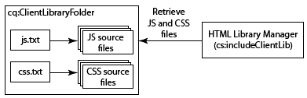
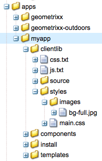

# Using Client-Side Libraries{#using-client-side-libraries}

Modern websites rely heavily on client-side processing driven by complex JavaScript and CSS code. Organizing and optimizing the serving of this code can be a complicated issue.

To help deal with this issue, AEM provides **Client-side Library Folders**, which let you store your client-side code in the repository, organize it into categories, and define when and how each category of code is to be served to the client. The client-side library system then takes care of producing the correct links in your final webpage to load the correct code.

## How Client-Side Libraries Work in AEM {#how-client-side-libraries-work-in-aem}

The standard way to include a client-side library (that is, a JS or CSS file) in the HTML of a page is simply to include a `<script>` or `<link>` tag in the JSP for that page, containing the path to the file in question. For example,

```xml
...
<head>
   ...
   <script type="text/javascript" src="/etc/clientlibs/granite/jquery/source/1.8.1/jquery-1.8.1.js"></script>
   ...
</head>
...
```

While this approach works in AEM, it can lead to problems when pages and their constituent components become complex. In such cases there is the danger that multiple copies of the same JS library may be included in the final HTML output. To avoid this and to allow logical organization of client-side libraries AEM uses **client-side library folders**.

A client-side library folder is a repository node of type `cq:ClientLibraryFolder`. Its definition in [CND notation](https://jackrabbit.apache.org/node-type-notation.html) is

```shell
[cq:ClientLibraryFolder] > sling:Folder
  - dependencies (string) multiple
  - categories (string) multiple
  - embed (string) multiple
  - channels (string) multiple
```

By default, `cq:ClientLibraryFolder` nodes can be placed anywhere within the `/apps`, `/libs` and `/etc` subtrees of the repository (these defaults, and other settings can be controlled through the **Adobe Granite HTML Library Manager** panel of the [System Console](https://localhost:4502/system/console/configMgr)).

Each `cq:ClientLibraryFolder` is populated with a set of JS and/or CSS files, along with a few supporting files (see below). The properties of the `cq:ClientLibraryFolder` are configured as follows:

* `categories`: Identifies the categories into which the set of JS and/or CSS files within this `cq:ClientLibraryFolder` fall. The `categories` property, being multi-valued, allows a library folder to be part of more than one category (see below for how this may be useful).

* `dependencies`: This is a list of other client library categories on which this library folder depends. For example, given two `cq:ClientLibraryFolder` nodes `F` and `G`, if a file in `F` requires another file in `G` to function properly, then at least one of the `categories` of `G` should be among the `dependencies` of `F`.

* `embed`: Used to embed code from other libraries. If node F embeds nodes G and H, the resulting HTML will be a concetration of content from nodes G and H.
* `allowProxy`: If a client library is located under `/apps`, this property allows acces to it via proxy servlet. See [Locating a Client Library Folder and Using the Proxy Client Libraries Servlet](/help/sites-developing/clientlibs.md#locating-a-client-library-folder-and-using-the-proxy-client-libraries-servlet) below.

## Referencing Client-Side Libraries {#referencing-client-side-libraries}

Because HTL is the preferred technology for developing AEM sites, HTL should be used to include client-side libraries in AEM. However it is also possible to do so using JSP.

### Using HTL {#using-htl}

In HTL, client libraries are loaded through a helper template provided by AEM, which can be accessed through [ `data-sly-use`](https://helpx.adobe.com/experience-manager/htl/using/block-statements.html#use). Three templates are available in this file, which can be called through [ `data-sly-call`](https://helpx.adobe.com/experience-manager/htl/using/block-statements.html#template-call):

* **css** - Loads only the CSS files of the referenced client libraries.
* **js** - Loads only the JavaScript files of the referenced client libraries.
* **all** - Loads all the files of the referenced client libraries (both CSS and JavaScript).

Each helper template expects a `categories` option for referencing the desired client libraries. That option can be either an array of string values, or a string containing a comma separated values list.

For further details and exmple of usage, see the document [Getting Started with the HTML Template Language](https://helpx.adobe.com/experience-manager/htl/using/getting-started.html#loading-client-libraries).

### Using JSP {#using-jsp}

Add a `ui:includeClientLib` tag to your JSP code to add a link to client libraries in the generated HTML page. To reference the libraries, you use the value of the `categories` property of the `ui:includeClientLib` node.

```
<%@taglib prefix="ui" uri="https://www.adobe.com/taglibs/granite/ui/1.0" %>
<ui:includeClientLib categories="<%= categories %>" />
```

For example, the `/etc/clientlibs/foundation/jquery` node is of type `cq:ClientLibraryFolder` with a categories property of value `cq.jquery`. The following code in a JSP file references the libraries:

```xml
<ui:includeClientLib categories="cq.jquery"/>
```

The generated HTML page contains the following code:

```xml
<script type="text/javascript" src="/etc/clientlibs/foundation/jquery.js"></script>
```

For complete information, including attributes for filtering JS, CSS, or theme libraries, see [ui:includeClientLib](/help/sites-developing/taglib.md#lt-ui-includeclientlib).

>[!CAUTION]
>
>`<cq:includeClientLib>`, which in the past was commonly used to include client libraries, has been deprecated since AEM 5.6. [ `<ui:includeClientLib>`](/help/sites-developing/taglib.md#lt-ui-includeclientlib) should be used instead as detailed above.

## Creating Client Library Folders {#creating-client-library-folders}

Create a `cq:ClientLibraryFolder` node to define JavaScript and Cascading Style Sheet libraries and make them available to HTML pages. Use the `categories` property of the node to identify the library categories to which it belongs.

The node contains one or more source files that, at runtime, are merged into a single JS and/or CSS file. The name of the generated file is the node name with either the `.js` or `.css` file name extension. For example, the library node named `cq.jquery` results in the generated file named `cq.jquery.js` or `cq.jquery.css`.

Client library folders contain the following items:

* The JS and/or CSS source files to merge.
* Resources that support CSS styles, such as image files.

  **Note:** You can use subfolders to organize source files.
* One `js.txt` file and/or one `css.txt` file that identifies the source files to merge in the generated JS and/or CSS files.



For information about requirements that are specific to client libraries for widgets, see [Using and Extending Widgets](/help/sites-developing/widgets.md).

The web client must have permissions to access the `cq:ClientLibraryFolder` node. You can also expose libraries from secured areas of the repository (see Embedding Code From Other Libraries, below).

### Overriding Libraries in /lib {#overriding-libraries-in-lib}

Client library folders located below `/apps` take precedence over same-named folders that are similarly in `/libs`. For example, `/apps/cq/ui/widgets` takes precedence over `/libs/cq/ui/widgets`. When these libraries belong to the same category, the library below `/apps` is used.

### Locating a Client Library Folder and Using the Proxy Client Libraries Servlet {#locating-a-client-library-folder-and-using-the-proxy-client-libraries-servlet}

In previous versions, client library folders were located below `/etc/clientlibs` in the repository. This is still supported, however it is recommended that client libraries now be located under `/apps`. This is to locate the client libraries near the other scripts, which are generally found below `/apps` and `/libs`.

>[!NOTE]
>
>Static resources below the client library folder must be in a folder called *resources*. If you do not have the static resources, such as images, under the folder *resources*, it cannot be referenced on a publish instance. Here is an example: https://localhost:4503/etc.clientlibs/geometrixx/components/clientlibs/resources/example.gif

>[!NOTE]
>
>To better isolate code from content and configuration, it is recommended to locate client libraries under `/apps` and expose them via `/etc.clientlibs` by using the `allowProxy` property.

In order for the client libraries under `/apps` to be accessible, a proxy servlet is used. The ACLs are still enforced on the client library folder, but the servlet allows for the content to be read via `/etc.clientlibs/` if the `allowProxy` property is set to `true`.

A static resource can only be accessed via the proxy, if it resides below a resource below the client library folder.

As an example:

* You have a clientlib in `/apps/myprojects/clientlibs/foo`
* You have a static image in `/apps/myprojects/clientlibs/foo/resources/icon.png`

Then you set the `allowProxy` property on `foo` to true.

* You can then request `/etc.clientlibs/myprojects/clientlibs/foo.js`
* You can then reference the image via `/etc.clientlibs/myprojects/clientlibs/foo/resources/icon.png`

>[!CAUTION]
>
>When using proxied client libraries, the AEM Dispatcher configuration may require an update to ensure the URIs with the extension clientlibs are allowed.

>[!CAUTION]
>
>Adobe recommends locating client libraries under `/apps` and making them available using the proxy servlet. However keep in mind that best practice still requires that public sites never include anything that is served directly over an `/apps` or `/libs` path.

### Create a Client Library Folder {#create-a-client-library-folder}

1. Open CRXDE Lite in a web browser ([https://localhost:4502/crx/de](https://localhost:4502/crx/de)).
1. Select the folder where you want to locate the client library folder and click **Create &gt; Create Node**.
1. Enter a name for the library file, and in the Type list select `cq:ClientLibraryFolder`. Click **OK** and then click **Save All**.
1. To specify the category or categories that the library belongs to, select the `cq:ClientLibraryFolder` node, add the following property, and then click **Save All**:

    * Name: categories
    * Type: String
    * Value: The category name
    * Multi: Select

1. Add source files to the library folder by any means. For example, use a WebDav client to copy files, or create a file and author the content manually.

   **Note:** You can organize source files in subfolders if desired.

1. Select the client library folder and click **Create &gt; Create file**.
1. In the file name box, type one of the following file names and click OK:

    * **`js.txt`:** Use this file name to generate a JavaScript file.
    * **`css.txt`:** Use this file name to generate a Cascading Style Sheet.

1. Open the file and type the following text to identify the root of the path of the source files:

   `#base=*[root]*`

   Replace * `[root]`* with the path to the folder that contains the source files, relative to the TXT file. For example, use the following text when the source files are in the same folder as the TXT file:

   `#base=.`

   The following code sets the root as the folder named mobile below the `cq:ClientLibraryFolder` node:

   `#base=mobile`

1. On the lines below `#base=[root]`, type the paths of the source files relative to the root. Place each file name on a separate line.
1. Click **Save All**.

### Linking to Dependencies {#linking-to-dependencies}

When the code in your client library folder references other libraries, identify the other libraries as dependencies. In the JSP, the `ui:includeClientLib` tag that references your client library folder causes the HTML code to include a link to your generated library file and the dependencies.

The dependencies must be another `cq:ClientLibraryFolder`. To identify dependencies, add a property to your `cq:ClientLibraryFolder` node with the following attributes:

* **Name:** dependencies
* **Type:** String[]
* **Values:** The value of the categories property of the cq:ClientLibraryFolder node that the current library folder depends on.

For example, the / `etc/clientlibs/myclientlibs/publicmain` has a dependency on the `cq.jquery` library. The JSP that references the main client library generates HTML that includes the following code:

```xml
<script src="/etc/clientlibs/foundation/cq.jquery.js" type="text/javascript">
<script src="/etc/clientlibs/mylibs/publicmain.js" type="text/javascript">
```

### Embedding Code From Other Libraries {#embedding-code-from-other-libraries}

You can embed code from a client library into another client library. At runtime, the generated JS and CSS files of the embedding library includes the code of the embedded library.

Embedding code is useful for providing access to libraries that are stored in secured areas of the repository.

#### App-Specific Client Library Folders {#app-specific-client-library-folders}

It is a best practice to keep all application-related files in their application folder below `/apps`. It is also a best practice to deny access for web site visitors to the `/apps` folder. To satisfy both best practices, create a client library folder below `/apps`, and make it accessible through the proxy servlet as described under [Locating a Client Library Folder and Using the Proxy Client Libraries Servlet](/help/sites-developing/clientlibs.md#locating-a-client-library-folder-and-using-the-proxy-client-libraries-servlet).

Use the categories property to identify the client library folder to embed. To embed the library, add a property to the embedding `cq:ClientLibraryFolder` node, using the following property attributes:

* **Name:** embed
* **Type:** String[]
* **Value:** The value of the categories property of the `cq:ClientLibraryFolder` node to embed.

#### Using Embedding to Minimize Requests {#using-embedding-to-minimize-requests}

In some cases you may find that the final HTML generated for typical page by your publish instance includes a relatively large number of `<script>` elements, particularly if your site is using client context information for analaytics or targeting. For example, in a non-optimized project you might find the following series of `<script>` elements in the HTML for a page:

```xml
<script type="text/javascript" src="/etc/clientlibs/granite/jquery.js"></script>
<script type="text/javascript" src="/etc/clientlibs/granite/utils.js"></script>
<script type="text/javascript" src="/etc/clientlibs/granite/jquery/granite.js"></script>
<script type="text/javascript" src="/etc/clientlibs/foundation/jquery.js"></script>
<script type="text/javascript" src="/etc/clientlibs/foundation/shared.js"></script>
<script type="text/javascript" src="/etc/clientlibs/foundation/personalization/kernel.js"></script>
```

In such cases, it can be useful to combine all the required client library code in to a single file so that the number of back and forth requests on page load is reduced. To do this you can `embed` the required libraries into you app-specific client library using the embed property of the `cq:ClientLibraryFolder` node.

The following client library categories are incuded with AEM. You should embed only those that are required for he functioning of your particular site. However, **you should maintain the order listed here**:

1. `browsermap.standard`
1. `browsermap`
1. `jquery-ui`
1. `cq.jquery.ui`
1. `personalization`
1. `personalization.core`
1. `personalization.core.kernel`
1. `personalization.clientcontext.kernel`
1. `personalization.stores.kernel`
1. `personalization.kernel`
1. `personalization.clientcontext`
1. `personalization.stores`
1. `cq.collab.comments`
1. `cq.collab.feedlink`
1. `cq.collab.ratings`
1. `cq.collab.toggle`
1. `cq.collab.forum`
1. `cq.cleditor`

#### Paths in CSS Files {#paths-in-css-files}

When you embed CSS files, the generated CSS code uses paths to resources that are relative to the embedding library. For example, the publicly-accessible library `/etc/client/libraries/myclientlibs/publicmain` embeds the `/apps/myapp/clientlib` client library:



The `main.css` file contains the following style:

```xml
body {
  padding: 0;
  margin: 0;
  background: url(images/bg-full.jpg) no-repeat center top;
  width: 100%;
}
```

The CSS file that the `publicmain` node generates contains the following style, using the URL of the original image:

```xml
body {
  padding: 0;
  margin: 0;
  background: url(../../../apps/myapp/clientlib/styles/images/bg-full.jpg) no-repeat center top;
  width: 100%;
}
```

### Using a Library for Specific Mobile Groups {#using-a-library-for-specific-mobile-groups}

Use the `channels` property of a client library folder to identify the mobile group that uses the library. The `channels` property is useful when libraries of the same category are designed for different device capabilities.

To associate a client library folder with a device group, add a property to your `cq:ClientLibraryFolder` node with the following attributes:

* **Name:** channels
* **Type:** String[]
* **Values:** The name of the mobile group. To exclude the library folder from a group, prefix the name with an exclamation mark ("!").

For example, the following table lists the value of the `channels` property for each client library folder of the `cq.widgets` category:

| Client library folder |Value of channels property |
|---|---|
| `/libs/cq/analytics/widgets` | `!touch` |
| `/libs/cq/analytics/widgets/themes/default` | `!touch` |
| `/libs/cq/cloudserviceconfigs/widgets` | `!touch` |
| `/libs/cq/touch/widgets` | `touch` |
| `/libs/cq/touch/widgets/themes/default` | `touch` |
| `/libs/cq/ui/widgets` | `!touch` |
| `/libs/cq/ui/widgets/themes/default` | `!touch` |

<!-- Search&Promote is end of life as of September 1, 2022 | `/libs/cq/searchpromote/widgets` | `!touch` | -->
<!-- Search&Promote is end of life as of September 1, 2022 | `/libs/cq/searchpromote/widgets/themes/default` |*[no value]* -->

## Using Preprocessors {#using-preprocessors}

AEM allows for pluggable preprocessors and ships with support for [YUI Compressor](https://github.com/yui/yuicompressor#yui-compressor---the-yahoo-javascript-and-css-compressor) for CSS and JavaScript and [Google Closure Compiler (GCC)](https://developers.google.com/closure/compiler/) for JavaScript with YUI set as AEM's default preprocessor.

The pluggable preprocessors allow for flexible usage including:

* Defining ScriptProcessors that can process script sources
* Processors are configurable with options
* Processors can be used for minification, but also for non-minified cases
* The clientlib can define which processor to use

>[!NOTE]
>
>By default, AEM uses the YUI Compressor. See the [YUI Compressor GitHub documentation](https://github.com/yui/yuicompressor/issues) for a list of known issues. Switching to GCC compressor for particular clientlibs may solve some issues observed when using YUI.

>[!CAUTION]
>
>Do not place a minified library in a client library. Instead provide the raw library and if minification is required, use the options of the preprocessors.

### Usage {#usage}

You can choose to configure the preprocessors configuration per clientlibrary or system-wide.

* Add the multivalue properties `cssProcessor` and `jsProcessor` on the clientlibrary node

* Or define the system default configuration via the **HTML Library Manager** OSGi configuration

A preprocessor configuration on the clientlib node takes precedence over the OSGI configuration.

### Format and Examples {#format-and-examples}

#### Format {#format}

```xml
config:= mode ":" processorName options*;
mode:= "default" | "min";
processorName := "none" | <name>;
options := ";" option;
option := name "=" value;
```

#### YUI Compressor for CSS Minification and GCC for JS {#yui-compressor-for-css-minification-and-gcc-for-js}

```xml
cssProcessor: ["default:none", "min:yui"]
jsProcessor: ["default:none", "min:gcc;compilationLevel=advanced"]
```

#### Typescript to Preprocess and Then GCC to Minify and Obfuscate {#typescript-to-preprocess-and-then-gcc-to-minify-and-obfuscate}

```xml
jsProcessor: [
   "default:typescript",
   "min:typescript",
   "min:gcc;obfuscate=true"
]

```

#### Additional GCC Options {#additional-gcc-options}

```xml
failOnWarning (defaults to "false")
languageIn (defaults to "ECMASCRIPT5")
languageOut (defaults to "ECMASCRIPT5")
compilationLevel (defaults to "simple") (can be "whitespace", "simple", "advanced")
```

For further details on GCC options, see the [GCC documentation](https://developers.google.com/closure/compiler/docs/compilation_levels).

### Set System Default Minifier {#set-system-default-minifier}

YUI is set as the default minifier in AEM. To change this to GCC, follow these steps.

1. Go to Apache Felix Config Manager at [https://localhost:4502/system/console/configMgr](https://localhost:4502/system/console/configMgr)
1. Find and edit the **Adobe Granite HTML Library Manager**.
1. Enable the **Minify** option (if not already enabled).
1. Set the value **JS Processor Default Configs** to `min:gcc`.

   Options can be passed if separated with a semicolon for example, `min:gcc;obfuscate=true`.

1. Click **Save** to save the changes.

## Debugging Tools {#debugging-tools}

AEM provides several tools for debugging and testing client library folders.

### See Embedded Files {#see-embedded-files}

To trace the origin of embedded code, or to ensure that embedded client libraries are producing the expected results, you can see the names of the files that are being embedded at runtime. To see the file names, append the `debugClientLibs=true` parameter to the URL of your web page. The library that is generated contains `@import` statements instead of the embedded code.

In the example in the previous [Embedding Code From Other Libraries](/help/sites-developing/clientlibs.md#embedding-code-from-other-libraries) section, the `/etc/client/libraries/myclientlibs/publicmain` client library folder embeds the `/apps/myapp/clientlib` client library folder. Appending the parameter to the web page produces the following link in the web page's source code:

```xml
<link rel="stylesheet" href="/etc/clientlibs/mycientlibs/publicmain.css">
```

Opening the `publicmain.css` file reveals the following code:

```xml
@import url("/apps/myapp/clientlib/styles/main.css");
```

1. In the address box of your web browser, append the following text to the URL of your HTML:

   `?debugClientLibs=true`
1. When the page loads, view the page source.
1. Click the link that is provided as the href for the link element to open the file and view the source code.

### Discover Client Libraries {#discover-client-libraries}

The `/libs/cq/granite/components/dumplibs/dumplibs` component generates a page of information about all client library folders on the system. The `/libs/granite/ui/content/dumplibs` node has the component as a resource type. To open the page, use the following URL (changing the host and port as required):

`https://<host>:<port>/libs/granite/ui/content/dumplibs.test.html`

The information includes the library path and type (CSS or JS), and the values of the library attributes, such as categories and dependencies. Subsequent tables on the page show the libraries in each category and channel.

### See Generated Output {#see-generated-output}

The `dumplibs` component includes a test selector that displays the source code that is generated for `ui:includeClientLib` tags. The page includes code for different combinations of js, css, and themed attributes.

1. Use one of the following methods to open the Test Output page:

    * From the `dumplibs.html` page, click the link in the **Click here for output testing** text.

    * Open the following URL in your web browser (use a different host and port as required):

      * `http://<host>:<port>/libs/granite/ui/content/dumplibs.html`

   The default page shows output for tags with no value for the categories attribute.

1. To see the output for a category, type the value of the client library's `categories` property and click **Submit Query**.

## Configuring Library Handling for Development and Production {#configuring-library-handling-for-development-and-production}

The HTML Library Manager service processes `cq:ClientLibraryFolder` tags and generates the libraries at runtime. The type of environment, development or production, determines how you should configure the service:

* Increase security: Disable debugging
* Improve performance: Remove whitespace and compress libraries.
* Improve readability: Include whitespace and do not compress.

For information about configuring the service, see [AEM HTML Library Manager](/help/sites-deploying/osgi-configuration-settings.md#aemhtmllibrarymanager).
