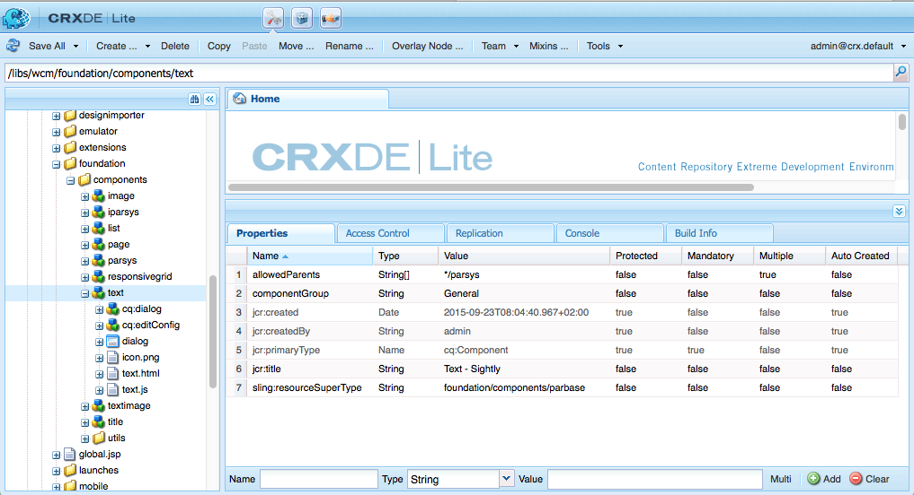
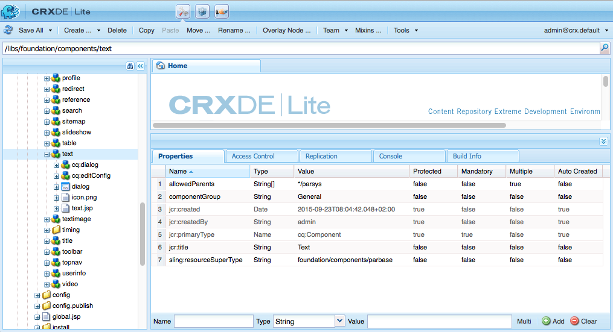
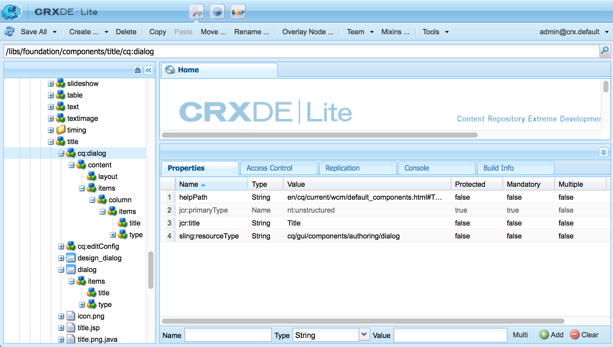
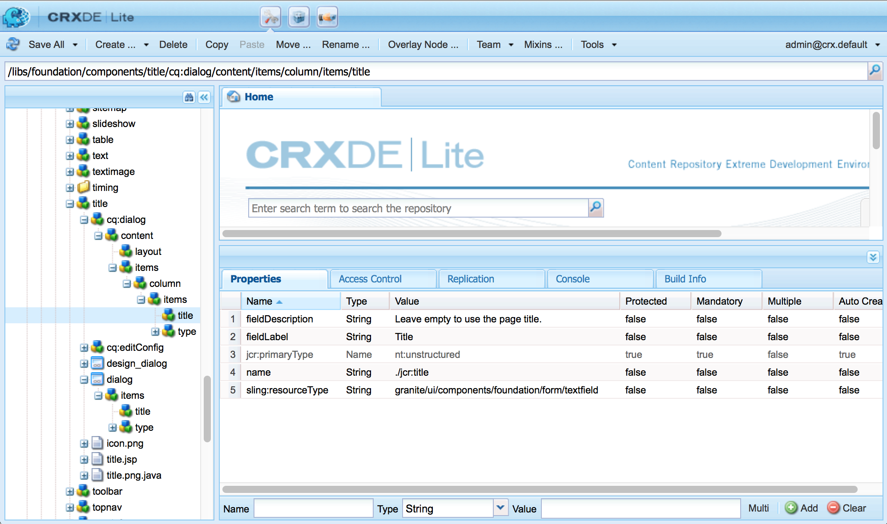
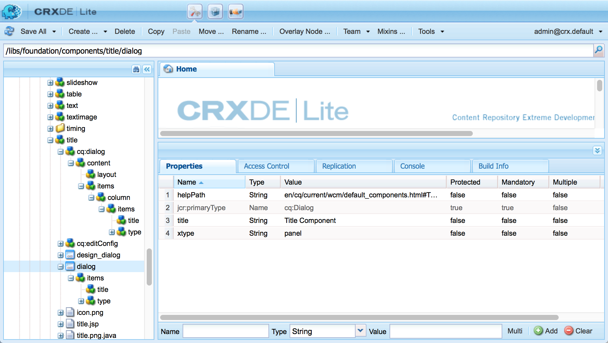
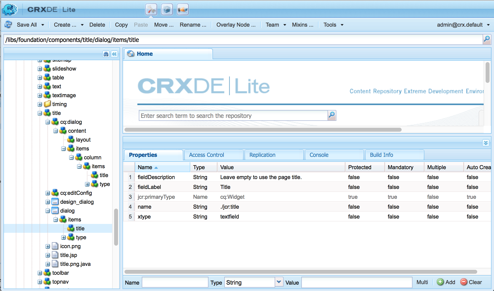
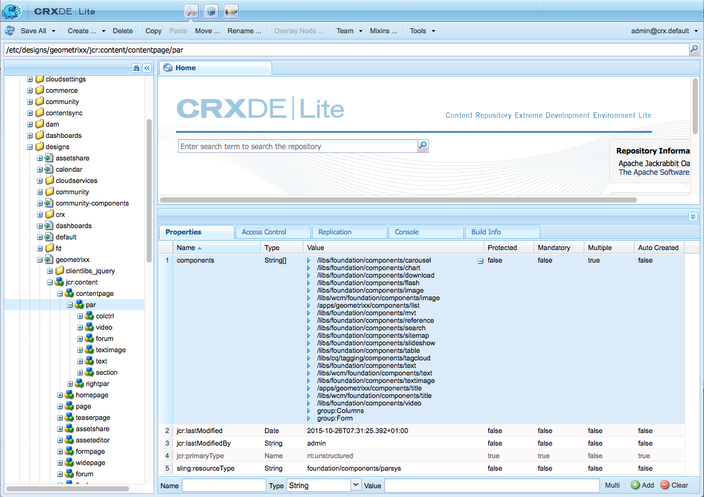
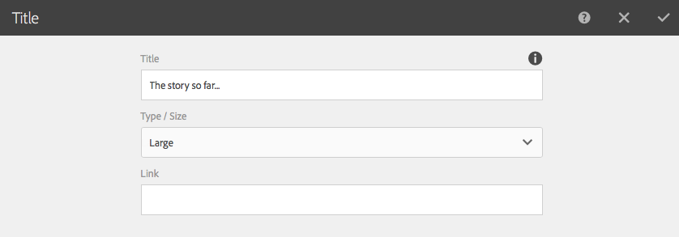
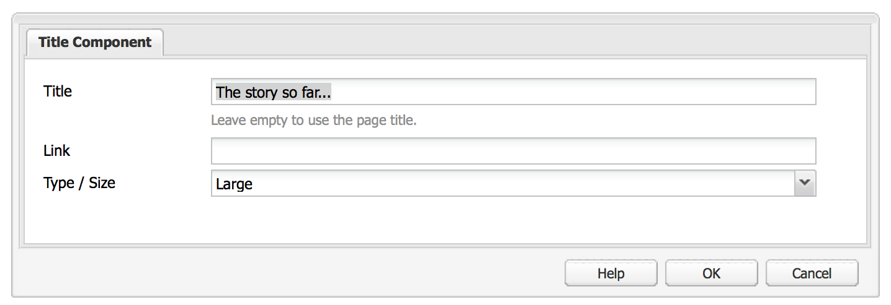
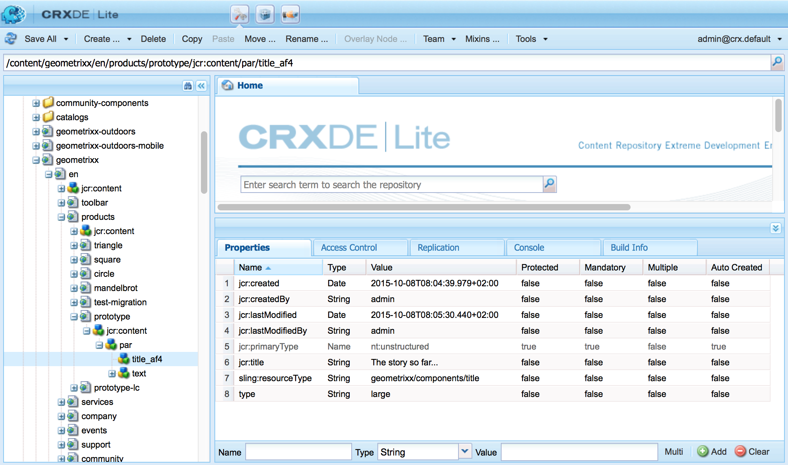

# Adobe Experience Manager (AEM) Components - The Basics{#aem-components-the-basics}

When you start to develop new components, you need to understand the basics of their structure and configuration.

This process involves reading the theory and looking at the wide range of component implementations in a standard AEM instance. This latter approach is slightly complicated by the fact that although AEM has shifted to a new standard, modern, touch-enabled UI, it continues to support the classic UI.

## Overview {#overview}

This section covers key concepts and issues as an introduction to the details needed when developing your own components.

### Planning {#planning}

Before starting to actually configure or code your component, you should ask:

* What exactly do you need the new component to do?
  * A clear specification helps at all stages of development, testing, and handover. Details may change over time, but the specification can be updated (though changes should be documented too).
* Do you need to create your component from scratch, or can you inherit the basics from an existing component?
  * There is no need to reinvent the wheel.
  * There are several mechanisms provided by AEM that lets you inherit and extend details from another component definition including override, overlay, and the [Sling Resource Merger](/help/sites-developing/sling-resource-merger.md).
* Does your component require logic to select or manipulate the content?
  * Logic should be kept separate from the user interface layer. HTL is designed to help ensure this happens.
* Does your component need CSS formatting?
  * CSS formatting should be kept separate from the component definitions. Define conventions for naming your HTML elements so that you can modify them through external CSS files.
* What security aspects should I consider?
  * See [Security Checklist - Development Best Practices](/help/sites-administering/security-checklist.md#development-best-practices) for more details.

### Touch-Enabled vs Classic UI {#touch-enabled-vs-classic-ui}

Before any serious discussion starts about developing components, you must know which UI your authors are using:

* **Touch-Enabled UI**
  [The standard user interface](/help/sites-developing/touch-ui-concepts.md) is based on the unified user experience for the Adobe Experience Cloud, using the underlying technologies of [Coral UI](/help/sites-developing/touch-ui-concepts.md#coral-ui) and [Granite UI](/help/sites-developing/touch-ui-concepts.md#granite-ui).
* **Classic UI**
  User interface based on ExtJS technology that was deprecated with AEM 6.4.

See [UI Interface Recommendations for Customers](/help/sites-deploying/ui-recommendations.md) for more details.

Components can be implemented to support the touch-enabled UI, the classic UI or both. When looking at a standard instance you will also see out-of-the-box components that were originally designed for the classic UI, or the touch-enabled UI, or both.

The basics of both are covered on this page, and how to recognize them.

>[!NOTE]
>
>Adobe recommends using the touch-enabled UI to benefit from the latest technology. [AEM Modernization Tools](modernization-tools.md) can make a migration easier.

### Content Logic and Rendering Markup  {#content-logic-and-rendering-markup}

Adobe recommends keeping the code responsible for markup and rendering separate from the code that controls the logic used to select the component's content.

This philosophy is supported by [HTL](https://experienceleague.adobe.com/docs/experience-manager-htl/content/overview.html), a templating language that is purposely limited to ensure that a real programming language is used to define the underlying business logic. This (optional) logic is invoked from HTL with a specific command. This mechanism highlights the code that is called for a given view and, if necessary, allows specific logic for different views of the same component.

### HTL vs JSP {#htl-vs-jsp}

HTL is an HTML templating language introduced with AEM 6.0.

The discussion of whether to use [HTL](https://experienceleague.adobe.com/docs/experience-manager-htl/content/overview.html) or JSP (Java&trade; Server Pages) when developing your own components should be straightforward as HTL is now the recommended scripting language for AEM.

Both HTL and JSP can be used for developing components for both the classic and the touch-enabled UI. Although there can be a tendency to assume that HTL is only for the touch-enabled UI and JSP for the classic UI, this is a misconception and more due to timing. The touch-enabled UI and HTL were incorporated into AEM over approximately the same period. Since HTL is now the recommended language, it is being used for new components, which tend to be for the touch-enabled UI.

>[!NOTE]
>
>The exceptions are Granite UI Foundation Form Fields (as used in dialogs). These still require the use of JSP.

### Developing Your Own Components {#developing-your-own-components}

To create your own components for the appropriate UI, see (after reading this page):

* [AEM Components for the Touch-Enabled UI](/help/sites-developing/developing-components.md)
* [AEM Components for the Classic UI](/help/sites-developing/developing-components-classic.md)

A quick way to get started is to copy an existing component and then make the changes you want. To learn how to create your own components and add them to the paragraph system see:

* [Developing Components](/help/sites-developing/developing-components-samples.md) (focused on the touch-enabled UI)

### Moving Components to the Publish Instance {#moving-components-to-the-publish-instance}

The components that render content must be deployed on the same AEM instance as the content. Therefore, all components that are used for authoring and rendering pages on the author instance must be deployed on the publish instance. When deployed, the components are available to render activated pages.

Use the following tools to move your components to the publish instance:

* [Use Package Manager](/help/sites-administering/package-manager.md) to add your components to a package and move them to another AEM instance.
* [Use the Activate Tree replication tool](/help/sites-authoring/publishing-pages.md#manage-publication) to replicate the components.

>[!NOTE]
>
>These mechanisms can also be used for transferring your component between other instances, for example, from your development to your test instance.

### Components to be Aware of from the Start {#components-to-be-aware-of-from-the-start}

* Page:

  * AEM has the *page* component ( `cq:Page`).
  * This is a specific type of resource that is important for content management.
    * A page corresponds to a web page holding content for your website.

* Paragraph systems:

  * The paragraph system is a key part of a website as it manages a list of paragraphs. It is used to hold and structure the individual components that hold the actual content.
  * You can create, move, copy, and delete paragraphs in the paragraph system.
  * You can also select the components to be available for use within a specific paragraph system.
  * There are various paragraph systems available within a standard instance (for example, `parsys`, ` [responsivegrid](/help/sites-authoring/responsive-layout.md)`).

## Structure {#structure}

The structure of an AEM component is powerful and flexible, the main considerations are:

* Resource Type
* Component Definition
* Properties and Child Nodes of a Component
* Dialogs
* Design Dialogs
* Component Availability
* Components and the Content They Create

### Resource Type {#resource-type}

A key element of the structure is the resource type.

* Content structure declares intentions.
* Resource type implements them.

This is an abstraction that helps ensure that even when the look and feel changes over time, the intention stays the time.

### Component Definition {#component-definition}

#### Component Basics {#component-basics}

The definition of a component can be broken down as follows:

* AEM components are based on [Sling](https://sling.apache.org/documentation.html).
* AEM components are (usually) located under:

  * HTL: `/libs/wcm/foundation/components`
  * JSP: `/libs/foundation/components`

* Project/Site specific components are (usually) located under:

  * `/apps/<myApp>/components`

* AEM standard components are defined as `cq:Component` and have the key elements:

  * jcr properties:

    A list of jcr properties; these are variable and some may be optional though the basic structure of a component node, its properties, and subnodes are defined by the `cq:Component` definition

  * Resources:

    These define static elements used by the component.

   * Scripts:

    Are used to implement the behavior of the resulting instance of the component.

* **Root Node**:

    * `<mycomponent> (cq:Component)` - Hierarchy node of the component.

* **Vital Properties**:

  * `jcr:title` - Component title; for example, used as a label when the component is listed in the components browser or sidekick.
  * `jcr:description` - Description for the component; can be used as mouse-over hint in the components browser or sidekick.
  * Classic UI:

      * `icon.png` - Icon for this component.
      * `thumbnail.png` - Image shown if this component is listed within the paragraph system.

  * Touch UI

      * See the section [Component Icon in Touch UI](/help/sites-developing/components-basics.md#component-icon-in-touch-ui) for details.

* **Vital Child Nodes**:

  * `cq:editConfig (cq:EditConfig)` - Defines the edit properties of the component and enables the component to appear in the Components browser or Sidekick.

    Note: if the component has a dialog, it will automatically appear in the Components browser or Sidekick, even if the cq:editConfig does not exist.

  * `cq:childEditConfig (cq:EditConfig)` - Controls author UI aspects for child components that do not define their own `cq:editConfig`.
  * Touch-Enabled UI:

      * `cq:dialog` ( `nt:unstructured`) - Dialog for this component. Defines the interface allowing the user to configure the component and/or edit content.
      * `cq:design_dialog` ( `nt:unstructured`) - Design editing for this component

  * Classic UI:

      * `dialog` ( `cq:Dialog`) - Dialog for this component. Defines the interface that lets the user configure the component, or edit content, or both.
      * `design_dialog` ( `cq:Dialog`) - Design editing for this component.

#### Component Icon in Touch UI {#component-icon-in-touch-ui}

The icon or abbreviation for the component is defined via JCR properties of the component when the component is created by the developer. These properties are evaluated in the following order and the first valid property found is used.

1. `cq:icon` - String property pointing to a standard icon in the [Coral UI library](https://developer.adobe.com/experience-manager/reference-materials/6-5/coral-ui/coralui3/Coral.Icon.html) to display in the component browser
    * Use the value of the HTML attribute of the Coral icon.
1. `abbreviation` - String property to customize the abbreviation of the component name in the component browser
    * The abbreviation should be limited to two characters.
    * Providing an empty string builds the abbreviation from first two characters of the `jcr:title` property.
        * For example, "Im" for "Image"
        * The localized title is used to build the abbreviation.
    * The abbreviation is only translated if the component has an `abbreviation_commentI18n` property, which is then used as translation hint.
1. `cq:icon.png` or `cq:icon.svg` - Icon for this component, which is shown in the component browser
    * 20 x 20 pixels is the size of icons of standard components.
        * Larger icons are downsized (client-side).
    * The recommended color is rgb(112, 112, 112) &gt; #707070
    * The background of standard component icons is transparent.
    * Only `.png` and `.svg` files are supported.
    * If importing from the file system by way of the Eclipse plugin, filenames must be escaped as `_cq_icon.png` or `_cq_icon.svg` for example.
    * `.png` takes precedent over `.svg` if both are present

If none of the above properties ( `cq:icon`, `abbreviation`, `cq:icon.png`, or `cq:icon.svg`) are found on the component:

* The system searchs for the same properties on the super components following the `sling:resourceSuperType` property.
* If nothing or an empty abbreviation is found at the super component level, the system builds the abbreviation from the first letters of the `jcr:title` property of the current component.

To cancel the inheritance of icons from super components, setting an empty `abbreviation` property on the component reverts to the default behavior.

The [Component Console](/help/sites-authoring/default-components-console.md#component-details) displays how the icon for a particular component is defined.

#### SVG Icon Example {#svg-icon-example}

```xml
<?xml version="1.0" encoding="utf-8"?>
<!DOCTYPE svg PUBLIC "-//W3C//DTD SVG 1.1//EN" "https://www.w3.org/Graphics/SVG/1.1/DTD/svg11.dtd">
<svg version="1.1" id="Layer_1" xmlns="https://www.w3.org/2000/svg" xmlns:xlink="https://www.w3.org/1999/xlink" x="0px" y="0px"
     width="20px" height="20px" viewBox="0 0 20 20" enable-background="new 0 0 20 20" xml:space="preserve">
    <ellipse cx="5" cy="5" rx="3" ry="3" fill="#707070"/>
    <ellipse cx="15" cy="5" rx="4" ry="4" fill="#707070"/>
    <ellipse cx="5" cy="15" rx="5" ry="5" fill="#707070"/>
    <ellipse cx="15" cy="15" rx="4" ry="4" fill="#707070"/>
</svg>
```

### Properties and Child Nodes of a Component {#properties-and-child-nodes-of-a-component}

Many of the nodes/properties that are needed to define a component are common to both UIs, with differences remaining independent so that your component can work in both environments.

A component is a node of type `cq:Component` and has the following properties and child nodes:

<table>
 <tbody>
  <tr>
   <td><strong>Name <br /> </strong></td>
   <td><strong>Type <br /> </strong></td>
   <td><strong>Description <br /> </strong></td>
  </tr>
  <tr>
   <td>.<br /> </td>
   <td><code>cq:Component</code></td>
   <td>Current component. A component is of node type <code>cq:Component</code>.<br /> </td>
  </tr>
  <tr>
   <td><code>componentGroup</code></td>
   <td><code>String</code></td>
   <td>Group under which the component can be selected in the Components browser (touch-enabled UI) or Sidekick (classic UI).<br /> A value of <code>.hidden</code> is used for components that are not available for selection from the UI such as the actual paragraph systems.</td>
  </tr>
  <tr>
   <td><code>cq:isContainer</code></td>
   <td><code>Boolean</code></td>
   <td>Indicates whether the component is a container component and therefore can contain other components such as a paragraph system.</td>
  </tr>
  <tr>
   <td> </td>
   <td> </td>
   <td> </td>
  </tr>
  <tr>
   <td><code>cq:dialog</code></td>
   <td><code>nt:unstructured</code><br /> </td>
   <td>Definition of the edit dialog for the touch-enabled UI.</td>
  </tr>
  <tr>
   <td><code>dialog</code></td>
   <td><code>cq:Dialog</code></td>
   <td>Definition of the edit dialog for the classic UI.</td>
  </tr>
  <tr>
   <td><code>cq:design_dialog</code></td>
   <td><code>nt:unstructured</code></td>
   <td>Definition of the design dialog for the touch-enabled UI.</td>
  </tr>
  <tr>
   <td><code>design_dialog</code></td>
   <td><code>cq:Dialog </code></td>
   <td>Definition of the design dialog for the classic UI.<br /> </td>
  </tr>
  <tr>
   <td><code>dialogPath</code></td>
   <td><code>String</code></td>
   <td>Path to a dialog to cover the case when the component does not have a dialog node.<br /> </td>
  </tr>
  <tr>
   <td> </td>
   <td> </td>
   <td> </td>
  </tr>
  <tr>
   <td><code>cq:cellName</code></td>
   <td><code>String</code></td>
   <td>If set, this property is taken as Cell ID.<br /> </td>
  </tr>
  <tr>
   <td><code>cq:childEditConfig</code></td>
   <td><code>cq:EditConfig</code></td>
   <td>When the component is a container&mdash;for example, a paragraph system&mdash;it drives the edit configuration of the child nodes.<br /> </td>
  </tr>
  <tr>
   <td><code>cq:editConfig</code></td>
   <td><code>cq:EditConfig</code></td>
   <td><a href="#edit-behavior">Edit configuration of the component</a>.<br /> </td>
  </tr>
  <tr>
   <td><code>cq:htmlTag</code></td>
   <td><code>nt:unstructured </code></td>
   <td>Returns additional tag attributes that are added to the surrounding html tag. Enables addition of attributes to the automatically generated divs.</td>
  </tr>
  <tr>
   <td><code>cq:noDecoration</code></td>
   <td><code>Boolean</code></td>
   <td>If true, the component is not rendered with automatically generated div and css classes.<br /> </td>
  </tr>
  <tr>
   <td><code>cq:template</code></td>
   <td><code>nt:unstructured</code></td>
   <td>If found, this node is used as a content template when the component is added from the Components Browser or Sidekick.</td>
  </tr>
  <tr>
   <td><code>cq:templatePath</code></td>
   <td><code>String</code></td>
   <td>Path to a node to use as a content template when the component is added from the Components browser or Sidekick. This must be an absolute path, not relative to the component node.<br /> Unless you want to reuse content already available elsewhere, this is not required and <code>cq:template</code> is sufficient (see below).</td>
  </tr>
  <tr>
   <td><code>jcr:created</code></td>
   <td><code>Date</code></td>
   <td>Date of creation of the component.<br /> </td>
  </tr>
  <tr>
   <td><code>jcr:description</code></td>
   <td><code>String</code></td>
   <td>Description of the component.<br /> </td>
  </tr>
  <tr>
   <td><code>jcr:title</code></td>
   <td><code>String</code></td>
   <td>Title of the component.<br /> </td>
  </tr>
  <tr>
   <td><code>sling:resourceSuperType</code></td>
   <td><code>String</code></td>
   <td>When set, the component inherits from this component.<br /> </td>
  </tr>
  <tr>
   <td><code>virtual</code></td>
   <td><code>sling:Folder</code></td>
   <td>Enables creation of virtual components. To see an example, look at the contact component at:<br /> <code>/libs/foundation/components/profile/form/contact</code></td>
  </tr>
  <tr>
   <td><code>&lt;breadcrumb.jsp&gt;</code></td>
   <td><code>nt:file</code><br /> </td>
   <td>Script file.<br /> </td>
  </tr>
  <tr>
   <td><code>icon.png</code></td>
   <td><code>nt:file</code></td>
   <td>Icon of the component, appears next to the Title in Sidekick.<br /> </td>
  </tr>
  <tr>
   <td><code>thumbnail.png</code></td>
   <td><code>nt:file</code></td>
   <td>Optional thumbnail that is shown while the component is dragged into place from Sidekick.<br /> </td>
  </tr>
 </tbody>
</table>

If you look at the **Text** component (either version), you can see these elements:

* HTL ( `/libs/wcm/foundation/components/text`)

  

* JSP ( `/libs/foundation/components/text`)

  

Properties of particular interest include:

* `jcr:title` - title of the component; this can be used to identify the component, for example, it appears in the component list within the components browser or sidekick
* `jcr:description` - description for the component; can be used as mouse-over hint in the component list within sidekick
* `sling:resourceSuperType`: this indicates the path of inheritance when extending a component (by overriding a definition)

Child nodes of particular interest include:

* `cq:editConfig` ( `cq:EditConfig`) - this controls visual aspects; for example, it can define the appearance of a bar or widget, or can add customized controls
* `cq:childEditConfig` ( `cq:EditConfig`) - this controls the visual aspects for child components that do not have their own definitions
* Touch-Enabled UI:
    * `cq:dialog` ( `nt:unstructured`) - defines the dialog for editing content of this component
    * `cq:design_dialog` ( `nt:unstructured`) - specifies the design editing options for this component
* Classic UI:
    * `dialog` ( `cq:Dialog`) - defines the dialog for editing content of this component (specific to the classic UI)
    * `design_dialog` ( `cq:Dialog`) - specifies the design editing options for this component
    * `icon.png` - graphics file to be used as an icon for the component in the Sidekick
    * `thumbnail.png` - graphics file to be used as a thumbnail for the component while dragging it from the Sidekick

### Dialogs {#dialogs}

Dialogs are a key element of your component as they provide an interface for authors to configure and provide input to that component.

Depending on the complexity of the component, your dialog may need one or more tabs - to keep the dialog short and to sort the input fields.

Dialog definitions are specific to the UI:

>[!NOTE]
>
>* For compatibility purposes the touch-enabled UI can use the definition of a classic UI dialog, when no dialog has been defined for the touch-enabled UI.
>* The [AEM Modernization Tools](/help/sites-developing/modernization-tools.md) are also provided to help you extend/convert components that only have dialogs defined for the classic UI.
>

* Touch-Enabled UI
    * `cq:dialog` ( `nt:unstructured`) nodes:
        * define the dialog for editing content of this component
        * specific to the touch-enabled UI
        * are defined using Granite UI components
        * have a property `sling:resourceType`, as standard Sling content structure
        * can have a property `helpPath` to define the context-sensitive help resource (absolute or relative path) that is accessed when the Help icon (the `?` icon) is selected.
            * For out-of-the box components, this often references a page in the documentation.
            * If no `helpPath` is specified, the default URL (documentation overview page) is shown.

  

  Within the dialog, individual fields are defined:

  

* Classic UI
    * `dialog` ( `cq:Dialog`) nodes
        * define the dialog for editing content of this component
        * specific to the classic UI
        * are defined using ExtJS widgets
        * have a property `xtype`, which refers to ExtJS
        * can have a property `helpPath` to define the context-sensitive help resource (absolute or relative path) that is accessed when the **Help** button is selected.
            * For out-of-the box components, this often references a page in the documentation.
            * If no `helpPath` is specified, the default URL (documentation overview page) is shown.

  

  Within the dialog, individual fields are defined:

  

  Within a classic dialog box:

    * you can create the dialog as `cq:Dialog`, which will provide a single tab - as in the text component, or if you need multiple tabs, as with the textimage component, the dialog can be defined as `cq:TabPanel`.
    * a `cq:WidgetCollection` ( `items`) is used to provide a base for either input fields ( `cq:Widget`) or further tabs ( `cq:Widget`). This hierarchy can be extended.

### Design Dialogs {#design-dialogs}

Design dialogs are similar to the dialogs used to edit and configure content, but they provide the interface for authors to configure and provide design details for that component.

[Design dialogs are available in Design Mode](/help/sites-authoring/default-components-designmode.md), though they are not needed for all components, for example, **Title** and **Image** both have design dialogs, whereas **Text** does not.

The design dialog for the paragraph system (for example, parsys) is a special case as it allows the user to specific other components to be available for selection (from the components browser or sidekick) on the page.

### Adding your Component to the Paragraph System {#adding-your-component-to-the-paragraph-system}

After a component is defined, it must be made available for use. To make a component available for use in a paragraph system, you can either:

1. Open [Design Mode](/help/sites-authoring/default-components-designmode.md) for a page and enable the required component.
1. Add the required components to the `components` property of your template definition under:

   `/etc/designs/<*yourProject*>/jcr:content/<*yourTemplate*>/par`

   For example, see:

   `/etc/designs/geometrixx/jcr:content/contentpage/par`

   

### Components and the Content They Create {#components-and-the-content-they-create}

If you create and configure an instance of the **Title** component on the page: `<content-path>/Prototype.html`

* Touch-Enabled UI

  

* Classic UI

  

Then you can see the structure of the content created within the repository:



In particular, if you look at the actual text for a **Title**:

* the definition (for both UIs) has the property `name`= `./jcr:title`

    * `/libs/foundation/components/title/cq:dialog/content/items/column/items/title`
    * `/libs/foundation/components/title/dialog/items/title`

* within the content, this generates the property `jcr:title` holding the author's content.

The properties defined depend on the individual definitions. Although they can be more complex than above, they still follow the same basic principles.

## Component Hierarchy and Inheritance {#component-hierarchy-and-inheritance}

Components within AEM are subject to three different hierarchies:

* **Resource Type Hierarchy**

  This is used to extend components using the property `sling:resourceSuperType`. This enables the component to inherit. For example, a text component inherits various attributes from the standard component.

    * scripts (resolved by Sling)
    * dialogs
    * descriptions (including thumbnail images, and icons)

* **Container Hierarchy**

  This is used to populate configuration settings to the child component and is most commonly used in a parsys scenario.

  For example, configuration settings for the edit bar buttons, control set layout (editbars, rollover), dialog layout (inline, floating) can be defined on the parent component and propagated to the child components.

  Configuration settings (related to edit functionality) in `cq:editConfig` and `cq:childEditConfig` are propagated.

* **Include Hierarchy**

  This is imposed at runtime by the sequence of includes.

  This hierarchy is used by the Designer, which in turn acts as the base for various design aspects of the rendering; including layout information, css information, the available components in a parsys among others.

## Edit Behavior {#edit-behavior}

This section explains how to configure the edit behavior of a component. This includes attributes such as actions available for the component, characteristics of the inplace editor, and the listeners related to events on the component.

The configuration is common to both the touch-enabled and classic UI, albeit with certain, specific differences.

The edit behavior of a component is configured by adding a `cq:editConfig` node of type `cq:EditConfig` below the component node (of type `cq:Component`) and by adding specific properties and child nodes. The following properties and child nodes are available:

* [ `cq:editConfig` node properties](#configuring-with-cq-editconfig-properties):

    * `cq:actions` ( `String array`): defines the actions that can be performed on the component.
    * `cq:layout` ( `String`): defines how the component is edited in the classic UI.
    * `cq:dialogMode` ( `String`): defines how the component dialog is opened in the classic UI

        * In the touch-enabled UI, dialogs are always floating in desktop mode, and automatically opened as fullscreen in mobile.

    * `cq:emptyText` ( `String`): defines text that is displayed when no visual content is present.
    * `cq:inherit` ( `Boolean`): defines if missing values are inherited from the component that it inherits from.
    * `dialogLayout` (String): defines how the dialog should open.

* [ `cq:editConfig` child nodes](#configuring-with-cq-editconfig-child-nodes):

    * `cq:dropTargets` (node type `nt:unstructured`): defines a list of drop targets that can accept a drop from an asset of the content finder

        * Multiple drop targets are only available in the classic UI.
        * In the touch-enabled UI, a single drop target is allowed.

    * `cq:actionConfigs` (node type `nt:unstructured`): defines a list of new actions that are appended to the cq:actions list.
    * `cq:formParameters` (node type `nt:unstructured`): defines additional parameters that are added to the dialog form.
    * `cq:inplaceEditing` (node type `cq:InplaceEditingConfig`): defines an inplace editing configuration for the component.
    * `cq:listeners` (node type `cq:EditListenersConfig`): defines what happens before or after an action occurs on the component.

>[!NOTE]
>
>In this page, a node (properties and child nodes) is represented as XML, as shown in the following example.

```
<jcr:root xmlns:cq="https://www.day.com/jcr/cq/1.0" xmlns:jcr="https://www.jcp.org/jcr/1.0"
    cq:actions="[edit]"
    cq:dialogMode="floating"
    cq:layout="editbar"
    jcr:primaryType="cq:EditConfig">
    <cq:listeners
        jcr:primaryType="cq:EditListenersConfig"
        afteredit="REFRESH_PAGE"/>
</jcr:root>
```

There are many existing configurations in the repository. You can easily search for specific properties or child nodes:

* To look for a property of the `cq:editConfig` node, for example, `cq:actions`, you can use the Query tool in **CRXDE Lite** and search with the following XPath query string:

  `//element(cq:editConfig, cq:EditConfig)[@cq:actions]`

* To look for a child node of `cq:editConfig`, for example, you can search for `cq:dropTargets`, which is of type `cq:DropTargetConfig`; you can use the Query tool in** CRXDE Lite** and search with the following XPath query string:

  `//element(cq:dropTargets, cq:DropTargetConfig)`

### Component Placeholders {#component-placeholders}

Components must always render some HTML that is visible to the author, even when the component has no content. Otherwise, it might visually disappear from the editor's interface, making it technically present but invisible on the page and in the editor. In such a case, the authors cannot select and interact with the empty component.

For this reason, components should render a placeholder as long as they do not render any visible output when the page is rendered in the page editor (when the WCM mode is `edit` or `preview`).
The typical HTML markup for a placeholder is the following:

```HTML
<div class="cq-placeholder" data-emptytext="Component Name"></div>
```

The typical HTL script that renders the above placeholder HTML is the following:

```HTML
<div class="cq-placeholder" data-emptytext="${component.properties.jcr:title}"
     data-sly-test="${(wcmmode.edit || wcmmode.preview) && isEmpty}"></div>
```

In the previous example, `isEmpty` is a variable that is true only when the component has no content and is invisible to the author.

To avoid repetition, Adobe recommends that implementers of components use an HTL template for these placeholders, [like the one provided by the Core Components.](https://github.com/adobe/aem-core-wcm-components/blob/master/content/src/content/jcr_root/apps/core/wcm/components/commons/v1/templates.html)

The usage of the template in the previous link is then done with the following line of HTL:

```HTML
<sly data-sly-use.template="core/wcm/components/commons/v1/templates.html"
     data-sly-call="${template.placeholder @ isEmpty=!model.text}"></sly>
```

In the previous example, `model.text` is the variable that is true only when the content has content and is visible.

An example usage of this template can be seen in the Core Components, [such as in the Title Component.](https://github.com/adobe/aem-core-wcm-components/blob/master/content/src/content/jcr_root/apps/core/wcm/components/title/v2/title/title.html#L27)

### Configuring with cq:EditConfig Properties {#configuring-with-cq-editconfig-properties}

### cq:actions {#cq-actions}

The `cq:actions` property ( `String array`) defines one or several actions that can be performed on the component. The following values are available for configuration:

<table>
 <tbody>
  <tr>
   <td><strong>Property Value</strong></td>
   <td><strong>Description</strong></td>
  </tr>
  <tr>
   <td><code>text:&lt;some text&gt;</code></td>
   <td>Displays the static text value &lt;some text&gt;<br /> Only visible in classic UI. The touch-enabled UI does not display actions in a contextual menu, so this is not applicable.</td>
  </tr>
  <tr>
   <td>-</td>
   <td>Adds a spacer.<br /> Only visible in classic UI. The touch-enabled UI does not display actions in a contextual menu, so this is not applicable.</td>
  </tr>
  <tr>
   <td><code>edit</code></td>
   <td>Adds a button to edit the component.</td>
  </tr>
      <tr>
    <td><code>editannotate</code></td>
    <td>Adds a button to edit the component and allowing <a href="/help/sites-authoring/annotations.md">annotations</a>.</td>
   </tr>
  <tr>
   <td><code>delete</code></td>
   <td>Adds a button to delete the component.</td>
  </tr>
  <tr>
   <td><code>insert</code></td>
   <td>Adds a button to insert a new component before the current one.</td>
  </tr>
  <tr>
   <td><code>copymove</code></td>
   <td>Adds a button to copy and cut the component.</td>
  </tr>
 </tbody>
</table>

The following configuration adds an edit button, a spacer, a delete, and an insert button to the component edit bar:

```
<jcr:root xmlns:cq="https://www.day.com/jcr/cq/1.0" xmlns:jcr="https://www.jcp.org/jcr/1.0"
    cq:actions="[edit,-,delete,insert]"
    cq:layout="editbar"
    jcr:primaryType="cq:EditConfig"/>
```

The following configuration adds the text "Inherited Configurations from Base Framework" to the component edit bar:

```
<jcr:root xmlns:cq="https://www.day.com/jcr/cq/1.0" xmlns:jcr="https://www.jcp.org/jcr/1.0"
    cq:actions="[text:Inherited Configurations from Base Framework]"
    cq:layout="editbar"
    jcr:primaryType="cq:EditConfig"/>
```

### cq:layout (Classic UI Only) {#cq-layout-classic-ui-only}

The `cq:layout` property ( `String`) defines how the component can be edited in the classic UI. The following values are available:

<table>
 <tbody>
  <tr>
   <td><strong>Property Value</strong></td>
   <td><strong>Description</strong></td>
  </tr>
  <tr>
   <td><code>rollover</code></td>
   <td>Default value. The component edition is accessible "on mouse over" through clicks and/or context menu.<br /> For advanced use, the corresponding client-side object is: <code>CQ.wcm.EditRollover</code>.</td>
  </tr>
  <tr>
   <td><code>editbar</code></td>
   <td>The component edition is accessible through a toolbar.<br /> For advanced use, the corresponding client-side object is: <code>CQ.wcm.EditBar</code>.</td>
  </tr>
  <tr>
   <td><code>auto</code></td>
   <td>The choice is left to the client-side code.</td>
  </tr>
 </tbody>
</table>

>[!NOTE]
>
>The concepts of rollover and editbar are not applicable in the touch-enabled UI.

The following configuration adds an edit button to the component edit bar:

```
<jcr:root xmlns:cq="https://www.day.com/jcr/cq/1.0" xmlns:jcr="https://www.jcp.org/jcr/1.0"
    cq:actions="[edit]"
    cq:layout="editbar"
    jcr:primaryType="cq:EditConfig">
</jcr:root>
```

### cq:dialogMode (Classic UI Only) {#cq-dialogmode-classic-ui-only}

The component can be linked to an edit dialog. The `cq:dialogMode` property ( `String`) defines how the component dialog is opened in the classic UI. The following values are available:

<table>
 <tbody>
  <tr>
   <td><strong>Property Value</strong></td>
   <td><strong>Description</strong></td>
  </tr>
  <tr>
   <td><code>floating</code></td>
   <td>The dialog is floating.<br /> </td>
  </tr>
  <tr>
   <td><code>inline</code></td>
   <td>(default value). The dialog is anchored over the component.<br /> </td>
  </tr>
  <tr>
   <td><code>auto</code></td>
   <td>If the component width is smaller than the client-side <code>CQ.themes.wcm.EditBase.INLINE_MINIMUM_WIDTH</code> value, the dialog is floating, otherwise it is inline.</td>
  </tr>
 </tbody>
</table>

>[!NOTE]
>
>In the touch-enabled UI, dialogs are always floating in desktop mode and automatically opened as fullscreen in mobile.

The following configuration defines an edit bar with an edit button, and a floating dialog:

```
<jcr:root xmlns:cq="https://www.day.com/jcr/cq/1.0" xmlns:jcr="https://www.jcp.org/jcr/1.0"
    cq:actions="[edit]"
    cq:dialogMode="floating"
    cq:layout="editbar"
    jcr:primaryType="cq:EditConfig">
</jcr:root>
```

### cq:emptyText {#cq-emptytext}

The `cq:emptyText` property ( `String`) defines text that is displayed when no visual content is present. It defaults to: `Drag components or assets here`.

### cq:inherit {#cq-inherit}

The `cq:inherit` property ( `boolean`) defines whether missing values are inherited from the component that it inherits from. It defaults to `false`.

### dialogLayout {#dialoglayout}

The `dialogLayout` property defines how a dialog should open by default.

* A value of `fullscreen` opens the dialog in full screen.
* An empty value or absence of the property defaults to opening the dialog normally.
* The user can always toggle the fullscreen mode within the dialog.
* Does not apply to the classic UI.

### Configuring with cq:EditConfig Child Nodes {#configuring-with-cq-editconfig-child-nodes}

### cq:dropTargets {#cq-droptargets}

The `cq:dropTargets` node (node type `nt:unstructured`) defines a list of drop targets that can accept a drop from an asset dragged from the content finder. It serves as a collection of nodes of type `cq:DropTargetConfig`.

>[!NOTE]
>
>Multiple drop targets are only available in the classic UI.
>
>In the touch-enabled UI, only the first target is used.

Each child node of type `cq:DropTargetConfig` defines a drop target in the component. The node name is important because it must be used in the JSP, as follows, to generate the CSS class name assigned to the DOM element that is the effective drop target:

```
<drop target css class> = <drag and drop prefix> +
 <node name of the drop target in the edit configuration>
```

The `<drag and drop prefix>` is defined by the Java&trade; property:

`com.day.cq.wcm.api.components.DropTarget.CSS_CLASS_PREFIX`.

For example, the class name is defined as follows in the JSP of the Download component
( `/libs/foundation/components/download/download.jsp`), where `file` is the node name of the drop target in the edit configuration of the Download component:

`String ddClassName = DropTarget.CSS_CLASS_PREFIX + "file";`

The node of type `cq:DropTargetConfig` must have the following properties:

<table>
 <tbody>
  <tr>
   <td><strong>Property Name</strong></td>
   <td><strong>Property Value<br /> </strong></td>
  </tr>
  <tr>
   <td><code>accept</code></td>
   <td>Regex applied to the asset mime type to validate if dropping is allowed.</td>
  </tr>
  <tr>
   <td><code>groups</code></td>
   <td>Array of drop target groups. Each group must match the group type that is defined in the content finder extension and that is attached to the assets.</td>
  </tr>
  <tr>
   <td><code>propertyName</code></td>
   <td>Name of the property that will be updated after a valid drop.</td>
  </tr>
 </tbody>
</table>

The following configuration is taken from the Download component. It enables any asset (the mime-type can be any string) from the `media` group to be dropped from the content finder into the component. After the drop, the component property `fileReference` is being updated:

```
    <cq:dropTargets jcr:primaryType="nt:unstructured">
        <file
            jcr:primaryType="cq:DropTargetConfig"
            accept="[.*]"
            groups="[media]"
            propertyName="./fileReference"/>
    </cq:dropTargets>
```

### cq:actionConfigs (Classic UI Only) {#cq-actionconfigs-classic-ui-only}

The `cq:actionConfigs` node (node type `nt:unstructured`) defines a list of new actions that are appended to the list defined by the `cq:actions` property. Each child node of `cq:actionConfigs` defines a new action by defining a widget.

The following sample configuration defines a new button (with a separator for the classic UI):

* a separator, defined by the xtype `tbseparator`;

    * This is only used by the classic UI.
    * This definition is ignored by the touch-enabled UI as xtypes are ignored (and separators are unnecessary as the action toolbar is constructed differently in the touch-enabled UI).

* a button named **Manage comments** that runs the handler function `CQ_collab_forum_openCollabAdmin()`.

```
<jcr:root xmlns:cq="https://www.day.com/jcr/cq/1.0" xmlns:jcr="https://www.jcp.org/jcr/1.0" xmlns:nt="https://www.jcp.org/jcr/nt/1.0"
    cq:actions="[EDIT,COPYMOVE,DELETE,INSERT]"
    jcr:primaryType="cq:EditConfig">
    <cq:actionConfigs jcr:primaryType="nt:unstructured">
        <separator0
            jcr:primaryType="nt:unstructured"
            xtype="tbseparator"/>
        <manage
            jcr:primaryType="nt:unstructured"
            handler="function(){CQ_collab_forum_openCollabAdmin();}"
            text="Manage comments"/>
    </cq:actionConfigs>
</jcr:root>
```

>[!NOTE]
>
>See [Add New Action to a Component Toolbar](/help/sites-developing/customizing-page-authoring-touch.md#add-new-action-to-a-component-toolbar) as an example for the touch-enabled UI.

### cq:formParameters {#cq-formparameters}

The `cq:formParameters` node (node type `nt:unstructured`) defines additional parameters that are added to the dialog form. Each property is mapped to a form parameter.

The following configuration adds a parameter called `name`, set with the value `photos/primary` to the dialog form:

```
    <cq:formParameters
        jcr:primaryType="nt:unstructured"
        name="photos/primary"/>
```

### cq:inplaceEditing {#cq-inplaceediting}

The `cq:inplaceEditing` node (node type `cq:InplaceEditingConfig`) defines an inplace editing configuration for the component. It can have the following properties:

<table>
 <tbody>
  <tr>
   <td><strong>Property Name</strong></td>
   <td><strong>Property Value<br /> </strong></td>
  </tr>
  <tr>
   <td><code>active</code></td>
   <td>(<code>boolean</code>) True to enable the inplace editing of the component.</td>
  </tr>
  <tr>
   <td><code>configPath</code></td>
   <td>(<code>String</code>) Path of the editor configuration. The configuration can be specified by a configuration node.</td>
  </tr>
  <tr>
   <td><code>editorType</code></td>
   <td><p>(<code>String</code>) Editor type. The available types are:</p>
    <ul>
     <li>plaintext: to be used for non-HTML content.<br /> </li>
     <li>title: is an enhanced plaintext editor that converts graphical titles into a plaintext before editing begins. Used by the Geometrixx title component.<br /> </li>
     <li>text: to be used for HTML content (uses the Rich Text Editor).<br /> </li>
    </ul> </td>
  </tr>
 </tbody>
</table>

The following configuration enables the inplace editing of the component and defines `plaintext` as the editor type:

```
    <cq:inplaceEditing
        jcr:primaryType="cq:InplaceEditingConfig"
        active="{Boolean}true"
        editorType="plaintext"/>
```

### cq:listeners {#cq-listeners}

The `cq:listeners` node (node type `cq:EditListenersConfig`) defines what happens before or after an action on the component. The following table defines its possible properties.

<table>
 <tbody>
  <tr>
   <td><strong>Property Name</strong></td>
   <td><strong>Property Value<br /> </strong></td>
   <td><p><strong>Default Value</strong></p> <p>(Classic UI Only)</p> </td>
  </tr>
  <tr>
   <td><code>beforedelete</code></td>
   <td>The handler is triggered before the component is removed.<br /> </td>
   <td> </td>
  </tr>
  <tr>
   <td><code>beforeedit</code></td>
   <td>The handler is triggered before the component is edited.</td>
   <td> </td>
  </tr>
  <tr>
   <td><code>beforecopy</code></td>
   <td>The handler is triggered before the component is copied.</td>
   <td> </td>
  </tr>
  <tr>
   <td><code>beforemove</code></td>
   <td>The handler is triggered before the component is moved.</td>
   <td> </td>
  </tr>
  <tr>
   <td><code>beforeinsert</code></td>
   <td>The handler is triggered before the component is inserted.<br /> Only operational for the touch-enabled UI.</td>
   <td> </td>
  </tr>
  <tr>
   <td><code>beforechildinsert</code></td>
   <td>The handler is triggered before the component is inserted inside another component (containers only).</td>
   <td> </td>
  </tr>
  <tr>
   <td><code>afterdelete</code></td>
   <td>The handler is triggered after the component is removed.</td>
   <td><code>REFRESH_SELF</code></td>
  </tr>
  <tr>
   <td><code>afteredit</code></td>
   <td>The handler is triggered after the component is edited.</td>
   <td><code>REFRESH_SELF</code></td>
  </tr>
  <tr>
   <td><code>aftercopy</code></td>
   <td>The handler is triggered after the component is copied.</td>
   <td><code>REFRESH_SELF</code></td>
  </tr>
  <tr>
   <td><code>afterinsert</code></td>
   <td>The handler is triggered after the component is inserted.</td>
   <td><code>REFRESH_INSERTED</code></td>
  </tr>
  <tr>
   <td><code>aftermove</code></td>
   <td>The handler is triggered after the component is moved.</td>
   <td><code>REFRESH_SELFMOVED</code></td>
  </tr>
  <tr>
   <td><code>afterchildinsert</code></td>
   <td>The handler is triggered after the component is inserted inside another component (containers only).</td>
   <td> </td>
  </tr>
 </tbody>
</table>

>[!NOTE]
>
>The `REFRESH_INSERTED` and `REFRESH_SELFMOVED` handlers are only available in the classic UI.

>[!NOTE]
>
>Default values for the listeners are only set in the classic UI.

>[!NOTE]
>
>If there are nested components, there are certain restrictions on actions defined as properties on the `cq:listeners` node:
>
>* For nested components, the values of the following properties *must* be `REFRESH_PAGE`: >
>  * `aftermove`
>  * `aftercopy`

The event handler can be implemented with a custom implementation. For example, where `project.customerAction` is a static method:

`afteredit = "project.customerAction"`

The following example is equivalent to the `REFRESH_INSERTED` configuration:

`afterinsert="function(path, definition) { this.refreshCreated(path, definition); }"`

>[!NOTE]
>
>For the classic UI, to see which parameters can be used in the handlers, see the `before<action>` and `after<action>` events section of the [ `CQ.wcm.EditBar`](https://developer.adobe.com/experience-manager/reference-materials/6-5/widgets-api/index.html?class=CQ.wcm.EditBar) and [ `CQ.wcm.EditRollover`](https://developer.adobe.com/experience-manager/reference-materials/6-5/widgets-api/index.html?class=CQ.wcm.EditRollover) widget documentation.

With the following configuration, the page is refreshed after the component is deleted, edited, inserted, or moved:

```
    <cq:listeners
        jcr:primaryType="cq:EditListenersConfig"
        afterdelete="REFRESH_PAGE"
        afteredit="REFRESH_PAGE"
        afterinsert="REFRESH_PAGE"
        afterMove="REFRESH_PAGE"/>
```
