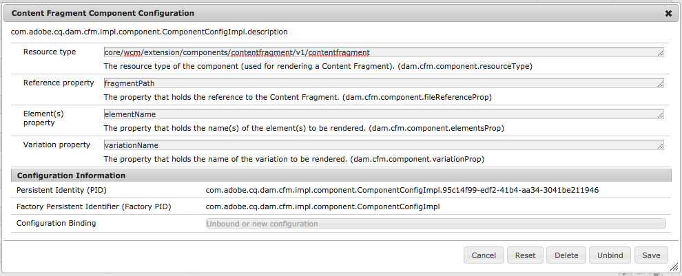

# Content Fragments Configuring Components for Rendering{#content-fragments-configuring-components-for-rendering}

There are several [advanced services](/help/sites-developing/content-fragments-config-components-rendering.md#definition-of-advanced-services-that-need-configuration) related to the rendering of content fragments. To use these services, the resource types of such components must make themselves known to the content fragments framework.

This is done by configuring the [OSGi Service - Content Fragment Component Configuration](#osgi-service-content-fragment-component-configuration).

>[!CAUTION]
>
>If you do not need the [advanced services](/help/sites-developing/content-fragments-config-components-rendering.md#definition-of-advanced-services-that-need-configuration) described below, you can ignore this configuration.

>[!CAUTION]
>
>When you are extending or using the out-of-the-box component(s), it is not recommended to change the configuration.

>[!CAUTION]
>
>You can write a component from scratch that uses the Content Fragments API only, with no advanced services. However, in such a case, you will have to develop your component so that it handles the appropriate processing.
>
>Therefore, it is recommended to use the core components.

## Definition of Advanced Services that need Configuration {#definition-of-advanced-services-that-need-configuration}

The services that require the registration of a component are:

* Determining dependencies correctly during publication (that is, ensure that fragments & models can be automatically published with a page if they have changed since last publication).
* Support for content fragments in full text search.
* The management/handling of *in-between content.*
* The management/handling of *mixed media assets.*
* Dispatcher flush for referenced fragments (if a page containing a fragment is re-published).
* Using paragraph-based rendering.

If you need one or more of these features, then (typically) it is easier to use the out-of-the-box functionality, instead of developing it from scratch.

## OSGi Service - Content Fragment Component Configuration {#osgi-service-content-fragment-component-configuration}

The configuration needs to be bound to the OSGi service **Content Fragment Component Configuration**:

`com.adobe.cq.dam.cfm.impl.component.ComponentConfigImpl`

>[!NOTE]
>
>See [Configuring OSGi](/help/sites-deploying/configuring-osgi.md) for further details.

For example:



The OSGi configuration is:

<table>
 <tbody>
  <tr>
   <td>Label</td>
   <td>OSGi Configuration<br /> </td>
   <td>Description</td>
  </tr>
  <tr>
   <td><strong>Resource type</strong></td>
   <td><code>dam.cfm.component.resourceType</code></td>
   <td>The resource type to register; for example, <br /> <p><span class="cmp-examples-demo__property-value"><code>core/wcm/components/contentfragment/v1/contentfragment</code></code></p> </td>
  </tr>
  <tr>
   <td><strong>Reference property</strong></td>
   <td><code>dam.cfm.component.fileReferenceProp</code></td>
   <td>The name of the property that contains the reference to the fragment; for example, <code>fragmentPath</code> or <code>fileReference</code></td>
  </tr>
  <tr>
   <td><strong>Element(s) property</strong></td>
   <td><code>dam.cfm.component.elementsProp</code></td>
   <td>The name of the property that contains the name(s) of the element(s) to render; for example,<code>elementName</code></td>
  </tr>
  <tr>
   <td><strong>Variation property</strong><br /> </td>
   <td><code>dam.cfm.component.variationProp</code></td>
   <td>The name of the property that contains the name of the variation to render; for example,<code>variationName</code></td>
  </tr>
 </tbody>
</table>

For some functionality (for example, to render only a paragraph range) you will have to adhere to some conventions:

<table>
 <tbody>
  <tr>
   <td>Property Name</td>
   <td>Description</td>
  </tr>
  <tr>
   <td><code>paragraphRange</code></td>
   <td><p>A string property that defines the range of paragraphs to be output if in <em>single element render mode</em>.</p> <p>Format:</p>
    <ul>
     <li><code>1</code> or <code>1-3</code> or <code>1-3;6;7-8</code> or <code>*-3;5-*</code></li>
     <li>only evaluated if <code>paragraphScope</code> is set to <code>range</code></li>
    </ul> </td>
  </tr>
  <tr>
   <td><code>paragraphScope</code></td>
   <td><p>A string property that defines how paragraphs are to be output if in <em>single element render mode</em>.</p> <p>Values:</p>
    <ul>
     <li><code>all</code> : to render all paragraphs</li>
     <li><code>range</code> : to render the range of paragraphs provided by <code>paragraphRange</code></li>
    </ul> </td>
  </tr>
  <tr>
   <td><code>paragraphHeadings</code></td>
   <td>A boolean property that defines if headings (for example, <code>h1</code>, <code>h2</code>, <code>h3</code>) are counted as paragraphs (<code>true</code>) or not (<code>false</code>)</td>
  </tr>
 </tbody>
</table>

>[!CAUTION]
>
>This may change in later 6.5 milestones.

## Example {#example}

As an example, see the following (on an out-of-the-box AEM instance):

```
/apps/core/wcm/config/com.adobe.cq.dam.cfm.impl.component.ComponentConfigImpl-core-comp-v1.config
```

This contains:

```
dam.cfm.component.resourceType="core/wcm/components/contentfragment/v1/contentfragment"
dam.cfm.component.fileReferenceProp="fragmentPath"
dam.cfm.component.elementsProp="elementName"
dam.cfm.component.variationProp="variationName"
```
