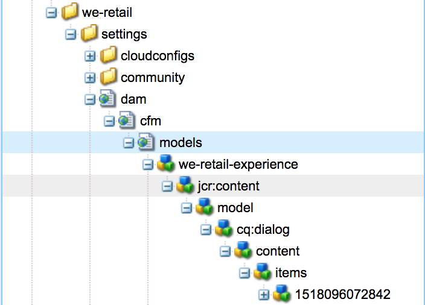

# DO NOT PUBLISH, BUT DO NOT DELETE Customizing Content Fragment Models{#do-not-publish-but-do-not-delete-customizing-content-fragment-models}

The Content Fragment Model editor is a wizard based on `Formbuilder`, inherited from:

`granite/ui/components/foundation/form/formbuilder`

This component has the tools necessary to render the drag and drop interface of the model editor, complete with data types and properties for each.

## Locations {#locations}

Models are saved and created under `/conf`, under a folder that has the [Content Fragment Models property](/help/assets/content-fragments-models.md#enable-content-fragment-models) enabled. This setting can also be seen in the **Configuration Properties**, accessible from the **Configuration Browser**.

1. Navigate to the browser via **Tools**, **General**, **Configuration Browser** 
   For example, `http://localhost:4502/libs/granite/configurations/content/view.html/conf`

1. From the browser, select the appropriate configuration then **Properties** from the toolbar. 

   For example, the properties for `global`: `http://localhost:4502/libs/granite/configurations/content/edit.html/conf/global`

In the models console, all folders with the **Content Fragment Models** property will appear. Navigate via **Tools**, **Assets**, **Content Fragment Models**; for example, `http://localhost:4502/libs/dam/cfm/models/console/content/models.html/conf`.

A user can [create a content fragment model](/help/assets/content-fragments-models.md#creating-a-content-fragment-model) using the **Create Model** wizard (using **Create** from the console).

>[!CAUTION]
>
>You ***must*** not change anything in the `/libs` path.
>
>This is because the content of `/libs` is overwritten the next time you upgrade your instance (and may be overwritten when you apply either a hotfix or feature pack).

## Structure of a Model {#structure-of-a-model}

The wizard will create an entry with this structure:

* `../settings/dam/cfm/models` 

  All the models are saved under sub-folders of this folder.  

* `jcr:content` 

  Every model contains a `jcr:content` node that:

    * contains information properties about the model such as `jcr:title`, `lastModified`, `lastModifiedBy` 
    * usually has the `sling:ResourceType` of `dam/cfm/models/console/components/data/entity/default`, 
  
      with the `sling:ResourceSuperType` of `dam/cfm/models/console/components/data/entity`

* `model` 

  The `model` node contains a property `dataTypesConfig`, used to determine the data types used in the model editor.

* `items` 

  Under the `items` node, all the data types added to the model are saved (as dragged and dropped in the model editor). Each item is given a random node name, but in order for the content fragment editor to work with this model, each item must have a `name` property. Additionally, on this node, all the configuration properties for a particular data type are saved, including default properties needed to render the components.

>[!CAUTION]
>
>All data types dragged and dropped in a model editor, and as such instantiated, **must** have the `name` property input by the user. 
>
>This is seen as **Property Name &ast;** in the **Properties** tab of model editor.

## Structure of the Model Editor {#structure-of-the-model-editor}

The **Content Fragment Model Editor** has two parts:

* The preview, or view, panel on the left side, where you can drop items. This:

    * Shows a preview of the **Data Type** that is instantiated. 
    * Permits ordering inside the Model Editor.

* The **Data Types**/**Properties** tabs in the panel at the right side. This:

    * Shows a list of data types that can be dragged and instantiated. 
    * For the out-of-the-box model editor the list is present at: 
  
      `/libs/settings/dam/cfm/models/formbuilderconfig/datatypes`
  
      <!-- Please uncomment when file is used
      This node contains all the data types currently supported in the model editor. For more information on how to configure the data types, see [Customizing Data Types for Content Fragment Models](/help/sites-developing/customizing-content-fragment-model-data-types.md).
      -->
  
    * All rendered data types have two script tags that, when instantiated, will form the view (the component rendered on the left side) and the **Properties** tab, which defines the properties that a user can define for a given component.

>[!CAUTION]
>
>You ***must*** not change anything in the `/libs` path.
>
>This is because the content of `/libs` is overwritten the next time you upgrade your instance (and may be overwritten when you apply either a hotfix or feature pack).

<!-- Please uncomment when files are used
The properties on the right side define a form that is submitted directly into JCR under `/conf`; see the path in the example [Structure of a Model](/help/sites-developing/customizing-content-fragment-models.md#structure-of-a-model).
-->

When a data type is instantiated, HTML inputs are created for every property the component needs to be rendered in a content fragment. For example, these include:

* **Property Name &ast;** ( `name`) - acts as an identifier for components

* **Render As** ( `metaType`) - type the component is to be rendered as

* **Description** ( `fieldDescription`) - description of the component in the Content Fragment

* and others.

