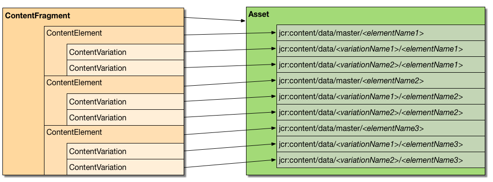
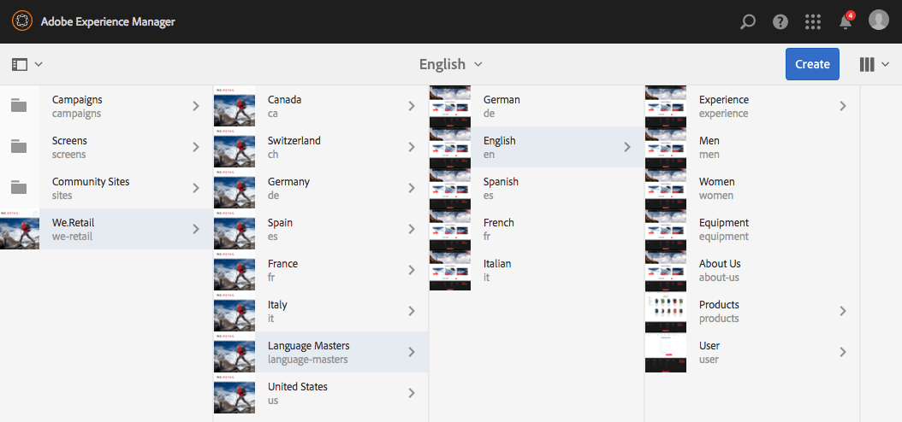
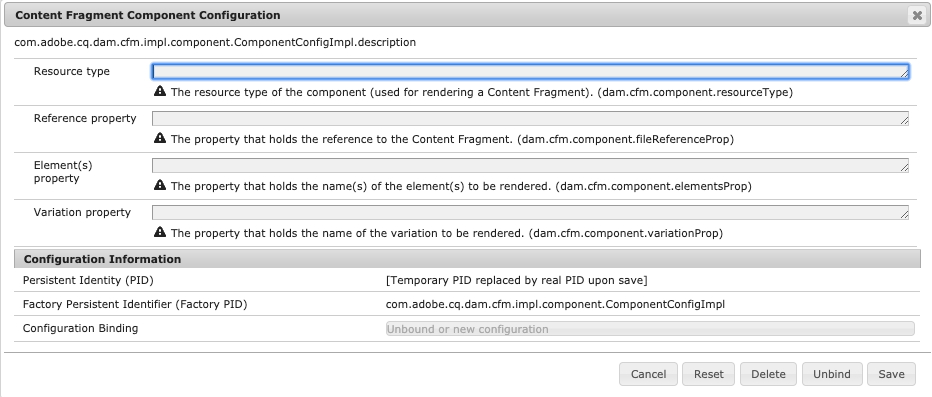

# Customizing and Extending Content Fragments{#customizing-and-extending-content-fragments}

A content fragment extends a standard asset; see:

* [Creating and Managing Content Fragments](/help/assets/content-fragments/content-fragments.md) and [Page Authoring with Content Fragments](/help/sites-authoring/content-fragments.md) for further information about content fragments.

* [Managing Assets](/help/assets/manage-assets.md) and [Customizing and Extending Assets](/help/assets/extending-assets.md) for further information about standard assets.

## Architecture {#architecture}

The basic [constituent parts](/help/assets/content-fragments/content-fragments.md#constituent-parts-of-a-content-fragment) of a content fragment are:

* A *Content Fragment,*
* consisting of one or more *Content Element*s,
* and which can have one or more *Content Variation*s.

Depending on the type of fragment, either models or templates are also used:

>[!CAUTION]
>
>[Content fragment models](/help/assets/content-fragments/content-fragments-models.md) are recommended for creating all new fragments.
>
>Content Fragment Models are used for all examples in WKND.

>[!NOTE]
>
>Prior to AEM 6.3 Content Fragments were created based on templates instead of models. 
>
>Content Fragment templates are now deprecated. They can still be used for creating fragments, but using Content Fragment Models instead is recommended. No new features will be added to fragment templates, and they will be removed in a future version.

* Content Fragment Models:

  * Used for defining content fragments that hold structured content.
  * Content fragment models define the structure of a content fragment when it is created.
  * A fragment references the model; so changes to the model may/will impact any dependent fragments.
  * Models are built-up of data types.
  * Functions to add new variations, and so on, have to update the fragment accordingly.

  >[!CAUTION]
  >
  >Any changes to an existing content fragment model can impact dependent fragments; this can lead to orphan properties in those fragments.

* Content Fragment Templates:

  * Used for defining simple content fragments.
  * Templates define the (basic, text-only) structure of a content fragment when it is created.
  * The template is copied to the fragment when it is created; so further changes to the template will not be reflected in existing fragments.
  * Functions to add new variations, and so on, have to update the fragment accordingly.
  * [Content fragment templates](/help/sites-developing/content-fragment-templates.md) operate in a different manner to that of other templating mechanisms within the AEM ecosystem (for example, page templates, and so on). Therefore they should be considered separately.
  * When based on a template the MIME type of the content is managed on the actual content; this means that each element and variation can have a different MIME type.

### Integration with Assets {#integration-with-assets}

Content Fragment Management (CFM) is part of AEM Assets as:

* Content fragments are assets.
* They use existing Assets functionality.
* They are fully integrated with Assets (admin consoles, and so on).

#### Mapping Structured Content Fragments to Assets {#mapping-structured-content-fragments-to-assets}



Content fragments with structured content (that is, based on a content fragment model) are mapped to a single asset:

* All content is stored under the `jcr:content/data` node of the asset:

  * The element data is stored under the master sub-node:
    `jcr:content/data/master`

  * Variations are stored under a sub-node that carries the name of the variation:
    for example, `jcr:content/data/myvariation`

  * The data of each element is stored in the respective sub-node as a property with the element name:
    for example, the content of element `text` is stored as property `text` on `jcr:content/data/master`

* Metadata and associated content is stored below `jcr:content/metadata`
  Except for the title and description, which are not considered traditional metadata and stored on `jcr:content`

#### Mapping Simple Content Fragments to Assets {#mapping-simple-content-fragments-to-assets}



Simple content fragments (based on a template) are mapped to a composite consisting of a main asset and (optional) sub-assets:

* All non-content information of a fragment (such as title, description, metadata, structure) is managed on the main asset exclusively.
* The content of the first element of a fragment is mapped to the original rendition of the main asset.

  * The variations (if there are any) of the first element are mapped to other renditions of the main asset.

* Additional elements (if existing) are mapped to sub-assets of the main asset.

  * The main content of these additional elements map to the original rendition of the respective sub-asset.
  * Other variations (if applicable) of any additional elements map to other renditions of the respective sub-asset.

#### Asset Location {#asset-location}

As with standard assets, a content fragment is held under:

`/content/dam`

#### Asset Permissions {#asset-permissions}

For further details see [Content Fragment - Delete Considerations](/help/assets/content-fragments/content-fragments-delete.md).

#### Feature Integration {#feature-integration}

* The Content Fragment Management (CFM) feature builds on the Assets core, but should be as independent of it as possible.
* CFM provides its own implementations for items in the card/column/list views; these plug into the existing Assets content rendering implementations.
* Several Assets components have been extended to cater for content fragments.

### Using Content Fragments in Pages {#using-content-fragments-in-pages}

>[!CAUTION]
>
>The [Content Fragment Core Component](https://experienceleague.adobe.com/docs/experience-manager-core-components/using/components/content-fragment-component.html) is now recommended. See [Developing Core Components](https://experienceleague.adobe.com/docs/experience-manager-core-components/using/developing/overview.html) for more details.

Content fragments can be referenced from AEM pages, just as any other asset type. AEM provides the [**Content Fragment** core component](https://experienceleague.adobe.com/docs/experience-manager-core-components/using/components/content-fragment-component.html) - a [component that lets you include content fragments on your pages](/help/sites-authoring/content-fragments.md#adding-a-content-fragment-to-your-page). You can also extend, this **Content Fragment** core component.

* The component uses the `fragmentPath` property to reference the actual content fragment. The `fragmentPath` property is handled in the same manner as similar properties of other asset types; for example, when the content fragment is moved to another location.

* The component lets you select the variation to be displayed.
* Additionally, a range of paragraphs can be selected to restrict the output; for example, this can be used for multi-column output.
* The component allows [in-between content](/help/sites-developing/components-content-fragments.md#in-between-content):

  * Here the component lets you place other assets (images, and so on) in between the paragraphs of the referenced fragment.
  * For in-between content you need to:

    * be aware of the possibility of unstable references; in-between content (added when authoring a page) has no fixed relationship to the paragraph it is positioned next to, inserting a new paragraph (in the content fragment editor) before the position of the in-between content can lose the relative position
    * consider the additional parameters (such as like variation and paragraph filters) to avoid false positives in search results

>[!NOTE]
>
>**Content Fragment Model:**
>
>When using a content fragment that has been based on a content fragment model on a page, the model is referenced. This means that if the model has not been published at the time you publish the page, this will be flagged and the model added to the resources to be published with the page.
>
>**Content Fragment Template:**
>
>When using a content fragment that has been based on a content fragment template on a page, there is no reference as the template was copied when creating the fragment.

#### Configuration using OSGi console {#configuration-using-osgi-console}

The backend implementation of content fragments is, for example, responsible for making instances of a fragment used on a page searchable, or for managing mixed media content. This implementation needs to know which components are used for rendering fragments and how the rendering is parameterized.

The parameters for this can be configured in the [Web Console](/help/sites-deploying/configuring-osgi.md#osgi-configuration-with-the-web-console), for the OSGi bundle **Content Fragment Component Configuration**.

* **Resource types**
  A list of `sling:resourceTypes` can be provided to define components that are used for rendering content fragments and where the background processing should be applied to.

* **Reference Properties**
  A list of properties can be configured to specify where the reference to the fragment is stored for the respective component.

>[!NOTE]
>
>There is no direct mapping between property and component type.
>
>AEM simply takes the first property that can be found on a paragraph. So you should choose the properties carefully.



There are still some guidelines you must follow to ensure your component is compatible with the content fragment background processing:

* The name of the property where the element(s) to be rendered is defined must be either `element` or `elementNames`.

* The name of the property where the variation to be rendered is defined must be either `variation` or `variationName`.

* If the output of multiple elements is supported (by using `elementNames` to specify multiple elements), the actual display mode is defined by property `displayMode`:

  * If the value is `singleText` (and there is only one element configured) then the element is rendered as a text with in-between content, layout support, and so on. This is the default for fragments where only one single element is rendered.
  * Otherwise, a much more simple approach is used (could be called "form view"), where no in-between content is supported and the fragment content is rendered "as is".

* If the fragment is rendered for `displayMode` == `singleText` (implicitly or explicitly) the following additional properties come into play:

  * `paragraphScope` defines whether all paragraphs, or only a range of paragraphs, should be rendered (values: `all` vs. `range`)

  * if `paragraphScope` == `range` then the property `paragraphRange` defines the range of paragraphs to be rendered

### Integration with other Frameworks {#integration-with-other-frameworks}

Content fragments can be integrated with:

* **Translations**

  Content Fragments are fully integrated with the [AEM translation workflow](/help/sites-administering/tc-manage.md). On an architectural level, this means:

  * The individual translations of a content fragment are actually separate fragments; for example:

    * they are located under different language roots:

      `/content/dam/<path>/en/<to>/<fragment>`

      vs.

      `/content/dam/<path>/de/<to>/<fragment>`

    * but they share exactly the same relative path below the language root:

      `/content/dam/<path>/en/<to>/<fragment>`

      vs.

      `/content/dam/<path>/de/<to>/<fragment>`

  * Besides the rule-based paths, there is no further connection between the different language versions of a content fragment; they are handled as two separate fragments, although the UI provides the means to navigate between the language variants.

  >[!NOTE]
  >
  >The AEM translation workflow works with `/content`:
  >
  >* As the content fragment models reside in `/conf`, these are not included in such translations. You can [internationalize the UI strings](/help/sites-developing/i18n-dev.md).
  >
  >* Templates are copied to create the fragment so this is implicit.

* **Metadata schemas**

  * Content fragments (re)use the [metadata schemas](/help/assets/metadata-schemas.md), that can be defined with standard assets.
  * CFM provides its own, specific schema:

    `/libs/dam/content/schemaeditors/forms/contentfragment`

    this can be extended if necessary.

  * The respective schema form is integrated with the fragment editor.

## The Content Fragment Management API - Server-Side {#the-content-fragment-management-api-server-side}

You can use the server-side API to access your content fragments; see:

[com.adobe.cq.dam.cfm](https://www.adobe.io/experience-manager/reference-materials/6-5/javadoc/com/adobe/cq/dam/cfm/package-summary.html)

>[!CAUTION]
>
>It is strongly recommended to use the server-side API instead of directly accessing the content structure.

### Key Interfaces {#key-interfaces}

The following three interfaces can serve as entry points:

* **Fragment Template** ([FragmentTemplate](https://www.adobe.io/experience-manager/reference-materials/6-5/javadoc/com/adobe/cq/dam/cfm/FragmentTemplate.html))

  Use `FragmentTemplate.createFragment()` for creating a fragment.

  ```
  Resource templateOrModelRsc = resourceResolver.getResource("...");
  FragmentTemplate tpl = templateOrModelRsc.adaptTo(FragmentTemplate.class);
  ContentFragment newFragment = tpl.createFragment(parentRsc, "A fragment name", "A fragment description.");

  ```

  This interface represents:

  * either a content fragment model or content fragment template from which to create a content fragment,
  * and (after the creation) the structural information of that fragment

  This information can include:

  * Access basic data (title, description)
  * Access templates/models for the elements of the fragment:

    * List element templates
    * Get structural information for a given element
    * Access the element template (see `ElementTemplate`)

  * Access templates for the variations of the fragment:

    * List variation templates
    * Get structural information for a given variation
    * Access the variation template (see `VariationTemplate`)

  * Get initial associated content

  Interfaces that represent important information:

  * `ElementTemplate`

    * Get basic data (name, title)
    * Get initial element content

  * `VariationTemplate`

    * Get basic data (name, title, description)

* **Content Fragment** ([ContentFragment](https://www.adobe.io/experience-manager/reference-materials/6-5/javadoc/com/adobe/cq/dam/cfm/ContentFragment.html))

  This interface lets you work with a content fragment in an abstract way.

  >[!CAUTION]
  >
  >It is strongly recommended to access a fragment through this interface. Changing the content structure directly should be avoided.

  The interface provides you with the means to:

  * Manage basic data (for example, get name; get/set title/description)
  * Access meta data
  * Access elements:

    * List elements
    * Get elements by name
    * Create new elements (see [Caveats](#caveats))

    * Access element data (see `ContentElement`)

  * List variations defined for the fragment
  * Create new variations globally
  * Manage associated content:

    * List collections
    * Add collections
    * Remove collections

  * Access the fragment's model or template

  Interfaces that represent the prime elements of a fragment are:

  * **Content Element** ([ContentElement](https://www.adobe.io/experience-manager/reference-materials/6-5/javadoc/com/adobe/cq/dam/cfm/ContentElement.html))

    * Get basic data (name, title, description)
    * Get/Set content
    * Access variations of an element:

      * List variations
      * Get variations by name
      * Create new variations (see [Caveats](#caveats))
      * Remove variations (see [Caveats](#caveats))
      * Access variation data (see `ContentVariation`)

    * Shortcut for resolving variations (applying some additional, implementation-specific fallback logic if the specified variation is not available for an element)

  * **Content Variation** ([ContentVariation](https://www.adobe.io/experience-manager/reference-materials/6-5/javadoc/com/adobe/cq/dam/cfm/ContentVariation.html))

    * Get basic data (name, title, description)
    * Get/Set content
    * Simple synchronization, based on last modified information

  All three interfaces ( `ContentFragment`, `ContentElement`, `ContentVariation`) extend the `Versionable` interface, which adds versioning capabilities, required for content fragments:

  * Create new version of the element
  * List versions of the element
  * Get the content of a specific version of the versioned element

### Adapting - Using adaptTo() {#adapting-using-adaptto}

The following can be adapted:

* `ContentFragment` can be adapted to:

  * `Resource` - the underlying Sling resource; note that updating the underlying `Resource` directly, requires rebuilding the `ContentFragment` object.

  * `Asset` - the DAM `Asset` abstraction that represents the content fragment; note that updating the `Asset` directly, requires rebuilding the `ContentFragment` object.

* `ContentElement` can be adapted to:

  * `ElementTemplate` - for accessing the element's structural information.

* `FragmentTemplate` can be adapted to:

  * `Resource` - the `Resource` determining the referenced model or the original template that was copied;

    * changes made through the `Resource` are not automatically reflected in the `FragmentTemplate`.

* `Resource` can be adapted to:

  * `ContentFragment`
  * `FragmentTemplate`

### Caveats {#caveats}

It should be noted that:

* The API is implemented to provide functionality supported by the UI.
* The entire API is designed to **not** persist changes automatically (unless otherwise noted in the API JavaDoc). So you will always have to commit the resource resolver of the respective request (or the resolver you are actually using).
* Tasks that might require additional effort:

  * Creating/removing new elements will not update the data structure of simple fragments (based on a fragment template).
  * Creating new variations from `ContentElement` will not update the data structure (but creating them globally from `ContentFragment` will).

  * Removing existing variations will not update the data structure.

## The Content Fragment Management API - Client-Side {#the-content-fragment-management-api-client-side}

>[!CAUTION]
>
>For AEM 6.5 the client-side API is internal.

### Additional Information {#additional-information}

See the following:

* `filter.xml`

  The `filter.xml` for content fragment management is configured so that it does not overlap with the Assets core content package.

## Edit Sessions {#edit-sessions}

An editing session is started when the user opens a content fragment in one of the editor pages. The editing session is finished when the user leaves the editor by selecting either **Save** or **Cancel**.

### Requirements {#requirements}

Requirements for controlling an editing session are:

* Editing a content fragment, which can span multiple views (= HTML pages), should be atomic.
* The editing should also be *transactional*; at the end of the edit session the changes must either be committed (saved) or rolled back (cancelled).
* Edge cases should be handled properly; these include situations such as when the user leaving the page by entering a URL manually or using global navigation.
* A periodic auto save (every x minutes) should be available to prevent data loss.
* If a content fragment is edited by two users concurrently, they should not overwrite each other's changes.

#### Processes {#processes}

The processes involved are:

* Starting a session

  * A new version of the content fragment is created.
  * Auto save is started.
  * Cookies are set; these define the currently edited fragment and that there is an edit session open.

* Finishing a session

  * Auto save is stopped.
  * Upon commit:

    * The last modified information is updated.
    * Cookies are removed.

  * Upon rollback:

    * The version of the content fragment that was created when the edit session was started is restored.
    * Cookies are removed.

* Editing

  * All changes (auto save included) are done on the active content fragment - not in a separated, protected area.
  * Therefore, those changes are reflected immediately on AEM pages that reference the respective content fragment

#### Actions {#actions}

The possible actions are:

* Entering a page

  * Check if an editing session is already present; by checking the respective cookie.

    * If one exists, verify that the editing session was started for the content fragment that is currently being edited

      * If the current fragment, reestablish the session.
      * If not, try to cancel editing for the previously edited content fragment and remove cookies (no editing session present afterwards).

    * If no edit session exists, wait for the first change made by the user (see below).

  * Check if the content fragment is already referenced on a page and display appropriate information if so.

* Content change

  * Whenever the user changes content and there is no edit session present, a new edit session is created (see [Starting a session](#processes)).

* Leaving a page

  * If an editing session is present and the changes have not been persisted, a modal confirmation dialog is shown to notify the user of potentially lost content and allow them to stay on the page.

## Examples {#examples}

### Example: Accessing an existing content fragment {#example-accessing-an-existing-content-fragment}

To achieve this you can adapt the resource that represents the API to:

`com.adobe.cq.dam.cfm.ContentFragment`

For example:

```java
// first, get the resource
Resource fragmentResource = resourceResolver.getResource("/content/dam/fragments/my-fragment");
// then adapt it
if (fragmentResource != null) {
    ContentFragment fragment = fragmentResource.adaptTo(ContentFragment.class);
    // the resource is now accessible through the API
}
```

### Example: Creating a content fragment {#example-creating-a-new-content-fragment}

To create a content fragment programmatically, you need to use:

`com.adobe.cq.dam.cfm.ContentFragmentManager#create`

For example:

```java
Resource templateOrModelRsc = resourceResolver.getResource("...");
FragmentTemplate tpl = templateOrModelRsc.adaptTo(FragmentTemplate.class);
ContentFragment newFragment = tpl.createFragment(parentRsc, "A fragment name", "A fragment description.");

```

### Example: Specifying the auto-save interval {#example-specifying-the-auto-save-interval}

The auto save interval (measured in seconds) can be defined using the configuration manager (ConfMgr):

* Node: `<*conf-root*>/settings/dam/cfm/jcr:content`
* Property Name: `autoSaveInterval`
* Type: `Long`

* Default: `600` (10 minutes); this is defined on `/libs/settings/dam/cfm/jcr:content`

If you want to set an auto save interval of 5 minutes you need to define the property on your node; for example:

* Node: `/conf/global/settings/dam/cfm/jcr:content`
* Property Name: `autoSaveInterval`

* Type: `Long`

* Value: `300` (5 minutes equates to 300 seconds)

## Content Fragment Templates {#content-fragment-templates}

See [Content Fragment Templates](/help/sites-developing/content-fragment-templates.md) for full information.

## Components for Page Authoring {#components-for-page-authoring}

For further information see

* [Core Components - Content Fragment Component](https://experienceleague.adobe.com/docs/experience-manager-core-components/using/components/content-fragment-component.html) (recommended)
* [Content Fragment Components - Components for Page Authoring](/help/sites-developing/components-content-fragments.md#components-for-page-authoring)
