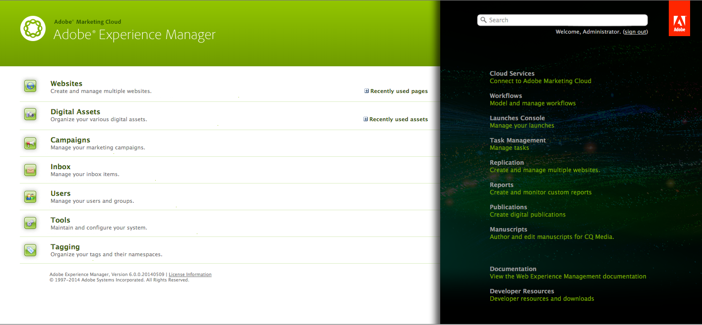
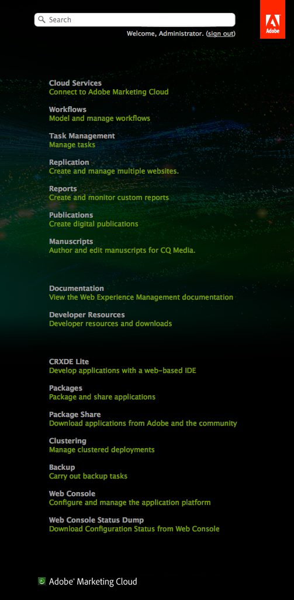

# Customizing the Welcome Console (Classic UI){#customizing-the-welcome-console-classic-ui}

>[!CAUTION]
>
>This page deals with the classic UI.
>
>See [Customizing the Consoles](/help/sites-developing/customizing-consoles-touch.md) for details on the standard, touch-enabled UI.

The Welcome console provides a list of links to the various consoles and functionality within AEM.

It is possible to configure the links that are visible. This can be defined for specific users and/or groups. The actions to be taken are dependent on the target type (which correlates to the section of the console they are in):

* [Main Consoles](#links-in-main-console-left-pane) - Links in the main console (left pane)
* [Resources, Documentation and Reference, Features](#links-in-sidebar-right-pane) - Links in the sidebar (right pane)

## Links in Main Console (Left Pane) {#links-in-main-console-left-pane}

This lists the main consoles of AEM.

### Configuring whether Main Console Links are Visible {#configuring-whether-main-console-links-are-visible}

Node level permissions determine whether the link can be seen or not. The nodes in question are:

* **Websites:** `/libs/wcm/core/content/siteadmin`

* **Digital Assets:** `/libs/wcm/core/content/damadmin`

* **Community:** `/libs/collab/core/content/admin`

* **Campaigns:** `/libs/mcm/content/admin`

* **Inbox:** `/libs/cq/workflow/content/inbox`

* **Users:** `/libs/cq/security/content/admin`

* **Tools:** `/libs/wcm/core/content/misc`

* **Tagging:** `/libs/cq/tagging/content/tagadmin`

For example:

* To restrict access to **Tools**, remove read access from

  `/libs/wcm/core/content/misc`

See the [Security section](/help/sites-administering/security.md) for more information on how to set the desired permissions.

### Links in Sidebar (Right Pane) {#links-in-sidebar-right-pane}

These links are based on the existence of *and* read access to nodes under the following path:

`/libs/cq/core/content/welcome`

There are three sections (spaced slightly apart) provided by default:

<table>
 <tbody>
  <tr>
   <td><strong>Resources</strong></td>
   <td> </td>
  </tr>
  <tr>
   <td> Cloud Services</td>
   <td><code>/libs/cq/core/content/welcome/resources/cloudservices</code></td>
  </tr>
  <tr>
   <td> Workflows</td>
   <td><code>/libs/cq/core/content/welcome/resources/workflows</code></td>
  </tr>
  <tr>
   <td> Task Management</td>
   <td><code>/libs/cq/core/content/welcome/resources/taskmanager</code></td>
  </tr>
  <tr>
   <td> Replication</td>
   <td><code>/libs/cq/core/content/welcome/resources/replication</code></td>
  </tr>
  <tr>
   <td> Reports</td>
   <td><code>/libs/cq/core/content/welcome/resources/reports</code></td>
  </tr>
  <tr>
   <td> Publications</td>
   <td><code>/libs/cq/core/content/welcome/resources/publishingadmin</code></td>
  </tr>
  <tr>
   <td> Manuscripts</td>
   <td><code>/libs/cq/core/content/welcome/resources/manuscriptsadmin</code></td>
  </tr>
  <tr>
   <td><strong>Documentation and Reference</strong></td>
   <td> </td>
  </tr>
  <tr>
   <td> Documentation</td>
   <td><code>/libs/cq/core/content/welcome/docs/docs</code></td>
  </tr>
  <tr>
   <td> Developer Resources</td>
   <td><code>/libs/cq/core/content/welcome/docs/dev</code></td>
  </tr>
  <tr>
   <td><strong>Features</strong></td>
   <td> </td>
  </tr>
  <tr>
   <td> CRXDE Lite</td>
   <td><code>/libs/cq/core/content/welcome/features/crxde</code></td>
  </tr>
  <tr>
   <td> Packages</td>
   <td><code>/libs/cq/core/content/welcome/features/packages</code></td>
  </tr>
  <tr>
   <td> Package Share</td>
   <td><code>/libs/cq/core/content/welcome/features/share</code></td>
  </tr>
  <tr>
   <td> Clustering</td>
   <td><code>/libs/cq/core/content/welcome/features/cluster</code></td>
  </tr>
  <tr>
   <td> Backup</td>
   <td><code>/libs/cq/core/content/welcome/features/backup</code></td>
  </tr>
  <tr>
   <td> Web Console  </td>
   <td><code>/libs/cq/core/content/welcome/features/config</code></td>
  </tr>
  <tr>
   <td> Web Console Status Dump  </td>
   <td><code>/libs/cq/core/content/welcome/features/statusdump</code></td>
  </tr>
 </tbody>
</table>

#### Configuring whether Sidebar Links are Visible {#configuring-whether-sidebar-links-are-visible}

It is possible to hide a link from specific users or groups by removing read access to the nodes that represent the link.

* Resources - remove access to:

  `/libs/cq/core/content/welcome/resources/<link-target>`

* Docs - remove access to:

  `/libs/cq/core/content/welcome/docs/<link-target>`

* Features - remove access to:

  `/libs/cq/core/content/welcome/features/<link-target>`

For example:

* To remove the link to **Reports**, remove read access from

  `/libs/cq/core/content/welcome/resources/reports`

* To remove the link to **Packages**, remove read access from

  `/libs/cq/core/content/welcome/features/packages`

See the [Security section](/help/sites-administering/security.md) for more information on how to set the desired permissions.

### Link Selection Mechanism {#link-selection-mechanism}

In `/libs/cq/core/components/welcome/welcome.jsp` use is made of [ConsoleUtil](https://helpx.adobe.com/experience-manager/6-5/sites/developing/using/reference-materials/javadoc/com/day/cq/commons/ConsoleUtil.html), which executes a query on nodes that have the property:

* `jcr:mixinTypes` with the value: `cq:Console`

>[!NOTE]
>
>Execute the following query to see the existing list:
>
>* `select * from cq:Console`
>

When a user or group does not have read permission on a node with the mixin `cq:Console`, that node is not retrieved by the `ConsoleUtil` search, hence it is not listed on the console.

### Adding a Custom Item {#adding-a-custom-item}

The [link selection mechanism](#link-selection-mechanism) can be used to add your own custom item to the list of links.

Add your custom item to the list by adding the `cq:Console` mixin to your widget or resource. This is done by defining the property:

* `jcr:mixinTypes` with the value: `cq:Console`
