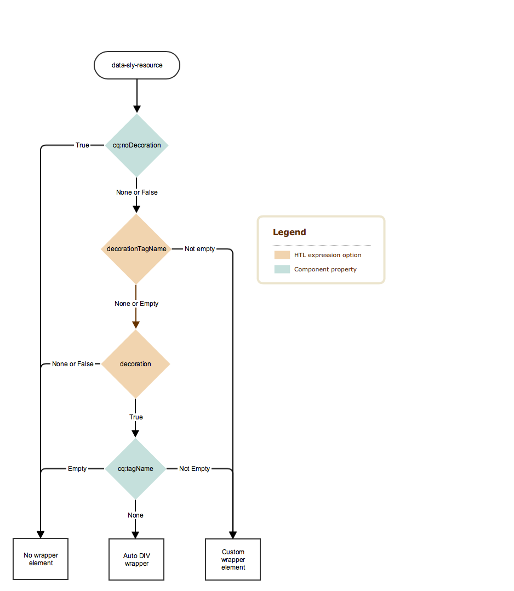

# Decoration Tag{#decoration-tag}

When a component in a web page is rendered, an HTML element can be generated, wrapping the rendered component within itself. This primarily serves two purposes:

* A component can only be edited when it is wrapped with an HTML element.
* The wrapping element is used to apply HTML classes that provide:

    * layout information
    * styling information

For developers, AEM offers clear and simple logic controlling the decoration tags that wrap included components. Whether and how the decoration tag is rendered is defined by the combination of two factors, which this page will dive into:

* The component themselves can configure their decoration tag with a set of properties.
* The scripts that include components (HTL, JSP, dispatcher, and so on) can define the aspects of the decoration tag with include parameters.

## Recommendations {#recommendations}

Here are some general recommendations of when to include the wrapper element that should help in avoiding running into unexpected issues:

* The presence of the wrapper element should not differ between WCMModes (edit or preview mode), instances (author or publish) or environment (staging or production), so that the CSS and JavaScripts of the page work identically in all cases.
* The wrapper element should be added to all components that are editable, so that the page editor can initialize and update them properly.
* For non-editable components, the wrapper element can be avoided if it serves no particular function, so that the resulting markup is not unnecessarily bloated.

## Component Controls {#component-controls}

The following properties and nodes can be applied to the components to control the behavior of their decoration tag:

* **`cq:noDecoration {boolean}`:** This property can be added to a component and a true value forces AEM not to generate any wrapper elements over the component.

* **`cq:htmlTag` node :** This node can be added under a component and can have the following properties:

    * **`cq:tagName {String}` :** This can be used to specify a custom HTML tag to be used for wrapping the components instead of the default DIV element.
    * **`class {String}` :** This can be used to specify css class names to be added to the wrapper.
    * Other property names will be added as HTML attributes with the same String value as provided.

## Script Controls {#script-controls}

The wrapper behavior does differ however depending on if [HTL](/help/sites-developing/decoration-tag.md#htl) or [JSP](/help/sites-developing/decoration-tag.md#jsp) is used to include the element.

### HTL {#htl}

In general, the wrapper behavior in HTL can be summarized as follows:

* No wrapper DIV is rendered by default (when just doing `data-sly-resource="foo"`).
* All wcm-modes (disabled, preview, edit on both author and publish) render identically.

The behavior of the wrapper can also be fully controlled.

* The HTL script has full control over the resulting behavior of the wrapper tag.
* Component properties (like `cq:noDecoration` and `cq:tagName`) can also define the wrapper tag.

It is possible to fully control the behavior of the wrapper tags from HTL scripts and their associated logic.

For further information about developing in HTL see the [HTL documentation](https://experienceleague.adobe.com/docs/experience-manager-htl/content/overview.html).

#### Decision Tree {#decision-tree}

This decision tree summarizes the logic that determines the behavior of the wrapper tags.



#### Use Cases {#use-cases}

The following three use cases provide examples of how the wrapper tags are handled, and also illustrate how simple it is to control the desired behavior of the wrapper tags.

All examples that follow assume following content structure, and components:

```
/content/test/
  @resourceType = "test/components/one"
  child/
    @resourceType = "test/components/two"

```

```
/apps/test/components/
  one/
    one.html
  two/
    two.html
    cq:htmlTag/
      @cq:tagName = "article"
      @class = "component-two"
```

#### Use Case 1: Include a Component for Code Reuse {#use-case-include-a-component-for-code-reuse}

The most typical use case is when a component includes another component for code reuse reasons. In that case, the included component is not desired to be editable with its own toolbar and dialog, so no wrapper is needed, and the component's `cq:htmlTag` will be ignored. This can be considered the default behavior.

`one.html: <sly data-sly-resource="child"></sly>`

`two.html: Hello World!`

Resulting output on `/content/test.html`:

**`Hello World!`**

An example would be a component that includes a core image component to display an image, typically in that case by using a synthetic resource, which consists in including a virtual child component by passing to data-sly-resource a Map object that represents all the properties that the component would have.

#### Use Case 2: Include an Editable Component {#use-case-include-an-editable-component}

Another common use case is when container components include editable child components, like a Layout Container. In this case, each included child imperatively needs a wrapper for the editor to work (unless explicitly disabled with the `cq:noDecoration` property).

Since the included component is in this case an independent component, it needs a wrapper element for the editor to work, and to define its layout and style to apply. To trigger this behavior, there's the `decoration=true` option.

`one.html: <sly data-sly-resource="${'child' @ decoration=true}"></sly>`

`two.html: Hello World!`

Resulting output on `/content/test.html`:

**`<article class="component-two">Hello World!</article>`**

#### Use Case 3: Custom Behavior {#use-case-custom-behavior}

There can be any number of complex cases, which can be achieved easily by the possibility of HTL to provide explicitly:

* **`decorationTagName='ELEMENT_NAME'`** To define the element name of the wrapper.
* **`cssClassName='CLASS_NAME'`** To define the CSS class names to set on it.

`one.html: <sly data-sly-resource="${'child' @ decorationTagName='aside', cssClassName='child'}"></sly>`

`two.html: Hello World!`

Resulting output `/content/test.html`:

**`<aside class="child">Hello World!</aside>`**

## JSP {#jsp}

When including a component using `cq:includ`e or `sling:include`, the default behavior in AEM is to use a DIV to wrap the element. However, this wrapping can be customized in two ways:

* Explicitly tell AEM not to wrap the component using `cq:noDecoration`.
* Use a custom HTML tag to wrap the component using `cq:htmlTag`/ `cq:tagName` or `decorationTagName`.

### Decision Tree {#decision-tree-1}

The following decision tree illustrates how `cq:noDecoration`, `cq:htmlTag`, `cq:tagName`, and `decorationTagName` affect the wrapper behavior.


