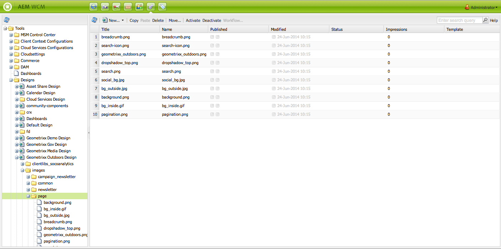
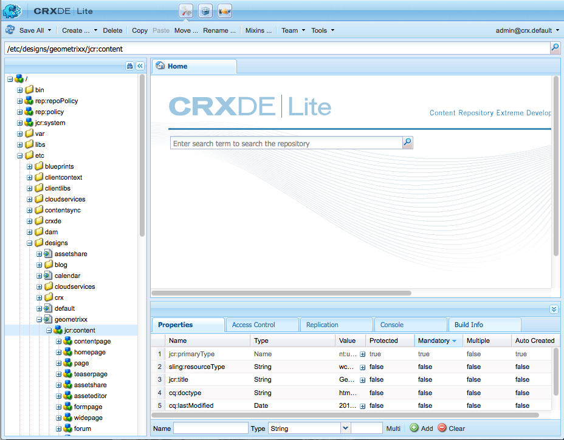

# Designs and the Designer{#designs-and-the-designer}

>[!CAUTION]
>
>This article describes how to create a website based on the classic UI. Adobe recommends using the latest AEM technologies for your websites as described in detail in the article [Getting Started Developing AEM Sites](/help/sites-developing/getting-started.md).

The Designer is used to create a design for your website using the [Classic UI](/help/release-notes/touch-ui-features-status.md) in AEM.

>[!NOTE]
>
>For more information about Web accessibility, see [AEM and the Web Accessibility Guidelines](/help/managing/web-accessibility.md).

## Using the Designer {#using-the-designer}

Your design can be defined in the **designs** section of the **Tools** tab:



Here you can create the structure required to store the design, then upload the cascaded style sheets and images required.

Designs are stored under `/apps/<your-project>`. The path to the design to be used for a website is specified using the `cq:designPath` property of the `jcr:content` node.



>[!NOTE]
>
>All the changes that are made on a page in design mode are persisted below the design node of the site and are automatically applied to all pages that have the same design.

## What you will need {#what-you-will-need}

To realize your design you will need:

**CSS** - The Cascading Style Sheets define the formats of specific areas on your pages.
**Images** - Any images that you use for features such as backgrounds, buttons.

### Considerations When Designing Your Website {#considerations-when-designing-your-website}

When developing a website, it is highly recommended to store images and CSS files under `/apps/<your-project>` so you can reference your resources based on the current design like described by the following snippet.

```xml
<%= currentDesign.getPath() + "/static/img/icon.gif %>
```

The preceding example offers severals benefits:

* Components can have a different look/feel based on each site using a different design path.
* Re-design of the website can be simply done by pointing the design path to a different node at the root of the site from `design/v1` to `design/v2.`

* `/etc/designs` and `/content` are the only external URLs that the browser sees protecting you of an external user getting curious about what is under your `/apps` tree. The above URL benefits also aid your System Administrator to setup better security because you are limiting the exposure of the assets to a few distinct locations.
