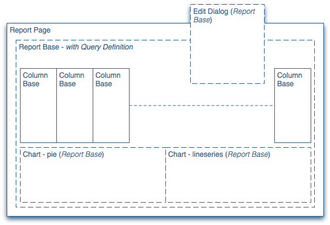
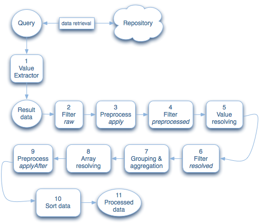

# Developing Reports {#developing-reports}

Adobe Experience Manager (AEM) provides a selection of [standard reports](/help/sites-administering/reporting.md) most of which are based on a reporting framework.

Using the framework you can either extend these standard reports, or develop your own, new reports. The reporting framework integrates tightly with existing CQ5 concepts and principles so that developers can use their existing knowledge of CQ5 as a springboard for developing reports.

For the standard reports delivered with AEM:

* These reports are built on the reporting framework:

  * [Component Report](/help/sites-administering/reporting.md#component-report)
  * [Page Activity Report](/help/sites-administering/reporting.md#page-activity-report)
  * [User Report](/help/sites-administering/reporting.md#user-report)
  * [Workflow Instance Report](/help/sites-administering/reporting.md#workflow-instance-report)

* The following reports are based on individual principles and therefore cannot be extended:

  * [Disk Usage](/help/sites-administering/reporting.md#disk-usage)
  * [Health Check](/help/sites-administering/reporting.md#health-check)
  * [Workflow Report](/help/sites-administering/reporting.md#workflow-report)

>[!NOTE]
>
>The tutorial [Creating Your Own Report - An Example](#creating-your-own-report-an-example) also shows how many of the principles below can be used.
>
>You can also refer to the standard reports to see other examples of implementation.

>[!NOTE]
>
>In the examples and definitions below the following notation is used :
>
>* Each line defines a node or a property where:
>  `N:<name> [<nodeType>]` : Describes a node with the name of `<*name*>` and node type of `<*nodeType*>`*.*
>  `P:<name> [<propertyType]` : Describes a property with the name of `<*name*>` and a property type of `<*propertyType*>`.
>  `P:<name> = <value>` : Describes a property `<name>` that must be set to the value of `<value>`.
>
>* Indentation shows the hierarchical dependencies between the nodes.
>* Items separated by | denotes a list of possible items; for example, types or names; for example, `String|String[]` means that the property can be either String or String[].
>
>* `[]` depicts an array; such as String[] or an array of nodes as in the [Query Definition](#query-definition).
>
>Unless otherwise stated the default types are:
>
>* Nodes - `nt:unstructured`
>* Properties - `String`

## Reporting Framework {#reporting-framework}

The reporting framework works on the following principles:

* It is entirely based on result sets that are returned by a query executed by the CQ5 QueryBuilder.
* The result set defines the data displayed in the report. Each row in the result set corresponds to a row in the tabular view of the report.
* The operations available for execution on the result set resemble RDBMS concepts; primarily *grouping* and *aggregation*.

* Most data retrieval and processing is done server-side.
* The client is solely responsible for displaying the pre-processed data. Only minor processing tasks (for example, creating links in cell content) are executed client-side.

The reporting framework (illustrated by the structure of a standard report) uses the following building blocks, fed by the processing queue:



### Report Page {#report-page}

The report page is:

* A standard CQ5 page.
* Based on a [standard CQ5 template, configured for the report](#report-template).

### Report Base {#report-base}

The [ `reportbase` component](#report-base-component) forms the basis of any report because it:

* Preserves the definition of the [query](#the-query-and-data-retrieval) that delivers the underlying result set of data.

* It is an adapted paragraph system that contains all columns ( `columnbase`) added to the report.
* Defines which chart types are available and which are currently active.
* Defines the Edit dialog box, which allows the user to configure certain aspects of the report.

### Column Base {#column-base}

Each column is an instance of the [ `columnbase` component](#column-base-component) that:

* Is a paragraph, used by the parsys ( `reportbase`) of the respective report.
* Defines the link to the [underlying result set](#the-query-and-data-retrieval). That is, it defines the specific data referenced within this result set, and how it is processed.
* Retains additional definitions; such as the aggregates and filters available, together with any default values.

### The Query and Data Retrieval {#the-query-and-data-retrieval}

The query:

* Is defined as part of the [ `reportbase`](#report-base) component.
* Is based on the [CQ QueryBuilder](https://developer.adobe.com/experience-manager/reference-materials/6-5/javadoc/com/day/cq/search/QueryBuilder.html).
* Retrieves the data used as the basis of the report. Each row of the result set (table) is tied to a node as returned by the query. Specific information for [individual columns](#column-base-component) is then extracted from this data set.

* Usually consists of:

    * A root path.

      This specifies the subtree of the repository to be searched.

      To help minimize the performance impact, it is advisable to (try to) restrict the query to a specific subtree of the repository. The root path can be either predefined in the [report template](#report-template) or set by the user in the [Configuration (Edit) dialog box](#configuration-dialog).

    * [One or more criteria](#query-definition).

      These are imposed to produce the (initial) result set; they include, for example, restrictions on the node type, or property constraints.

**The key point here is that each single node returned in the result set of the query is used to generate a single row on the report (so a 1:1 relationship).**

The developer has to ensure that the query defined for a report returns a node set appropriate for that report. However, the node itself does not need to hold all the required information, this can also be derived from parent and/or child nodes. For example, the query used for the [User Report](/help/sites-administering/reporting.md#user-report) selects nodes based on the node type (in this case `rep:user`). However, most columns on this report do not take their data directly from these nodes, but from the child nodes `profile`.

### Processing Queue {#processing-queue}

The [query](#the-query-and-data-retrieval) returns a result set of data to be displayed as rows on the report. Each row in the result set is processed (server-side), in [several phases](#phases-of-the-processing-queue), before being transferred to the client for display on the report.

This allows:

* Extracting and deriving values from the underlying result set.

  For example, it lets you process two property values as a single value by calculating the difference between the two.

* Resolving extracted values; this can be done in various ways.

  For example, paths can be mapped to a title (as in the more human-readable content of the respective *jcr:title* property).

* Applying filters at various points.
* Creating compound values, if necessary.

  For example, consisting of a text that is displayed to the user, a value to be used for sorting and an additional URL that is used (on the client side) for creating a link.

#### Workflow of the Processing Queue {#workflow-of-the-processing-queue}

The following workflow represents the processing queue:



#### Phases of the Processing Queue {#phases-of-the-processing-queue}

Where the detailed steps and elements are:

1. Transforms the results returned by the [initial query (reportbase)](#query-definition) into the basic result set using value extractors.

   Value extractors are automatically chosen depending on the [column type](#column-specific-definitions). They are used for reading values from the underlying JCR Query and creating a result set from them; after which further processing may then be applied. For example, for the `diff` type, the value extractor reads two properties, calculates the single value that is then added to the result set. The value extractors cannot be configured.

1. To that initial result set, containing raw data, [initial filtering](#column-specific-definitions) (*raw* phase) is applied.

1. Values are [preprocessed](#processing-queue); as defined for the *apply* phase.

1. [Filtering](#column-specific-definitions) (assigned to the *preprocessed* phase) is executed on the preprocessed values.

1. Values are resolved; according to the [defined resolver](#processing-queue).
1. [Filtering](#column-specific-definitions) (assigned to the *resolved* phase) is executed on the resolved values.

1. Data is [grouped and aggregated](#column-specific-definitions).
1. Array data is resolved by converting it into a (string-based) list.

   This is an implicit step that converts a multi-value result into a list that can be displayed; it is required for (unaggregated) cell values that are based on multi-value JCR properties.

1. Values are again [preprocessed](#processing-queue); as defined for the *afterApply* phase.

1. Data is sorted.
1. The processed data is transferred to the client.

>[!NOTE]
>
>The initial query returning the basis data result set is defined on the `reportbase` component.
>
>Other elements of the processing queue are defined on the `columnbase` components.

## Report Construction and Configuration {#report-construction-and-configuration}

The following are needed to construct and configure a report:

* a [location for the definition of your report components](#location-of-report-components)
* a [ `reportbase` component](#report-base-component)
* one, or more, [ `columnbase` components](#column-base-component)
* a [page component](#page-component)
* a [report design](#report-design)
* a [report template](#report-template)

### Location of Report Components {#location-of-report-components}

The default reporting components are held under `/libs/cq/reporting/components`.

However, it is recommended that you do not update these nodes, but create your own component nodes under `/apps/cq/reporting/components` or if more appropriate `/apps/<yourProject>/reports/components`.

Where (as an example):

```
N:apps
    N:cq [nt:folder]
        N:reporting|reports [sling:Folder]
            N:components [sling:Folder]
```

Under this, you create the root for your report and under this, the report base component and the column base components:

```
N:apps
    N:cq [nt:folder]
        N:reporting|reports [sling:Folder]
            N:components [sling:Folder]
                N:<reportname> [sling:Folder]
                        N:<reportname> [cq:Component]  // report base component
                        N:<columnname> [cq:Component]  // column base component
```

### Page Component {#page-component}

A report page must use the `sling:resourceType` of `/libs/cq/reporting/components/reportpage`.

A customized page component should not be necessary (usually).

## Report Base Component {#report-base-component}

Each report type requires a container component derived from `/libs/cq/reporting/components/reportbase`.

This component acts as a container for the report as a whole and provides information for:

* The [query definition](#query-definition).
* An [(optional) dialog](#configuration-dialog) for configuring the report.
* Any [Charts](#chart-definitions) that are integrated with the report.

```
N:<reportname> [cq:Component]
    P:sling:resourceSuperType = "cq/reporting/components/reportbase"
    N:charting
    N:dialog [cq:Dialog]
    N:queryBuilder
```

### Query Definition {#query-definition}

```xml
N:queryBuilder
    N:propertyConstraints
    [
        N:<name> // array of nodes (name irrelevant), each with the following properties:
            P:name
            P:value
    ]
    P:nodeTypes [String|String[]]
    P:mandatoryProperties [String|String[]
  ]
```

* `propertyConstraints`

  Limits the result set to nodes that have specific properties with specific values. If multiple constraints are specified, the node must satisfy all of them (AND operation).

  For example:

  ```
  N:propertyConstraints
   [
   N:0
   P:sling:resourceType
   P:foundation/components/textimage
   N:1
   P:jcr:modifiedBy
   P:admin
   ]
  ```

  Would return all `textimage` components that were last modified by the `admin` user.

* `nodeTypes`

  Used to limit the result set to the specified node types. Multiple node types can be specified.

* `mandatoryProperties`

  Limits the result set to nodes that have *all* the specified properties. The value of the properties is not account for.

All are optional and can be combined as necessary, but you must define at least one of them.

### Chart Definitions {#chart-definitions}

```xml
N:charting
    N:settings
        N:active [cq:WidgetCollection]
        [
            N:<name> // array of nodes, each with the following property
                P:id   // must match the id of a child node of definitions
        ]
    N:definitions [cq:WidgetCollection]
    [
        N:<name> // array of nodes, each with the following properties
            P:id
            P:type
            // additional, chart type specific configurations
    ]
```

* `settings`

  Holds definitions for the active charts.

    * `active`

      As multiple settings can be defined, you can use this to define which are currently active. These are defined by an array of nodes (there is no compulsory naming convention for these nodes, but the standard reports often use `0`, `1`.. `x`), each having the following property:

        * `id`

          Identification for the active charts. This must match the id of one of the chart `definitions`.

* `definitions`

  Defines the chart types that are potentially available for the report. The `definitions` to be used is specified by the `active` settings.

  The definitions are specified using an array of nodes (again often named `0`, `1`.. `x`), each having the following properties:

    * `id`

      The chart's identification.

    * `type`

      The type of chart available. Select from:

        * `pie`
          Pie chart. Generated from current data only.

        * `lineseries`
          Series of lines (connecting dots representing the actual snapshots). Generated from historic data only.

    * Additional properties are available, dependent on the chart type:

        * for the chart type `pie`:

            * `maxRadius` ( `Double/Long`)

              The maximum radius allowed for the pie chart; therefore the maximum size allowed for the chart (without legend). Ignored if `fixedRadius` is defined.

            * `minRadius` ( `Double/Long`)

              The minimum radius allowed for the pie chart. Ignored if `fixedRadius` is defined.

            * `fixedRadius` ( `Double/Long`)
              Defines a fixed radius for the pie chart.

        * for the chart type [`lineseries`](/help/sites-administering/reporting.md#display-limits):

            * `totals` ( `Boolean`)

              True if an additional line showing the **Total** should be shown.
              default: `false`

            * `series` ( `Long`)

              Number of lines/series to be shown.
              default: `9` (this is also the maximum allowed)

            * `hoverLimit` ( `Long`)

              Maximum number of aggregated snapshots (dots shown on each horizontal line, representing distinct values) for which pop-ups are to be displayed. That is, when the user does mouse over on a distinct value or corresponding label in the chart legend.

              default: `35` (that is, no pop-ups at all are shown if more than 35 distinct values are applicable for the current chart settings).

              There is an additional limit of ten pop-ups that can be shown in parallel (multiple pop-ups can be shown when mouse-over is made over the legend texts).

### Configuration Dialog {#configuration-dialog}

Every report can have a configuration dialog, allowing the user to specify various parameters for the report. This dialog is accessible through the **Edit** button when the report page is open.

This dialog is a standard CQ [dialog](/help/sites-developing/components-basics.md#dialogs) and can be configured as such (see [CQ.Dialog](https://developer.adobe.com/experience-manager/reference-materials/6-5/widgets-api/index.html?class=CQ.Dialog) for more information).

An example dialog can look as follows:

```xml
<?xml version="1.0" encoding="UTF-8"?>
<jcr:root xmlns:cq="https://www.day.com/jcr/cq/1.0" xmlns:jcr="https://www.jcp.org/jcr/1.0"
    jcr:primaryType="cq:Dialog"
    height="{Long}424">
    <items jcr:primaryType="cq:WidgetCollection">
        <props jcr:primaryType="cq:Panel">
            <items jcr:primaryType="cq:WidgetCollection">
                <title
                    jcr:primaryType="cq:Widget"
                    path="/libs/cq/reporting/components/commons/title.infinity.json"
                    xtype="cqinclude"/>
                <description
                    jcr:primaryType="cq:Widget"
                    path="/libs/cq/reporting/components/commons/description.infinity.json"
                    xtype="cqinclude"/>
                <rootPath
                    jcr:primaryType="cq:Widget"
                    fieldLabel="Root path"
                    name="./report/rootPath"
                    rootPath=""
                    rootTitle="Repository root"
                    xtype="pathfield"/>
                <processing
                    jcr:primaryType="cq:Widget"
                    path="/libs/cq/reporting/components/commons/processing.infinity.json"
                    xtype="cqinclude"/>
                <scheduling
                    jcr:primaryType="cq:Widget"
                    path="/libs/cq/reporting/components/commons/scheduling.infinity.json"
                    xtype="cqinclude"/>
            </items>
        </props>
    </items>
</jcr:root>
```

Several preconfigured components are provided; these can be referenced in the dialog, using the `xtype` property with a value of `cqinclude`:

* **`title`**

  `/libs/cq/reporting/components/commons/title`

  Text field to define the report title.

* **`description`**

  `/libs/cq/reporting/components/commons/description`

  Text area to define the report description.

* **`processing`**

  `/libs/cq/reporting/components/commons/processing`

  Selector for the report's processing mode (manually/automatically load data).

* **`scheduling`**

  `/libs/cq/reporting/components/commons/scheduling`

  Selector for scheduling snapshots for the historic chart.

>[!NOTE]
>
>The referenced components must be included using the `.infinity.json` suffix (see example above).

### Root Path {#root-path}

Also, a root path can be defined for the report:

* **`rootPath`**

  This limits the report to a certain section (tree or subtree) of the repository, which is recommended for performance optimization. The root path is specified by the `rootPath` property of the `report` node of each report page (taken from the template upon page creation).

  It can be specified by:

    * the [report template](#report-template) (either as a fixed value or as the default value for the configuration dialog).
    * the user (using this parameter)

## Column Base Component {#column-base-component}

Each column type requires a component derived from `/libs/cq/reporting/components/columnbase`.

A column component defines a combination of the following:

* The [Column Specific Query](#column-specific-query) configuration.
* The [Resolvers and Preprocessing](#resolvers-and-preprocessing).
* The [Column Specific Definitions](#column-specific-definitions) (such as filters and aggregates; `definitions` child node).
* [Column Default Values](#column-default-values).
* The [Client Filter](#client-filter) to extract the information for display from the data returned by the server.
* Also, a column component must provide a suitable instance of `cq:editConfig`. to define the [Events and Actions](#events-and-actions) required.
* The configuration for [generic columns](#generic-columns).

```
N:<columnname> [cq:Component]
    P:componentGroup
    P:jcr:title
    P:sling:resourceSuperType = "cq/reporting/components/columnbase"
    N:cq:editConfig [cq:EditConfig] // <a href="#events-and-actions">Events and Actions</a>
    N:defaults // <a href="#column-default-values">Column Default Values</a>
    N:definitions
      N:queryBuilder // <a href="#column-specific-query">Column Specific Query</a>
        P:property [String|String[]] // Column Specific Query
        P:subPath // Column Specific Query
        P:secondaryProperty [String|String[]] // Column Specific Query
        P:secondarySubPath // Column Specific Query
      N:data
        P:clientFilter [String] // <a href="#client-filter">Client Filter</a>
        P:resolver // <a href="#resolvers-and-preprocessing">Resolvers and Preprocessing</a>
        N:resolverConfig // Resolvers and Preprocessing
        N:preprocessing // Resolvers and Preprocessing
      P:type // <a href="#column-specific-definitions">Column Specific Definitions</a>
      P:groupable [Boolean] // Column Specific Definitions
      N:filters [cq:WidgetCollection] // Column Specific Definitions
      N:aggregates [cq:WidgetCollection] // Column Specific Definitions
```

See also [Defining Your New Report](#defining-your-new-report).

### Column-Specific Query {#column-specific-query}

This defines the specific data extraction (from the [report data result set](#the-query-and-data-retrieval)) for use in the individual column.

```xml
N:definitions
    N:queryBuilder
        P:property [String|String[]]
        P:subPath
        P:secondaryProperty [String|String[]]
        P:secondarySubPath
```

* `property`

  Defines the property to be used for calculating the actual cell value.

  If a property is defined as String[], multiple properties are scanned (in sequence) to find the actual value.

  For example, if there is:

  `property = [ "jcr:lastModified", "jcr:created" ]`

  The corresponding value extractor (which is in control here):

    * Checks whether there is a jcr:lastModified property available and if so, use it.
    * If no jcr:lastModified property is available, the contents of jcr:created are used instead.

* `subPath`

  If the result is not on the node that is returned by the query, `subPath` defines where the property is located.

* `secondaryProperty`

  A second property that must be used for calculating the actual cell value. This definition is only used for certain column types (diff and sortable).

  For example, if there is the Workflow Instances Report, the property specified is used to store the actual value of the time difference (in milliseconds) between start and end times.

* `secondarySubPath`

  Similar to subPath, when `secondaryProperty` is used.

Usually, only `property` is used.

### Client Filter {#client-filter}

The client filter extracts the information to be displayed from the data returned by the server.

>[!NOTE]
>
>This filter is run client-side, after the entire server-side processing has been applied.

```xml
N:definitions
    N:data
        P:clientFilter [String]
```

The `clientFilter` is a JavaScript function that:

* as input, receives one parameter; the data returned from the server (so fully preprocessed)
* as output, returns the filtered (processed) value; the data extracted or derived from the input information

The following example extracts the corresponding page path from a component path:

```
function(v) {
    var sepPos = v.lastIndexOf('/jcr:content');
    if (sepPos < 0) {
        return v;
    }
    return v.substring(sepPos + '/jcr:content'.length, v.length);
}
```

### Resolvers and Preprocessing {#resolvers-and-preprocessing}

The [processing queue](#processing-queue) defines the various resolvers and configures the preprocessing:

```xml
N:definitions
    N:data
        P:resolver
        N:resolverConfig
        N:preprocessing
            N:apply
            N:applyAfter
```

* `resolver`

  Defines the resolver to be used. The following resolvers are available:

    * `const`

      Maps values to other values; for example, this is used to resolve constants such as `en` to its equivalent value `English`.

    * `default`

      The default resolver. This is a dummy resolver that actually resolves nothing.

    * `page`

      Resolves a path value to the path of the appropriate page; more precisely, to the corresponding `jcr:content` node. For example, `/content/.../page/jcr:content/par/xyz` is resolved to `/content/.../page/jcr:content`.

    * `path`

      Resolves a path value by optionally appending a subpath and taking the actual value from a property of the node (as defined by `resolverConfig`) at the resolved path. For example, a `path` of `/content/.../page/jcr:content` can be resolved to the content of the `jcr:title` property, this would mean that a page path is resolved to the page title.

    * `pathextension`

      Resolves a value by prepending a path and taking the actual value from a property of the node at the resolved path. For example, a value `de` might be prepended by a path such as `/libs/wcm/core/resources/languages`, taking the value from the property `language`, to resolve the country code `de` to the language description `German`.

* `resolverConfig`

  Provides definitions for the resolver. The options available depend on the `resolver` selected:

    * `const`

      Use properties to specify the constants for resolving. The name of the property defines the constant to be resolved; the value of the property defines the resolved value.

      For example, a property with **Name**= `1` and **Value** `=One` resolves 1 to One.

    * `default`

      No configuration available.

    * `page`

        * `propertyName` (optional)

          Defines the name of the property that should be used for resolving the value. If not specified, the default value of *jcr:title* (the page title) is used; for the `page` resolver, this means that first the path is resolved to the page path, then further resolved to the page title.

    * `path`

        * `propertyName` (optional)

          Specifies the name of the property that should be used for resolving the value. If not specified, the default value of `jcr:title` is used.

        * `subPath` (optional)

          This property can be used to specify a suffix to be appended to the path before the value is resolved.

    * `pathextension`

        * `path` (mandatory)

          Defines the path to be prepended.

        * `propertyName` (mandatory)

          Defines the property on the resolved path where the actual value is located.

        * `i18n` (optional; type Boolean)

          Determines whether the resolved value should be *internationalized* (that is, using [CQ5's internationalization services](/help/sites-administering/tc-manage.md)).

* `preprocessing`

  Preprocessing is optional and can be bound (separately) to the processing phases *apply* or *applyAfter*:

    * `apply`

      The initial preprocessing phase ([step 3 in the representation of the processing queue](#processing-queue)).

    * `applyAfter`

      Apply after preprocessing ([step 9 in the representation of the processing queue](#processing-queue)).

#### Resolvers {#resolvers}

The resolvers are used to extract the information required. Examples of the various resolvers are:

**Const**

The following resolves a constant value of `VersionCreated` to the string `New version created`.

See `/libs/cq/reporting/components/auditreport/typecol/definitions/data`.

```xml
N:data
    P:resolver=const
    N:resolverConfig
        P:VersionCreated="New version created"
```

**Page**

Resolves a path value to the jcr:description property on the jcr:content (child) node of the corresponding page.

See `/libs/cq/reporting/components/compreport/pagecol/definitions/data`.

```xml
N:data
    P:resolver=page
    N:resolverConfig
        P:propertyName="jcr:description"
```

**Path**

The following resolves a path of `/content/.../page` to the content of the `jcr:title` property, this would mean that a page path is resolved to the page title.

See `/libs/cq/reporting/components/auditreport/pagecol/definitions/data`.

```xml
N:data
    P:resolver=path
    N:resolverConfig
        P:propertyName="jcr:title"
        P:subPath="/jcr:content"
```

**Path Extension**

The following prepends a value `de` with the path extension `/libs/wcm/core/resources/languages`, then takes the value from the property `language`, to resolve the country code `de` to the language description `German`.

See `/libs/cq/reporting/components/userreport/languagecol/definitions/data`.

```xml
N:data
    P:resolver=pathextension
    N:resolverConfig
        P:path="/libs/wcm/core/resources/languages"
        P:propertyName="language"
```

#### Preprocessing {#preprocessing}

The `preprocessing` definition can be applied to either the:

* original value:

  The preprocessing definition for the original value is specified on `apply` and/or `applyAfter` directly.

* value in its aggregated state:

  If necessary, a separate definition can be provided for each aggregation.

  To specify explicit preprocessing for aggregated values, the preprocessing definitions have to reside on a respective `aggregated` child node ( `apply/aggregated`, `applyAfter/aggregated`). If explicit preprocessing for distinct aggregates is required, the preprocessing definition is on a child node with the name of the respective aggregate (for example, `apply/aggregated/min/max` or other aggregates).

You can specify either of the following to be used during preprocessing:

* [find and replace patterns](#preprocessing-find-and-replace-patterns)
  When found, the specified pattern (which is defined as a regular expression) is replaced by another pattern; for example, this can be used to extract a substring of the original.

* [data type formatters](#preprocessing-data-type-formatters)

  Converts a numeric value into a relative string; for example, the value ``representing a time difference of one hour would be resolved to a string such as `1:24PM (1 hour ago)`.

For example:

```xml
N:definitions
    N:data
        N:preprocessing
            N:apply|applyAfter
                P:pattern         // regex
                P:replace         // replacement for regex
                // and/or
                P:format          // data type formatter
```

#### Preprocessing - Find and Replace Patterns {#preprocessing-find-and-replace-patterns}

For preprocessing you can specify a `pattern` (defined as a [regular expression](https://en.wikipedia.org/wiki/Regular_expression) or regex) that is located and then substituted by the `replace` pattern:

* `pattern`

  The regular expression that is used to locate a substring.

* `replace`

  The string, or representation of the string, that is used as a replacement for the original string. Often this represents a substring of the string located by the regular expression `pattern`.

An example replacement can be broken down as:

* For the node `definitions/data/preprocessing/apply` with the following two properties:

    * `pattern`: `(.*)(/jcr:content)(/|$)(.*)`
    * `replace`: `$1`

* A string arriving as:

    * `/content/geometrixx/en/services/jcr:content/par/text`

* Broken into four sections:

    * `$1` - `(.*)` - `/content/geometrixx/en/services`
    * `$2` - `(/jcr:content)` - `/jcr:content`
    * `$3` - `(/|$)` - `/`
    * `$4` - `(.*)` - `par/text`

* And replaced with the string represented by `$1`:

    * `/content/geometrixx/en/services`

#### Preprocessing - Data Type Formatters {#preprocessing-data-type-formatters}

These formatters convert a numeric value into a relative string.

For example, this can be used for a time column that allows `min`, `avg` and `max` aggregates. As `min`/ `avg`/ `max` aggregates are displayed as a *time difference* (for example, `10 days ago`), they require a data formatter. For this, a `datedelta` formatter is applied to the `min`/ `avg`/ `max` aggregated values. If a `count` aggregate is also available, this does not need a formatter, neither does the original value.

Currently the available data type formatters are:

* `format`

  Data type formatter:

    * `duration`

      Duration is the time span between two defined dates. For example, the start and end of a workflow action that took one hour, starting at 2/13/11 11:23h and ending one hour later at 2/13/11 12:23h.

      It converts a numeric value (interpreted as milliseconds) into a duration string; for example, `30000` is formatted as * `30s`.*

    * `datedelta`

      Datadelta is the time span between a date in the past until "now" (so it has a different result if the report is viewed at a later point in time).

      It converts the numeric value (interpreted as a time difference in days) into a relative date string. For example, 1 is formatted as one day ago.

The following example defines `datedelta` formatting for `min` and `max` aggregates:

```xml
N:definitions
    N:data
        N:preprocessing
            N:apply
                N:aggregated
                    N:min
                        P:format = "datedelta"
                    N:max
                        P:format = "datedelta"
```

### Column-Specific Definitions {#column-specific-definitions}

The column-specific definitions define the filters and aggregates available for that column.

```xml
N:definitions
    P:type
    P:groupable [Boolean]
    N:filters [cq:WidgetCollection]
    [
        N:<name> // array of nodes (names irrelevant) with the following properties:
            P:filterType
            P:id
            P:phase
    ]
    N:aggregates [cq:WidgetCollection]
    [
        N:<name> // array of nodes (names irrelevant) with the following properties:
            P:text
            P:type
    ]
```

* `type`

  The following are available as standard options:

    * `string`
    * `number`
    * `int`
    * `date`
    * `diff`
    * `timeslot`

      Used for extracting parts of a date needed for aggregation (for example, group by year to get data aggregated for each year).

    * `sortable`

      Used for values that use different values (as taken from different properties) for sorting and displaying.

  In addition, any of the above can be defined as multi value; for example, `string[]` defines an array of strings.

  The value extractor is chosen by the column type. If a value extractor is available for a column type, then this extractor is used. Otherwise, the default value extractor is used.

  A type may (optionally) take a parameter. For example, `timeslot:year` extracts the year from a date field. Types with their parameters:

    * `timeslot` - The values are comparable to the corresponding constants of `java.utils.Calendar`.

        * `timeslot:year` - `Calendar.YEAR`
        * `timeslot:month-of-year` - `Calendar.MONTH`
        * `timeslot:week-of-year` - `Calendar.WEEK_OF_YEAR`
        * `timeslot:day-of-month` - `Calendar.DAY_OF_MONTH`
        * `timeslot:day-of-week` - `Calendar.DAY_OF_WEEK`
        * `timeslot:day-of-year` - `Calendar.DAY_OF_YEAR`
        * `timeslot:hour-of-day` - `Calendar.HOUR_OF_DAY`
        * `timeslot:minute-of-hour` - `Calendar.MINUTE`

* `groupable`

  Defines whether the report can be grouped by this column.

* `filters`

  Filter definitions.

    * `filterType`

      Available filters are:

        * `string`

          A string-based filter.

    * `id`

      Filter identifier.

    * `phase`

      Available phases:

        * `raw`

          The filter is applied on raw data.

        * `preprocessed`

          The filter is applied on preprocessed data.

        * `resolved`

          The filter is applied on resolved data.

* `aggregates`

  Aggregate definitions.

    * `text`

      Textual name of the aggregate. If `text` is not specified, then it takes the default description of the aggregate. For example, `minimum` is used for the `min` aggregate.

    * `type`

      Aggregate type. Available aggregates are:

        * `count`

          Counts the number of rows.

        * `count-nonempty`

          Counts the number of non-empty rows.

        * `min`

          It provides the minimum value.

        * `max`

          It provides the maximum value.

        * `average`

          It provides the average value.

        * `sum`

          It provides the sum of all values.

        * `median`

          It provides the median value.

        * `percentile95`

          Uses the 95th percentile of all values.

### Column Default Values {#column-default-values}

Defines default values for the column:

```xml
N:defaults
    P:aggregate
```

* `aggregate`

  Valid `aggregate` values are the same as for `type` under `aggregates` (see [Column Specific Definitions (definitions - filters / aggregates)](#column-specific-definitions) ).

### Events and Actions {#events-and-actions}

Edit Configuration defines the necessary events for the listeners to detect and the actions to be applied after those events occurs. See the [introduction to component development](/help/sites-developing/components.md) for background information.

The following values must be defined to ensure that all required actions are catered for:

```xml
N:cq:editConfig [cq:EditConfig]
    P:cq:actions [String[]] = "insert", "delete"
    P:cq:dialogMode = "floating"
    P:cq:layout = "auto"
    N:cq:listeners [cq:EditListenersConfig]
        P:aftercreate = "REFRESH_INSERTED"
        P:afterdelete = "REFRESH_SELF"
        P:afteredit = "REFRESH_SELF"
        P:afterinsert = "REFRESH_INSERTED"
        P:aftermove = "REFRESH_SELF"
        P:afterremove = "REFRESH_SELF"
```

### Generic Columns {#generic-columns}

Generic columns are an extension where (most of) the column definitions are stored on the instance of the column node (rather than the component node).

They use a (standard) dialog box that you can customize for the individual generic component. This dialog box lets the report user define the column properties of a generic column on the report page (using the menu option **Column properties...**).

An example is the **Generic** column of the **User Report**. See `/libs/cq/reporting/components/userreport/genericcol`.

To make a column generic:

* Set the `type` property of the column's `definition` node to `generic`.

  See `/libs/cq/reporting/components/userreport/genericcol/definitions`

* Specify a (standard) dialog definition under the column's `definition` node.

  See `/libs/cq/reporting/components/userreport/genericcol/definitions/dialog`

    * The fields of the dialog box must refer to the same names as the corresponding component property, including its path.

      For example, if you want to make the type of the generic column configurable through the dialog, use a field with the name of `./definitions/type`.

    * Properties defined using the UI/dialog take precedence over those defined on the `columnbase` component.

* Define the Edit Configuration.

  See `/libs/cq/reporting/components/userreport/genericcol/cq:editConfig`

* Use standard AEM methodologies to define (additional) column properties.

  For properties that are defined on both the component and column instances, the value on the column instance takes precedence.

  Properties available for a generic column are:

    * `jcr:title` - column name
    * `definitions/aggregates` - aggregates
    * `definitions/filters` - filters
    * `definitions/type`- the type of the column (this must be defined in the dialog, either using a selector/combobox or a hidden field)
    * `definitions/data/resolver` and `definitions/data/resolverConfig` (but not `definitions/data/preprocessing` or `.../clientFilter`) - the resolver and configuration
    * `definitions/queryBuilder` - the query builder configuration
    * `defaults/aggregate` - the default aggregate

  If there is a new instance of the generic column on the **User Report**, the properties defined with the dialog are persisted under:

  `/etc/reports/userreport/jcr:content/report/columns/genericcol/settings/generic`

## Report Design {#report-design}

The design defines which column types are available for creating a report. It also defines the paragraph system to which the columns are added.

Adobe recommends that you create an individual design for each report. Doing so ensures full flexibility. See [Defining Your New Report](#defining-your-new-report).

The default reporting components are held under `/etc/designs/reports`.

The location for your reports can depend on where your components are located:

* `/etc/designs/reports/<yourReport>` is suitable if the report is under `/apps/cq/reporting`

* `/etc/designs/<yourProject>/reports/<*yourReport*>` for reports using the `/apps/<yourProject>/reports` pattern

Required design properties are registered on `jcr:content/reportpage/report/columns` (for example, `/etc/designs/reports/<reportName>/jcr:content/reportpage/report/columns`):

* `components`

  Any components and/or component groups that are allowed on the report.

* `sling:resourceType`

  Property with value `cq/reporting/components/repparsys`.

An example design snippet (taken from the design of the component report) is:

```xml
<!-- ... -->
    <jcr:content
        jcr:primaryType="nt:unstructured"
        jcr:title="Component Report"
        sling:resourceType="wcm/core/components/designer">
        <reportpage jcr:primaryType="nt:unstructured">
            <report jcr:primaryType="nt:unstructured">
                <columns
                    jcr:primaryType="nt:unstructured"
                    sling:resourceType="cq/reporting/components/repparsys"
                    components="group:Component Report"/>
            </report>
        </reportpage>
    </jcr:content>
<!-- ... -->
```

Specifying designs for individual columns is not required. Available columns can be defined in design mode.

>[!NOTE]
>
>Adobe recommends that you do not change the standard report designs. This is to ensure that you do not lose any changes when upgrading or installing hotfixes.
>
>Copy the report and its design if you want to customize a standard report.

>[!NOTE]
>
>Default columns can be created automatically when a report is created. These are specified in the template.

## Report Template {#report-template}

Each report type must provide a template. These are standard [CQ Templates](/help/sites-developing/templates.md) and can be configured as such.

The template must:

* set the `sling:resourceType` to `cq/reporting/components/reportpage`

* indicate the design to be used
* create a `report` child node that references the container ( `reportbase`) component with the `sling:resourceType` property

An example template snippet (taken from the component report template) is:

```xml
<!-- ... -->
    <jcr:content
        cq:designPath="/etc/designs/reports/compreport"
        jcr:primaryType="cq:PageContent"
        sling:resourceType="cq/reporting/components/reportpage">
        <report
            jcr:primaryType="nt:unstructured"
            sling:resourceType="cq/reporting/components/compreport/compreport"/>
    </jcr:content>
<!-- .. -->
```

An example template snippet, showing the definition of the root path (taken from the user report template), is:

```xml
<!-- ... -->
    <jcr:content
        cq:designPath="/etc/designs/reports/userreport"
        jcr:primaryType="cq:PageContent"
        sling:resourceType="cq/reporting/components/reportpage">
        <report
            jcr:primaryType="nt:unstructured"
            rootPath="/home/users"
            sling:resourceType="cq/reporting/components/compreport/compreport"/>
    </jcr:content>
<!-- .. -->
```

The default reporting templates are held under `/libs/cq/reporting/templates`.

However, Adobe recommends that you do not update these nodes. Instead, create your own component nodes under `/apps/cq/reporting/templates` or if more appropriate `/apps/<yourProject>/reports/templates`.

Where, as an example (see also [Location of Report Components](#location-of-report-components)):

```xml
N:apps
    N:cq [nt:folder]
        N:reporting|reports [sling:Folder]
            N:templates [sling:Folder]
```

Under this, create the root for your template:

```xml
N:apps
    N:cq [nt:folder]
        N:reporting|reports [sling:Folder]
            N:templates [sling:Folder]
                N:<reportname> [sling:Folder]
```

## Creating Your Own Report - An Example {#creating-your-own-report-an-example}

### Defining Your New Report {#defining-your-new-report}

To define a report, create and configure:

1. The root for your report components.
1. The report base component.
1. One, or more, column base components.
1. The report design.
1. The root for your report template.
1. The report template.

To illustrate these steps, the following example defines a report that lists all OSGi configurations within the repository. That is, all instances of the `sling:OsgiConfig` node.

>[!NOTE]
>
>Copying an existing report, then customizing the new version, is an alternative method.

1. Create the root node for your new report.

   For example, under `/apps/cq/reporting/components/osgireport`.

   ```xml
   N:cq [nt:folder]
       N:reporting [sling:Folder]
           N:components [sling:Folder]
               N:osgireport [sling:Folder]
   ```

1. Define your report base. For example, `osgireport[cq:Component]` under `/apps/cq/reporting/components/osgireport`.

   ```xml
   N:osgireport [sling:Folder]
       N:osgireport [cq:Component]
           P:sling:resourceSuperType [String] = "cq/reporting/components/reportbase"
           N:charting [nt:unstructured]
               N:settings [nt:unstructured]
                   N:active [cq:WidgetCollection]
                       N:0 [nt:unstructured]
                           P:id [String] = "pie"
                       N:1 [nt:unstructured]
                           P:id [String] = "lineseries"
               N:definitions [cq:WidgetCollections]
                   N:0 [nt:unstructured]
                       P:id [String] = "pie"
                       P:maxRadius [Long] = 180
                       P:type [String] = "pie"
                   N:1 [nt:unstructured]
                       P:id [String] = "lineseries"
                       P:type [String] = "lineseries"
           N:dialog [cq:Dialog]
               P:height [Long] = 424
               N:items [cq:WidgetCollection]
                   N:props [cq:Panel]
                       N:items [cq:WidgetCollection]
                           N:title [cq:Widget]
                               P:path [String] = "/libs/cq/reporting/components/commons/title.infinity.json"
                               P:xtype [String] = "cqinclude"
                           N:description [cq:Widget]
                               P:path [String] = "/libs/cq/reporting/components/commons/description.infinity.json"
                               P:xtype [String] = "cqinclude"
                           N:rootPath [cq:Widget]
                               P:fieldLabel [String] = "Root path"
                               P:name [String] = "./report/rootPath"
                               P:xtype [String] = "pathfield"
                           N:processing [cq:Widget]
                               P:path [String] = "/libs/cq/reporting/components/commons/processing.infinity.json"
                               P:xtype [String] = "cqinclude"
                           N:scheduling [cq:Widget]
                               P:path [String] = "/libs/cq/reporting/components/commons/scheduling.infinity.json"
                               P:xtype [String] = "cqinclude"
           N:queryBuilder [nt:unstructured]
               P:nodeTypes [String[]] = "sling:OsgiConfig"
   ```

   This defines a report base component that:

    * searches for all nodes of type `sling:OsgiConfig`
    * displays both `pie` and `lineseries` charts
    * provides a dialog for the user to configure the report

1. Define your first column (columnbase) component. For example, `bundlecol[cq:Component]` under `/apps/cq/reporting/components/osgireport`.

   ```xml
   N:osgireport [sling:Folder]
       N:bundlecol [cq:Component]
           P:componentGroup [String] = "OSGi Report"
           P:jcr:title = "Bundle"
           P:sling:resourceSuperType [String] = "cq/reporting/components/columnbase"
           N:cq:editConfig [cq:EditConfig]
               P:cq:actions [String[]] = "insert", "delete"
               P:cq:dialogMode [String] = "floating"
               P:cq:layout [String] = "auto"
               N:cq:listeners [cq:EditListenersConfig]
                   P:aftercreate [String] "REFRESH_INSERTED"
                   P:afterdelete [String] "REFRESH_SELF"
                   P:afteredit [String] "REFRESH_SELF"
                   P:afterinsert [String] "REFRESH_INSERTED"
                   P:aftermove [String] "REFRESH_SELF"
                   P:afterremove [String] "REFRESH_SELF"
           N:defaults [nt:unstructured]
               P:aggregate [String] = "count"
           N:definitions [nt:unstructured]
               P:groupable [Boolean] = false
               P:type [String] = "string"
               N:queryBuilder [nt:unstructured]
                   P:property [String] = "jcr:path"
   ```

   This defines a columnbase component that:

    * searches for and returns the value that it receives from the server; in this case the property `jcr:path` for every `sling:OsgiConfig` node
    * provides the `count` aggregate
    * is not groupable
    * has the title `Bundle` (column title within the table)
    * is in the sidekick group `OSGi Report`
    * refreshes on specified events

   >[!NOTE]
   >
   >In this example, there are no definitions of `N:data` and `P:clientFilter`. This is because the value received from the server is returned on a 1:1 basis - which is the default behavior.
   >
   >This is the same as the definitions:
   >
   >```
   >N:data [nt:unstructured]
   >  P:clientFilter [String] = "function(v) { return v; }"
   >```
   >
   >Where the function simply returns the value that it receives.

1. Define your report design. For example, `osgireport[cq:Page]` under `/etc/designs/reports`.

   ```xml
   N:osgireport [cq:Page]
       N:jcr:content [nt:unstructured]
           P:jcr:title [String] = "OSGi report"
           P:sling:resourceType [String] = "wcm/core/components/designer"
           N:reportpage [nt:unstructured]
               N:report [nt:unstructured]
                   N:columns [nt:unstructured]
                       P:components [String] = "group:OSGi Report"
                       P:sling:resourceType [String] = "cq/reporting/components/repparsys"
   ```

1. Create the root node for your new report template.

   For example, under `/apps/cq/reporting/templates/osgireport`.

   ```xml
   N:cq [nt:folder]
       N:reporting [sling:Folder]
           N:templates [sling:Folder]
               N:osgireport [cq:Template]
   ```

1. Define your report template. For example, `osgireport[cq:Template]` under `/apps/cq/reporting/templates`.

   ```xml
   N:osgireport [cq:Template]
       P:allowedPaths [String[]] = "/etc/reports(/.*)?"
       P:jcr:description [String] = "Use this report generator to create an OSGi report."
       P:jcr:title [String] = "OSGi Report Template"
       P:ranking [Long] = 100
       P:shortTitle [String] = "OSGi Report"
       N:jcr:content [cq:PageContent]
           P:cq:designPath [String] = "/etc/designs/reports/osgireport"
           P:sling:resourceType [String] = "cq/reporting/components/reportpage"
           N:report [nt:unstructured]
               P:rootPath [String] = "/"
               P:sling:resourceType [String] = "cq/reporting/components/osgireport/osgireport"
       N:thumbnail.png [nt:file]
   ```

   This defines a template that:

    * defines the `allowedPaths` for the resulting reports - in the above case anywhere under `/etc/reports`
    * provides titles and descriptions for the template
    * provides a thumbnail image for use in the template list (the full definition of this node is not listed above - it is easiest to copy an instance of thumbnail.png from an existing report).

### Creating an Instance of Your New Report {#creating-an-instance-of-your-new-report}

An instance of your new report can now be created:

1. Open the **Tools** console.

1. Select **Reports** in the left-hand pane.
1. Then **New...** from the toolbar. Define a **Title** and **Name**, select your new report type (the **OSGi Report Template**) from the list of templates, then click **Create**.
1. Your new report instance appears in the list. Double-click this to open.
1. Drag a component (for this example, **Bundle** in the **OSGi Report** group) from the sidekick to create the first column and [start the report definition](/help/sites-administering/reporting.md#the-basics-of-report-customization).

   >[!NOTE]
   >
   >As this example does not have any groupable columns, the charts are not available. To see charts, set `groupable` to `true`:
   >
   >```
   >N:osgireport [sling:Folder]
   > N:bundlecol [cq:Component]
   > N:definitions [nt:unstructured]
   > P:groupable [Boolean] = true
   >```
   >

## Configuring the Report Framework Services {#configuring-the-report-framework-services}

This section describes advanced configuration options for the OSGi services that implement the report framework.

These can be viewed using the Configuration menu of the web console (available at `http://localhost:4502/system/console/configMgr`, for example). When working with AEM, there are several methods of managing the configuration settings for such services; see [Configuring OSGi](/help/sites-deploying/configuring-osgi.md) for more details and the recommended practices.

### Basic Service (Day CQ Reporting Configuration) {#basic-service-day-cq-reporting-configuration}

* **Timezone** defines the timezone historic data is created for. This is to ensure that the historic chart displays the same data for each user around the globe.
* **Locale** defines the locale to be used with **Timezone** for historic data. The locale is used to determine some locale-specific calendar settings (for example, whether the first day of a week is Sunday or Monday).

* **Snapshot path** defines the root path where snapshots for historic charts are stored.
* **Path to reports** defines the path where reports are located. This is used by the snapshot service to determine the reports to actually take snapshots for.
* **Daily snapshots** defines the hour of each day when daily snapshots are taken. The specified hour is in the local timezone of the server.
* **Hourly snapshots** defines the minute of each hour when hourly snapshots are taken.
* **Rows (max)** defines the maximum number of rows that are stored for each snapshot. This value should be chosen reasonably. If it is too high, this affects the size of the repository, if too low, data may not be accurate because of the way historic data is handled.
* **Fake data**, if enabled, fake historic data can be created by using the `fakedata` selector; if disabled, then use of the `fakedata` selector throws an exception.

  Because the data is fake, it must *only* be used for testing and debugging purposes.

  Using the `fakedata` selector finishes the report implicitly, so all existing data is lost. Data can be restored manually, but this can be a time-consuming process.

* **Snapshot user** defines an optional user that can be used for taking snapshots.

  Basically, snapshots are taken for the user that has finished the report. There might be situations (for example, on a publish system, where this user is nonexistent as their account has not been replicated) where you want to specify a fallback user that is used instead.

  Also, specifying a user might impose a security risk.

* **Enforce snapshot user**, if enabled, all snapshots are taken with the user specified under *Snapshot user*. This might have a serious security impact if not handled correctly.

### Cache Settings (Day CQ Reporting Cache) {#cache-settings-day-cq-reporting-cache}

* **Enable** lets you enable or disable the caching of report data. Enabling the report cache keeps report data in memory during several requests. This may boost performance, but leads to higher memory consumption and may, in extreme circumstances, lead to out-of-memory situations.
* **TTL** defines the time (in seconds) for which report data is cached. A higher number boosts performance, but may also return inaccurate data if the data changes within the time period.
* **Max entries** defines the maximum number of reports to be cached at any one time.

>[!NOTE]
>
>Report data may be different for each user and language. Therefore report data is cached per report, user, and language. This means that a **Max entries** value of `2` actually caches data for either:
>
>* one report for two users with different language settings
>* one user and two reports
>
