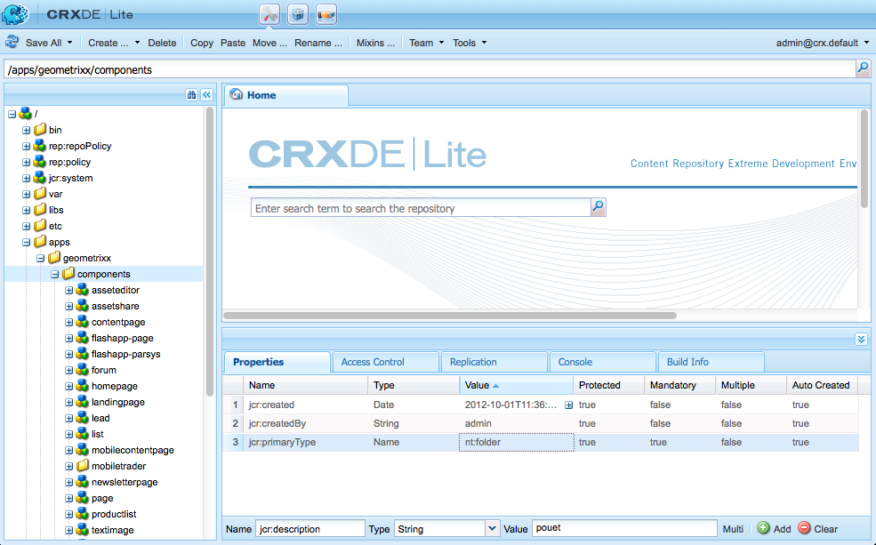
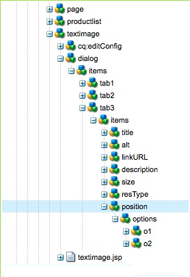

# Developing AEM Components (Classic UI){#developing-aem-components-classic-ui}

The classic UI uses ExtJS to create widgets that provide the look-and-feel of the components. Due to the nature of these widgets there are some differences between how components interact with the classic UI and the [touch-enabled UI](/help/sites-developing/developing-components.md).

>[!NOTE]
>
>Many aspects of component development are common to both the classic UI and the touch-enabled UI, so **you must read [AEM Components - The Basics](/help/sites-developing/components-basics.md) before** using this page, which deals with the specifics of the classic UI.

>[!NOTE]
>
>Although both the HTML Template Language (HTL) and JSP can be used for developing components for the classic UI, this page illustrates development with JSP. This is solely due to the history of using JSP within the classic UI.
>
>HTL is now the recommended scripting language for AEM. See [HTL](https://experienceleague.adobe.com/docs/experience-manager-htl/content/overview.html) and [Developing AEM Components](/help/sites-developing/developing-components.md) to compare methods.

## Structure {#structure}

The basic structure of a component is covered on the page [AEM Components - The Basics](/help/sites-developing/components-basics.md#structure), which applies both the touch-eanbeld and classic UIs. Een if you do not need to use the settings for the touch-enabled UI in your new component, it can help to be aware of them when inheriting from existing components.

## JSP Scripts {#jsp-scripts}

JSP Scripts or Servlets can be used to render components. According to the request processing rules of Sling the name for the default script is:

`<*componentname*>.jsp`

## global.jsp {#global-jsp}

The JSP script file `global.jsp` is used to provide quick access to specific objects (i.e. to access content) to any JSP script file used to render a component.

Therefore `global.jsp` should be included in every component rendering JSP script where one or more of the objects provided in `global.jsp` are used.

The location of the default `global.jsp` is:

`/libs/foundation/global.jsp`

>[!NOTE]
>
>The path `/libs/wcm/global.jsp`, which was used by the versions CQ 5.3 and earlier, is now obsolete.

### Function of global.jsp, used APIs, and Taglibs {#function-of-global-jsp-used-apis-and-taglibs}

The following lists the most important objects provided from the default `global.jsp`:

Summary:

* `<cq:defineObjects />`

    * `slingRequest` - The wrapped Request Object ( `SlingHttpServletRequest`).
    * `slingResponse` - The wrapped Response Object ( `SlingHttpServletResponse`).
    * `resource` - The Sling Resource Object ( `slingRequest.getResource();`).
    * `resourceResolver` - The Sling Resource Resolver Object ( `slingRequest.getResoucreResolver();`).
    * `currentNode` - The resolved JCR node for the request.
    * `log` - The Default logger ().
    * `sling` - The Sling script helper.
    * `properties` - The properties of the addressed resource ( `resource.adaptTo(ValueMap.class);`).
    * `pageProperties` - The properties of the page of the addressed resource.
    * `pageManager` - The page manager for accessing AEM content pages ( `resourceResolver.adaptTo(PageManager.class);`).
    * `component` - The component object of the current AEM component..
    * `designer` - The designer object for retrieving design information ( `resourceResolver.adaptTo(Designer.class);`).
    * `currentDesign` - The design of the addressed resource.
    * `currentStyle` - The style of the addressed resource.

### Accessing Content {#accessing-content}

There are three methods to access content in AEM WCM:

* Via the properties object introduced in `global.jsp`:

  The properties object is an instance of a ValueMap (see [Sling API](https://sling.apache.org/apidocs/sling5/org/apache/sling/api/resource/ValueMap.html)) and contains all properties of the current resource.

  Example: `String pageTitle = properties.get("jcr:title", "no title");` used in the rendering script of a page component.

  Example: `String paragraphTitle = properties.get("jcr:title", "no title");` used in the rendering script of a standard paragraph component.

* Via the `currentPage` object introduced in `global.jsp`:

  The `currentPage` object is an instance of a page (see [AEM API](https://helpx.adobe.com/experience-manager/6-5/sites/developing/using/reference-materials/javadoc/com/day/cq/wcm/api/Page.html)). The page class provides some methods to access content.

  Example: `String pageTitle = currentPage.getTitle();`

* Via `currentNode` object introduced in `global.jsp`:

  The `currentNode` object is an instance of a node (see [JCR API](https://jackrabbit.apache.org/api/2.16/org/apache/jackrabbit/standalone/cli/core/CurrentNode.html)). The properties of a node can be accessed by the `getProperty()` method.

  Example: `String pageTitle = currentNode.getProperty("jcr:title");`

## JSP Tag Libraries {#jsp-tag-libraries}

The CQ and Sling tag libraries give you access to specific functions for use in the JSP script of your templates and components.

For more information, see the document [Tag Libraries](/help/sites-developing/taglib.md).

## Using Client-Side HTML Libraries {#using-client-side-html-libraries}

Modern websites rely heavily on client-side processing driven by complex JavaScript and CSS code. Organizing and optimizing the serving of this code can be a complicated issue.

To help deal with this issue, AEM provides **Client-side Library Folders**, which allow you to store your client-side code in the repository, organize it into categories and define when and how each category of code is to be served to the client. The client-side library system then takes care of producing the correct links in your final web page to load the correct code.

See the document [Using Client-Side HTML Libraries](/help/sites-developing/clientlibs.md) for more information.

## Dialog {#dialog}

Your component will need a dialog for authors to add and configure the content.

See [AEM Components - The Basics](/help/sites-developing/components-basics.md#dialogs) for further details.

## Configuring the Edit Behavior {#configuring-the-edit-behavior}

You can configure the edit behavir of a component. This includes attributes such as actions available for the component, characteristics of the inplace editor, and the listeners related to events on the component. The configuration is common to both the touch-enabled and classic UIs, albeit with certain, specific differences.

The [edit behavior of a component is configured](/help/sites-developing/components-basics.md#edit-behavior) by adding a `cq:editConfig` node of type `cq:EditConfig` below the component node (of type `cq:Component`) and by adding specific properties and child nodes.

## Using and Extending ExtJS Widgets {#using-and-extending-extjs-widgets}

See [Using and Extending ExtJS Widgets](/help/sites-developing/widgets.md) for more details.

## Using xtypes for ExtJS Widgets {#using-xtypes-for-extjs-widgets}

See [Using xtypes](/help/sites-developing/xtypes.md) for more details.

## Developing New Components {#developing-new-components}

This section describes how to create your own components and add them to the paragraph system.

A quick way to get started is to copy an existing component and then make the changes you want.

An example of how to develop a component is described in detail in [Extending the Text and Image Component - An Example.](#extending-the-text-and-image-component-an-example)

### Develop a New Component (Adapt Existing Component) {#develop-a-new-component-adapt-existing-component}

To develop new components for AEM based on existing component you can copy the component, create a javascript file for the new component and store it in a location accessible to AEM (see also [Customizing Components and Other Elements](/help/sites-developing/dev-guidelines-bestpractices.md#customizing-components-and-other-elements)):

1. Using CRXDE Lite, create a new component folder in:

   / `apps/<myProject>/components/<myComponent>`

   Recreate the node structure as in libs, then copy the definition of an existing component, such as the Text component. For example, to customize the Text component copy:

    * from `/libs/foundation/components/text`
    * to `/apps/myProject/components/text`

1. Modify the `jcr:title` to reflect its new name.
1. Open the new component folder and make the changes you require. Also, delete any extraneous information in the folder.

   You can make changes such as:

    * adding a new field in the dialog box

        * `cq:dialog` - dialog for the touch-enabled UI
        * `dialog` - dialog for the classic UI

    * replacing the `.jsp` file (name it after your new component)
    * or completely reworking the entire component if you want

   For example, if you take a copy of the standard Text component, you can add an additional field to the dialog box, then update the `.jsp` to process the input made there.

   >[!NOTE]
   >
   >A component for the:
   >
   >* Touch-enabled UI uses [Granite](https://helpx.adobe.com/experience-manager/6-5/sites/developing/using/reference-materials/granite-ui/api/jcr_root/libs/granite/ui/index.html) components
   >* Classic UI uses [ExtJS widgets](https://helpx.adobe.com/experience-manager/6-5/sites/developing/using/reference-materials/widgets-api/index.html)

   >[!NOTE]
   >
   >A dialog defined for the classic UI will operate within the touch-enabled UI.
   >
   >A dialog defined for the touch-enabled UI will not operate within the classic UI.
   >
   >Depending on your instance and author environment you might want to define both types of dialog for your component.

1. One of the following nodes should be present and properly initialized for the new component to appear:

    * `cq:dialog` - dialog for the touch-enabled UI
    * `dialog` - dialog for the classic UI
    * `cq:editConfig` - how components behave in the edit environment (e.g drag and drop)
    * `design_dialog` - dialog for design mode (classic UI only)

1. Activate the new component in your paragraph system by either:

    * using CRXDE Lite to add the value `<path-to-component>` (for example, `/apps/geometrixx/components/myComponent`) to the property components of the node `/etc/designs/geometrixx/jcr:content/contentpage/par`
    * following the instructions in [Adding new components to paragraph systems](#adding-a-new-component-to-the-paragraph-system-design-mode)

1. In AEM WCM, open a page in your web site and insert a new paragraph of the type you just created to make sure the component is working properly.

>[!NOTE]
>
>To see timing statistics for page loading, you can use Ctrl-Shift-U - with `?debugClientLibs=true` set in the URL.

### Adding a New Component to the Paragraph System (Design Mode) {#adding-a-new-component-to-the-paragraph-system-design-mode}

After the component has been developed, you add it to the paragraph system, which enables authors to select and use the component when editing a page.

1. Access a page within your authoring environment that uses the paragraph system, for example `<contentPath>/Test.html`.
1. Switch to Design mode by either:

    * adding `?wcmmode=design` to the end of the URL and accessing again, for example:

      `<contextPath>/ Test.html?wcmmode=design`

    * clicking Design in Sidekick

   You are now in design mode and can edit the paragraph system.

1. Click Edit.

   A list of components belonging to the paragraph system are shown. Your new component is also listed.

   The components can be activated (or deactivated) to determine which are offered to the author when editing a page.

1. Activate your component, then return to normal edit mode to confirm that it is available for use.

### Extending the Text and Image Component - An Example {#extending-the-text-and-image-component-an-example}

This section provides an example on how to extend the widely used text and image standard component with a configurable image placement feature.

The extension to the text and image component allows editors to use all the existing functionality of the component plus have an extra option to specify the placement of the image either:

* On the left-hand side of the text (current behavior and the new default)
* As well as on the right-hand side

After extending this component, you can configure the image placement through the component's dialog box.

The following techniques are described in this exercise:

* Copying existing component node and modifying its metadata
* Modifying the component's dialog, including inheritance of widgets from parent dialog boxes
* Modifying the component's script to implement the new functionality

>[!NOTE]
>
>This example is targeted at the classic UI.

>[!NOTE]
>
>This example is based on the Geometrixx sample content, which is no longer shipped with AEM, having been replaced by We.Retail. See the document [We.Retail Reference Implementation](/help/sites-developing/we-retail.md#we-retail-geometrixx) for how to download and install Geometrixx.

#### Extending the Existing textimage Component {#extending-the-existing-textimage-component}

To create the new component, we use the standard textimage component as a basis and modify it. We store the new component in the Geometrixx AEM WCM example application.

1. Copy the standard textimage component from `/libs/foundation/components/textimage` into the Geometrixx component folder, `/apps/geometrixx/components`, using textimage as the target node name. (Copy the component by navigating to the component, right-clicking and selecting Copy and browsing to the target directory.)

   

1. To keep this example simple, navigate to the component you copied and delete all the subnodes of the new textimage node except for the following ones:

    * dialog definition: `textimage/dialog`
    * component script: `textimage/textimage.jsp`
    * edit configuration node (allowing drag-and-drop of assets): `textimage/cq:editConfig`

   >[!NOTE]
   >
   >The dialog definition is dependent on the UI:
   >
   >* Touch-enabled UI: `textimage/cq:dialog`
   >* Classic UI: `textimage/dialog`

1. Edit the component metadata:

    * Component name

        * Set `jcr:description` to `Text Image Component (Extended)`
        * Set `jcr:title` to `Text Image (Extended)`

    * Group, where the component is listed in the sidekick (leave as is)

        * Leave `componentGroup` set to `General`

    * Parent component for the new component (the standard textimage component)

        * Set `sling:resourceSuperType` to `foundation/components/textimage`

   After this step, the component node looks like this:

   

1. Change the `sling:resourceType` property of the edit configuration node of the image (property: `textimage/cq:editConfig/cq:dropTargets/image/parameters/sling:resourceType`) to `geometrixx/components/textimage.`

   This way, when an image is dropped to the component on the page, the `sling:resourceType` property of the extended textimage component is set to: `geometrixx/components/textimage.`

1. Modify the component's dialog box to include the new option. The new component inherits the parts of the dialog box that are the same as in the original. The only addition we make is to extend the **Advanced** tab, adding an **Image Position** dropdown list, with options **Left** and **Right**:

    * Leave the `textimage/dialog`properties unchanged.

   Note how `textimage/dialog/items` has four subnodes, tab1 to tab4, representing the four tabs of the textimage dialog box.

    * For the first two tabs (tab1 and tab2):

        * Change xtype to cqinclude (to inherit from the standard component).
        * Add a path property with values `/libs/foundation/components/textimage/dialog/items/tab1.infinity.json`and `/libs/foundation/components/textimage/dialog/items/tab2.infinity.json`, respectively.
        * Remove all other properties or subnodes.

    * For tab3:

        * Leave the properties and subnodes without changes
        * Add a new field definition to `tab3/items`, node position of type `cq:Widget`
        * Set the following properties (of type String) for the new `tab3/items/position`node:

            * `name`: `./imagePosition`
            * `xtype`: `selection`
            * `fieldLabel`: `Image Position`
            * `type`: `select`

        * Add subnode `position/options` of type `cq:WidgetCollection` to represent the two choices for image placement, and under it create two nodes, o1 and o2 of type `nt:unstructured`.
        * For node `position/options/o1` set the properties: `text` to `Left` and `value` to `left.`
        * For node `position/options/o2` set the properties: `text` to `Right` and `value` to `right`.

    * Delete tab4.

   Image position is persisted in content as the `imagePosition`property of the node representing `textimage` paragraph. After these steps, the component dialog box looks like this:

   

1. Extend the component script, `textimage.jsp`, with extra handling of the new parameter:

   ```xml
   Image image = new Image(resource, "image");

   if (image.hasContent() || WCMMode.fromRequest(request) == WCMMode.EDIT) {
        image.loadStyleData(currentStyle);
   ```

   We are going to replace the emphasized code fragment *%&gt;&lt;div class="image"&gt;&lt;%* with new code generating a custom style for this tag.

   ```xml
   // todo: add new CSS class for the 'right image' instead of using
   // the style attribute
   String style="";
        if (properties.get("imagePosition", "left").equals("right")) {
             style = "style=\"float:right\"";
        }
        %><div <%= style %> class="image"><%
   ```

1. Save the component to the repository. The component is ready to test.

#### Checking the New Component {#checking-the-new-component}

After the component has been developed, you can add it to the paragraph system, which enables authors to select and use the component when editing a page. These steps allow you to test the component.

1. Open a page in Geometrixx such as English / Company.
1. Switch to design mode by clicking Design in Sidekick.
1. Edit the paragraph system design by clicking Edit on the paragraph system in the middle of the page. A list of components, which can be placed in the paragraph system are shown, and it should include your newly developed component, Text Image (Extended) . Activate it for the paragraph system by selecting it and clicking OK .
1. Switch back to the editing mode.
1. Add the Text Image (Extended) paragraph to the paragraph system, initialize text and image with sample content. Save the changes.
1. Open the dialog of the text and image paragraph, and change the Image Position on the Advanced tab to Right , and click OK to save the changes.
1. The paragraph is rendered with the image on the right.
1. The component is now ready to use.

The component stores its content in a paragraph on the Company page.

### Disable Upload Capability of the Image Component {#disable-upload-capability-of-the-image-component}

To disable this capability, we use the standard image component as a basis and modify it. We store the new component in the Geometrixx example application.

1. Copy the standard image component from `/libs/foundation/components/image` into the Geometrixx component folder, `/apps/geometrixx/components`, using image as the target node name.

   

1. Edit the component metadata:

    * Set **jcr:title** to `Image (Extended)`

1. Navigate to `/apps/geometrixx/components/image/dialog/items/image`.
1. Add a new property:

    * **Name**: `allowUpload`
    * **Type**: `String`
    * **Value**: `false`

   

1. Click **Save All**. The component is ready to test.
1. Open a page in Geometrixx such as English / Company.
1. Switch to design mode and activate Image (Extended).
1. Switch back to the editing mode and add it to the paragraph system. On the next pictures, you can see the differences between the original image component and the one you just created.

   Original image component:

   

   Your new image component:

   

1. The component is now ready to use.
