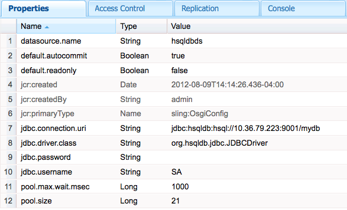

# Developing AEM Components{#developing-aem-components}

AEM components are used to hold, format, and render the content made available on your webpages.

* When [authoring pages](/help/sites-authoring/default-components.md), the components allow the authors to edit and configure the content.

    * When constructing a [Commerce](/help/commerce/cif-classic/administering/ecommerce.md) site the components can, for example, collect and render information from the catalog.
      See [Developing eCommerce](/help/commerce/cif-classic/developing/ecommerce.md) for more information.

    * When constructing a [Communities](/help/communities/author-communities.md) site the components can provide information to and collect information from your visitors.
      See [Developing Communities](/help/communities/communities.md) for more information.

* On the publish instance, the components render your content, presenting it as you require to your website visitors.

>[!NOTE]
>
>This page is a continuation of the document [AEM Components - The Basics](/help/sites-developing/components-basics.md).

>[!CAUTION]
>
>Components below `/libs/cq/gui/components/authoring/dialog` are meant to be used only in the Editor (component dialogs in Authoring). If they are used elsewhere (such as in a wizard dialog for instance), they may not behave as expected.

## Code Samples {#code-samples}

This page provides the reference documentation (or links to reference documentation) required to develop new components for AEM. See [Developing AEM Components - Code Samples](/help/sites-developing/developing-components-samples.md) for some practical examples.

## Structure {#structure}

The basic structure of a component is covered on the page [AEM Components - The Basics](/help/sites-developing/components-basics.md#structure). That document covers both the touch-enabled and classic UIs. Even if you do not need to use the classic settings in your new component it can help to be aware of them when inheriting from existing components.

## Extending Existing Components and Dialogs {#extending-existing-components-and-dialogs}

Depending on the component you want to implement, it might be possible to extend or customize an existing instance, rather than defining and developing the entire [structure](#structure) from scratch.

When extending or customizing an existing component or dialog, you can copy or replicate either the entire structure or the structure required for the dialog before making your changes.

### Extending an Existing Component {#extending-an-existing-component}

Extending an existing component can be achieved with [Resource Type Hierarchy](/help/sites-developing/components-basics.md#component-hierarchy-and-inheritance) and the related inheritance mechanisms.

>[!NOTE]
>
>Components can also be redefined with an overlay based on the search path logic. However, in such case, the [Sling Resource Merger](/help/sites-developing/sling-resource-merger.md) is not triggered and `/apps` must define the entire overlay.

>[!NOTE]
>
>The [content fragment component](/help/sites-developing/customizing-content-fragments.md) can also be customized and extended, though the full structure and relationships with Assets must be considered.

### Customizing a Existing Component Dialog {#customizing-a-existing-component-dialog}

It is also possible to override a *component dialog* using the [Sling Resource Merger](/help/sites-developing/sling-resource-merger.md) and defining the property `sling:resourceSuperType`.

This means you only need to redefine the required differences, as opposed to redefining the entire dialog (using `sling:resourceSuperType`). This is now recommended method for extending a component dialog

See the [Sling Resource Merger](/help/sites-developing/sling-resource-merger.md) for more details.

## Defining the Markup {#defining-the-markup}

Your component will be rendered with [HTML](https://www.w3schools.com/htmL/html_intro.asp). Your component needs to define the HTML needed to take the required content and then render it as required, on both the author and publish environments.

### Using the HTML Template Language {#using-the-html-template-language}

The [HTML Templating Language (HTL)](https://experienceleague.adobe.com/docs/experience-manager-htl/content/overview.html), introduced with AEM 6.0, takes the place of JSP (JavaServer Pages) as the preferred and recommended server-side template system for HTML. For web developers who need to build robust enterprise websites, HTL helps to achieve increased security and development efficiency.

>[!NOTE]
>
>Although both HTL and JSP can be used for developing components, we will illustrate development with HTL on this page, as it is the recommended scripting language for AEM.

## Developing the Content Logic {#developing-the-content-logic}

This optional logic selects and/or computes the content to be rendered. It is invoked from HTL expressions with the appropriate Use-API pattern.

The mechanism to separate logic from appearance helps clarify what is called for a given view. It also allows differing logic for different views of the same resource.

### Using Java {#using-java}

[The HTL Java Use-API enables a HTL file to access helper methods in a custom Java class](https://experienceleague.adobe.com/docs/experience-manager-htl/content/java-use-api.html?lang=en). This lets you use Java code to implement the logic for selecting and configuring the component content.

### Using JavaScript {#using-javascript}

[The HTL JavaScript Use-API enables a HTL file to access helper code written in JavaScript](https://experienceleague.adobe.com/docs/experience-manager-htl/content/java-use-api.html?lang=en). This allows you to use JavaScript code to implement the logic for selecting and configuring the component content.

### Using Client-Side HTML Libraries {#using-client-side-html-libraries}

Modern websites rely heavily on client-side processing driven by complex JavaScript and CSS code. Organizing and optimizing the serving of this code can be a complicated issue.

To help deal with this issue, AEM provides **Client-side Library Folders**, which allow you to store your client-side code in the repository, organize it into categories and define when and how each category of code is to be served to the client. The client-side library system then takes care of producing the correct links in your final web page to load the correct code.

Read [Using Client-Side HTML Libraries](/help/sites-developing/clientlibs.md) for more information.

## Configuring the Edit Behavior {#configuring-the-edit-behavior}

You can configure the edit behavior of a component including attributes such as actions available for the component, characteristics of the inplace editor, and the listeners related to events on the component. The configuration is common to both the touch-enabled and classic UI, albeit with certain, specific differences.

The [edit behavior of a component is configured](/help/sites-developing/components-basics.md#edit-behavior) by adding a `cq:editConfig` node of type `cq:EditConfig` below the component node (of type `cq:Component`) and by adding specific properties and child nodes.

## Configuring the Preview Behavior {#configuring-the-preview-behavior}

The [WCM Mode](https://developer.adobe.com/experience-manager/reference-materials/6-5/javadoc/com/day/cq/wcm/api/WCMMode.html) cookie is set when switching to **Preview** mode even when the page is not refreshed.

For components with a rendering that are sensitive to the WCM Mode, they need to be defined to refresh themselves specifically, then rely on the value of the cookie.

>[!NOTE]
>
>In the touch-enabeld UI only the values `EDIT` and `PREVIEW` are used for the [WCM Mode](https://developer.adobe.com/experience-manager/reference-materials/6-5/javadoc/com/day/cq/wcm/api/WCMMode.html) cookie.

## Creating and Configuring a Dialog {#creating-and-configuring-a-dialog}

Dialogs are used to allow author to interact with the component. Using a dialog allows authors and/or administrators to edit content, configure the component or define design parameters (using a [Design Dialog](#creating-and-configuring-a-design-dialog))

### Coral UI and Granite UI {#coral-ui-and-granite-ui}

[Coral UI](https://developer.adobe.com/experience-manager/reference-materials/6-5/coral-ui/coralui3/index.html) and [Granite UI](https://developer.adobe.com/experience-manager/reference-materials/6-5/granite-ui/api/jcr_root/libs/granite/ui/index.html) define the modern look and feel of AEM.

[Granite UI provides a large range of the basic components (widgets)](https://developer.adobe.com/experience-manager/reference-materials/6-5/granite-ui/api/jcr_root/libs/granite/ui/index.html) needed to create your dialog on the authoring environment. When necessary you can extend this selection and [create your own widget](#creatinganewwidget).

For full details see:

* Coral UI

    * Provides a consistent UI across all cloud solutions
    * [Concepts of the AEM Touch-Enabled UI - Coral UI](/help/sites-developing/touch-ui-concepts.md#coral-ui)
    * [Coral UI Guide](https://developer.adobe.com/experience-manager/reference-materials/6-5/coral-ui/coralui3/index.html)

* Granite UI

    * Provides Coral UI markup wrapped into Sling components for building UI consoles and dialogs
    * [Concepts of the AEM Touch-Enabled UI - Granite UI](/help/sites-developing/touch-ui-concepts.md#coral-ui)
    * [Granite UI Documentation](https://developer.adobe.com/experience-manager/reference-materials/6-5/granite-ui/api/jcr_root/libs/granite/ui/index.html)

>[!NOTE]
>
>Due to the nature of the Granite UI components (and differences to the ExtJS widgets), there are some differences between how components interact with the touch-enabled UI and the [classic UI](/help/sites-developing/developing-components-classic.md).

### Creating a New Dialog {#creating-a-new-dialog}

Dialogs for the touch-enabled UI:

* are named `cq:dialog`.
* are defined as an `nt:unstructured` node with the `sling:resourceType` property set.

* are located under their `cq:Component` node and next to their component definition.
* are rendered on the server-side (as Sling components), based on their content structure and the `sling:resourceType` property.
* use the Granite UI framework.
* contain a node structure describing the fields within the dialog.

    * these nodes are `nt:unstructured` with the required `sling:resourceType` property.

An example node structure might be:

```xml
newComponent (cq:Component)
  cq:dialog (nt:unstructured)
    content
      layout
      items
        column
          items
            file
            description
```

Customizing a dialog is similar to developing a component as the dialog is itself a component (i.e. markup rendered by a component script together with behavior/style provided by a client library).

For examples, see:

* `/libs/foundation/components/text/cq:dialog`
* `/libs/foundation/components/download/cq:dialog`

>[!NOTE]
>
>If a component has no dialog defined for the touch-enabled UI, then the classic UI dialog is used as a fallback inside of a compatibility layer. To customize such a dialog you need to customize the classic UI dialog. See [AEM Components for the Classic UI](/help/sites-developing/developing-components-classic.md).

### Customizing Dialog Fields {#customizing-dialog-fields}

>[!NOTE]
>
>See:
>
>* the AEM Gems session on [Customizing Dialog Fields](https://experienceleague.adobe.com/docs/experience-manager-gems-events/gems/gems2015/aem-customizing-dialog-fields-in-touch-ui.html?lang=en).
>* the related sample code covered under [Code Sample - How to Customize Dialog Fields](/help/sites-developing/developing-components-samples.md#code-sample-how-to-customize-dialog-fields).
>

#### Creating a New Field {#creating-a-new-field}

Widgets for the touch-enabled UI are implemented as Granite UI components.

To create a new widget for use in a component dialog for the touch-enabled UI requires you to [create a new Granite UI field component](/help/sites-developing/granite-ui-component.md).

>[!NOTE]
>
>For full details about the Granite UI, please see the [Granite UI documentation](https://developer.adobe.com/experience-manager/reference-materials/6-5/granite-ui/api/jcr_root/libs/granite/ui/index.html).

If you consider your dialog as a simple container for a form element, then you can also see the primary content of your dialog content as form fields. Creating a new form field requires you to create a resource type; this is equivalent to creating a new component. To help you in that task, Granite UI offers a generic field component to inherit from (using `sling:resourceSuperType`):

`/libs/granite/ui/components/coral/foundation/form/field`

More specifically Granite UI provides a range of field components that are suitable for use in dialogs (or, more generally speaking, in [forms](https://developer.adobe.com/experience-manager/reference-materials/6-5/granite-ui/api/jcr_root/libs/granite/ui/components/foundation/form/index.html)).

>[!NOTE]
>
>This differs from the classic UI, where widgets are represented by `cq:Widgets` nodes, each with a particular `xtype` to establish the relation with their corresponding ExtJS widget. From an implementation viewpoint, these widgets were rendered on the client-side by the ExtJS framework.

Once you have created your resource type, you can instantiate your field by adding a new node in your dialog, with the property `sling:resourceType` referring to the resource type you have just introduced.

#### Creating a Client Library for Style and Behavior {#creating-a-client-library-for-style-and-behavior}

If you want to define styling and behavior for your component, you can create a dedicated [client library](/help/sites-developing/clientlibs.md) that defines your custom CSS/LESS and JS.

To have your client library loaded solely for your component dialog (i.e. it will not be loaded for another component) you need to set the property `extraClientlibs`** **of your dialog to the category name of the client library you have just created. This is advisable if your client library is quite big and/or your field is specific to that dialog and will not be needed in other dialogs.

To have your client library loaded for all dialogs, set the category property of your client library to `cq.authoring.dialog`. This is the category name of the client library that is included by default when rendering all dialogs. You want to do that if you client library is small and/or your field is generic and could be reused in other dialogs.

For an example, see:

* `cqgems/customizingfield/components/colorpicker/clientlibs`

    * provided by the [Code Sample](/help/sites-developing/developing-components-samples.md#code-sample-how-to-customize-dialog-fields)

#### Extending (Inheriting from) a Field {#extending-inheriting-from-a-field}

Depending on your requirements, you can either:

* Extend a given Granite UI field by component inheritance ( `sling:resourceSuperType`)
* Extend a given widget from the underlying widget library (in the case of Granite UI, this is Coral UI), by following the widget library API (JS/CSS inheritance)

#### Access to Dialog Fields {#access-to-dialog-fields}

You can also use render conditions ( `rendercondition`) to control who has access to specific tabs/fields in your dialog; for example:

```xml
+ mybutton
  - sling:resourceType = granite/ui/components/coral/foundation/button
  + rendercondition
    - sling:resourceType = myapp/components/renderconditions/group
    - groups = ["administrators"]
```

### Handling Field Events {#handling-field-events}

The method of handling events on dialog fields is now done with [listeners in a custom client library](#listeners-in-a-custom-client-library). This is a change from the older method of having [listeners in the content structure](#listenersinthecontentstructureclassicui).

#### Listeners in a Custom Client Library {#listeners-in-a-custom-client-library}

To inject logic into your field, you should:

1. Have your field marked with a given CSS class (the *hook*).
1. Define, in your client library a JS listener hooked on that CSS class name (this ensures that your custom logic is scoped to your field only, and does not affect other fields of the same type).

To achieve this you need to know about the underlying widget library with which you want to interact. See the [Coral UI documentation](https://developer.adobe.com/experience-manager/reference-materials/6-5/coral-ui/coralui3/index.html) to identify to which event you want to react. This is very similar to the process that you had to perform with ExtJS in the past: find the documentation page of a given widget, then check the details of its event API.

For an example, see:

* `cqgems/customizingfield/components/clientlibs/customizingfield`

    * provided by the [Code Sample](/help/sites-developing/developing-components-samples.md#code-sample-how-to-customize-dialog-fields)

#### Listeners in the Content Structure {#listeners-in-the-content-structure}

In the classic UI with ExtJS, it was usual to have listeners for a given widget in the content structure. Achieving the same in the touch-enabled UI is different as JS listener code (or any code at all) is no longer defined in the content.

The content structure describes the semantic structure; it should (must) not imply the nature of the underlying widget. By not having JS code in the content structure, you can change the implementation details without having to change the content structure. In other words, you can change the widget library without needing to touch the content structure.

#### Detecting Availability of the Dialog {#dialog-ready}

If you have a custom JavaScript that needs to be executed only when the dialog is available and ready, you should listen for the `dialog-ready` event.

This event is triggered  whenever the dialog loads (or re-loads) and is ready for use, which means whenever there is a change (create/update) in the DOM of the dialog.

`dialog-ready` can be used to hook in JavaScript custom code that performs customizations on the fields inside a dialog or similar tasks.

### Field Validation {#field-validation}

#### Mandatory Field {#mandatory-field}

To mark a given field as mandatory set the following property on the content node of your field:

* Name: `required`
* Type: `Boolean`

For an example, see:

```xml
/libs/foundation/components/page/cq:dialog/content/items/tabs/items/basic/items/column/items/title/items/title
```

#### Field Validation (Granite UI) {#field-validation-granite-ui}

Field validation in Granite UI and the Granite UI Components (equivalent to widgets), is done by using the `foundation-validation` API. [See the `foundation-valdiation` Granite documentation for details.](https://developer.adobe.com/experience-manager/reference-materials/6-5/granite-ui/api/jcr_root/libs/granite/ui/components/coral/foundation/clientlibs/foundation/js/validation/index.html)

For examples, see:

* `cqgems/customizingfield/components/clientlibs/customizingfield/js/validations.js`

    * provided by the [Code Sample](/help/sites-developing/developing-components-samples.md#code-sample-how-to-customize-dialog-fields)

* `/libs/cq/gui/components/authoring/dialog/clientlibs/dialog/js/validations.js`

## Creating and Configuring a Design Dialog {#creating-and-configuring-a-design-dialog}

The Design dialog is provided when a component has design details that can be edited in [Design Mode](/help/sites-authoring/default-components-designmode.md).

The definition is very similar to that of a [dialog used for editing content](#creating-a-new-dialog), with the difference that it is defined as a node:

* Node name: `cq:design_dialog`
* Type: `nt:unstructured`

## Creating and Configuring an Inplace Editor {#creating-and-configuring-an-inplace-editor}

An inplace editor allows the user to edit content directly in the paragraph flow, without the need to open a dialog. For example, the standard Text and Title components both have an inplace editor.

An inplace editor is not necessary/meaningful for every component type.

See [Extending Page Authoring - Add New Inplace Editor](/help/sites-developing/customizing-page-authoring-touch.md#add-new-in-place-editor) for more information.

## Customizing the Component Toolbar {#customizing-the-component-toolbar}

The [Component Toolbar](/help/sites-developing/touch-ui-structure.md#component-toolbar) gives the user access to a range of actions for the component such as edit, configure, copy, and delete.

See [Extending Page Authoring - Add New Action to a Component Toolbar](/help/sites-developing/customizing-page-authoring-touch.md#add-new-action-to-a-component-toolbar) for more information.

## Configuring a Component for the References Rail (Borrowed/Lent) {#configuring-a-component-for-the-references-rail-borrowed-lent}

If your new component references content from other pages then you can consider whether you want it to impact the **Borrowed Content** and **Lent Content** sections of the [**References**](/help/sites-authoring/basic-handling.md#references) Rail.

Out-of-the-box AEM only checks the Reference component. To add your component you need to configure the OSGi bundle **WCM Authoring Content Reference Configuration**.

Create a new entry in the definition, specifying your component, together with the property to be checked. For example:

`/apps/<*your-Project*>/components/reference@parentPath`

>[!NOTE]
>
>When working with AEM there are several methods of managing the configuration settings for such services. See [Configuring OSGi](/help/sites-deploying/configuring-osgi.md) for more details and the recommended practices.

## Enabling and Adding Your Component to the Paragraph System {#enabling-and-adding-your-component-to-the-paragraph-system}

After the component has been developed it needs to be enabled for use in an appropriate paragraph system, so it can be used on the required pages.

This can be done by either:

* using [Design mode](/help/sites-authoring/default-components-designmode.md) when editing a specific page.
* [defining the `components` property on the paragraph system of a template](/help/sites-developing/components-basics.md#adding-your-component-to-the-paragraph-system).

## Configuring a Paragraph System so that Dragging an Asset Creates a Component Instance {#configuring-a-paragraph-system-so-that-dragging-an-asset-creates-a-component-instance}

AEM offers the possibility to configure a paragraph system on your page so that [an instance of your new component is automatically created when a user drags an (appropriate) asset onto an instance of that page](/help/sites-authoring/editing-content.md#insertingacomponenttouchoptimizedui) (instead of always having to drag an empty component to the page).

This behavior, and the required asset-to-component relationship can be configured:

1. Under the paragraph definition of your page design. For example:

    * `/etc/designs/<myApp>/page/par`

   Create a new node:

    * Name: `cq:authoring`
    * Type: `nt:unstructured`

1. Under this create a new node to hold all the asset-to-component mappings:

    * Name: `assetToComponentMapping`
    * Type: `nt:unstructured`

1. For each asset-to-component mapping create a node:

    * Name: text; it is recommended that the name indicate the asset and related component type; for example, image
    * Type: `nt:unstructured`

   Each with the following properties:

    * `assetGroup`:

        * Type: `String`
        * Value: the group that the related asset belongs to; for example, `media`

    * `assetMimetype`:

        * Type: `String`
        * Value: the mime type of the related asset; for example `image/*`

    * `droptarget`:

        * Type: `String`
        * Value: the drop target; for example, `image`

    * `resourceType`:

        * Type: `String`
        * Value: the related component resource; for example, `foundation/components/image`

    * `type`:

        * Type: `String`
        * Value: the type, for example, `Images`

For examples see:

* `/etc/designs/geometrixx/jcr:content/page/par/cq:authoring`
* `/etc/designs/geometrixx-outdoors/jcr:content/page/par/cq:authoring`
* `/etc/designs/geometrixx-media/jcr:content/article/article-content-par/cq:authoring`

CODE ON GITHUB

You can find the code of this page on GitHub

* [Open aem-project-archetype project on GitHub](https://github.com/adobe/aem-project-archetype)
* Download the project as [a ZIP file](https://github.com/adobe/aem-project-archetype/archive/master.zip)

>[!NOTE]
>
>The automatic creation of component instances can now be configured easily within the UI when using [Core Components](https://experienceleague.adobe.com/docs/experience-manager-core-components/using/introduction.html) and Editable Templates. See [Creating Page Templates](/help/sites-authoring/templates.md#editing-a-template-structure-template-author) for more information about defining which components are automatically associated with given media types.

## Using the AEM Brackets Extension {#using-the-aem-brackets-extension}

The [AEM Brackets Extension](/help/sites-developing/aem-brackets.md) provides a smooth workflow to edit AEM components and client libraries. It is based on the [Brackets](https://brackets.io/) code editor.

The extension:

* Eases synchronization (no Maven or File Vault required) to help increase developer efficiency and also helps front-end developers with limited AEM knowledge to participate on projects.
* Provides some [HTL](https://experienceleague.adobe.com/docs/experience-manager-htl/content/overview.html) support, the template language designed to simplify component development and increase security.

>[!NOTE]
>
>Brackets is the recommended mechanism for creating components. It replaces the CRXDE Lite - Create Component functionality, which was designed for the classic UI.

## Migrating from a Classic Component {#migrating-from-a-classic-component}

When migrating a component that was designed for use with the classic UI to a component that can be used with the touch-enabled UI (either solely or jointly) the following issues should be considered:

* HTL

    * Use of [HTL](https://experienceleague.adobe.com/docs/experience-manager-htl/content/overview.html) is not compulsory, but if your component needs updating then it is an ideal time to consider [migrating from JSP to HTL](/help/sites-developing/components-basics.md#htl-vs-jsp).

* Components

    * Migrate [ `cq:listener`](/help/sites-developing/developing-components.md#migrating-cq-listener-code) code that use classic UI specific functions
    * RTE plugin, for further information see [Configuring the Rich Text Editor](/help/sites-administering/rich-text-editor.md).
    * [Migrate `cq:listener` code](#migrating-cq-listener-code) that uses functions specific to the classic UI

* Dialogs

    * Create a dialog for use in the touch-enabled UI. However, for compatibility purposes the touch-enabled UI can use the definition of a classic UI dialog, when no dialog has been defined for the touch-enabled UI.
    * The [AEM Modernization Tools](/help/sites-developing/modernization-tools.md) are provided to help you extend existing components.
    * [Mapping ExtJS to Granite UI Components](/help/sites-developing/touch-ui-concepts.md#extjs-and-corresponding-granite-ui-components) provides a convenient overview of ExtJS xtypes and node types with their equivalent Granite UI resource types.
    * Customizing fields, for more information see the AEM Gems session on [Customizing Dialog Fields](https://experienceleague.adobe.com/docs/experience-manager-gems-events/gems/gems2015/aem-customizing-dialog-fields-in-touch-ui.html?lang=en).
    * Migrate from vtypes to [Granite UI validation](https://developer.adobe.com/experience-manager/reference-materials/6-5/granite-ui/api/jcr_root/libs/granite/ui/components/foundation/clientlibs/foundation/js/validation/index.html)
    * Using JS listeners, for more information see [Handling Field Events](#handling-field-events) and the AEM Gems session on [Customizing Dialog Fields](https://experienceleague.adobe.com/docs/experience-manager-gems-events/gems/gems2015/aem-customizing-dialog-fields-in-touch-ui.html?lang=en).

### Migrating cq:listener Code {#migrating-cq-listener-code}

If you are migrating a project that was designed for the classic UI, then the `cq:listener` code (and component related clientlibs) might use functions that are specific to the classic UI (such as `CQ.wcm.*`). For the migration you must update such code using the equivalent objects/functions in the touch-enabled UI.

If your project is being completely migrated to the touch-enabled UI you need to replace such code to use the objects and functions relevant to the touch-enabled UI.

However, if your project must cater for both the classic UI and the touch-enabled UI during the migration period (the usual scenario), then you must implement a switch to differentiate the separate code referencing the appropriate objects.

This switch mechanism can be implemented as:

```
if (Granite.author) {
    // touch UI
} else {
    // classic UI
}
```

## Documenting Your Component {#documenting-your-component}

As a developer, you want easy access to component documentation so that you can quickly understand:

* Description
* Intended use
* Content structure and properties
* Exposed APIs and extension points
* And so on

For this reason, it is easy to make any existing documentation markdown you have available within the component itself.

Place a `README.md` file in the component structure. This markdown is displayed in the [component console](/help/sites-authoring/default-components-console.md).



The supported markdown is the same as that for [content fragments](/help/assets/content-fragments/content-fragments-markdown.md).
