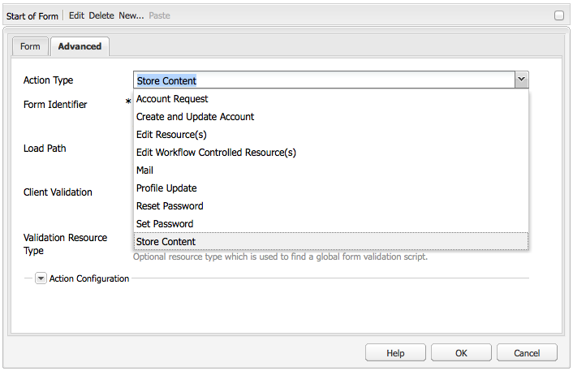
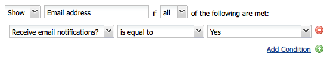
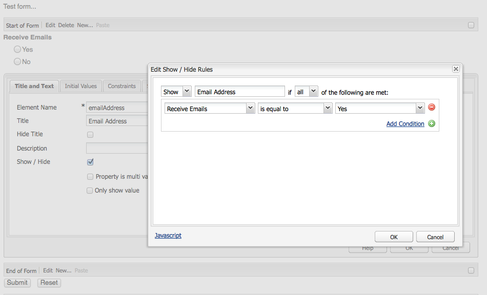
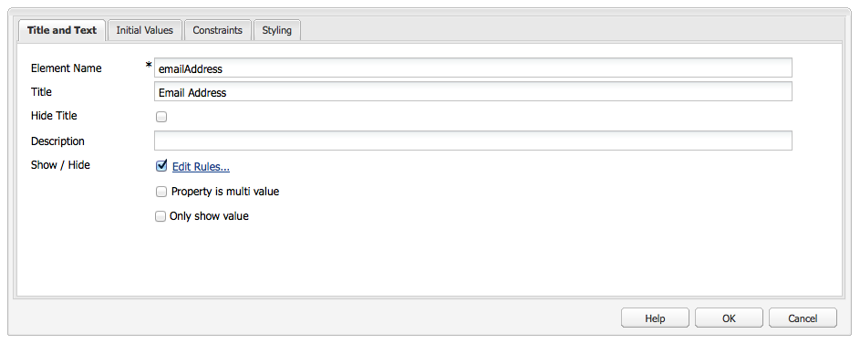

# Developing Forms (Classic UI){#developing-forms-classic-ui}

The basic structure of a form is:

* Form start
* Form elements
* Form end

All of these are realized with a series of default [Form components](/help/sites-authoring/default-components.md#form), available in a standard AEM installation.

In addition to [developing new components](/help/sites-developing/developing-components-samples.md) for use on your forms you can also:

* [Preload your form with values](#preloading-form-values)
* [Preload (certain) fields with multiple values](#preloading-form-fields-with-multiple-values)
* [Develop new actions](#developing-your-own-form-actions)
* [Develop new constraints](#developing-your-own-form-constraints)
* [Show or hide specific form fields](#showing-and-hiding-form-components)

[Using scripts](#developing-scripts-for-use-with-forms) to extend functionality where necessary.

>[!NOTE]
>
>This document focuses on developing forms using the [Foundation Components](/help/sites-authoring/default-components-foundation.md) in the classic UI. Adobe recommends using the new [Core Components](https://experienceleague.adobe.com/docs/experience-manager-core-components/using/introduction.html) and [Hide Conditions](/help/sites-developing/hide-conditions.md) for form development in the touch-enabled UI.

## Preloading Form Values {#preloading-form-values}

The form start component provides a field for the **Load Path**, an optional path that points to a node in the repository.

The Load Path is the path to node properties that is used to load predefined values into multiple fields on the form.

This is an optional field that specifies the path to a node in the repository. When this node has properties that match the field names, then the appropriate fields on the form are preloaded with the value of those properties. If no match exists, then the field contains the default value.

>[!NOTE]
>
>A [form action](#developing-your-own-form-actions) can also set the resource from which to load the initial values. This is done using `FormsHelper#setFormLoadResource` inside `init.jsp`.
>
>Only if that is not set, will the form be populated from the path set in the start form component by the author.

### Preloading Form Fields with Multiple Values {#preloading-form-fields-with-multiple-values}

Various form fields also have the **Items Load Path**, again an optional path that points to a node in the repository.

The **Items Load Path** is the path to node properties that is used to load predefined values into that specific field on the form, for example, a [drop-down list](/help/sites-authoring/default-components-foundation.md#dropdown-list), [check box group](/help/sites-authoring/default-components-foundation.md#checkbox-group) or [radio group](/help/sites-authoring/default-components-foundation.md#radio-group).

#### Example - Preloading A Dropdown List with Multiple Values {#example-preloading-a-dropdown-list-with-multiple-values}

A drop-down list can be configured with your range of values for selection.

The **Items Load Path** can be used to access a list from a folder in the repository and preload these into the field:

1. Create a sling folder ( `sling:Folder`)
   for example, `/etc/designs/<myDesign>/formlistvalues`

1. Add a new property (for example, `myList`) of type multi-value string ( `String[]`) to contain the list of drop-down items. Content can also be imported using a script, such as with either a JSP script or cURL in a shell script.

1. Use the full path in the **Items Load Path** field:
   for example, `/etc/designs/geometrixx/formlistvalues/myList`

Note that if the values in the `String[]` are of the formatted like this:

* `AL=Alabama`
* `AK=Alaska`

and so on, then AEM generates the list as:

* `<option value="AL">Alabama</option>`
* `<option value="AK">Alaska</option>`

This feature can, for example, be put to good use in a multi-language setting.

### Developing your own Form Actions {#developing-your-own-form-actions}

A form needs an action. An action defines the operation that is executed when the form is submitted with the user data.

A range of actions are provided with a standard AEM installation, these can be seen under:

`/libs/foundation/components/form/actions`

and in the **Action Type** list of the **Form** component:

This section covers how you can develop your own form action for inclusion in this list.

You can add your own action under `/apps` as follows:

1. Create a node of type `sling:Folder`. Specify a name that reflects the action to be implemented.

   For example:

   `/apps/myProject/components/customFormAction`

1. On this node define the following properties, then click **Save All** to persist your changes:

   * `sling:resourceType` - set as `foundation/components/form/action`

   * `componentGroup` - define as `.hidden`

   * Optionally:

     * `jcr:title` - specify a title of your choice, this will show in the drop-down selection list. If not set then the node name is shown

     * `jcr:description` - enter a description of your choice

1. In the folder create a dialog node:

   1. Add fields so that the author can edit the forms dialog once the action is chosen.

1. In the folder create either:

   1. A post script.
      The name of the script is `post.POST.<extension>`, for example, `post.POST.jsp`
      The post script is invoked when a form is submitted to process the form, it contains the code that handles the data arriving from the form `POST`.

   1. Add a forward script which is invoked when the form is submitted.
      The name of the script is `forward.<extension`>, for example, `forward.jsp`
      This script can define a path. The current request is then forwarded to the specified path.

   The necessary call is `FormsHelper#setForwardPath` (2 variants). A typical case is to perform some validation, or logic, to find the target path and then forward to that path, letting the default Sling POST servlet do the actual storage in JCR.

   There could also be another servlet that does the actual processing, in such a case the form action and the `forward.jsp` would only act as the "glue" code. An example of this is the mail action at `/libs/foundation/components/form/actions/mail`, which forwards details to `<currentpath>.mail.html`where a mail servlet sits.

   So:

   * a `post.POST.jsp` is useful for small operations that are fully done by the action itself
   * while the `forward.jsp` is useful when only delegation is required.

   The order of execution for the scripts is:

   * Upon rendering the form ( `GET`):

     1. `init.jsp`
     1. for all field's constraints: `clientvalidation.jsp`
     1. form's validationRT: `clientvalidation.jsp`
     1. form is loaded via load resource if set
     1. `addfields.jsp` while inside rendering `<form></form>`

   * upon handling a form `POST`:

     1. `init.jsp`
     1. for all field's constraints: `servervalidation.jsp`
     1. form's validationRT: `servervalidation.jsp`
     1. `forward.jsp`
     1. if a forward path was set ( `FormsHelper.setForwardPath`), forward the request, then call `cleanup.jsp`

     1. if no forward path was set, call `post.POST.jsp` (ends here, no `cleanup.jsp` called)

1. Again in the folder optionally add:

   1. A script for adding fields.
      The name of the script is `addfields.<extension>`, for example, `addfields.jsp`
      An `addfields` script is invoked immediately after the HTML for the form start is written. This allows the action to add custom input fields or other such HTML inside the form.

   1. An initialization script.
      The name of the script is `init.<extension>`, for example, `init.jsp`
      This script is invoked when the form is rendered. It can be used to initialize action specifics.

   1. A cleanup script.
      The name of the script is `cleanup.<extension>`, for example, `cleanup.jsp`
      This script can be used to perform cleanup.

1. Use the **Forms** component in a parsys. The **Action Type** drop-down will now include your new action.

   >[!NOTE]
   >
   >To see default actions that are part of the product:
   >
   >
   >`/libs/foundation/components/form/actions`

### Developing your own Form Constraints {#developing-your-own-form-constraints}

Constraints can be imposed at two levels:

* For [individual fields (see the following procedure)](#constraints-for-individual-fields)
* As [form-global validation](#form-global-constraints)

#### Constraints for Individual Fields {#constraints-for-individual-fields}

You can add your own constraints for an individual field (under `/apps`) as follows:

1. Create a node of type `sling:Folder`. Specify a name that reflects the constraint to be implemented.

   For example:

   `/apps/myProject/components/customFormConstraint`

1. On this node define the following properties, then click **Save All** to persist your changes:

   * `sling:resourceType` - set to `foundation/components/form/constraint`

   * `constraintMessage` - a customized message that is shown if the field is not valid, according to the constraint, when the form is submitted

   * Optionally:

     * `jcr:title` - specify a title of your choice, this will show in the selection list. If not set then the node name is shown
     * `hint` - additional information, for the user, on how to use the field

1. Inside this folder, you can need the following scripts:

   * A client validation script:
     The name of the script is `clientvalidation.<extension>`, for example, `clientvalidation.jsp`
     This is invoked when the form field is rendered. It can be used to create client javascript to validate the field on the client.

   * A server validation script:
     The name of the script is `servervalidation.<extension>`, for example, `servervalidation.jsp`
     This is invoked when the form is submitted. It can be used to validate the field on the server after it is submitted.

>[!NOTE]
>
>Sample constraints can be seen under:
>
>`/libs/foundation/components/form/constraints`

#### Form-Global Constraints {#form-global-constraints}

The form-global validation is specified by configuring a resource type in the start form component ( `validationRT`). For example:

`apps/myProject/components/form/validation`

You can then define:

* a `clientvalidation.jsp` - injected after the field's client validation scripts
* and a `servervalidation.jsp` - also called after the individual field server validations upon a `POST`.

### Showing and Hiding Form Components {#showing-and-hiding-form-components}

You can configure your form to show or hide form components according to the value of other fields in the form.

Changing the visibility of a form field is useful when the field is needed only under specific conditions. For example, on a feedback form a question asks customers if they want product information sent to them in email. Upon selecting yes, a text field appears to enable the customer to type their email address.

Use the **Edit Show/Hide Rules** dialog box to specify the conditions under which a form component is shown or hidden.

Use the fields at the top of the dialog box to specify the following information:

* Whether you are specifying conditions for hiding or showing the component.
* Whether any or all the conditions need to be true to show or hide the component.

One or more conditions appear below these fields. A condition compares the value of another form component (on the same form) to a value. If the actual value in the field satisfies the condition, the condition evaluates to true. Conditions include the following information:

* The Title of the form field that is tested.
* An operator.
* A value against with the field value is compared.

For example, a Radio Group component with the title `Receive email notifications?`* * contains `Yes` and `No` radio buttons. A Text Field component with the title of `Email Address` uses the following condition so that it is visible if `Yes` is selected:

In JavaScript, conditions use the value of the Element Name property to refer to fields. In the previous example, the Element Name property of the Radio Group component is `contact`. The following code is the equivalent JavaScript code for that example:

`((contact == "Yes"))`

**To show or hide a form component:**

1. Edit the specific form component.

1. Select **Show / Hide** to open the **Edit Show / Hide Rules** dialog:

   * In the first drop-down list select either **Show** or **Hide** to specify whether your conditions determine whether to show or hide the component.

   * In the drop-down list at the end of the top line select:

     * **all** - if all conditions must be true to show or hide the component
     * **any** - if only one or more conditions must be true to show or hide the component

   * In the condition line (one is presented as default) select a component, operator, and then specify a value.
   * Add more conditions if needed by clicking **Add Condition**.

   For example:

   

1. Click **OK** to save the definition.

1. After you saved your definition, an **Edit Rules** link appears next to the **Show / Hide** option in the form component properties. Click this link to open the **Edit Show / Hide Rules** dialog box to make changes.

   Click **OK** to save all changes.

   

   >[!CAUTION]
   >
   >The effects of Show / Hide definitions can be seen and tested:
   >
   >* in **Preview** mode on the author environment (needs a page reload when first switching to preview)
   >
   >* on the publish environment
 
#### Handling Broken Component References {#handling-broken-component-references}

Show/hide conditions use the value of the Element Name property to reference other components in the form. The Show/Hide configuration is invalid when any of the conditions refer to a component that is deleted or has had the Element Name property changed. When this situation occurs, you need to manually update the conditions or an error occurs when the form loads.

When the Show/Hide configuration is invalid, the configuration is provided only as JavaScript code. Edit the code to correct the problems.The code uses the Element Name property that was originally used to reference the components.

### Developing Scripts for use with Forms {#developing-scripts-for-use-with-forms}

For more information about the API elements that can be used when writing scripts see the [javadocs related to forms](https://helpx.adobe.com/experience-manager/6-5/sites/developing/using/reference-materials/javadoc/com/day/cq/wcm/foundation/forms/package-summary.html).

You can use this for actions such as calling a service before the form is submitted and canceling the service if it fails:

* Define the validation resource type
* Include a script for validation:

  * In your JSP, call your web service and create a `com.day.cq.wcm.foundation.forms.ValidationInfo` object containing your error messages. If there are errors, form data will not be posted.
