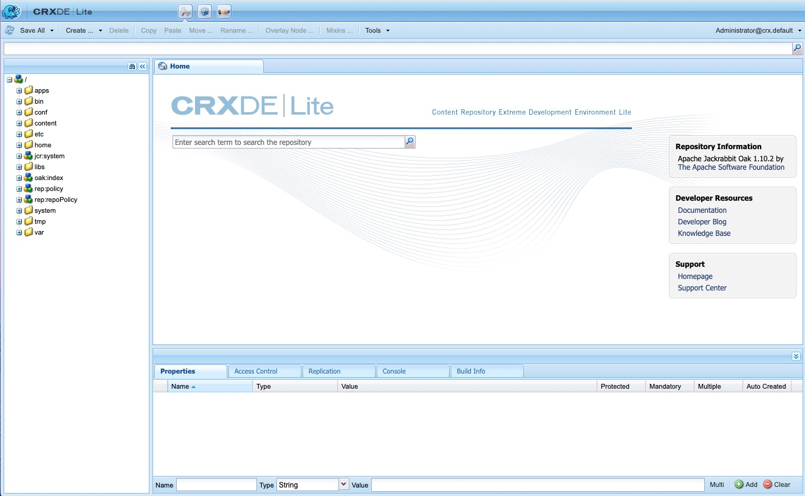

# Developing with CRXDE Lite{#developing-with-crxde-lite}

This section describes how to develop your Adobe Experience Manager (AEM) application using CRXDE Lite.

Seethe overview documentation for more information on the different development environments that are available.

CRXDE Lite is embedded into AEM and enables you to perform standard development tasks in the browser. With CRXDE Lite, you can create a project, create, and edit files (like .jsp and .java), folders, templates, components, dialogs, nodes, properties, and bundles while logging.
CRXDE Lite is recommended when you do not have direct access to the AEM server. Or, when you develop an application by extending or modifying the out-of-the-box components and Java&trade; bundles, or when you do not need a dedicated debugger, code completion and syntax highlighting.

>[!NOTE]
>
>From AEM 6.5.5.0 onwards, anonymous access of CRXDE Lite is not possible anymore.
>Users are redirected to the login screen.

>[!NOTE]
>
>Adobe recommends that you use the [AEM Developer Tools for Eclipse](/help/sites-developing/aem-eclipse.md) and the [AEM HTL Brackets Extension](/help/sites-developing/aem-brackets.md) during project development.

## Getting Started with CRXDE Lite {#getting-started-with-crxde-lite}

To get started with CRXDE Lite, proceed as follows:

1. Install AEM.
1. In your browser, enter `https://<host>:<port>/crx/de`. By default it is `https://localhost:4502/crx/de`.
1. Enter your **username** and **password**. By default it is `admin` and `admin`.

1. Click **OK**.

The CRXDE Lite User Interface looks as follows in your browser:

You can now use CRXDE Lite to develop your application.

## Overview of the User Interface {#overview-of-the-user-interface}

CRXDE Lite offers the following functionality:

<table>
 <tbody>
  <tr>
   <td>Top switcher bar</td>
   <td>Quickly switch between CRXDE Lite, Package Manager, and Package Share.</td>
  </tr>
  <tr>
   <td>Node path widget</td>
   <td>
Displays the path to the selected node.
 
You can also use it to jump to a node, by entering the path by hand, or pasting it from somewhere else, and hitting Enter.
 
It also provides support looking for nodes with a specific node name. Enter the name of the node that you would like to find, and wait (or hit the search symbol on the right-hand side). You can try entering, for example, the string <em>oak</em> into the widget to see how it works. If a given node or nodes is loaded into the explorer pane, the list is displayed, and you can select the path and hit Enter to navigate to it. It only works for the nodes loaded into the CRXDE client application in the browser. If you want to search the whole repository, use Tools, then Query.
 </td>
  </tr>
  <tr>
   <td>Explorer pane</td>
   <td>
Displays a tree of all the nodes in the repository.
 
Click a node so you can display its properties in the <strong>Properties</strong> tab. After clicking a node, you can select an action in the toolbar. Click the node again to rename it.
 
Tree Navigation Filter (binocular icon): enables you to filter the nodes in the repository for which the name contains the input text. It only applies to nodes that have been loaded locally.  
 </td>
  </tr>
  <tr>
   <td>Edit pane</td>
   <td>
<strong>Home</strong> tab: lets you search content and/or documentation and access developer resources (documentation, developer blog, knowledge base) and support (Adobe homepage and support center).  
 
Double-click a file in the <strong>Explorer</strong> pane so you can display its content. For example, a .jsp or a .java file. You can then modify it and save the changes.
 
Once a file is edited in the <strong>Edit</strong> pane, the following tools are available on the toolbar:  
 - <strong>Show in tree: </strong>shows the file in the repository tree.  - <strong>Search/Replace ...</strong>: do search or replace.    Double-click the status line of the <strong>Edit</strong> pane opens the <strong>Go to line</strong> dialog so you can enter a specific line number to go to.  </td>
  </tr>
  <tr>
   <td>Properties tab  </td>
   <td>Displays the properties of the node that you have selected. You can add new properties or delete existing ones.  </td>
  </tr>
  <tr>
   <td>Access Control tab</td>
   <td>
Display permissions based on the path, repository-level, or principal.
 
The permissions are broken down into
 
- <strong>Applicable Access Control Policy</strong>: The policies that can be applied to the selection.
 
- <strong>Local Access Control Policies</strong>: The policies applied locally to the selection.
 
- <strong>Effective Access Control Policies</strong>: The policies applied for the selection, might be set locally or inherited from parent nodes.
 
Note. To be able to see the Access Control information at all, the user logged in to CRXDE Lite must have read-rights to ACL entries. The anonymous user cannot see this information by default - log in as admin to see the information, for example.
 </td>
  </tr>
  <tr>
   <td>Replication tab</td>
   <td>
Display the replication status of the node. You can replicate and replicate delete the node.
 </td>
  </tr>
  <tr>
   <td>Console tab  </td>
   <td>
<strong>Server Logs</strong>:
 
Displays logs messages. You can configure the log level, clear the console, pin at the selected scroll position, and enable or disable the displaying of messages.  
 
<strong>Version Control</strong>:
 
Displays version control messages.  
 </td>
  </tr>
  <tr>
   <td>Build Info tab  </td>
   <td>Displays information when a bundle is being built.  </td>
  </tr>
  <tr>
   <td>Refresh  </td>
   <td>Refreshes the selection. Changes from other users are updated in your view of the repository. Changes you have made are unaffected.  </td>
  </tr>
  <tr>
   <td>Save All</td>
   <td>
<strong>Save All</strong>:  
 
Saves all the changes that you have made. Until you click save, the changes are temporary, and are lost when you exit the console.
 
<strong>Revert</strong>:
 
Discards all the changes that you have made on the selected node since the last save action, then reloads the state of the repository for the selected node.
 
<strong>Revert All</strong>:
 
Discards all the changes that you have made throughout the entire repository since the last save action, then reloads the state of the repository.
 </td>
  </tr>
  <tr>
   <td>Create ...  </td>
   <td>
Drop-down menu to create the following under the selected node:  
 
- <strong>Node</strong>: a node with an arbitrary node type  
 
- <strong>File</strong>: nt:file node and its nt:resource subnode
 
- <strong>Folder</strong>: nt:folder node
 
- <strong>Template</strong>: AEM template
 
- <strong>Component</strong>: AEM component
 
- <strong>Dialog</strong>: AEM dialog
 </td>
  </tr>
  <tr>
   <td>Delete  </td>
   <td>Deletes the selected node.  </td>
  </tr>
  <tr>
   <td>Copy</td>
   <td>Copies the selected node.  </td>
  </tr>
  <tr>
   <td>Paste  </td>
   <td>Pastes the copied node under the selected node.  </td>
  </tr>
  <tr>
   <td>Move ...  </td>
   <td>Moves the selected node to the node that is set through the dialog.</td>
  </tr>
  <tr>
   <td>Rename ...  </td>
   <td>Renames the selected node.  </td>
  </tr>
  <tr>
   <td>Mixins ...  </td>
   <td>Lets you add mixin types to the node type. The mixin types are mostly used to add advanced features such as versioning, access control, referencing, and locking to the node.</td>
  </tr>
  <tr>
   <td>Tools  </td>
   <td>
Drop-down menu with the following tools:
 
- <strong>Server Config ...</strong>: to access the Felix Console.
 
- <strong>Query ...</strong>: to query the repository.
 
- <strong>Privileges ...</strong>: to open privilege management, where you can view and add privileges.
 
- <strong>Test Access Control ...</strong>: a place where you can test the permission for a certain path and/or principal.
 
- <strong>Export Node Type</strong>: to export node types in the system as cnd notation.
 
- <strong>Import Node Type ...</strong>: to import node types using cnd notation.
 
- <strong>Install SiteCatalyst Debugger ...</strong>: instructions on how to install Analytics Debugger.
 </td>
  </tr>
  <tr>
   <td>Login widget  </td>
   <td>
Displays the logged-in users and the workspace that they are logged into, for example, admin@crx.default.
 
Click it to log in or relogin as a specific user. If you do not specify a workspace to log in to, you are logged into the default workspace, crx.default.
 
If you want to browse the repository as an Anonymous user, use <strong>anonymous</strong> as the login name, and any password (for example, a space or a dot).  
 
If your authorization is no longer valid (for example, it is expired), the login widget displays "<strong>Unauthorized - Login...</strong>". Click it to log in again.
 </td>
  </tr>
 </tbody>
</table>

## Creating a Folder {#creating-a-folder}

To create a folder with CRXDE Lite:

1. Open CRXDE Lite in your browser.
1. In the Navigation pane, right-click the folder under which you want to create the folder, select **Create ...**, then **Create Folder ...**.

1. Enter the folder **Name** and click **OK**.

1. Click **Save All** to save the changes on the server.

## Creating a Template {#creating-a-template}

To create a template with CRXDE Lite:

1. Open CRXDE Lite in your browser.
1. In the Navigation pane, right-click the folder where you want to create the template, select **Create ...**, then **Create Template ...**.

1. Enter the **Label**, **Title**, **Description**, **Resource Type**, and **Ranking** of the template. Click **Next**.

1. This step is optional: set the **Allowed Paths**. Click **Next**

1. This step is optional: set the **Allowed Parents**. Click **Next**.

1. This step is optional: set the **Allowed Children**. Click **OK**.

1. Click **Save All** to save the changes on the server.

It creates:

* A node of type `cq:Template` with Template properties

* A child node of type `cq:PageContent` with Page Content properties

You can add properties to your template: see the [Creating a Property](#creating-a-property) section.

## Creating a Component {#creating-a-component}

The feature described here is only available if CQ5 is installed, that is if the node type `cq:Component` is available in the repository.

To create a component with CRXDE Lite:

1. Open CRXDE Lite in your browser.
1. In the Navigation pane, right-click the folder where you want to create the component, select **Create ...**, then **Create Component ...**.

1. Enter the **Label**, **Title**, **Description**, **Super Resource Type**, and **Group** of the component. Click **Next**.

1. This step is optional: set the component properties **Is Container,** **No Decoration**, **Cell Name**, and **Dialog Path**. Click **Next**.

1. This step is optional: set the component property **Allowed Parents**. Click **Next**.

1. This step is optional: set the component property **Allowed Children**. Click **OK**.

1. Click **Save All** to save the changes on the server.

It creates:

* A node of type `cq:Component`
* Component properties
* A component .jsp script

## Creating a Dialog {#creating-a-dialog}

To create a dialog with CRXDE Lite:

1. Open CRXDE Lite in your browser.
1. In the Navigation pane, right-click the component where you want to create the dialog, select **Create ...**, then **Create Dialog ...**.

1. Enter the **Label** and the **Title**. Click **OK**.

1. Click **Save Al**l to save the changes on the server.

It creates a dialog with the following structure:

`dialog[cq:Dialog]/items[cq:Widget]/items[cq:WidgetCollection]/tab1[cq:Panel]`

You can now adapt the dialog to your needs by modifying properties or creating nodes.

You can also use the Dialog Editor to edit a dialog. Double-clicking the dialog node in CRXDE Lite brings up the editor. See [Dialog Editor](/help/sites-developing/dialog-editor.md) for more details.

## Creating a Node {#creating-a-node}

To create a node with CRXDE Lite:

1. Open CRXDE Lite in your browser.
1. In the Navigation pane, right-click the node where you want to create the node, select **Create ...**, then **Create Node ...**.
1. Enter the **Name** and the **Type**. Click **OK**.
1. Click **Save All** to save the changes on the server.

You can now adapt the node to your needs by modifying properties or creating nodes.

>[!NOTE]
>
>Most of the edit operations, including Create Node, keeps all the changes in memory, and only stores them into the repository upon saving (by way of the "Save All" button). However some operations such as move are automatically persisted.
>
>The validation regarding whether the newly created node is allowed by the node type of the parent node is also carried out by the JCR repository first when saving changes. If you receive an error message while saving a node, check whether the content structure is valid (for example, you cannot create an `nt:unstructured` node as a child of `nt:folder` node).

## Creating a Property {#creating-a-property}

To create a property with CRXDE Lite:

1. Open CRXDE Lite in your browser.
1. In the Navigation pane, select the node where you want to add the new property.
1. In the **Properties** tab in the bottom pane, enter the **Name**, the **Type**, and the **Value**. Click **Add**.

1. Click **Save All** to save the changes on the server.

## Creating a Script {#creating-a-script}

To create a script:

1. Open CRXDE Lite in your browser.
1. In the Navigation pane, right-click the component where you want to create the script, select **Create ...**, then **Create File ...**.

1. Enter the File **Name** including its extension. Click **OK**.

1. The new file opens as a tab in the Edit pane.
1. Edit the file.
1. Click **Save All** to save the changes.

## Exporting and Importing Node Types {#exporting-and-importing-node-types}

With CRXDE Lite, you can import and/or export node type definitions in [CND (Compact Namespace and Node Type Definition) notation](https://jackrabbit.apache.org/jcr/node-type-notation.html).

To export a node type definition:

1. Open CRXDE Lite in your browser.
1. Select your required node.
1. Select **Tools** then **Export Node Type**.

1. The definition, in cnd notation, is displayed in your browser. Save the information, if necessary.

To import a node type definition:

1. Open CRXDE Lite in your browser.
1. Select **Tools** then **Import Node Type...**.

1. Enter the CND notation for the definition in the text box.
1. Check **Allow Update** if you are updating an existing definition.
1. Click **Import**.

## Logging {#logging}

With CRXDE Lite, you can display the file `error.log` that is on the file system at `<crx-install-dir>/crx-quickstart/server/logs` and filter it with the appropriate log level. Proceed as follows:

1. Open CRXDE Lite in your browser.
1. In the **Console** tab at the bottom of the window, in the drop-down menu on the right, select **Server Logs**.

1. Click the **Stop** icon to display the messages.

You can:

* Adjust the log parameters in the Felix Console by clicking the **Logging Configurations** icon.
* Clear the messages by clicking the **Brush** icon.
* Pin the message at the selection by clicking the **Pin** icon.
* Enable or disable the displaying of messages by clicking the **Stop** icon.

## Access Control {#access-control}

>[!NOTE]
>
>See [Users, Groups, and Access Rights Administration](/help/sites-administering/user-group-ac-admin.md) for more information.
