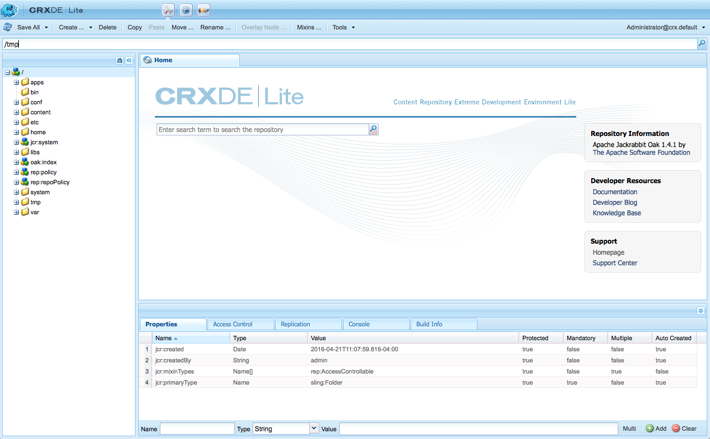
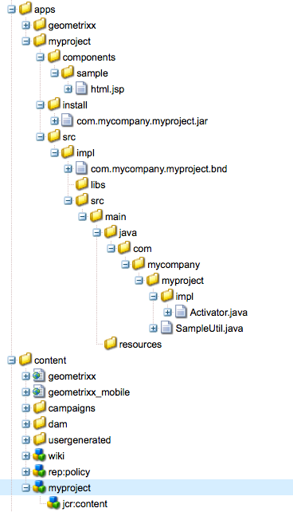
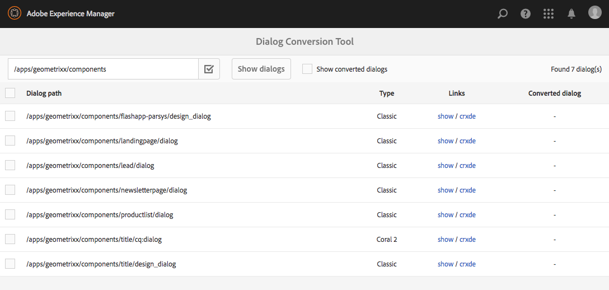

# Dialog Conversion Tool{#dialog-conversion-tool}

The dialog conversion tool is provided to help extend existing components that only have a dialog defined for the classic UI (based on ExtJS) or based on Granite UI and Coral 2. The tool uses the original dialog to create a duplicate dialog designed for the standard UI, based on Granite UI and Coral 3.

The goal of this tool is to automate the upgrade as far as possible, increase efficiency, and reduce errors. However because the tool can not cover every scenario, the process can not be fully automated and the user must review the converted dialogs and possibly make additional adjustments. The tool is intended as an aid to help you start the conversion process, but not intended to take full control of the conversion.

The tool will create the new dialog using the standard, Granite UI and Coral 3-based UI, but it will skip what it cannot convert. Therefore the resulting dialog might contain nodes from the original dialog copied as-is, if no rule matched that specific component. In addition, a converted component might have some unconverted properties, because there was no appropriate rule to convert them.

>[!CAUTION]
>
>The tool cannot cover every scenario, as its conversion rules are non-exhaustive and operate on a best-effort basis. It converts the most frequently used elements and properties, but the conversion will be incomplete when dealing with customizations or highly-specialized dialogs. **Converted dialogs may require additional adjustments and all conversions must be reviewed.**

>[!NOTE]
>
>Because the classic UI is no longer being developed or enhanced, Adobe recommends that customers upgrade to the default Granite UI user interface to benefit from the latest technology.
>
>Although it is generally good practice to migrate to the latest platform, migrating from Coral 2 to Coral 3 is not critical. However any new project should be started based on Coral 3.

## Download and Install the Dialog Conversion Tool {#download-and-install-the-dialog-conversion-tool}

The dialog conversion tool has been made open source and can be access via GitHub.

CODE ON GITHUB

You can find the code of this page on GitHub

* [Open aem-dialog-conversion project on GitHub](https://github.com/Adobe-Marketing-Cloud/aem-dialog-conversion)
* Download the project as [a ZIP file](https://github.com/Adobe-Marketing-Cloud/aem-dialog-conversion/archive/master.zip)

>[!NOTE]
>
>AEM does not ship with the dialog conversion tool. You must download and install it in order to use it.

Follow these steps to install the dialog conversion tool.

1. Download the package from the [Dialog Conversion Tool GitHub project](https://github.com/Adobe-Marketing-Cloud/aem-dialog-conversion/releases).
1. Install the package on your instance. For details on package management see [How to Work With Packages](/help/sites-administering/package-manager.md).

## Converting a Dialog {#converting-a-dialog}

The tool converts dialogs by creating a corresponding Granite UI / Coral 3 dialog at the same location as the original dialog in the content tree. In the case of Granite UI / Coral 2 dialogs, these are copied to a backup location (a `.coral2` suffix is appended to the dialog node name) so as not to be overridden. The tool can convert design dialogs as well as edit dialogs.

Use the following steps to convert one or more dialogs:

1. Open the **Dialog Conversion** console, accessible from **Global Navigation** -&gt; **Tools** -&gt; **Operations**:

   `https://<hostname>:<port>/libs/cq/dialogconversion/content/console.html`

   

1. Enter the required path such as `/apps/geometrixx/components`. You can also enter a direct path to a single dialog such as `/apps/geometrixx/components/lead`.

   

1. Select **Show dialogs** to display all dialogs below that location.

   

   The table lists all existing legacy dialogs below the entered path. Each dialog has its Type listed. Types include:

    * **Classic:** Nodes of type `cq:Dialog` that have node name `dialog` or `design_dialog`
    * **Coral 2:** Nodes named `cq:dialog` or `cq:design_dialog` that have a Granite UI / Coral 2 resource type at their child content node

   Each row contains a link to view the dialog and a link to CRXDE Lite to view its node structure.

   >[!NOTE]
   >
   >Components that do not have a dialog for the classic UI or Coral 2 at all (i.e. they designed with Granite UI / Coral 3) are not listed.

1. Select one or more dialogs for conversion and click or tap **Convert X dialog(s)** to start the conversion process.

   

1. The selected dialogs are listed with the results of their conversions. If the conversion was successful, then the row contains links to view the converted dialog or to open it in CRXDE Lite.

   Click or tap **Back** to return to the Dialog Conversion Tool.

   

1. Back in the Dialog Conversion Tool, the converted dialogs are no longer shown in the list. Note however that the total number of dialogs found are still listed, including those already converted, i.e. the number of rows in the table does not necessarily match that of the number found.

   

1. Check the option **Show converted dialogs** to show those dialogs located at the specified path that have already been converted.

   

   If the dialog is already converted, links are also provided to the converted dialog. A dialog is considered converted if there is a sibling Granite UI / Coral 3 dialog already available.

## Dialog Rewrite Rules {#dialog-rewrite-rules}

The dialog conversion tool is based on the concept of **graph rewriting**, consisting of transforming a subject graph by applying rewrite rules. A rewrite rule is the pairing of a pattern with a replacement graph. The rule matches occurrences of a certain subgraph in the subject graph and subsequently replaces them. See also [https://en.wikipedia.org/wiki/Graph_rewriting](https://en.wikipedia.org/wiki/Graph_rewriting) for details on graph rewriting.

The dialog conversion tool uses this approach to rewrite a given legacy dialog tree (Classic or Granite UI / Coral 2) to its Granite UI / Coral 3 counterpart. This has the advantage that the conversion is highly flexible and can take into account even complex components, since matching is done on actual subtrees and not only single nodes or properties.

### Algorithm {#algorithm}

The rewrite algorithm takes as a parameter the tree to be rewritten and a set of rewrite rules. It traverses the tree in pre-order and for each node checks if a rule applies for the subtree rooted at that node. The first rule that matches is applied to that subtree in order to rewrite it. The traversal then restarts from the root. The algorithm stops as soon as the whole tree has been traversed and no rule has matched any subtree. As an optimization measure, the algorithm keeps track of a set of nodes that are final and therefore don't have to be rechecked for matches in subsequent traversals. It is up to the rewrite rules to define which nodes of the rewritten tree are final, and which should be revisited by future passes of the algorithm.

The entry point for the conversion is the `DialogConversionServlet`, which is registered on POST requests to `/libs/cq/dialogconversion/content/convert.json`. It accepts a path request parameter, which is an array containing the paths to the dialogs that should be converted. For each dialog, the servlet then rewrites the corresponding dialog tree by applying all defined dialog rewrite rules.

### Rewrite Rule Types {#rewrite-rule-types}

The rewrite rules can be defined in two different ways, either as:

* JCR node structures - [Node-Based Rewrite Rules](/help/sites-developing/dialog-conversion.md#node-based-rewrite-rules)  

* Java classes implementing a specific interface - [Java-Based Rewrite Rules](/help/sites-developing/dialog-conversion.md#java-based-rewrite-rules)

Some are [provided out-of-the-box](#provided-rewrite-rules), but you can also define your own customized rules. [Sample rewrite rules](/help/sites-developing/dialog-conversion.md#sample-rewrite-rules) are also available.

Typically, a single dialog rewrite rule is responsible for rewriting a single dialog element, for example the pathbrowser input field.

>[!CAUTION]
>
>Rewrite loops are not detected by the algorithm, therefore **rewrite rules must not rewrite trees in a circular fashion**.

### Node-Based Rewrite Rules {#node-based-rewrite-rules}

A dialog rewrite rule can be defined in terms of nodes and properties.

```xml
rule
  - jcr:primaryType = nt:unstructured
  - cq:rewriteRanking = 4
  + patterns
    - jcr:primaryType = nt:unstructured
    + foo
      - ...
      + ...
    + foo1
      - ...
      + ...
  + replacement
    + bar
      - ...
      + ...
```

This example defines a rule containing two **patterns** (the trees rooted at `foo` and `foo1`) and a **replacement** (the tree rooted at `bar`). The pattern and replacement trees are arbitrary trees containing nodes and properties. The rule matches a subtree if any of the defined patterns match. In order for a pattern to match, the subject tree must contain the same nodes as the pattern (matching names) and all properties defined in the pattern must match the properties of the tree.

In the case of a match, the matched subtree (called the original tree) will be substituted by the replacement. The replacement tree can define mapped properties that will inherit the value of a property in the original tree. They need to be of type `String` and have the following format:

`${<path>}`

If the referenced property doesn't exist in the original tree, then the property is omitted. Alternatively, a default value can be specified for that case (only possible for string properties):

`${<path>:<default>}`

Properties that contain ' `:`' characters can be single quoted to avoid conflict with providing a default value. Boolean properties are negated if the expression is prefixed with ' `!`'. Mapped properties can be multivalued, in which case they will be assigned the value of the first property that exists in the matched tree.

For example, the following property `one` will be assigned the value of the property `./two/three` of the matched original tree.

```xml
...
  + replacement
    + bar
      - one = ${./two/three}
      - negated = !${./some/boolean/prop}
      - default = ${./some/prop:default}
      - multi = [${./prop1}, ${./prop2}]
```

Rules also support the following optional properties.

* `cq:rewriteOptional` (boolean) 

  Set this property on a pattern node to indicate that the node doesn’t have to be present for the pattern to match

* `cq:rewriteRanking` (integer) 

  Set this property on the rule node to affect the order by which the rules are applied. This can be useful in ensuring that rules handling more specific structures aren’t overwritten by more general ones. Rules with a lower ranking take precedence over those with higher ranking. All rules by default receive `Integer.MAX_VALUE` as their ranking.

The replacement tree also supports the following special properties (named beginning with `cq:rewrite`):

* `cq:rewriteMapChildren` (string) 

  The node containing this property will receive a copy of the children of the node in the original tree referenced by the property value (e.g. `cq:rewriteMapChildren=./items`).

* `cq:rewriteFinal` (boolean) 

  This is an optimization measure telling the algorithm that the node containing this property is final and doesn't have to be rechecked for matching rewrite rules. When placed on the replacement node itself, the whole replacement tree is considered final.
* `cq:rewriteCommonAttrs` (boolean) 

  Set this property on the replacement node ( `rule`/ `replacement`) to map relevant properties of the original root node to Granite common attribute equivalents in the copy root. It will handle data attributes by copying/creating the `granite:data` subnode on the target and writing `data-*` properties there.
* `cq:rewriteRenderCondition` (boolean) 

  Set this property on the replacement node ( `rule`/ `replacement`) to copy any Granite render condition ( `rendercondition` or `granite:rendercondition`) child node from the original root node to a `granite:rendercondition` child of the copy root.

In addition, a `cq:rewriteProperties` node can be added to a replacement node to define string rewrites for mapped properties in the result. The node is removed from the replacement. The properties of the `cq:rewriteProperties` node must be named the same as those which they are rewriting and accept a string array with two parameters:

* `pattern`: Regex to match against, e.g. `"(?:coral-Icon-)(.+)"`

* `replacement`: Provided to the matcher `replaceAll` function, e.g. `"$1"`

The following is an example of rewriting Coral 2 icon properties to Coral 3 equivalents:

```xml
...
  + replacement
    + bar
      - icon = ${./icon}
      + cq:rewriteProperties
       - icon = [(?:coral-Icon--)(.+), $1]
```

#### Defining Your Own Node-Based Rewrite Rules {#defining-your-own-node-based-rewrite-rules}

The rewrite rules provided are defined at:

`/libs/cq/dialogconversion/rules`

The rules are further divided at this location into folders for classic rewrite rules and Coral 2 rewrite rules:

`/libs/cq/dialogconversion/rules/classic`

`/libs/cq/dialogconversion/rules/coral2`

These rules can be overwritten by providing a set of rules at:

`/apps/cq/dialogconversion/rules`

You can copy `/libs/cq/dialogconversion/rules` to `/apps` then modify existing and/or add new rules to this new instance ``.

### Java-Based Rewrite Rules {#java-based-rewrite-rules}

More complex rewrite rules can be defined as Java classes exposing an OSGi service of the interface `com.adobe.cq.dialogconversion.DialogRewriteRule`.

Such a class must implement following methods:

```java
boolean matches(Node root) throws RepositoryException;
Node applyTo(Node root, Set<Node> finalNodes) throws DialogRewriteException, RepositoryException;
int getRanking();
```

The `matches` method must return `true` if the rule matches the subtree rooted at the supplied root node. If the rule matches, the tree rewriting algorithm will subsequently call the `applyTo` method, which must rewrite the subtree rooted at the specified root node. Usually, this method will temporarily rename the original tree, build the new tree as a new child of the original tree's parent node (using its nodes and properties), and finally remove the original tree. More detailed information can be found in the Javadoc of the `com.adobe.cq.dialogconversion.DialogRewriteRule` interface.

#### Further information - Javadocs {#further-information-javadocs}

For further information see the Javadocs for [`com.adobe.cq.dialogconversion`](https://adobe-marketing-cloud.github.io/aem-touchui-dialogconversion-samples/javadoc/).

#### Defining Your Own Java-Based Rewrite Rules {#defining-your-own-java-based-rewrite-rules}

The following class shows an example of a custom rewrite rule implementing the `com.adobe.cq.dialogconversion.DialogRewriteRule` interface.

```java
@Component
@Service
public class CustomDialogRewriteRule implements DialogRewriteRule {
 
    public boolean matches(Node root) throws RepositoryException {
        // ...
    }
 
    public Node applyTo(Node root, Set<Node> finalNodes) throws DialogRewriteException, RepositoryException {
        // ...
    }
 
    int getRanking() {
        // ...
    }

}
```

Alternatively, you can extend `com.adobe.cq.dialogconversion.AbstractDialogRewriteRule` as below. The abstract class implements the `getRanking` method and uses the `service.ranking` OSGi property of the service to determine the ranking of the rule.

```java
@Component
@Service
@Properties({
        @Property(name="service.ranking", intValue = 10)
})
public class CustomDialogRewriteRule extends AbstractDialogRewriteRule {

    public boolean matches(Node root) throws RepositoryException {
        // ...
    }
 
    public Node applyTo(Node root, Set<Node> finalNodes) throws RewriteException, RepositoryException {
        // ...
    }
 
}
```

### Provided Rewrite Rules {#provided-rewrite-rules}

The `cq-dialog-conversion-content` package contains several predefined rewrite rules. For classic UI widgets see [Using xtypes](/help/sites-developing/xtypes.md) for more information).

<table> 
 <tbody> 
  <tr> 
   <td><strong>Rule</strong></td> 
   <td><strong>Legacy Component</strong></td> 
   <td><strong>Granite UI / Coral 3 Replacement</strong></td> 
  </tr> 
  <tr> 
   <td><code>com.adobe.cq.dialogconversion.rules.CqDialogRewriteRule</code></td> 
   <td>Node of type <code>cq:Dialog</code>, handles different substructures</td> 
   <td><p>A <code>granite/ui/components/foundation/container</code> using either a <code>fixedcolumns</code> or <code>tabs</code> layout</p> <p>The actual components of the dialog are copied over and are rewritten in subsequent passes of the algorithm.</p> </td> 
  </tr> 
  <tr> 
   <td><code>com.adobe.cq.dialogconversion.rules.IncludeRule</code></td> 
   <td>xtype = <code>cqinclude</code></td> 
   <td>The referenced node is copied to the Granite UI / Coral 3 dialog and (possibly) subsequently rewritten by the algorithm.</td> 
  </tr> 
  <tr> 
   <td><code>com.adobe.cq.dialogconversion.rules.MultifieldRewriteRule</code></td> 
   <td>xtype = <code>multifield</code></td> 
   <td><p>A <code>granite/ui/components/coral/foundation/form/multifield</code></p> <p>The <code>fieldConfig</code> child node (if any) is rewritten separately, thus not limiting the supported components.</p> </td> 
  </tr> 
  <tr> 
   <td><code>/libs/cq/dialogconversion/rules/classic</code></td> 
   <td><code class="code">button
      checkbox
      colorfield
      combobox
      componentselector
      datetime
      fieldset
      fileupload
      hidden
      numberfield
      panel
      password
      pathfield
      radio
      radiogroup
      select
      sizefield
      tabpanel
      tags
      textarea
      textfield</code></td> 
   <td> </td> 
  </tr> 
  <tr> 
   <td><code>/libs/cq/dialogconversion/rules/coral2</code></td> 
   <td><code class="code">actionfield
      autocomplete
      button
      checkbox
      collapsible
      colorpicker
      container
      datepicker
      fieldset
      fileupload
      fixedcolumns
      heading
      hidden
      hyperlink
      include
      multifield
      nestedcheckboxlist
      nestedcheckboxlist-checkbox
      numberfield
      password
      pathbrowser
      radio
      radiogroup
      reset
      select
      submit
      switch
      tabs
      tags
      text
      textarea
      textfield
      userpicker
      well</code></td> 
   <td> </td> 
  </tr> 
 </tbody> 
</table>

### Sample Rewrite Rules {#sample-rewrite-rules}

CODE ON GITHUB

You can find the code of this page on GitHub

* [Open aem-touchui-dialogconversion-samples project on GitHub](https://github.com/Adobe-Marketing-Cloud/aem-touchui-dialogconversion-samples)
* Download the project as [a ZIP file](https://github.com/Adobe-Marketing-Cloud/aem-touchui-dialogconversion-samples/archive/master.zip)

