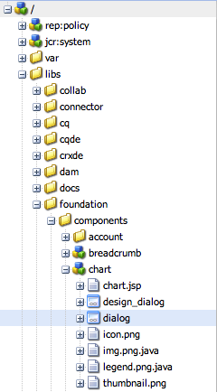
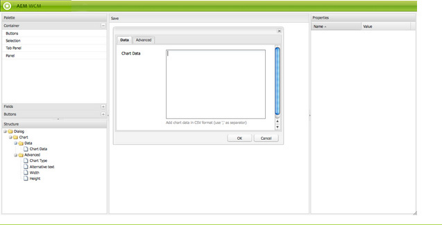

# Dialog Editor{#dialog-editor}

The dialog editor provides a graphical interface for easily creating and editing dialog boxes and scaffolds.

To see how it works, go to CRXDE Lite, open the explorer tree to `/libs/foundation/components/chart` and double-click on the node `dialog`:

The dialog node will open in the **dialog editor**:

## User Interface Overview {#user-interface-overview}

The dialog editor interface is composed of four panes:

* The **palette**, in the top left corner. This pane holds the widgets available for building a dialog box, such as tab panels, text fields, selection lists and buttons. You can expand the different categories within the palette by clicking on the desired divider bar.
* The **structure** pane, in the bottom left corner. This pane shows the hierarchical structure of nodes that makes up the dialog definition. You can see the same structure by expanding the dialog node in either CRXDE Lite or CRX Content Explorer.
* The **render** pane, in the center of the window. This pane shows how the dialog definition defined in the structure pane will be rendered as an actual dialog box.
* The **properties** pane. This pane shows the properties of the node currently highlighted in the structure pane.

### Using the Dialog Editor {#using-the-dialog-editor}

To build a dialog box, the user drags and drops elements from the palette to the structure pane into position within the dialog definition hierarchy.

Once the desired structure is completed, the user clicks **Save**, at the top of the render pane.

>[!CAUTION]
>
>Note that the dialog editor is intended for the creation is relatively simple dialogs and may not be able to edit more complex dialog definitions. In cases where the dialog editor does not allow the editing of a dialog structure, the dialog definition must be created and/or edited manually by directly editing the node structure using for example, CRXDE Lite or CRX Content Explorer.

### Creating a New Dialog {#creating-a-new-dialog}

To create a new dialog box you need to select the required component, click **Create...** and then **Create Dialog...**.

Enter the required details then click **Save All** - now you can double-click on the dialog to open it with the editor.

### Using the Dialog Editor for Scaffolds {#using-the-dialog-editor-for-scaffolds}

A scaffold is a special page containing a form that can be filled in and submitted in one step. This allows you to rapidly create a page using the content entered.

The form that makes up a scaffold is defined by a dialog definition, just like a normal dialog, though it appears on the scaffolding page in a different form. Because dialog definitions are used to define scaffolds, scaffolds can be designed using the dialog editor. Note that when using the dialog editor in this fashion, the render pane will still displaythedialog definition in the form of a dialog box not as a scaffold.

See [Scaffolding](/help/sites-authoring/scaffolding.md) for more information on using the dialog editor to create scaffolds.
