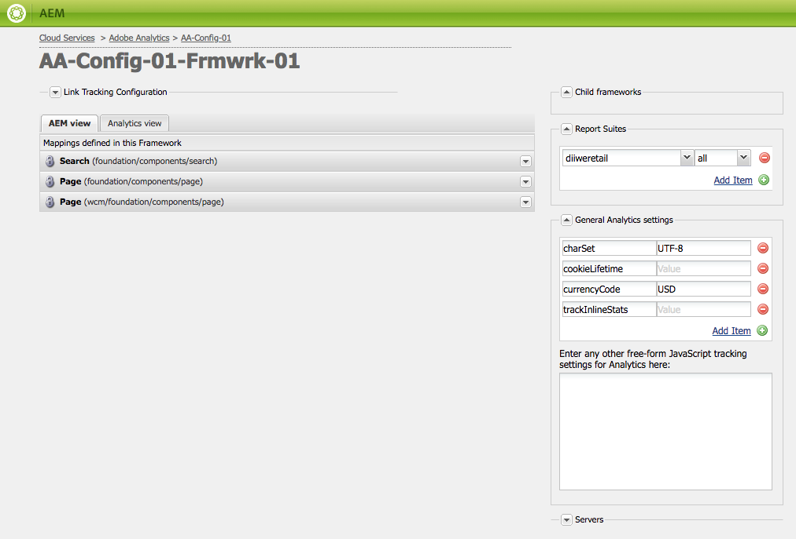
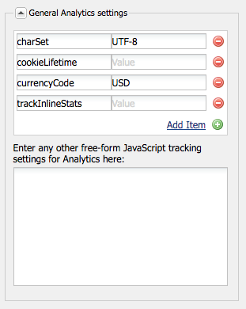
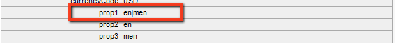

# Customizing the Adobe Analytics Framework{#customizing-the-adobe-analytics-framework}

The Adobe Analytics framework determines the information that is tracked with Adobe Analytics. To customize the default framework, you use JavaScript to add custom tracking, integrate Adobe Analytics plugins, and change general settings within the framework used for tracking.

## About the Generated JavaScript for Frameworks {#about-the-generated-javascript-for-frameworks}

When a page is associated with an Adobe Analytics framework, and the page includes [references to the Analytics module](/help/sites-administering/adobeanalytics.md), a analytics.sitecatalyst.js file is automatically generated for the page.

The JavaScript in the page creates an `s_gi`object (that the s_code.js Adobe Analytics library defines) and assigns values to its properties. The name of the object instance is `s`. The code examples that are presented in this section makes several references to this `s` variable.

The following example code is similar to the code in an analytics.sitecatalyst.js file:

```
var s_account = "my_sitecatalyst_account";
var s = s_gi(s_account);
s.fpCookieDomainPeriods = "3";
s.currencyCode= 'USD';
s.trackInlineStats= true;
s.linkTrackVars= 'None';
s.charSet= 'UTF-8';
s.linkLeaveQueryString= false;
s.linkExternalFilters= '';
s.linkTrackEvents= 'None';
s.trackExternalLinks= true;
s.linkDownloadFileTypes= 'exe,zip,wav,mp3,mov,mpg,avi,wmv,doc,pdf,xls';
s.linkInternalFilters= 'javascript:,'+window.location.hostname;
s.trackDownloadLinks= true;

s.visitorNamespace = "mynamespace";
s.trackingServer = "xxxxxxx.net";
s.trackingServerSecure = "xxxxxxx.net";

/* Plugin Config */
/*
s.usePlugins=false;
function s_doPlugins(s) {
    //add your custom plugin code here
}
s.doPlugins=s_doPlugins;
*/
```

When you use custom JavaScript code to customize the framework, you alter the content of this file.

## Configuring Adobe Analytics Properties {#configuring-adobe-analytics-properties}

There are several predefined variables within Adobe Analytics that are configurable on a framework. The **charset**, **cookieLifetime**, **currencyCode**, and **trackInlineStats** variables are included in the **General Analytics Settings** list by default.



You can add variable names and values to the list. These predefined variables and any variables that you add are used to configure the properties of the `s` object in the analytics.sitecatalyst.js file. The following example shows how the added `prop10` property of value `CONSTANT` is represented in the JavaScript code:

```
var s_account = "my_sitecatalyst_account";
var s = s_gi(s_account);
s.fpCookieDomainPeriods = "3";
s.currencyCode= 'USD';
s.trackInlineStats= true;
s.linkTrackVars= 'None';
s.charSet= 'UTF-8';
s.linkLeaveQueryString= false;
s.linkExternalFilters= '';
s.linkTrackEvents= 'None';
s.trackExternalLinks= true;
s.linkDownloadFileTypes= 'exe,zip,wav,mp3,mov,mpg,avi,wmv,doc,pdf,xls';
s.prop10= 'CONSTANT';
s.linkInternalFilters= 'javascript:,'+window.location.hostname;
s.trackDownloadLinks= true;

s.visitorNamespace = "mynamespace";
s.trackingServer = "xxxxxxx.net";
s.trackingServerSecure = "xxxxxxx.net";
```

Use the following procedure to add variables to the list:

1. On your Adobe Analytics framework page, expand the **General Analytics Settings** area.
1. Below the list of variables, click Add Item to add a new variable to the list.
1. In the left-hand cell, enter a name for the variable, for example, `prop10`.

1. In the right-hand column, enter a value for the variable, for example, `CONSTANT`.

1. To remove a variable, click the (-) button next to the variable.

>[!NOTE]
>
>When entering variables and values, make sure they are correctly formatted and spelled, or the **calls will not be sent** with the correct value/variable pair. Misspelled variables and values can even prevent calls from occurring.
>
>Consult with your Adobe Analytics representative to make sure that these variables are correctly set.

>[!CAUTION]
>
>Some of the variables in this list are **mandatory** for Adobe Analytics calls to function correctly (for example, **currencyCode**, **charSet**).
>
>So, even if they are removed from the framework itself, they will still be attached with a default value when the Adobe Analytics call is made.

### Adding custom JavaScript to an Adobe Analytics Framework {#adding-custom-javascript-to-an-adobe-analytics-framework}

The free-from JavaScript box in the **General Analytics Settings** area lets you add custom code to an Adobe Analytics framework.



The code that you add is appended to the analytics.sitecatalyst.js file. Therefore, you can access the `s` variable, which is an instance of the `s_gi` JavaScript object that is defined in `s_code.js`. For example, adding the following code is equivalent to adding a variable named `prop10` of value `CONSTANT`, which is the example in the previous section:

`s.prop10= 'CONSTANT';`

The code in the [analytics.sitecatalyst.js](/help/sites-developing/extending-analytics-components.md) file (which includes the content of the Adobe Analytics `s-code.js` file) contains the following code:

`if (s.usePlugins) s.doPlugins(s)`

The following procedure demonstrates how to use the JavaScript box to customize Adobe Analytics tracking. If your JavaScript needs to use Adobe Analytics plugins, [integrate them](/help/sites-administering/adobeanalytics.md) into AEM.

1. Add the following JavaScript code to the box so that `s.doPlugins` is executed:

   ```
   s.usePlugins=true;
   function s_doPlugins(s) {
       //add your custom code here
   }
   s.doPlugins=s_doPlugins;
   ```

   >[!CAUTION]
   >
   >This code is necessary if you want to send variables in an Adobe Analytics call that have been customized in some way that cannot be done through the basic drag&drop interface OR through inline JavaScript in Adobe Analytics View.
   >
   >If the custom variables are outside of the s_doPlugins function they will be sent as *undefined *in the Adobe Analytics call

1. Add your JavaScript code in the **s_doPlugins** function.

The following example concatenates the data captured on a page in hierarchical order, using a common separator of "|".

An Adobe Analytics framework has the following configruations:

* The `prop2` Adobe Analytics variable is mapped to the `pagedata.sitesection` site property.

* The `prop3` Adobe Analytics variable is mapped to the `pagedata.subsection` site property.

* The following code is added to the free-from JavaScript box:

  ```
  s.usePlugins=true;
   function s_doPlugins(s) {
   s.prop1 = s.prop2+'|'+s.prop3;
   }
   s.doPlugins=s_doPlugins;
  ```

* When the webpage that uses the framework is visited (or, in edit mode the page is reloaded or previewed), the calls to Adobe Analytics are performed.

For example, the following values are generated in Adobe Analytics:



### Adding Global Custom Code for All Adobe Analytics Frameworks {#adding-global-custom-code-for-all-adobe-analytics-frameworks}

Provide custom JavaScript code that is integrated into all Adobe Analytics frameworks. When a page's Adobe Analytics framework contains no custom [free-form JavaScript](/help/sites-administering/adobeanalytics.md), the JavaScript that the /libs/cq/analytics/components/sitecatalyst/config.js.jsp script generates is appended to the [analytics.sitecatalyst.js](/help/sites-administering/adobeanalytics.md) file. By default, the script has no effect because it is commented out. The code also sets `s.usePlugins` to `false`:

```
/* Plugin Config */
/*
s.usePlugins=false;
function s_doPlugins(s) {
    //add your custom plugin code here
}
s.doPlugins=s_doPlugins;
*/
```

Code in the analytics.sitecatalyst.js file (which includes the content of the Adobe Analytics s_code.js file) contains the following code:

if (s.usePlugins) s.doPlugins(s)

Therefore, your JavaScript should set `s.usePlugins` to `true` so that any code in the `s_doPlugins` function is executed. To customize the code, overlay the config.js.jsp file with one that uses your own JavaScript. If your JavaScript needs to use Adobe Analytics plugins, [integrate them](/help/sites-administering/adobeanalytics.md) into AEM.

>[!NOTE]
>
>Do not edit the /libs/cq/analytics/components/sitecatalyst/config.js.jsp file. Certain AEM upgrade or maintenance tasks can reinstall the original file, removing your changes.

1. In CRXDE Lite, create the /apps/cq/analytics/components folder structure:

    1. Right-click the /apps folder and click Create &gt; Create Folder.
    1. Specify `cq` as the folder name, and click OK.
    1. Similarly, create the `analytics` and `components` folders.

1. Right-click the `components` folder that you created and click Create &gt; Create Component. Specify the following property values:

    * Label: `sitecatalyst`
    * Title: `sitecatalyst`
    * Super Type: `/libs/cq/analytics/components/sitecatalyst`
    * Group: `hidden`

1. Click Next repeatedly until the OK button is enabled, and then click OK.

   The sitecatalyst component contains the automatically created sitecatalyst.jsp file.

1. Right-click the sitecatalyst.jsp file and click Delete.

1. Right-click the sitecatalyst component and click Create > Create File. Specify the name `config.js.jsp` and then click OK.

   The config.js.jsp file opens automatically for editing.

1. Add the following text to the file, and then click Save All:

   ```java
   <%@page session="true"%>
   /* Plugin Config */
   s.usePlugins=true;
   function s_doPlugins(s) {
       //add your custom plugin code here
   }
   s.doPlugins=s_doPlugins;
   ```

   The JavaScript code that the /apps/cq/analytics/components/sitecatalyst/config.js.jsp script generates is now inserted into the analytics.sitecatalyst.js file for all pages that use an Adobe Analytics framework.

1. Add the JavaScript code that you want to execute in the `s_doPlugins` function, and then click Save All.

>[!CAUTION]
>
>If any text is present in the free-form JavaScript of a page's framework (even only whitespace), config.js.jsp is ignored.

### Using Adobe Analytics Plugins in AEM {#using-adobe-analytics-plugins-in-aem}

Obtain the JavaScript code for Adobe Analytics plugins and integrate them into your Adobe Analytics framework in AEM. Add the code to a client library folder of the category `sitecatalyst.plugins` so that they are available to your custom JavaScript code.

For example, if you integrate the `getQueryParams` plugin, you can call the plugin from the `s_doPlugins` function of your custom JavaScript. The following example code sends the query string in **"pid"** from the referrer's URL as **eVar1**, when an Adobe Analytics call is triggered.

```
s.usePlugins=true;
function s_doPlugins(s) {
   // take the query string from the referrer
   s.eVar1=s.getQueryParam('pid','',document.referrer);
}
s.doPlugins=s_doPlugins;
```

AEM installs the following Adobe Analytics plugins, so that they are available by default:

* getQueryParam()
* getPreviousValue()
* split()

The /libs/cq/analytics/clientlibs/sitecatalyst/plugins client library folder includes these plugins in the sitecatalyst.plugins category.

>[!NOTE]
>
>Create a client library folder for your plugins. Do not add plugins to the `/libs/cq/analytics/clientlibs/sitecatalyst/plugins` folder. This practice ensures that your contribution to the `sitecatalyst.plugins` category are not overwritten during AEM re-installs or upgrade tasks.

Use the following procedure to create the client library folder for your plugins. You only need to peform this procedure once. To add a plugin to the client library folder, use the subsequent procedure.

1. In a web browser, open CRXDE Lite. ([http://localhost:4502/crx/de](http://localhost:4502/crx/de))

1. Right-click the /apps/my-app/clientlibs folder and click Create &gt; Create Node. Enter the following property values and then click OK:

    * Name: A name for your client library folder, such as my-plugins

    * Type: cq:ClientLibraryFolder

1. Select the client library folder that you created and use the bottom right-hand property bar to add the following property:

    * Name: categories
    * Type: String
    * Value: sitecatalyst.plugins
    * Multi: selected

   Click OK in the Edit window to confirm the property value.

1. Right-click the client library folder that you created and click Create &gt; Create File. For the file name type js.txt, and then click OK.

1. Click Save All.

Use the following procedure to obtain the plugin code, store the code in the AEM repository, and add the code to your client library folder.

1. Log in to [sc.omniture.com](https://sc.omniture.com/login/) using your Adobe Analytics account.
1. On the landing page, go to Help &gt; Help Home.
1. In the table of contents on the left side, click Implementation Plug-ins.
1. Click the link to the plugin that you want to add and when the page opens, locate the JavaScript source code for the plugin, then select the code and copy it.

1. Right-click your client library folder, and click Create &gt; Create File. For the file name, type the name of the plugin that you are integrating followed by .js, and then click OK. For example, if you are integrating the getQueryParam plugin, name the file getQueryParam.js.

   When you create the file, it opens for editing.

1. Paste the plugin JavaScript code into the file, click Save All, and then close the file.

1. Open the js.txt file from your client library folder.

1. In a new line, add the name of the file that contains the plugin, for example, getQueryParam.js. Then, click Save All and close the file.

>[!NOTE]
>
>When using plugins, make sure to integrate any supporting plugins as well, otherwise the plugin JavaScript will not recognize the calls that it makes to the functions in the supporting plugin. For example, the getPreviousValue() plugin requires the split() plugin to function correctly.
>
>The name of the support plugin needs to be added to **js.txt** as well.
