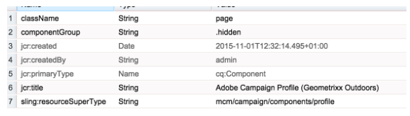
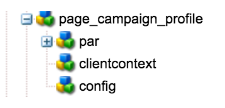
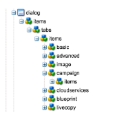
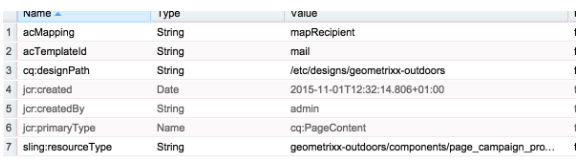

# Creating Custom AEM Page Template with Adobe Campaign Form Components{#creating-custom-aem-page-template-with-adobe-campaign-form-components}

This page explains how to build a custom page template that uses [Adobe Campaign Form](/help/sites-authoring/adobe-campaign-components.md) components by examining how the Geometrixx-outdoors template (`/apps/geometrixx-outdoors/components/page_campaign_profile`) is implemented, and points you to important information you may need when creating your own custom template.

>[!NOTE]
>
>[Email and form samples are only available in Geometrixx](/help/sites-developing/we-retail.md). Download sample Geometrixx content from Package Share.

>[!CAUTION]
>
>The AEM email components have been deprecated. Due to the nature of email, which merges content and style, the email components provided out-of-the-box by AEM become of limited reuse for customers because of the need to implement custom styles into whatever components are required for projects.
>
>Email components can be implemented on project level, and the deprecated AEM email components illustrate how that can be achieved. However, do not use these deprecated components on projects.


To create a custom AEM page template using Adobe Campaign Form components, make sure you have the following:

1. **Correct resourceSuperType**

   Make sure the page-component inherits from `mcm/campaign/components/profile`.

   This is required for the servlets to get and save info

    * `com.day.cq.mcm.campaign.servlets.TemplateListServlet`
    * `com.day.cq.mcm.campaign.servlets.SaveProfileServlet`

   

1. **ClientContext Settings**

   When you look at the clientcontext settings ( `/etc/designs/geometrixx-outdoors/jcr:content/page_campaign_profile`) you see the following settings:

    * ClientContext points to `/etc/clientcontext/campaign`
    * There is also an extra *config* node.

   

1. **head.jsp (/apps/geometrixx-outdoors/components/page_campaign_profile/head.jsp)**

   In **head.jsp**, you see the following lines that use the **clientcontext-config** and the **cloudservice-hook**:

   ```
   <cq:include path="config" resourceType="cq/personalization/components/clientcontext_optimized/config"/>
   <sling:include path="contexthub" resourceType="granite/contexthub/components/contexthub"/>
   <cq:include script="/libs/cq/cloudserviceconfigs/components/servicelibs/servicelibs.jsp"/>
   ```

1. **body.jsp (/apps/geometrixx-outdoors/components/page_campaign_profile/body.jsp)**

   In **body.jsp**, the cloud services are loaded at the bottom of the page:

   ```
   <cq:include path="cloudservices" resourceType="cq/cloudserviceconfigs/components/servicecomponents"/>
   ```

1. **Campaign page properties**

   To be able to select an Adobe Campaign template the page-properties are extended with the **Campaign** tab:

   `/apps/geometrixx-outdoors/components/page_campaign_profile/dialog/items/tabs/items/campaign`

   

1. **Template settings**.

   In the template ( `/apps/geometrixx-outdoors/templates/campaign_profile/jcr:content`) you see the following default values:

   | **acMapping** |mapRecipient (for Adobe Campaign 6.1), profile (for Adobe Campaign Standard) |
   |---|---|
   | **acTemplateId** |mail |

   
