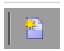
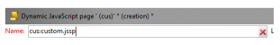
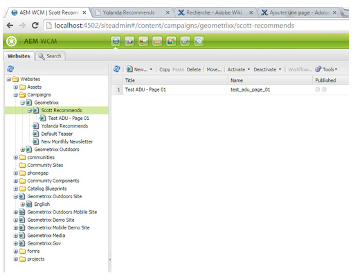

# Creating Custom Extensions{#creating-custom-extensions}

Generally when you implement a project, you have custom code in both AEM and Adobe Campaign. With the use of the existing API, you can call your custom code in Adobe Campaign from AEM or from AEM to Adobe Campaign. This document describes how to do that.

## Prerequisites {#prerequisites}

You must have the following installed:

* Adobe Experience Manager
* Adobe Campaign 6.1

See [Integrating AEM with Adobe Campaign 6.1](/help/sites-administering/campaignonpremise.md) for more information.

## Example 1: AEM to Adobe Campaign {#example-aem-to-adobe-campaign}

The standard integration between AEM and Campaign is based on JSON and JSSP (JavaScript Server Page). These JSSP files can be found in the Campaign console, and all start with **aec** (Adobe Experience Cloud).


>[!NOTE]
>
>[For this example, see Geometrixx](/help/sites-developing/we-retail.md), which is available from Package Share.

In this example, a new custom JSSP file was created and calls that from the AEM side to retrieve the result. It can be used, for example, to retrieve data from Adobe Campaign or to save data into Adobe Campaign.

1. In Adobe Campaign, to create a JSSP file, click the **New** icon.

   

1. Enter the name of this JSSP file. In this example, **cus:custom.jssp** is used (meaning it is in the **cus** namespace).

   

1. Put the following code inside the jssp-file:

   ```
   <%
   var origin = request.getParameter("origin");
   document.write("Hello from Adobe Campaign, origin : " + origin);
   %>
   ```

1. Save your work. The remaining work is in AEM.
1. Create a simple servlet on the AEM side so you can call this JSSP. In this example, you can assume the following:

    * You have the connection working between AEM and Campaign
    * The campaign cloud service is configured on **/content/geometrixx-outdoors**

   The most important object in this example is the **GenericCampaignConnector**, which allows you to call (get and post) jssp files on the Adobe Campaign side.

   Here is a small code snippet:

   ```
   @Reference
   private GenericCampaignConnector campaignConnector;
   ...
   Map<String, String> params = new HashMap<String, String>();
   params.put("origin", "AEM");
   CallResults results = campaignConnector.callGeneric("/jssp/cus/custom.jssp", params, credentials);
   return results.bodyAsString();
   ```

1. In this example, you must pass the credentials into the call. You can get them by way of the getCredentials() method where you pass in a page that has the Campaign cloud service configured.

   ```xml
   // page containing the cloudservice for Adobe Campaign
   Configuration config = campaignConnector.getWebserviceConfig(page.getContentResource().getParent());
   CampaignCredentials credentials = campaignConnector.retrieveCredentials(config);
   ```

The complete code is as follows:

```java
import java.io.IOException;
import java.io.PrintWriter;
import java.util.HashMap;
import java.util.Map;

import javax.servlet.ServletException;

import org.apache.felix.scr.annotations.Reference;
import org.apache.felix.scr.annotations.sling.SlingServlet;
import org.apache.sling.api.SlingHttpServletRequest;
import org.apache.sling.api.SlingHttpServletResponse;
import org.apache.sling.api.servlets.SlingSafeMethodsServlet;
import org.slf4j.Logger;
import org.slf4j.LoggerFactory;

import com.day.cq.mcm.campaign.CallResults;
import com.day.cq.mcm.campaign.CampaignCredentials;
import com.day.cq.mcm.campaign.GenericCampaignConnector;
import com.day.cq.wcm.api.Page;
import com.day.cq.wcm.api.PageManager;
import com.day.cq.wcm.api.PageManagerFactory;
import com.day.cq.wcm.webservicesupport.Configuration;

@SlingServlet(paths="/bin/campaign", methods="GET")
public class CustomServlet extends SlingSafeMethodsServlet {

 private final Logger log = LoggerFactory.getLogger(this.getClass());

 @Reference
 private GenericCampaignConnector campaignConnector;

 @Reference
 private PageManagerFactory pageManagerFactory;

 @Override
 protected void doGet(SlingHttpServletRequest request,
   SlingHttpServletResponse response) throws ServletException,
   IOException {

  PageManager pm = pageManagerFactory.getPageManager(request.getResourceResolver());

  Page page = pm.getPage("/content/geometrixx-outdoors");

  String result = null;
  if ( page != null) {
   result = callCustomFunction(page);
  }
  if ( result != null ) {
   PrintWriter pw = response.getWriter();
   pw.print(result);
  }
 }

 private String callCustomFunction(Page page ) {
  try {
   Configuration config = campaignConnector.getWebserviceConfig(page.getContentResource().getParent());
   CampaignCredentials credentials = campaignConnector.retrieveCredentials(config);

   Map<String, String> params = new HashMap<String, String>();
   params.put("origin", "AEM");
   CallResults results = campaignConnector.callGeneric("/jssp/cus/custom.jssp", params, credentials);
   return results.bodyAsString();
  } catch (Exception e ) {
   log.error("Something went wrong during the connection", e);
  }
  return null;

 }

}
```

## Example 2: Adobe Campaign to AEM {#example-adobe-campaign-to-aem}

AEM offers out of the box APIs to retrieve the objects available anywhere in the siteadmin explorer view.



>[!NOTE]
>
>[For this example, see Geometrixx](/help/sites-developing/we-retail.md), which is available from Package Share.

For each node in the explorer, there is an API that is linked to it. For example, for the node :

* [http://localhost:4502/siteadmin#/content/campaigns/geometrixx/scott-recommends](http://localhost:4502/siteadmin#/content/campaigns/geometrixx/scott-recommends)

The API is:

* [http://localhost:4502/content/campaigns/geometrixx/scott-recommends.1.json](http://localhost:4502/content/campaigns/geometrixx/scott-recommends.2.json)

The end of the URL **.1.json** can be replaced by **.2.json**, **.3.json**, according to the number of sublevels you are interested in getting. To obtain all of them the keyword, **infinity** can be used:

* [http://localhost:4502/content/campaigns/geometrixx/scott-recommends.infinity.json](http://localhost:4502/content/campaigns/geometrixx/scott-recommends.2.json)

To consume the API, AEM, by default, uses basic authentication.

A JS library that is named **amcIntegration.js** is available in 6.1.1 (build 8624 and higher) that implements that logic among several other ones.

### AEM API call {#aem-api-call}

```java
loadLibrary("nms:amcIntegration.js");

var cmsAccountId = sqlGetInt("select iExtAccountId from NmsExtAccount where sName=$(sz)","aemInstance")
var cmsAccount = nms.extAccount.load(String(cmsAccountId));
var cmsServer = cmsAccount.server;

var request = new HttpClientRequest(cmsServer+"/content/campaigns/geometrixx.infinity.json")
aemAddBasicAuthentication(cmsAccount, request);
request.method = "GET"
request.header["Content-Type"] = "application/json; charset=UTF-8";
request.execute();
var response = request.response;
```
