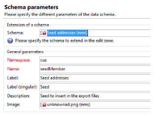
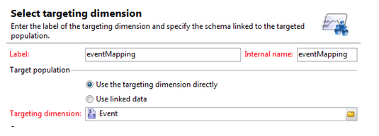
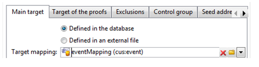
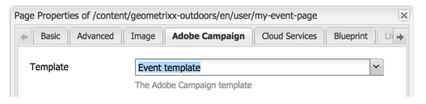
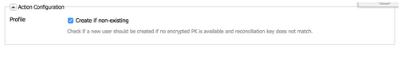
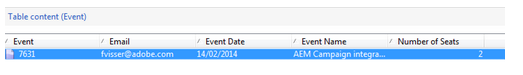

# Creating Custom Form Mappings{#creating-custom-form-mappings}

When you create a custom table in Adobe Campaign, you may want to build a form in AEM that maps to that custom table.

This document describes how to create custom form mappings. When you complete the steps in this document, you will be providing your users with an event page where they can sign up for an upcoming event. You then follow up with these users via Adobe Campaign.

## Prerequisites {#prerequisites}

You need to have the following installed:

* Adobe Experience Manager
* Adobe Campaign Classic

See [Integrating AEM with Adobe Campaign Classic](/help/sites-administering/campaignonpremise.md) for more information.

## Creating Custom Form Mappings {#creating-custom-form-mappings-2}

To create custom form mappings, you need to follow these high-level steps, which are described in detail in the following sections:

1. Create a custom table.
1. Extend the **seed** table.
1. Create a custom mapping.
1. Create a delivery based on the custom mapping.
1. Build the form in AEM, which will use the created delivery.
1. Submit the form to test it.

### Creating the Custom Table in Adobe Campaign {#creating-the-custom-table-in-adobe-campaign}

Start by creating a custom table in Adobe Campaign. In this example, we are using the following definition to create an event table:

```xml
<element autopk="true" label="Event" labelSingular="Event" name="event">
 <attribute label="Event Date" name="eventdate" type="date"/>
 <attribute label="Event Name" name="eventname" type="string"/>
 <attribute label="Email" name="email" type="string"/>
 <attribute label="Number of Seats" name="seats" type="long"/>
</element>
```

After you create the event table, run the **Update database structure wizard** to create the table.

### Extending the Seed Table {#extending-the-seed-table}

In Adobe Campaign, select **Add** to create an extension of the **Seed addresses (nms)** table.



Now, use the fields from the **event** table to extend the **seed** table:

```xml
<element label="Event" name="custom_cus_event">
 <attribute name="eventname" template="cus:event:event/@eventname"/>
 <attribute name="eventdate" template="cus:event:event/@eventdate"/>
 <attribute name="email" template="cus:event:event/@email"/>
 <attribute name="seats" template="cus:event:event/@seats"/>
 </element>
```

After this, run **Update database wizard** to apply the changes.

### Creating Custom Target Mapping {#creating-custom-target-mapping}

In **Administration/Campaign Managemen**t, go to **Target Mappings** and add a new T**arget Mapping.**

>[!NOTE]
>
>Make sure you use a meaningful name for **Internal name**.



### Creating a Custom Delivery Template {#creating-a-custom-delivery-template}

In this step, you are adding a delivery template that uses the created **Target mapping**.

In **Resources/Templates**, navigate to the Delivery Template and duplicate the existing AEM delivery. When you click **To**, select the create event **Target mapping**.



### Building the Form in AEM {#building-the-form-in-aem}

In AEM, make sure you have configured a Cloud Service in **Page Properties**.

Then, in the **Adobe Campaign** tab, select the delivery that was created in [Creating a Custom Delivery Template](#creating-a-custom-delivery-template).



When configuring the fields, make sure you specify unique element-names for the form-fields.

After the fields are configured, you need to manually change the mapping.

In CRXDE-lite, go the **jcr:content** (of the page) node and change the **acMapping** value to the internal name of the **Target mapping**.


In the configuration of the form, make sure you check the checkbox to create if non existing



### Submitting the Form {#submitting-the-form}

You can now submit the form and validate on the Adobe Campaign side whether the values are saved.



## Troubleshooting {#troubleshooting}

**"Invalid type for value '02/02/2015' from element '@eventdate' (document of type 'Event ([adb:event])')"**

When submitting the form, this error is logged in the **error.log** in AEM.

This is due to an invalid format for the date field. The workaround is to supply **yyyy-mm-dd** as the value.
